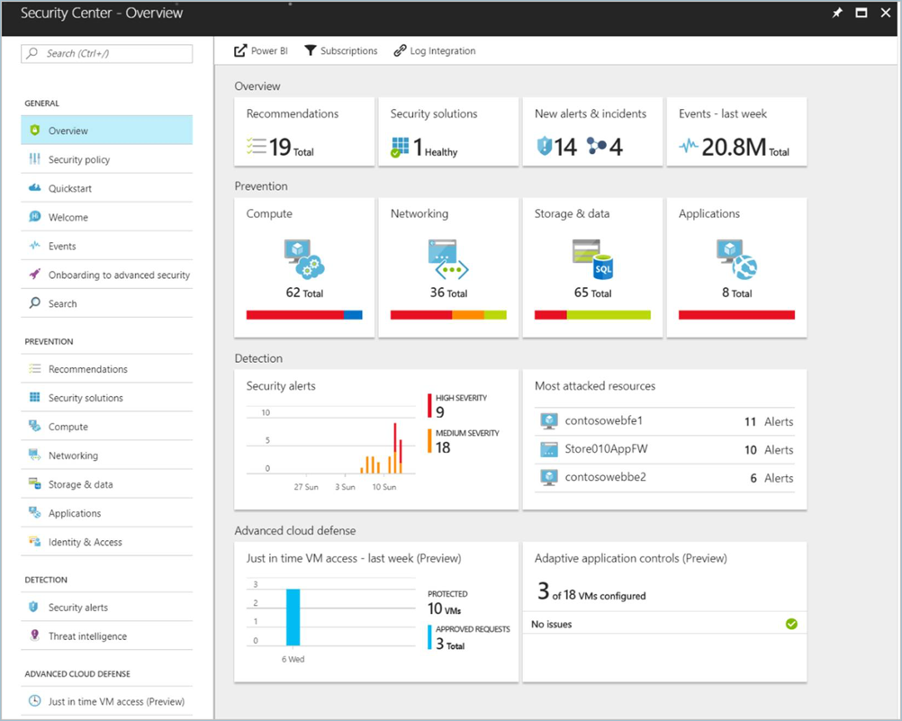
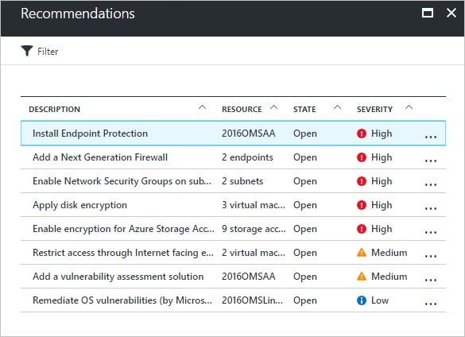
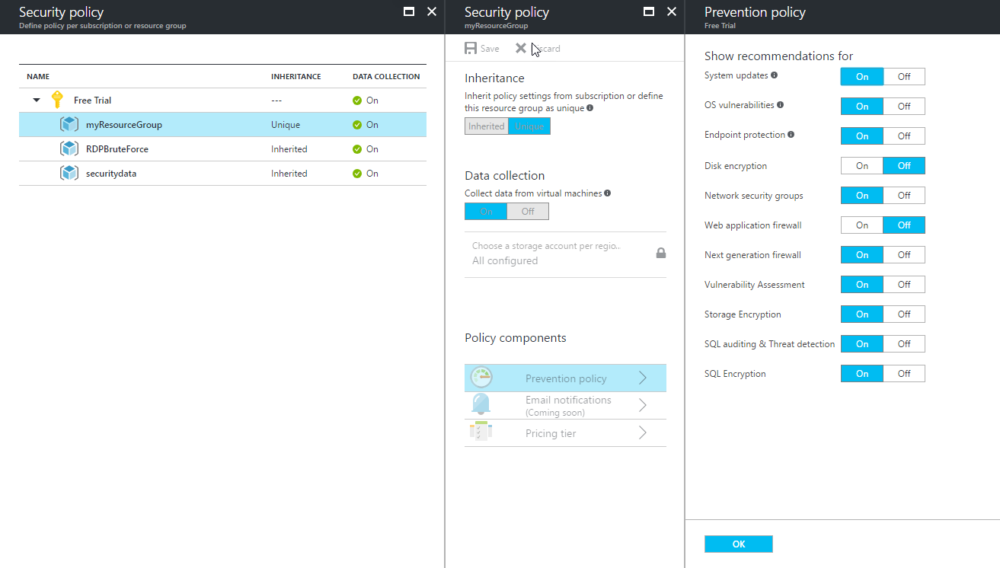
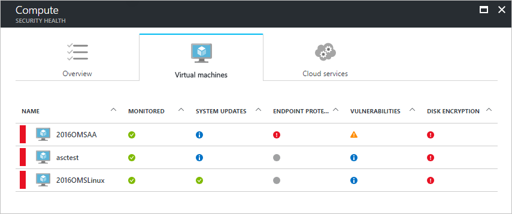
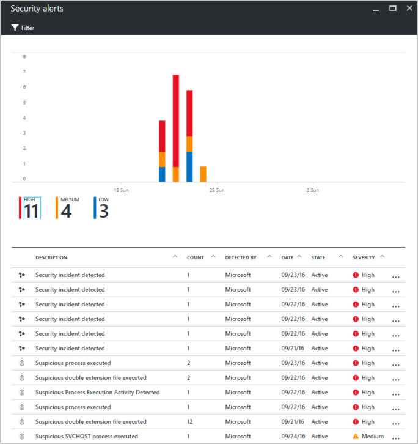

# Monitor virtual machine security by using Azure Security Center

Azure Security Center can help you gain visibility into your Azure resource security practices. Security Center offers integrated security monitoring. It can detect threats that otherwise might go unnoticed. In this tutorial, you learn about Azure Security Center, and how to:
 
> [!div class="checklist"]
> * Set up data collection
> * Set up security policies
> * View and fix configuration health issues
> * Review detected threats  

## Security Center overview

Security Center identifies potential virtual machine (VM) configuration issues and targeted security threats. These might include VMs that are missing network security groups, unencrypted disks, and brute-force Remote Desktop Protocol (RDP) attacks. The information is shown on the Security Center dashboard in easy-to-read graphs.

To access the Security Center dashboard, in the Azure portal, on the menu, select  **Security Center**. On the dashboard, you can see the security health of your Azure environment, find a count of current recommendations, and view the current state of threat alerts. You can expand each high-level chart to see more detail.

Security Center goes beyond data discovery to provide recommendations for issues that it detects. For example, if a VM was deployed without an attached network security group, Security Center displays a recommendation, with remediation steps you can take. You get automated remediation without leaving the context of Security Center.  

## Set up data collection

Before you can get visibility into VM security configurations, you need to set up Security Center data collection. This involves turning on data collection and creating an Azure storage account to hold collected data. 

1. On the Security Center dashboard, click **Security policy**, and then select your subscription. 
2. For **Data collection**, select **On**.
3. To create a storage account, select **Choose a storage account**. Then, select **OK**.
4. On the **Security Policy** blade, select **Save**. 

The Security Center data collection agent is then installed on all VMs, and data collection begins. 

## Set up a security policy

Security policies are used to define the items for which Security Center collects data and makes recommendations. You can apply different security policies to different sets of Azure resources. Although by default Azure resources are evaluated against all policy items, you can turn off individual policy items for all Azure resources or for a resource group. For in-depth information about Security Center security policies, see [Set security policies in Azure Security Center](../../security-center/security-center-policies.md). 

To set up a security policy for all Azure resources:

1. On the Security Center dashboard, select **Security policy**, and then select your subscription.
2. Select **Prevention policy**.
3. Turn on or turn off policy items that you want to apply to all Azure resources.
4. When you're finished selecting your settings, select **OK**.
5. On the **Security policy** blade, select **Save**. 

To set up a policy for a specific resource group:

1. On the Security Center dashboard, select **Security policy**, and then select a resource group.
2. Select **Prevention policy**.
3. Turn on or turn off policy items that you want to apply to the resource group.
4. Under **INHERITANCE**, select **Unique**.
5. When you're finished selecting your settings, select **OK**.
6. On the **Security policy** blade, select **Save**.  

You also can turn off data collection for a specific resource group on this page.

In the following example, a unique policy has been created for a resource group named *myResoureGroup*. In this policy, disk encryption and web application firewall recommendations are turned off.

## View VM configuration health

After you've turned on data collection and set a security policy, Security Center begins to provide alerts and recommendations. As VMs are deployed, the data collection agent is installed. Security Center is then populated with data for the new VMs. For in-depth information about VM configuration health, see [Protect your VMs in Security Center](../../security-center/security-center-virtual-machine-recommendations.md). 

As data is collected, the resource health for each VM and related Azure resource is aggregated. The information is shown in an easy-to-read chart. 

To view resource health:

1.  On the Security Center dashboard, under **Resource security health**, select **Compute**. 
2.  On the **Compute** blade, select **Virtual machines**. This view provides a summary of the configuration status for all your VMs.

To see all recommendations for a VM, select the VM. Recommendations and remediation are covered in more detail in the next section of this tutorial.

## Remediate configuration issues

After Security Center begins to populate with configuration data, recommendations are made based on the security policy you set up. For instance, if a VM was set up without an associated network security group, a recommendation is made to create one. 

To see a list of all recommendations: 

1. On the Security Center dashboard, select **Recommendations**.
2. Select a specific recommendation. A list of all resources for which the recommendation applies appears.
3. To apply a recommendation, select a specific resource. 
4. Follow the instructions for remediation steps. 

In many cases, Security Center provides actionable steps you can take to address a recommendation without leaving Security Center. In the following example, Security Center detects a network security group that has an unrestricted inbound rule. On the recommendation page, you can select the **Edit inbound rules** button. The UI that is needed to modify the rule appears. 

As recommendations are remediated, they are marked as resolved. 

## View detected threats

In addition to resource configuration recommendations, Security Center displays threat detection alerts. The security alerts feature aggregates data collected from each VM, Azure networking logs, and connected partner solutions to detect security threats against Azure resources. For in-depth information about Security Center threat detection capabilities, see [Azure Security Center detection capabilities](../../security-center/security-center-detection-capabilities.md).

The security alerts feature requires the Security Center pricing tier to be increased from *Free* to *Standard*. A 30-day **free trial** is available when you move to this higher pricing tier. 

To change the pricing tier:  

1. On the Security Center dashboard, click **Security policy**, and then select your subscription.
2. Select **Pricing tier**.
3. Select the new tier, and then select **Select**.
4. On the **Security policy** blade, select **Save**. 

After you've changed the pricing tier, the security alerts graph begins to populate as security threats are detected.

Select an alert to view information. For example, you can see a description of the threat, the detection time, all threat attempts, and the recommended remediation. In the following example, an RDP brute-force attack was detected, with 294 failed RDP attempts. A recommended resolution is provided.

## Next steps
In this tutorial, you set up Azure Security Center, and then reviewed VMs in Security Center. You learned how to:

> [!div class="checklist"]
> * Set up data collection
> * Set up security policies
> * View and fix configuration health issues
> * Review detected threats

Advance to the next tutorial to learn more about creating a CI/CD pipeline with Jenkins, GitHub, and Docker.

> [!div class="nextstepaction"]
> [Create CI/CD infrastructure with Jenkins, GitHub, and Docker](tutorial-jenkins-github-docker-cicd.md)

