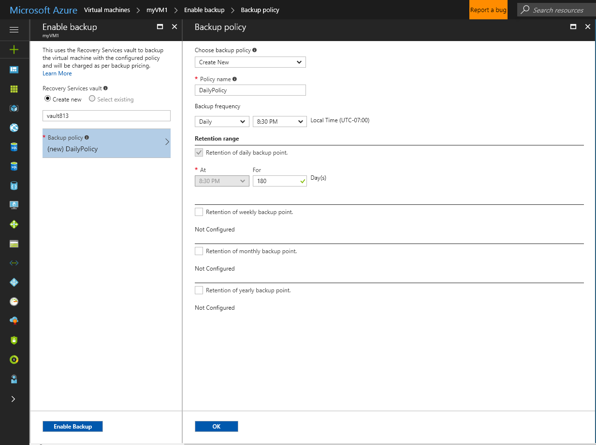

# Back up Linux  virtual machines in Azure

## Backup overview


## How does Azure back up virtual machines?
When the Azure Backup service initiates a backup job at the scheduled time, it triggers the backup extension to take a point-in-time snapshot. The Azure Backup service uses the _VMSnapshot_ extension in Windows, and the _VMSnapshotLinux_ extension in Linux. The extension is installed during the first VM backup. To install the extension, the VM must be running. If the VM is not running, the Backup service takes a snapshot of the underlying storage (since no application writes occur while the VM is stopped).

When taking a snapshot of Windows VMs, the Backup service coordinates with the Volume Shadow Copy Service (VSS) to get a consistent snapshot of the virtual machine's disks. If you're backing up Linux VMs, you can write your own custom scripts to ensure consistency when taking a VM snapshot. Details on invoking these scripts are provided later in this article.

Once the Azure Backup service takes the snapshot, the data is transferred to the vault. To maximize efficiency, the service identifies and transfers only the blocks of data that have changed since the previous backup.


When the data transfer is complete, the snapshot is removed and a recovery point is created.

> [!NOTE]
> 1. During the backup process, Azure Backup doesn't include the temporary disk attached to the virtual machine. For more information, see the blog on [temporary storage](https://blogs.msdn.microsoft.com/mast/2013/12/06/understanding-the-temporary-drive-on-windows-azure-virtual-machines/).
> 2. Since Azure Backup takes a storage-level snapshot and transfers that snapshot to vault, do not change the storage account keys until the backup job finishes.
>

### Data consistency
Backing up and restoring business critical data is complicated by the fact that business critical data must be backed up while the applications that produce the data are running. To address this, Azure Backup supports application-consistent backups for both Windows and Linux VMs
#### Windows VM
Azure Backup takes VSS full backups on Windows VMs (read more about [VSS full backup](http://blogs.technet.com/b/filecab/archive/2008/05/21/what-is-the-difference-between-vss-full-backup-and-vss-copy-backup-in-windows-server-2008.aspx)). To enable VSS copy backups, the following registry key needs to be set on the VM.

```
[HKEY_LOCAL_MACHINE\SOFTWARE\MICROSOFT\BCDRAGENT]
"USEVSSCOPYBACKUP"="TRUE"
```

#### Linux VMs
Azure Backup provides a scripting framework. To ensure application consistency when backing up Linux VMs, create custom pre-scripts and post-scripts that control the backup workflow and environment. Azure Backup invokes the pre-script before taking the VM snapshot and invokes the post-script once the VM snapshot job completes. For more details, see [application consistent
VM backups using pre-script and post-script](https://docs.microsoft.com/azure/backup/backup-azure-linux-app-consistent).
> [!NOTE]
> Azure Backup only invokes the customer-written pre- and post-scripts. If the pre-script and post-scripts execute successfully, Azure Backup marks the recovery point as application consistent. However, the customer is ultimately responsible for the application consistency when using custom scripts.
>


This table explains the types of consistency and the conditions that they occur under during Azure VM backup and restore procedures.

| Consistency | VSS-based | Explanation and details |
| --- | --- | --- |
| Application consistency |Yes for Windows|Application consistency is ideal for workloads as it ensures that:<ol><li> The VM *boots up*. <li>There is *no corruption*. <li>There is *no data loss*.<li> The data is consistent to the application that uses the data, by involving the application at the time of backup--using VSS or pre/post script.</ol> <li>*Windows VMs*- Most Microsoft workloads have VSS writers that do workload-specific actions related to data consistency. For example, Microsoft SQL Server has a VSS writer that ensures that the writes to the transaction log file and the database are done correctly. For Azure Windows VM backups, to create an application-consistent recovery point, the backup extension must invoke the VSS workflow and complete it before taking the VM snapshot. For the Azure VM snapshot to be accurate, the VSS writers of all Azure VM applications must complete as well. (Learn the [basics of VSS](http://blogs.technet.com/b/josebda/archive/2007/10/10/the-basics-of-the-volume-shadow-copy-service-vss.aspx) and dive deep into the details of [how it works](https://technet.microsoft.com/library/cc785914%28v=ws.10%29.aspx)). </li> <li> *Linux VMs*- Customers can execute [custom pre-script and post-script to ensure application consistency](https://docs.microsoft.com/azure/backup/backup-azure-linux-app-consistent). </li> |
| File-system consistency |Yes - for Windows-based computers |There are two scenarios where the recovery point can be *file-system consistent*:<ul><li>Backups of Linux VMs in Azure, without pre-script/post-script or if pre-script/post-script failed. <li>VSS failure during backup for Windows VMs in Azure.</li></ul> In both these cases, the best that can be done is to ensure that: <ol><li> The VM *boots up*. <li>There is *no corruption*.<li>There is *no data loss*.</ol> Applications need to implement their own "fix-up" mechanism on the restored data. |
| Crash consistency |No |This situation is equivalent to a virtual machine experiencing a "crash" (through either a soft or hard reset). Crash consistency typically happens when the Azure virtual machine is shut down at the time of backup. A crash-consistent recovery point provides no guarantees around the consistency of the data on the storage medium--either from the perspective of the operating system or the application. Only the data that already exists on the disk at the time of backup is captured and backed up. <br/> <br/> While there are no guarantees, usually, the operating system boots, followed by disk-checking procedure, like chkdsk, to fix any corruption errors. Any in-memory data or writes that have not been transferred to the disk are lost. The application typically follows with its own verification mechanism in case data rollback needs to be done. <br><br>As an example, if the transaction log has entries that are not present in the database, then the database software does a rollback until the data is consistent. When data is spread across multiple virtual disks (like spanned volumes), a crash-consistent recovery point provides no guarantees for the correctness of the data. |


###Pricing
The cost of backing up Azure VMs is based on the number of protected instances. For a definition of a protected instance, see [What is a protected instance](backup-introduction-to-azure-backup.md#what-is-a-protected-instance). For an example of calculating the cost of backing up a virtual machine, see [How are protected instances calculated](backup-azure-vms-introduction.md#calculating-the-cost-of-protected-instances). See the Azure Backup Pricing page for information about [Backup Pricing](https://azure.microsoft.com/pricing/details/backup/).


## Create a backup
Create a simple daily backup schedule to a Recovery Services Vault. The Recovery Services Vault by deafult is geo-redundant storage.

1. Sign in to the [Azure portal](https://portal.azure.com/).
2. In the menu on the left, select **Virtual machines**. 
3. From the list, select a VM to back up.
4. On the VM blade, in the **Settings** section, click **Backup**. The **Enable backup** blade opens.
5. For the [Recovery Services vault](backup-azure-vms-first-look-arm.md#create-a-recovery-services-vault-for-a-vm), click **Create new** and provide the name for the new vault. A new vault is created in the same Resource Group and same location as the virtual machine.
6. Click **Backup policy**. The default policy is to create a backup daily at 8:30 PM and to retain the backup for 180 days. Keep the defaults for this example and click **OK**.

    

7. On the Enable backup blade, click **Enable Backup**. 
9. Once the configuration has completed, on the VM management blade, click **Backup** to open the Backup Item blade and view the details.

  

  Until the initial backup has completed, **Last backup status** shows as **Warning(Initial backup pending)**. To see when the next scheduled backup job occurs, under **Backup policy** click the name of the policy. The Backup Policy blade opens and shows the time of the scheduled backup.

10. To create an initial recovery point, on the Backup vault blade click **Backup now**.

11. On the Backup Now blade, click the calendar icon, use the calendar control to select the last day this recovery point is retained, and click **Backup**.

Deployment notifications let you know the backup job has been triggered, and that you can monitor the progress of the job on the Backup jobs page.

## Restore the VM

Protect your data by taking snapshots of your data at defined intervals. These snapshots are known as recovery points, and they are stored in recovery services vaults. If or when it is necessary to repair or rebuild a VM, you can restore the VM from any of the saved recovery points. When you restore a recovery point, you can create a new VM which is a point-in-time representation of your backed-up VM, or restore disks and use the template that comes along with it to customize the restored VM or do an individual file recovery. This article explains how to restore a VM to a new VM or restore all backed-up disks. For individual file recovery, refer to [Recover files from Azure VM backup](backup-azure-restore-files-from-vm.md)

1. In the blade for the VM, click **Backup**.
2. In the Backup blade, click **Restore VM** from the menu to open the **Select Restore point** blade.

    

    By default, the dialog displays all restore points from the last 30 days. Use the **Filter** to alter the time range of the restore points displayed. By default, restore points of all consistency are displayed. Modify **All Restore points** filter to select a specific consistency of restore points. For more information about each type of restoration point, see the explanation of [Data consistency](backup-azure-vms-introduction.md#data-consistency).  

   * **Restore point consistency** from this list choose:
     * Crash consistent restore points,
     * Application consistent restore points,
     * File system consistent restore points
     * All restore points.  
8. Choose a Restore point and click **OK**.

    

    The **Restore** blade shows the Restore point is set.

    
9. On the **Restore** blade, **Restore configuration** opens automatically after restore point is set.

Once restore point is selected, on the **Restore configuration** blade, enter or select values for each of the following fields:

* **Restore Type** - Create virtual machine.
* **Virtual machine name** - Provide a name for the VM. The name must be unique to the resource group (for a Resource Manager-deployed VM) or cloud service (for a Classic VM). You cannot replace the virtual machine if it already exists in the subscription.
* **Resource group** - Use an existing resource group, or create a new one. If you are restoring a Classic VM, use this field to specify the name of a new cloud service. If you are creating a new resource group/cloud service, the name must be globally unique. Typically, the cloud service name is associated with a public-facing URL - for example: [cloudservice].cloudapp.net. If you attempt to use a name for the cloud resource group/cloud service that has already been used, Azure assigns the resource group/cloud service the same name as the VM. Azure displays resource groups/cloud services and VMs not associated with any affinity groups. For more information, see [How to migrate from Affinity Groups to a Regional Virtual Network (VNet)](../virtual-network/virtual-networks-migrate-to-regional-vnet.md).
* **Virtual Network** - Select the virtual network (VNET) when creating the VM. The field provides all VNETs associated with the subscription. Resource group of the VM is displayed in parentheses.
* **Subnet** - If the VNET has subnets, the first subnet is selected by default. If there are additional subnets, select the desired subnet.
* **Storage account** - This menu lists the storage accounts in the same location as the Recovery Services vault. Storage accounts that are Zone redundant are not supported. If there are no storage accounts with the same location as the Recovery Services vault, you must create one before starting the restore operation. The storage account's replication type is mentioned in parentheses.


On the **Restore configuration** blade, click **OK** to finalize the restore configuration. On the **Restore** blade, click **Restore** to trigger the restore operation.


## Post-Restore steps
* If you are using a cloud-init based Linux distribution such as Ubuntu, for security reasons, password is blocked post restore. Please use VMAccess extension on the restored VM to [reset the password](../virtual-machines/linux/classic/reset-access.md). We recommend using SSH keys on these distributions to avoid resetting password post restore.
* Extensions present during the backup config will be installed, however they won't be enabled. Please reinstall extensions if you see any issue. 
* If the backed-up VM has static IP, post restore, restored VM will have a dynamic IP to avoid conflict when creating restored VM. Learn more on how you can [add a static IP to restored VM](../virtual-network/virtual-networks-reserved-private-ip.md#how-to-add-a-static-internal-ip-to-an-existing-vm)
* Restored VM will not have availability value set. We recommend using restore disks option and [adding availability set](../virtual-machines/windows/create-availability-set.md#use-powershell-to-create-an-availability-set) when creating a VM from PowerShell or templates using restored disks. 

## Backup for restored VMs
If you have restored VM to same Resource Group with the same name as originally backed up VM, backup continues on the VM post restore. If you have either restored VM to a different Resource group or specified a different name for restored VM, this is treated as a new VM and you need to setup backup for restored VM.

