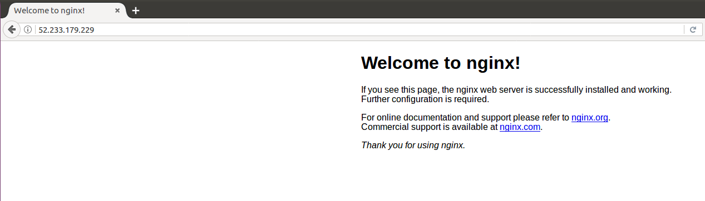
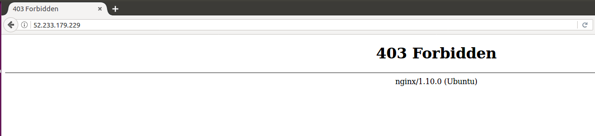

# Tutorial: Back up and restore files for Linux virtual machines in Azure

You can protect your data by taking backups at regular intervals. Azure Backup creates recovery points that are stored in geo-redundant recovery vaults. When you restore from a recovery point, you can restore the whole VM or specific files. This article explains how to restore a single file to a Linux VM running nginx. If you don't already have a VM to use, you can create one using the [Linux quickstart](quick-create-cli.md). In this tutorial you learn how to:

> [!div class="checklist"]
> * Create a backup of a VM
> * Schedule a daily backup
> * Restore a file from a backup

## Backup overview

When the Azure Backup service initiates a backup, it triggers the backup extension to take a point-in-time snapshot. The Azure Backup service uses the _VMSnapshotLinux_ extension in Linux. The extension is installed during the first VM backup if the VM is running. If the VM is not running, the Backup service takes a snapshot of the underlying storage (since no application writes occur while the VM is stopped).

By default, Azure Backup takes a file system consistent backup for Linux VM but it can be configured to take [application consistent backup using pre-script and post-script framework](https://docs.microsoft.com/azure/backup/backup-azure-linux-app-consistent). 
Once the Azure Backup service takes the snapshot, the data is transferred to the vault. To maximize efficiency, the service identifies and transfers only the blocks of data that have changed since the previous backup.

When the data transfer is complete, the snapshot is removed and a recovery point is created.


## Create a backup
Create a scheduled daily backup to a Recovery Services Vault:

1. Sign in to the [Azure portal](https://portal.azure.com/).
2. In the menu on the left, select **Virtual machines**. 
3. From the list, select a VM to back up.
4. On the VM blade, in the **Settings** section, click **Backup**. The **Enable backup** blade opens.
5. In **Recovery Services vault**, click **Create new** and provide the name for the new vault. A new vault is created in the same Resource Group and location as the virtual machine.
6. Click **Backup policy**. For this example, keep the defaults and click **OK**.
7. On the **Enable backup** blade, click **Enable Backup**. This creates a daily backup based on the default schedule.
10. To create an initial recovery point, on the **Backup** blade click **Backup now**.
11. On the **Backup Now** blade, click the calendar icon, use the calendar control to select the last day this recovery point is retained, and click **Backup**.
12. In the **Backup** blade for your VM, you see the number of recovery points that are complete.

	

The first backup takes about 20 minutes. Proceed to the next part of this tutorial after your backup is finished.

## Restore a file

If you accidentally delete or make changes to a file, you can use File Recovery to recover the file from your backup vault. File Recovery uses a script that runs on the VM, to mount the recovery point as a local drive. These drives remain mounted for 12 hours so that you can copy files from the recovery point and restore them to the VM.  

In this example, we show how to recover the default nginx web page /var/www/html/index.nginx-debian.html. The public IP address of our VM in this example is *13.69.75.209*. You can find the IP address of your vm using:

 ```azurecli
 az vm show --resource-group myResourceGroup --name myVM -d --query [publicIps] --o tsv
 ```

 
1. On your local computer, open a browser and type in the public IP address of your VM to see the default nginx web page.

	

1. SSH into your VM.

    ```bash
    ssh 13.69.75.209
    ```

2. Delete /var/www/html/index.nginx-debian.html.

    ```bash
	sudo rm /var/www/html/index.nginx-debian.html
	```
	
4. On your local computer, refresh the browser by hitting CTRL + F5 to see that default nginx page is gone.

	
	
1. On your local computer, sign in to the [Azure portal](https://portal.azure.com/).
6. In the menu on the left, select **Virtual machines**. 
7. From the list, select the VM.
8. On the VM blade, in the **Settings** section, click **Backup**. The **Backup** blade opens. 
9. In the menu at the top of the blade, select **File Recovery**. The **File Recovery** blade opens.
10. In **Step 1: Select recovery point**, select a recovery point from the drop-down.
11. In **Step 2: Download script to browse and recover files**, click the **Download Executable** button. Save the downloaded file to your local computer.
7. Click **Download script** to download the script file locally.
8. Open a Bash prompt and type the following, replacing *Linux_myVM_05-05-2017.sh* with the correct path and filename for the script that you downloaded, *azureuser* with the username for the VM and *13.69.75.209* with the public IP address for your VM.
    
	```bash
	scp Linux_myVM_05-05-2017.sh azureuser@13.69.75.209:
	```
	
9. On your local computer, open an SSH connection to the VM.

    ```bash
	ssh 13.69.75.209
	```
	
10. On your VM, add execute permissions to the script file.

    ```bash
	chmod +x Linux_myVM_05-05-2017.sh
	```
	
11. On your VM, run the script to mount the recovery point as a filesystem.

    ```bash
	./Linux_myVM_05-05-2017.sh
	```
	
12. The output from the script gives you the path for the mount point. The output looks similar to this:

    ```output
	Microsoft Azure VM Backup - File Recovery
	______________________________________________
                          
	Connecting to recovery point using ISCSI service...
	
	Connection succeeded!
	
	Please wait while we attach volumes of the recovery point to this machine...
                         
	************ Volumes of the recovery point and their mount paths on this machine ************

	Sr.No.  |  Disk  |  Volume  |  MountPath 

	1)  | /dev/sdc  |  /dev/sdc1  |  /home/azureuser/myVM-20170505191055/Volume1

	************ Open File Explorer to browse for files. ************

	After recovery, to remove the disks and close the connection to the recovery point, please click 'Unmount Disks' in step 3 of the portal.

	Please enter 'q/Q' to exit...
	```

12. On your VM, copy the nginx default web page from the mount point back to where you deleted the file.

    ```bash
	sudo cp ~/myVM-20170505191055/Volume1/var/www/html/index.nginx-debian.html /var/www/html/
	```
	
17. On your local computer, open the browser tab where you are connected to the IP address of the VM showing the nginx default page. Press CTRL + F5 to refresh the browser page. You should now see that the default page is working again.

	

18. On your local computer, go back to the browser tab for the Azure portal and in **Step 3: Unmount the disks after recovery** click the **Unmount Disks** button. If you forget to do this step, the connection to the mountpoint is automatically closed after 12 hours. After those 12 hours, you need to download a new script to create a new mountpoint.


## Next steps

In this tutorial, you learned how to:

> [!div class="checklist"]
> * Create a backup of a VM
> * Schedule a daily backup
> * Restore a file from a backup

Advance to the next tutorial to learn about monitoring virtual machines.

> [!div class="nextstepaction"]
> [Govern virtual machines](tutorial-govern-resources.md)

