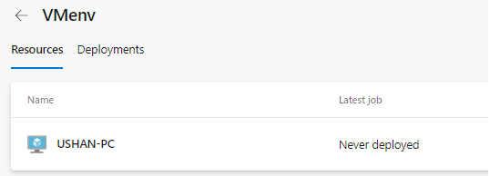
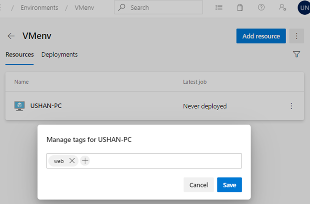
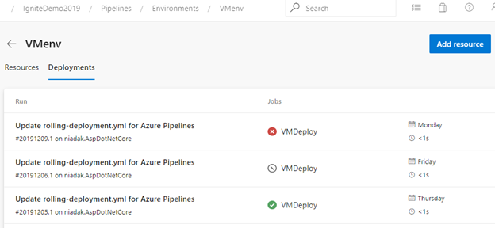
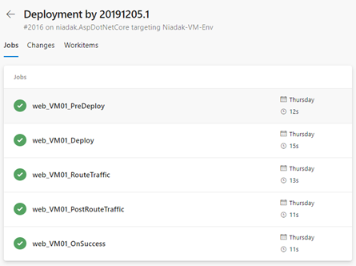

# Tutorial: Deploy your app to Linux virtual machines in Azure using Azure DevOps Services and Azure Pipelines

Continuous integration (CI) and continuous deployment (CD) form a pipeline by which you can build, release, and deploy your code after every code commit. 
This document contains the steps associated with setting up a CI/CD pipeline for doing multi-machine deployments using Azure Pipelines.

Azure Pipelines provides a complete, fully featured set of CI/CD automation tools for deployments to Virtual machines, both on-prem or on any cloud.

In this tutorial, you will set up a YAML based CI/CD pipeline to deploy your app to an Azure Pipelines [Environment](https://docs.microsoft.com/azure/devops/pipelines/process/environments?view=azure-devops) with Linux Virtual machines as resources, each of which serve as web servers to run the app.

You learn how to:

> [!div class="checklist"]
> * Get a sample app.
> * Create a YAML based Azure Pipelines CI pipeline for building the sample app.
> * Create an Azure Pipelines Environment for the Azure virtual machines
> * Create an Azure Pipelines CD pipeline.
> * Execute manual and CI-triggered deployments.

## Before you begin

* Sign in to your Azure DevOps Services organization (**https://dev.azure.com/**). 
  You can get a [free Azure DevOps Services organization](https://go.microsoft.com/fwlink/?LinkId=307137&clcid=0x409&wt.mc_id=o~msft~vscom~home-vsts-hero~27308&campaign=o~msft~vscom~home-vsts-hero~27308).

  > [!NOTE]
  > For more information, see [Connect to Azure DevOps Services](https://docs.microsoft.com/azure/devops/organizations/projects/connect-to-projects?view=vsts).

*  You need a Linux virtual machine for a deployment target.  For more information, see [Create and manage Linux VMs with the Azure CLI](https://docs.microsoft.com/azure/virtual-machines/linux/tutorial-manage-vm).

*  Open inbound port 80 for your virtual machine. For more information, see [Create network security groups using the Azure portal](https://docs.microsoft.com/azure/virtual-network/tutorial-filter-network-traffic).

## Get your sample app code

If you already have an app in GitHub that you want to deploy, you can try creating a pipeline for that code.

However, if you are a new user, then you might get a better start by using our sample code. In that case, fork this repo in GitHub:

#### [Java](#tab/java)

```
https://github.com/spring-projects/spring-petclinic
```

> [!NOTE]
> Petclinic is a [Java Spring Boot](https://spring.io/guides/gs/spring-boot) application built using [Maven](https://spring.io/guides/gs/maven/).

#### [JavaScript](#tab/java-script)

```
https://github.com/azure-devops/fabrikam-node
```

> [!NOTE]
> This Node.js app was built through [Yeoman](https://yeoman.io/learning/index.html). It uses Express, bower, and grunt. And it has some npm packages as dependencies.
> The sample also contains a script that sets up Nginx and deploys the app. It is executed on the virtual machines. Specifically, the script:
> 1. Installs Node, Nginx, and PM2.
> 2. Configures Nginx and PM2.
> 3. Starts the Node app.

* * * 

## Prerequisites for the Linux VM

Sample apps mentioned above have been tested on Ubuntu 16.04, and we recommend you use the same version of Linux VM for this quickstart.
Follow the additional steps described below based on the runtime stack used for the app.

#### [Java](#tab/java)

- For deploying Java Spring Boot and Spring Cloud based apps, create a Linux VM in Azure using [this](https://azuremarketplace.microsoft.com/marketplace/apps/azul.azul-zulu8-ubuntu-1804) template, which provides a fully supported OpenJDK-based runtime.
- For deploying Java servlets on Tomcat server, create a Linux VM with Java 8 using [this](https://azuremarketplace.microsoft.com/marketplace/apps/azul.azul-zulu8-ubuntu-1804) Azure template and [configure Tomcat 9.x as a service](https://tomcat.apache.org/tomcat-9.0-doc/setup.html).
- For deploying Java EE based app, use an Azure template to create a [Linux VM + Java + WebSphere 9.x](https://azuremarketplace.microsoft.com/marketplace/apps/midvision.websphere-application-server-nde-90) or a [Linux VM + Java + WebLogic 12.x](https://azuremarketplace.microsoft.com/marketplace/apps/Oracle.OracleWebLogicServer12cEnterprise) or a [Linux VM +Java](https://azuremarketplace.microsoft.com/marketplace/apps/azul.azul-zulu8-ubuntu-1804) + WildFly/JBoss 14 

#### [JavaScript](#tab/java-script)

To install a javascript app or a Node.js app, you'll need a Linux VM with Nginx web server to deploy the app.
If you don't already have a Linux VM with Nginx, create one now in Azure using the steps in
[this example](/azure/virtual-machines/linux/quick-create-cli).

* * * 

## Create an Azure Pipelines environment with Azure virtual machines

Virtual machines can be added as resources within [environments](https://docs.microsoft.com/azure/devops/pipelines/process/environments) and can be targeted for multi-machine deployments. 
Deployment history views within environment provide traceability from VM to the pipeline and then to the commit.

You can create an environment in the “**Environments**” hub within the “**Pipelines**” section.
1.	Sign in to your Azure DevOps organization and navigate to your project.
2.	In your project, navigate to the **Pipelines** page. Then choose **Environments** and click **Create Environment**. Specify a **Name** (required) for the environment and a **Description**.
3.	Choose **Virtual Machines** as a **Resource** to be added to the environment and click **Next**.
4.	Choose Operating System (Windows/Linux), and **copy PS registration script**. 
5.	Now run the copied script from an administrator PowerShell command prompt on each of the target VMs to be registered with this Environment.
    > [!NOTE]
    > - Personal Access Token of the logged in user is pre-inserted in the script which expires on the same day making the copied script unusable thereon.
    > - If your VM already has any agent running on it, provide a unique name for “agent” to register with environment.
6.	Once the VM is registered, it will start appearing as an environment resource under “resources” tab of the environment.

    

7.	For adding more VMs, you can view and copy the script again by clicking on “Add resource” and choosing “Virtual Machines” as resource. This script would remain same for all the VMs to be added to this environment. 
8.	Each machine interacts with Azure Pipelines to coordinate deployment of your app.

    

9. You can add tags to the VM as part of the interactive PS registration script (or) you can also add/remove the same from the resource view by clicking on the triple dots at the end of each VM resource in the resources view.

   The tags you assign allow you to limit deployment to specific virtual machines when the environment is used in a Deployment job. Tags are each limited to 256 characters, but there is no limit to the number of tags you can use.

   

* * * 

## Define your CI build pipeline

You'll need a continuous integration (CI) build pipeline that publishes your web application, as well as
a deployment script that can be run locally on the Ubuntu server. Set up a CI build pipeline based on the runtime you want to use. 

1. Sign in to your Azure DevOps organization and navigate to your project.

1. In your project, navigate to the **Pipelines** page. Then choose the action to create a new pipeline.

1. Walk through the steps of the wizard by first selecting **GitHub** as the location of your source code.

1. You might be redirected to GitHub to sign in. If so, enter your GitHub credentials.

1. When the list of repositories appears, select your desired sample app repository.

1. Azure Pipelines will analyze your repository and recommend a suitable pipeline template.

#### [Java](#tab/java)

Select the **starter** template and copy the below YAML snippet that builds your Java project and runs tests with Apache Maven:

```YAML
- job: Build
  displayName: Build Maven Project
  steps:
  - task: Maven@3
    displayName: 'Maven Package'
    inputs:
      mavenPomFile: 'pom.xml'
  - task: CopyFiles@2
    displayName: 'Copy Files to artifact staging directory'
    inputs:
      SourceFolder: '$(System.DefaultWorkingDirectory)'
      Contents: '**/target/*.?(war|jar)'
      TargetFolder: $(Build.ArtifactStagingDirectory)
  - upload: $(Build.ArtifactStagingDirectory)
    artifact: drop
```

For more guidance, follow the steps mentioned in [Build your Java app with Maven](https://docs.microsoft.com/azure/devops/pipelines/ecosystems/java).

#### [JavaScript](#tab/java-script)

Select the **starter** template and copy the below YAML snippet that builds a general Node.js project with npm.

```YAML
- stage: Build
  displayName: Build stage
  jobs:  
  - job: Build
    displayName: Build
    - task: NodeTool@0
      inputs:
        versionSpec: '10.x'
      displayName: 'Install Node.js'
    - script: |
        npm install
        npm run build --if-present
        npm run test --if-present
      displayName: 'npm install, build and test'
    - task: ArchiveFiles@2
      displayName: 'Archive files'
      inputs:
        rootFolderOrFile: '$(System.DefaultWorkingDirectory)'
        includeRootFolder: false
        archiveType: zip
        archiveFile: $(Build.ArtifactStagingDirectory)/$(Build.BuildId).zip
        replaceExistingArchive: true
    - upload: $(Build.ArtifactStagingDirectory)/$(Build.BuildId).zip
      artifact: drop
```

For more guidance, follow the steps in [Build your Node.js app with gulp](https://docs.microsoft.com/azure/devops/pipelines/ecosystems/javascript).

- Take a look at the pipeline to see what it does. Make sure that all the default inputs are appropriate for your code.

- Select **Save and run**, then select **Commit directly to the master branch**, and then choose **Save and run** again.

- A new run is started. Wait for the run to finish.

* * * 

## Define CD steps to deploy to the Linux VM

1. Edit the above pipeline and include a [deployment job](https://docs.microsoft.com/azure/devops/pipelines/process/deployment-jobs) by referencing the environment and the VM resources which you have earlier using the YAML syntax below:

   ```YAML
   jobs:  
   - deployment: VMDeploy
     displayName: web
     environment:
       name:  <environment name>
       resourceType: VirtualMachine
       tags: web1
     strategy:
   ```
2. You can select specific sets of virtual machines from the environment to receive the deployment by specifying the **tags** that you have defined for each virtual machine in the environment.
[Here](https://docs.microsoft.com/azure/devops/pipelines/yaml-schema?view=azure-devops&tabs=schema#deployment-job) is the complete YAML schema for Deployment job.

3. You can specify eithor `runOnce` or `rolling` as deployment strategy. 

   `runOnce` is the simplest deployment strategy wherein all the life cycle hooks, namely `preDeploy` `deploy`, `routeTraffic`, and `postRouteTraffic`, are executed once. Then,  either `on:` `success` or `on:` `failure` is executed.

   Below is the example YAML snippet for `runOnce` :
   ```YAML
   jobs:
   - deployment: VMDeploy
     displayName: web
     pool:
       vmImage: 'Ubuntu-16.04'
     environment:
       name: <environment name>
       resourceType: VirtualMachine
     strategy:
         runOnce:
           deploy:
             steps:
             - script: echo my first deployment
   ```

4. Below is an example of the YAML snippet that you can use to define a rolling strategy for Virtual machines updates upto 5 targets in each iteration. `maxParallel` will determine the number of targets that can be deployed to, in parallel. The selection accounts for absolute number or percentage of targets that must remain available at any time excluding the targets that are being deployed to. It is also used to determine the success and failure conditions during deployment.

   ```YAML
   jobs: 
   - deployment: VMDeploy
     displayName: web
     environment:
       name: <environment name>
       resourceType: VirtualMachine
     strategy:
         rolling:
           maxParallel: 5  #for percentages, mention as x%
           preDeploy:
             steps:
             - download: current
               artifact: drop
             - script: echo initialize, cleanup, backup, install certs
           deploy:
             steps:
             - task: Bash@3
               inputs:
                 targetType: 'inline'
                 script: |
                   # Modify deployment script based on the app type
                   echo "Starting deployment script run"
                   sudo java -jar '$(Pipeline.Workspace)/drop/**/target/*.jar'
           routeTraffic:
             steps:
             - script: echo routing traffic
           postRouteTraffic:
             steps:
             - script: echo health check post-route traffic
           on:
             failure:
               steps:
               - script: echo Restore from backup! This is on failure
             success:
               steps:
               - script: echo Notify! This is on success
   ```

   With each run of this job, deployment history is recorded against the `<environment name>` environment that you have created and registered the VMs.

## Run your pipeline and get traceability views in environment
Deployments view of the environment provides complete traceability of commits and work items, and a cross-pipeline deployment history per environment/resource.


  


## Next steps
- You can proceed to [customize the pipeline](https://docs.microsoft.com/azure/devops/pipelines/customize-pipeline) you just created.
- To learn what else you can do in YAML pipelines, see [YAML schema reference](https://docs.microsoft.com/azure/devops/pipelines/yaml-schema).
- To learn about how to deploy a LAMP (Linux, Apache, MySQL, and PHP) stack, advance to the next tutorial.

> [!div class="nextstepaction"]
> [Deploy LAMP stack](tutorial-lamp-stack.md)
