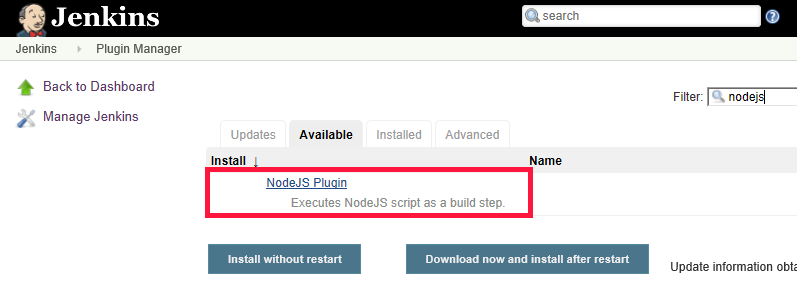
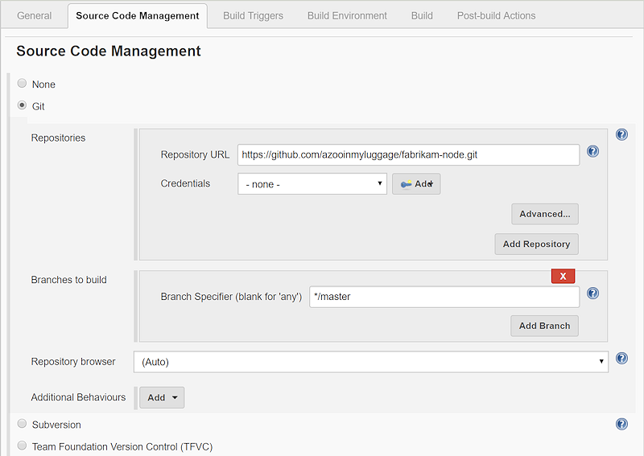
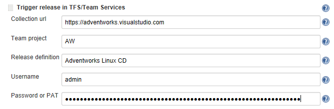
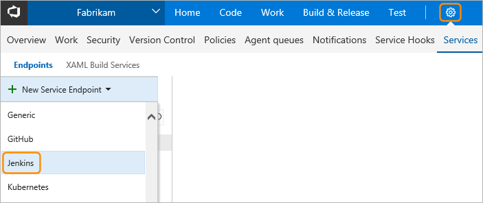

# Tutorial: Deploy your app to Linux virtual machines in Azure with using Jenkins and Azure DevOps Services

Continuous integration (CI) and continuous deployment (CD) form a pipeline by which you can build, release, and deploy your code. Azure DevOps Services provides a complete, fully featured set of CI/CD automation tools for deployment to Azure. Jenkins is a popular third-party CI/CD server-based tool that also provides CI/CD automation. You can use Azure DevOps Services and Jenkins together to customize how you deliver your cloud app or service.

In this tutorial, you use Jenkins to build a Node.js web app. You then use Azure DevOps to deploy it

to a [deployment group](https://docs.microsoft.com/azure/devops/pipelines/release/deployment-groups/index?view=vsts) that contains Linux virtual machines (VMs). You learn how to:

> [!div class="checklist"]
> * Get the sample app.
> * Configure Jenkins plug-ins.
> * Configure a Jenkins Freestyle project for Node.js.
> * Configure Jenkins for Azure DevOps Services integration.
> * Create a Jenkins service endpoint.
> * Create a deployment group for the Azure virtual machines.
> * Create an Azure Pipelines release pipeline.
> * Execute manual and CI-triggered deployments.

## Before you begin

* You need access to a Jenkins server. If you have not yet created a Jenkins server,
  see [Create a Jenkins master on an Azure virtual machine](https://docs.microsoft.com/azure/jenkins/install-jenkins-solution-template). 

* Sign in to your Azure DevOps Services organization (**https://{yourorganization}.visualstudio.com**). 
  You can get a [free Azure DevOps Services organization](https://go.microsoft.com/fwlink/?LinkId=307137&clcid=0x409&wt.mc_id=o~msft~vscom~home-vsts-hero~27308&campaign=o~msft~vscom~home-vsts-hero~27308).

  > [!NOTE]
  > For more information, see [Connect to Azure DevOps Services](https://docs.microsoft.com/azure/devops/organizations/projects/connect-to-projects?view=vsts).

*  You need a Linux virtual machine for a deployment target.  For more information, see [Create and manage Linux VMs with the Azure CLI](https://docs.microsoft.com/azure/virtual-machines/linux/tutorial-manage-vm).

*  Open inbound port 80 for your virtual machine. For more information, see [Create network security groups using the Azure portal](https://docs.microsoft.com/azure/virtual-network/tutorial-filter-network-traffic).

## Get the sample app

You need an app to deploy, stored in a Git repository.
For this tutorial, we recommend that you use [this sample app available from GitHub](https://github.com/azooinmyluggage/fabrikam-node). This tutorial contains a sample script that's used for installing Node.js and an application. If you want to work with your own repository, you should configure a similar sample.

Create a fork of this app and take note of the location (URL) for use in later steps of this tutorial. For more information, see [Fork a repo](https://help.github.com/articles/fork-a-repo/).    

> [!NOTE]
> The app was built through [Yeoman](https://yeoman.io/learning/index.html). It uses Express, bower, and grunt. And it has some npm packages as dependencies.
> The sample also contains a script that sets up Nginx and deploys the app. It is executed on the virtual machines. Specifically, the script:
> 1. Installs Node, Nginx, and PM2.
> 2. Configures Nginx and PM2.
> 3. Starts the Node app.

## Configure Jenkins plug-ins

First, you must configure two Jenkins plug-ins: **NodeJS** and **VS Team Services Continuous Deployment**.

1. Open your Jenkins account and select **Manage Jenkins**.
2. On the **Manage Jenkins** page, select **Manage Plugins**.
3. Filter the list to locate the **NodeJS** plug-in, and select the **Install without restart** option.
    
4. Filter the list to find the **VS Team Services Continuous Deployment** plug-in and select the **Install without restart** option.
5. Go back to the Jenkins dashboard and select **Manage Jenkins**.
6. Select **Global Tool Configuration**. Find **NodeJS** and select **NodeJS installations**.
7. Select the **Install automatically** option, and then enter a **Name** value.
8. Select **Save**.

## Configure a Jenkins Freestyle project for Node.js

1. Select **New Item**. Enter an item name.
2. Select **Freestyle project**. Select **OK**.
3. On the **Source Code Management** tab, select **Git** and enter the details of the repository and the branch that contain your app code.    
    
4. On the **Build Triggers** tab, select **Poll SCM** and enter the schedule `H/03 * * * *` to poll the Git repository for changes every three minutes. 
5. On the **Build Environment** tab, select **Provide Node &amp; npm bin/ folder PATH** and select the **NodeJS Installation** value. Leave **npmrc file** set to **use system default**.
6. On the **Build** tab, select **Execute shell** and enter the command `npm install` to ensure that all dependencies are updated.

## Configure Jenkins for Azure DevOps Services integration

> [!NOTE]
> Ensure that the personal access token (PAT) you use for the following steps contains the *Release* (read, write, execute and manage) permission in Azure DevOps Services.
 
1.  Create a PAT in your Azure DevOps Services organization if you don't already have one. Jenkins requires this information to access your Azure DevOps Services organization. Be sure to store the token information for upcoming steps in this section.
  
    To learn how to generate a token, read [How do I create a personal access token for Azure DevOps Services?](https://docs.microsoft.com/azure/devops/organizations/accounts/use-personal-access-tokens-to-authenticate?view=vsts).
2. In the **Post-build Actions** tab, select **Add post-build action**. Select **Archive the artifacts**.
3. For **Files to archive**, enter `**/*` to include all files.
4. To create another action, select **Add post-build action**.
5. Select **Trigger release in TFS/Team Services**. Enter the URI for your Azure DevOps Services organization, such as **https://{your-organization-name}.visualstudio.com**.
6. Enter the **Project** name.
7. Choose a name for the release pipeline. (You create this release pipeline later in Azure DevOps Services.)
8. Choose credentials to connect to your Azure DevOps Services or Team Foundation Server environment:
   - Leave **Username** blank if you are using Azure DevOps Services. 
   - Enter a username and password if you are using an on-premises version of Team Foundation Server.    
   
5. Save the Jenkins project.

## Create a Jenkins service endpoint

A service endpoint allows Azure DevOps Services to connect to Jenkins.

1. Open the **Services** page in Azure DevOps Services, open the **New Service Endpoint** list, and select **Jenkins**.
   
2. Enter a name for the connection.
3. Enter the URL of your Jenkins server, and select the **Accept untrusted SSL certificates** option. An example URL is	**http://{YourJenkinsURL}.westcentralus.cloudapp.azure.com**.
4. Enter the username and password for your Jenkins account.
5. Select **Verify connection** to check that the information is correct.
6. Select **OK** to create the service endpoint.

## Create a deployment group for Azure virtual machines

You need a [deployment group](https://www.visualstudio.com/docs/build/concepts/definitions/release/deployment-groups/) to register the Azure DevOps Services agent so the release pipeline can be deployed to your virtual machine. Deployment groups make it easy to define logical groups of target machines for deployment, and to install the required agent on each machine.

   > [!NOTE]
   > In the following procedure, be sure to install the prerequisites and *don't run the script with sudo privileges.*

1. Open the **Releases** tab of the **Build &amp; Release** hub, open **Deployment groups**, and select **+ New**.
2. Enter a name for the deployment group, and an optional description. Then select **Create**.
3. Choose the operating system for your deployment target virtual machine. For example, select **Ubuntu 16.04+**.
4. Select **Use a personal access token in the script for authentication**.
5. Select the **System prerequisites** link. Install the prerequisites for your operating system.
6. Select **Copy script to clipboard** to copy the script.
7. Log in to your deployment target virtual machine and run the script. Don't run the script with sudo privileges.
8. After the installation, you are prompted for deployment group tags. Accept the defaults.
9. In Azure DevOps Services, check for your newly registered virtual machine in **Targets** under **Deployment Groups**.

## Create an Azure Pipelines release pipeline

A release pipeline specifies the process that Azure Pipelines uses to deploy the app. In this example, you execute a shell script.

To create the release pipeline in Azure Pipelines:

1. Open the **Releases** tab of the **Build &amp; Release** hub, and select **Create release pipeline**. 
2. Select the **Empty** template by choosing to start with an **Empty process**.
3. In the **Artifacts** section, select **+ Add Artifact** and choose **Jenkins** for **Source type**. Select your Jenkins service endpoint connection. Then select the Jenkins source job and select **Add**.
4. Select the ellipsis next to **Environment 1**. Select **Add deployment group phase**.
5. Choose your deployment group.
5. Select **+** to add a task to **Deployment group phase**.
6. Select the **Shell Script** task and select **Add**. The **Shell Script** task provides the configuration for a script to run on each server in order to install Node.js and start the app.
8. For **Script Path**, enter	**$(System.DefaultWorkingDirectory)/Fabrikam-Node/deployscript.sh**.
9. Select **Advanced**, and then enable **Specify Working Directory**.
10. For **Working Directory**, enter **$(System.DefaultWorkingDirectory)/Fabrikam-Node**.
11. Edit the name of the release pipeline to the name that you specified on the **Post-build Actions** tab of the build in Jenkins. Jenkins requires this name to be able to trigger a new release when the source artifacts are updated.
12. Select **Save** and select **OK** to save the release pipeline.

## Execute manual and CI-triggered deployments

1. Select **+ Release** and select **Create Release**.
2. Select the build that you completed in the highlighted drop-down list, and select **Queue**.
3. Choose the release link in the pop-up message. For example: "Release **Release-1** has been created."
4. Open the **Logs** tab to watch the release console output.
5. In your browser, open the URL of one of the servers that you added to your deployment group. For example, enter **http://{your-server-ip-address}**.
6. Go to the source Git repository and modify the contents of the **h1** heading in the file app/views/index.jade with some changed text.
7. Commit your change.
8. After a few minutes, you will see a new release created on the **Releases** page of Azure DevOps. Open the release to see the deployment taking place. Congratulations!

## Troubleshooting the Jenkins plugin

If you encounter any bugs with the Jenkins plugins, file an issue in the [Jenkins JIRA](https://issues.jenkins-ci.org/) for the specific component.

## Next steps

In this tutorial, you automated the deployment of an app to Azure by using Jenkins for build and Azure DevOps Services for release. You learned how to:

> [!div class="checklist"]
> * Build your app in Jenkins.
> * Configure Jenkins for Azure DevOps Services integration.
> * Create a deployment group for the Azure virtual machines.
> * Create a release pipeline that configures the VMs and deploys the app.

To learn about how to deploy a LAMP (Linux, Apache, MySQL, and PHP) stack, advance to the next tutorial.

> [!div class="nextstepaction"]
> [Deploy LAMP stack](tutorial-lamp-stack.md)
