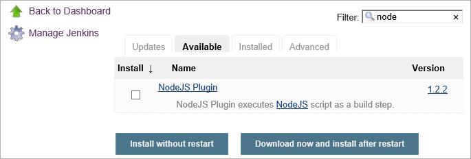
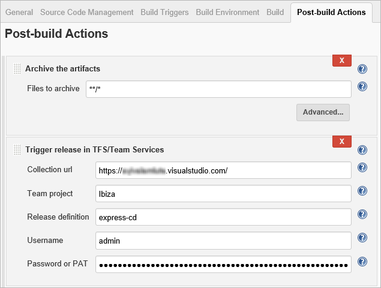
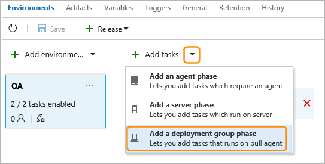

# Implement continuous deployment of your app to Linux VMs using Jenkins and Team Services

Continuous integration (CI) and continuous deployment (CD) means starting an automated deployment process whenever a new successful build is available.
In this tutorial, you set up CI/CD for a Node.js app by using Jenkins to build it, and Visual Studio Team Services
or Team Foundation Server (TFS) to deploy it to an Azure deployment group; including how to:

* Build your app in Jenkins
* Configure Jenkins for CI with Team Services or TFS
* Create a deployment group for the Azure virtual machines
* Create a release definition that configures the VMs and deploys the app

## Get set up

You'll need a [Team Services account](https://www.visualstudio.com/team-services/pricing/)
or a [Team Foundation Server account](https://www.visualstudio.com/tfs/).
You'll also need to have an app that you want to deploy stored in a Git repository,
and configure the required plugins in Jenkins to interface with Team Services,
as described next.

### Get the sample app

For this tutorial, we recommend you use [this sample app available from
GitHub](https://github.com/azooinmyluggage/fabrikam-node). You can
copy this app into your own Git repository if you prefer.
The app was built using [Yeoman](http://yeoman.io/learning/index.html);
it uses **Express**, **bower**, and **grunt**; and it has some **npm** packages as dependencies.

The sample app contains a set of
[Azure Resource Manager (ARM) templates](https://docs.microsoft.com/en-us/azure/azure-resource-manager/resource-group-overview#template-deployment)
that are used to create the deployment group and virtual machines where
the app will be deployed. These templates are used by tasks in the Team
Services or TFS release definition.

The main template creates a network security group, a virtual machine, 
and a virtual network; assigns a public IP address; and opens inbound
port 80. It also adds a tag that is used by the deployment group to 
select the machines to receive the deployment.

The parameters template contains the values that override settings in
the main template when the release definition processes that template
for each of the virtual machines.

The sample also contains a script that is executed on each of the virtual
machines after the deployment has succeeded. This script:

* Installs Node, Nginx, and PM2

* Configures Nginx and PM2, then starts the Node app

This is the script, named **deployscript.sh**:

```
sudo apt-get update
curl -sL https://deb.nodesource.com/setup_6.x | sudo -E bash - 
sudo apt-get install -y nodejs
ln -sf /usr/bin/nodejs /usr/bin/node
sudo apt-get install -y nginx
sudo rm -f /etc/nginx/sites-enabled/default
sudo cp node-app-nginx-config /etc/nginx/sites-available/
sudo ln -sf /etc/nginx/sites-available/node-app-nginx-config /etc/nginx/sites-enabled/node-app-nginx-config
sudo service nginx restart
sudo npm install -g pm2
sudo pm2 start -f app.js
sudo pm2 startup systemd
sudo pm2 save
```

### Configure Jenkins plugins

You need to configure plugins for NodeJS and integration with Team Services or TFS.

1. Open your Jenkins account and choose **Manage Jenkins**.

1. In the **Manage Jenkins** page, choose **Manage Plugins**.

1. Filter the list to locate the the **NodeJS** plugin and install it without restart.

  

1. Filter the list to find the **Team Foundation Server** plugin and install it without restart.

## Configure Jenkins build 

In Jenkins, create a new build project and configure it as follows:

1. In the **General** tab, enter a name for your build project.

1. In the **Source Code Management** tab, select **Git** and enter details
  of the repository and branch containing your app code.

1. In the **Build Triggers** tab, select **Poll SCM** and enter the schedule `H/03 * * * *`
  to poll the Git repository for changes every three minutes. 

1. In the **Build Environment** tab, select **Provide Node &amp; npm bin/ folder PATH**
  and enter `NodeJS` for the Node JS Installation value. Leave **npmrc file** set to
  "use system default".

1. In the **Build** tab, enter the command `npm install` to ensure all dependencies are updated.

1. In the **Post-build Actions** tab:
 
   - For **Files to archive**, enter `**/*` to include all files.

   - For **Trigger release in TFS/Team Services** enter the full URL of your account
     (for example, `https://your-account-name.visualstudio.com`), the project name,
     the name of the release definition you will create, and the credentials to connect to your account.<p /> 

   

   [How do I create a personal access token for Team Services and TFS?](https://www.visualstudio.com/en-us/docs/setup-admin/team-services/use-personal-access-tokens-to-authenticate)

1. Save the build project.

## Configure Team Services or TFS

You'll need a connection to Jenkins so that Team Services or TFS can 
download the build artifacts and deploy them.

1. Open the **Services** tab of the administration page, and add a new **Jenkins** service endpoint.

   

1. In the **Add new Jenkins Connection** dialog, enter a name you will use to refer to the service endpoint.

1. Enter the URL of your Jenkins server, and the credentials to connect to it.

1. Use the **Verify connection** link to check the connection, and then choose **OK**.

## Create a deployment group

You need a deployment group containing the virtual machines you will deploy to.
To create a deployment group in Team Services or TFS:
 
1. Open the **Releases** tab of the **Build &amp; Release** hub,
   open the **Deployment groups** tab, and choose **+ New**.

1. Enter a name for the deployment group, and optionaly a description.
   Then choose **Create**.

1. The virtual machines to populate the new deployment group will be created
   by the Azure Resource Group Deployment task. You don't need to register them manually.

## Create a release definition

To create the release definition in Team Services or TFS:

1. Open the **Releases** tab of the **Build &amp; Release** hub, open the **+** drop-down
   in the list of release definitions, and choose the **Create release definition**. 

1. Select the **Empty** template and choose **Next**.

1. In **Artifacts** section, choose **Jenkins** and select your Jenkins service endpoint connection. 
   Then select the Jenkins source job and choose **Create**.

1. In the new release definition, choose **+ Add tasks** and add an **Azure Resource Group Deployment** task
   to the default environment.

1. Choose the drop-down arrow next to the **+ Add tasks** link and add a deployment group phase to the definition.

    

1. In the Task catalog, open the **Utility** section and add an instance of the **Shell Script** task.

1. Configure the tasks as follows:

   | Task step | Parameters |
   | --------- | ---------- |
   | <br/>Create the deployment group using an Azure Resource Group template  | **Azure Subscription:** Select a connection from the list under **Available Azure Service Connections**. If no connections appear, choose **Manage**, select **New Service Endpoint** then **Azure Resource Manager**, and follow the prompts. Then return to your release definition, refresh the **AzureRM Subscription** list, and select the connection you just created.<br/>**Resource group**: Enter a name of the resource group you created earlier.<br />**Location**: Select a region for the deployment.<br />**Template location**: `URL of the file`<br />**Template link**: `{your-git-repo}/{branch}/ARM-Templates/UbuntuWeb1.json`<br />**Template parameters link**: `{your-git-repo}/{branch}/ARM-Templates/UbuntuWeb1.parameters.json`<br />**Override template parameters**: A list of the override values, for example: `-location {location} -virtualMachineName {machine] -virtualMachineSize Standard_DS1_v2 -adminUsername {username} -virtualNetworkName fabrikam-node-rg-vnet -networkInterfaceName fabrikam-node-websvr1 -networkSecurityGroupName fabrikam-node-websvr1-nsg -adminPassword $(adminpassword) -diagnosticsStorageAccountName fabrikamnodewebsvr1 -diagnosticsStorageAccountId Microsoft.Storage/storageAccounts/fabrikamnodewebsvr1 -diagnosticsStorageAccountType Standard_LRS -addressPrefix 172.16.8.0/24 -subnetName default -subnetPrefix 172.16.8.0/24 -publicIpAddressName fabrikam-node-websvr1-ip -publicIpAddressType Dynamic`<br />**Enable prerequisites**: `Configure with Deployment Group agent`<br />**TFS/VSTS endpoint**: Select the Jenkins service endpoint connection you created earlier.<br />**Team project**: Select your current project<br />**Deployment Group**: Enter the same deployment group name as you used for the **Resource group** parameter above. |
   | [Utility: Shell Script](../../steps/utility/shell-script.md)<br/>Run a script on each server to install Node.js and start the app  | **Script Path**: `$(System.DefaultWorkingDirectory)/Fabrikam-Node/deployscript.sh`<br />**Specify Working Directory**: `Checked`<br/>**Working Directory**: `$(System.DefaultWorkingDirectory)/Fabrikam-Node` |
   
   > The default settings for the Azure Resource Group Deployment task are to create or update a resource,
   and to do so incrementally. The task will create the VMs the first time it runs, and subsequently just update them.

1. Optionally, change the name of the environment by clicking on the name. 

1. Edit the name of the release definition to the name you specified in the
   **Post-build Actions** tab of the build in Jenkins. This is necessary for 
   Jenkins to be able to trigger a new release when the source artifacts are updated.

1. Choose **Save**, and choose **OK**.

## Start a manual deployment

1. Choose **+ Release** and select **Create Release**.

1. Select the build you just completed in the highlighted drop-down list and choose **Create**.

1. Choose the release link in the popup message. For example: "Release **Release-1** has been created".

. Open the **Logs** tab to watch the release console output.

## View the deployed app

In your browser, open the URL of one of the servers you added to your deployment group. For example, enter
`http://{your-server-ip-address}`

## Start a CI/CD deployment

1. In the release definition, uncheck the **Enabled** checkbox in the **Control Options**
   section of the settings for the Azure Resource Group Deployment task.
   For subsequent deployments to the existing deployment group, you do not need
   to re-execute this task.

1. Go to your source Git repository and modify one of the application files.

1. After a few minutes, you will see a new release created in the **Releases** 
   page of Team Services or TFS. Open the release to see the deployment taking place.

## Q&A

### Can I deploy to a production environment automatically after the app is approved?

Yes. This tutorial shows how to deploy to one environment (one set of target machines
in a deployment group). You can create a deployment group for other target machines, such as
production servers, and deploy to these in exactly the same way.
For example, you could [add a second environment](../../actions/work-with-release-definitions.md#add-envir)
that deploys to the production servers, and configure a 
[pre-deployment approval rule](../../concepts/definitions/release/environments.md#approvals)
for the environment so that specific users (or one or more members of a specific group) must
approve the release before it is deployed to production.

### Can I add additional tasks to the release definition?

Yes, you can add tasks such as Test tasks that run as part of your deployment process.
For a list of tasks, see the [index of tasks](../../define/build.md).

### If I use GitHub to store my app, can I get better integration for changes to the source?

Yes, you can configure GitHub to automatically notify Jenkins when a change to the source code
occurs. This is more efficient than polling. You'll need to install the
[GitHub Plugin](https://wiki.jenkins.io/display/JENKINS/Github+Plugin) into Jenkins for this. 

