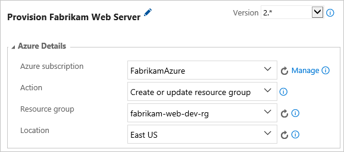
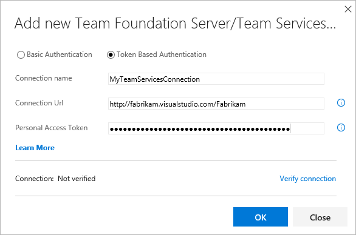

# Deploy your app to Linux VMs using Jenkins and Team Services

Continuous integration (CI) and continuous deployment (CD) is a pipeline by which you can build, release, and deploy your code. Team Services provides a complete, fully featured set of CI/CD automation tools for deployment to Azure. Jenkins is a popular 3rd-party CI/CD server-based tool that also provides CI/CD automation. You can use both together to customize how you deliver your cloud app or service.

In this tutorial, you use Jenkins to build a **Node.js web app**, and Visual Studio Team Services to deploy it
to a [deployment group](https://www.visualstudio.com/docs/build/concepts/definitions/release/deployment-groups/) containing Linux virtual machines.

You will:

> [!div class="checklist"]
> * Build your app in Jenkins
> * Configure Jenkins for Team Services integration
> * Create a deployment group for the Azure virtual machines
> * Create a release definition that configures the VMs and deploys the app

## Before you begin

* You need access to a Jenkins account. If you have not yet created a Jenkins server,
  see [Jenkins Documentation](https://jenkins.io/doc/). 

* Sign in to your Team Services account (`https://{youraccount}.visualstudio.com`). 
  You can get a [free Team Services account](https://go.microsoft.com/fwlink/?LinkId=307137&clcid=0x409&wt.mc_id=o~msft~vscom~home-vsts-hero~27308&campaign=o~msft~vscom~home-vsts-hero~27308).

  > [!NOTE]
  > For more information, see [Connect to Team Services](https://www.visualstudio.com/docs/setup-admin/team-services/connect-to-visual-studio-team-services).

* Create a personal access token (PAT) in your Team Services account if you don't already have one. Jenkins requires this information to access your Team Services account.
  Read [How do I create a personal access token for Team Services and TFS](https://www.visualstudio.com/docs/setup-admin/team-services/use-personal-access-tokens-to-authenticate) to learn how to generate one.

## Get the sample app

You need an app to deploy stored in a Git repository.
For this tutorial, we recommend you use [this sample app available from
GitHub](https://github.com/azooinmyluggage/fabrikam-node).

1. Create a fork of this app and take note of the location (URL) for use in later steps of this tutorial.

1. Make the fork **public** to simplify connecting to GitHub later.

> [!NOTE]
> For more information, see [Fork a repo](https://help.github.com/articles/fork-a-repo/)
and [Making a private repository public](https://help.github.com/articles/making-a-private-repository-public/).

> [!NOTE]
> The app was built using [Yeoman](http://yeoman.io/learning/index.html);
> it uses **Express**, **bower**, and **grunt**; and it has some **npm** packages as dependencies.
> The sample app contains a set of
> [Azure Resource Manager templates](https://docs.microsoft.com/azure/azure-resource-manager/resource-group-overview#template-deployment)
> that are used to dynamically create the virtual machines for deployment on Azure. These templates are used by tasks in the [Team
> Services release definition](https://www.visualstudio.com/docs/build/actions/work-with-release-definitions).
> The main template creates a network security group, a virtual machine, 
> and a virtual network. It assigns a public IP address and opens inbound
> port 80. It also adds a tag that is used by the deployment group to 
> select the machines to receive the deployment.
>
> The sample also contains a script that sets up Nginx and deploys the app. It is executed on each of the virtual
> machines. Specifically, the script installs Node, Nginx, and PM2; configures Nginx and PM2; then starts the Node app.

## Configure Jenkins plugins

First, you must configure two Jenkins plugins for **NodeJS** and **Integration with Team Services**.

1. Open your Jenkins account and choose **Manage Jenkins**.

1. In the **Manage Jenkins** page, choose **Manage Plugins**.

1. Filter the list to locate the **NodeJS** plugin and install it without restart.

   

1. Filter the list to find the **Team Foundation Server** plugin and install it. (This plug-in works for both Team Services and Team Foundation Server.) Restarting Jenkins is not necessary.

## Configure Jenkins build for Node.js

In Jenkins, create a new build project and configure it as follows:

1. In the **General** tab, enter a name for your build project.

1. In the **Source Code Management** tab, select **Git** and enter the details
   of the repository and the branch containing your app code.

   

   > [!NOTE]
   > If your repository is not public, choose **Add** and provide credentials to connect to it.

1. In the **Build Triggers** tab, select **Poll SCM** and enter the schedule `H/03 * * * *`
   to poll the Git repository for changes every three minutes. 

1. In the **Build Environment** tab, select **Provide Node &amp; npm bin/ folder PATH**
   and enter `NodeJS` for the Node JS Installation value. Leave **npmrc file** set to
   "use system default."

1. In the **Build** tab, enter the command `npm install` to ensure all dependencies are updated.

## Configure Jenkins for Team Services integration

1. In the **Post-build Actions** tab, for **Files to archive**, enter `**/*` to include all files.

1. For **Trigger release in TFS/Team Services**, enter the full URL of your account
   (such as `https://your-account-name.visualstudio.com`), the project name,
   a name for the release definition (created later), and the credentials to connect to your account.
   You need your user name and the PAT you created earlier. 

   

1. Save the build project.

## Create a Jenkins service endpoint

A service endpoint allows Team Services to connect to Jenkins.

1. Open the **Services** page in Team Services, open the **New Service Endpoint** list, and choose **Jenkins**.

   

1. Enter a name you will use to refer to this connection.

1. Enter the URL of your Jenkins server, and tick the **Accept untrusted SSL certificates** option.

1. Enter the user name and password for your Jenkins account.

1. Choose **Verify connection** to check that the information is correct.

1. Choose **OK** to create the service endpoint.

## Create a deployment group

You need a [deployment group](https://www.visualstudio.com/docs/build/concepts/definitions/release/deployment-groups/) to  contain the virtual machines.

1. Open the **Releases** tab of the **Build &amp; Release** hub, then
   open the **Deployment groups** tab, and choose **+ New**.

1. Enter a name for the deployment group, and an optional description.
   Then choose **Create**.

The Azure Resource Group Deployment task creates and registers the VMs when it runs using the Azure Resource Manager template.
You don't need to create and register the virtual machines yourself.

## Create a release definition

A release definition specifies the process Team Services will execute to deploy the app.
To create the release definition in Team Services:

1. Open the **Releases** tab of the **Build &amp; Release** hub, open the **+** drop-down
   in the list of release definitions, and choose the **Create release definition**. 

1. Select the **Empty** template and choose **Next**.

1. In the **Artifacts** section, click on **Link an Artifact** and choose **Jenkins**. Select your Jenkins service endpoint connection. Then select the Jenkins source job and choose **Create**. 

1. In the new release definition, choose **+ Add tasks** and add an **Azure Resource Group Deployment** task to the default environment.

1. Choose the drop down arrow next to the **+ Add tasks** link and add a deployment group phase to the definition.

    

1. In the Task catalog, open the **Utility** section and add an instance of the **Shell Script** task.

1. The parameters template used in the Azure Resource Group Deployment task sets the admin password used to connect to the VMs.
   You provide this password with the variable **$(adminpassword)**:
   
   - Open the **Variables** tab and, in the **Variables** section, enter the name `adminpassword`.

   - Enter the administrator password.

   - Choose the "padlock" icon next to the value textbox to protect the password. 

## Configure the Azure Resource Group Deployment task

The **Azure Resource Group Deployment** task is used to create the deployment group. Configure it as follows:

* **Azure Subscription:** Select a connection from the list under **Available Azure Service Connections**. 
  If no connections appear, choose **Manage**, select **New Service Endpoint** then **Azure Resource Manager**, and follow the prompts.
  Return to your release definition, refresh the **AzureRM Subscription** 
  list, and select the connection you created.

* **Resource group**: Enter a name of the resource group you created earlier.

* **Location**: Select a region for the deployment.

  

* **Template location**: `URL of the file`

* **Template link**: `{your-git-repo}/ARM-Templates/UbuntuWeb1.json`

* **Template parameters link**: `{your-git-repo}/ARM-Templates/UbuntuWeb1.parameters.json`

* **Override template parameters**: A list of the override values, for example: `-location {location} -virtualMachineName {machine] -virtualMachineSize Standard_DS1_v2 -adminUsername {username} -virtualNetworkName fabrikam-node-rg-vnet -networkInterfaceName fabrikam-node-websvr1 -networkSecurityGroupName fabrikam-node-websvr1-nsg -adminPassword $(adminpassword) -diagnosticsStorageAccountName fabrikamnodewebsvr1 -diagnosticsStorageAccountId Microsoft.Storage/storageAccounts/fabrikamnodewebsvr1 -diagnosticsStorageAccountType Standard_LRS -addressPrefix 172.16.8.0/24 -subnetName default -subnetPrefix 172.16.8.0/24 -publicIpAddressName fabrikam-node-websvr1-ip -publicIpAddressType Dynamic`. Insert your own specific values for the {placeholders}. 

* **Enable prerequisites**: `Configure with Deployment Group agent`

* **TFS/VSTS endpoint**: Choose **Add** and, in the "Add new Team Foundation Server/Team Services Connection" dialog, select **Token Based Authentication**. Enter a name of the connection and the URL of your team project. Then generate and enter a [Personal Access Token (PAT)]( https://www.visualstudio.com/docs/setup-admin/team-services/use-personal-access-tokens-to-authenticate) to authenticate the connection to your team project.

  

* **Team project**: Select your current project.

* **Deployment Group**: Enter the same deployment group name as you used for the **Resource group** parameter.

The default settings for the Azure Resource Group Deployment task are to create or update a resource,
and to do so incrementally. The task creates the VMs the first time it runs, and subsequently just update them.

## Configure the Shell Script task

The **Shell Script** task is used to provide the configuration for a script to run on each server to install Node.js and start the app. Configure it as follows:

* **Script Path**: `$(System.DefaultWorkingDirectory)/Fabrikam-Node/deployscript.sh`

* **Specify Working Directory**: `Checked`

* **Working Directory**: `$(System.DefaultWorkingDirectory)/Fabrikam-Node`
   
## Rename and save the release definition

1. Edit the name of the release definition to the name you specified in the
   **Post-build Actions** tab of the build in Jenkins. Jenkins requires this name
   to be able to trigger a new release when the source artifacts are updated.

1. Optionally, change the name of the environment by clicking on the name. 

1. Choose **Save**, and choose **OK**.

## Start a manual deployment

1. Choose **+ Release** and select **Create Release**.

1. Select the build you completed in the highlighted drop-down list and choose **Create**.

1. Choose the release link in the popup message. For example: "Release **Release-1** has been created."

1. Open the **Logs** tab to watch the release console output.

1. In your browser, open the URL of one of the servers you added to your deployment group. For example, enter `http://{your-server-ip-address}`

## Start a CI/CD deployment

1. In the release definition, uncheck the **Enabled** checkbox in the **Control Options**
   section of the settings for the Azure Resource Group Deployment task.
   For future deployments to the existing deployment group, you do not need
   to re-execute this task.

1. Go to the source Git repository and modify the contents of the **h1** heading in the file 
   [app/views/index.jade](https://github.com/azooinmyluggage/fabrikam-node/blob/master/app/views/index.jade).

1. Commit your change.

1. After a few minutes, you will see a new release created in the **Releases** 
   page of Team Services or TFS. Open the release to see the deployment taking place. Congratulations!

## Next Steps

In this tutorial, you automated the deployment of an app to Azure using Jenkins build and Team Services for release. You learned how to:

> [!div class="checklist"]
> * Build your app in Jenkins
> * Configure Jenkins for Team Services integration
> * Create a deployment group for the Azure virtual machines
> * Create a release definition that configures the VMs and deploys the app

Advance to the next tutorial to learn more about how to deploy a LAMP (Linux, Apache, MySQL, and PHP) stack.

> [!div class="nextstepaction"]
> [Deploy LAMP stack](tutorial-lamp-stack.md)