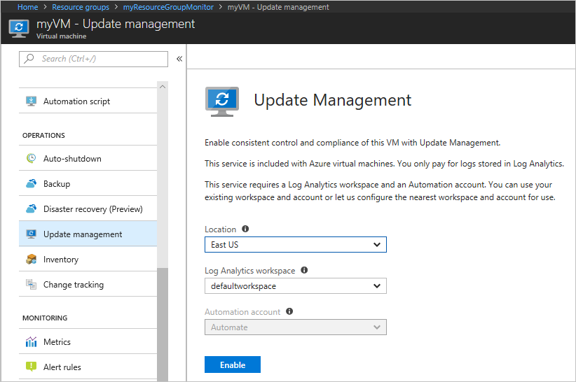
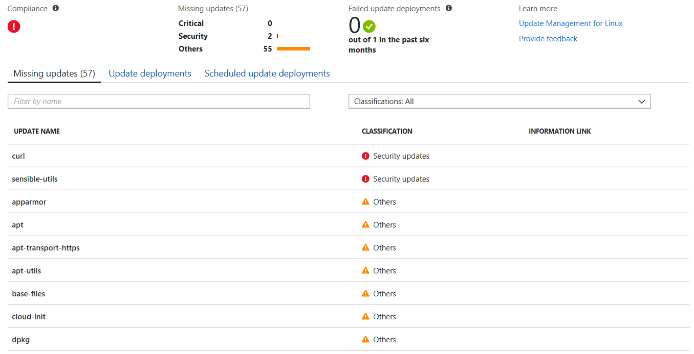
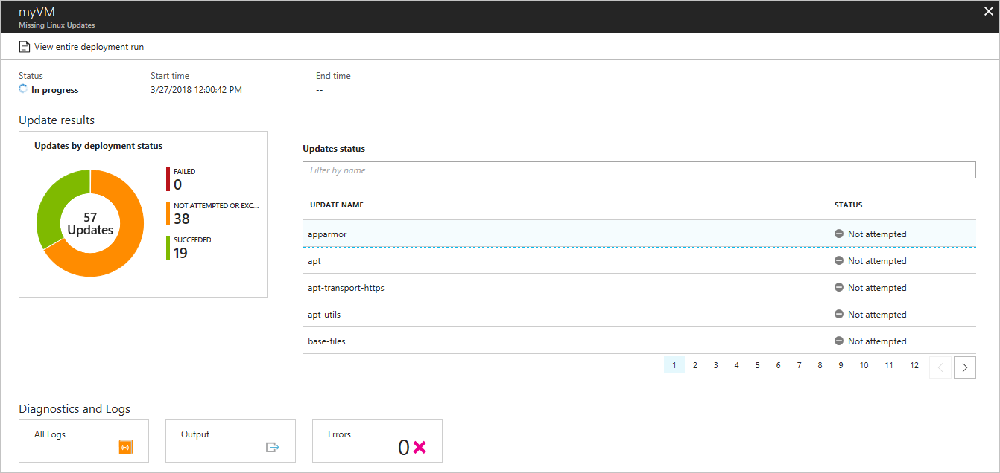
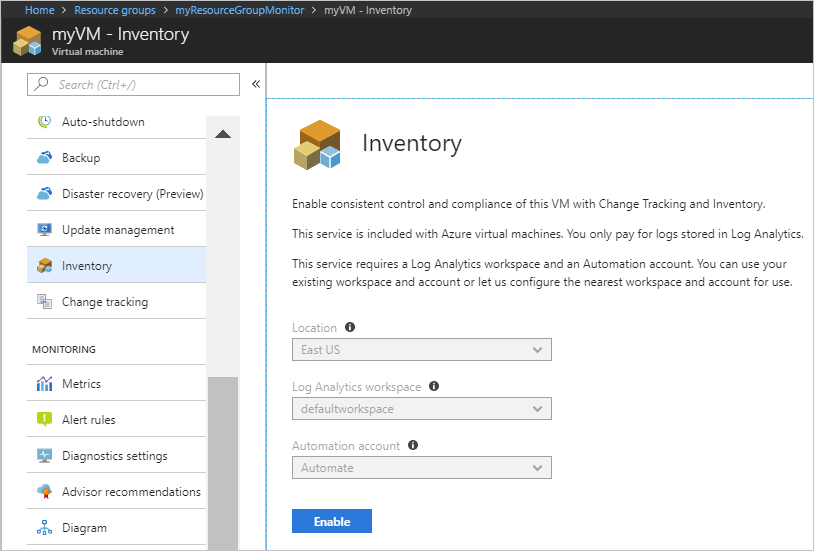
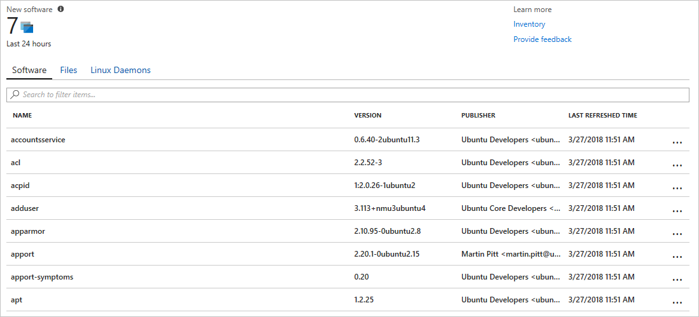
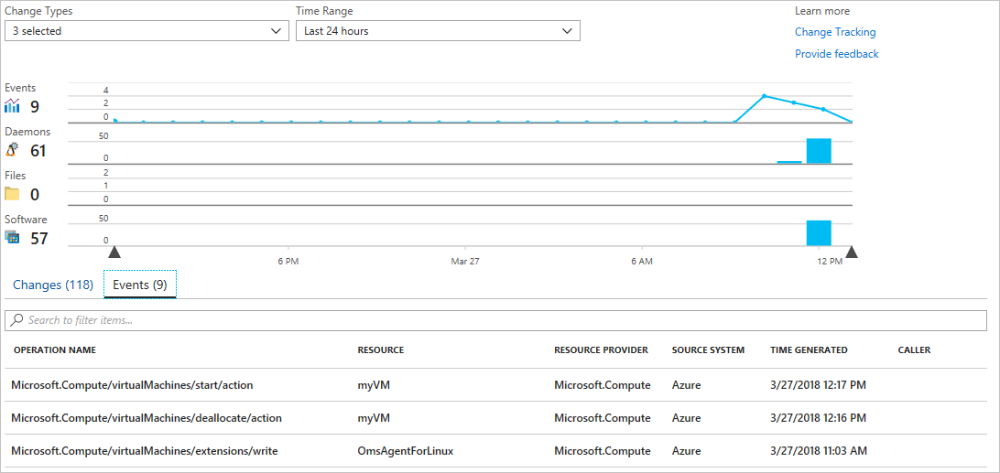

# Tutorial: Monitor changes and update a Linux virtual machine in Azure

**Applies to:** :heavy_check_mark: Linux VMs :heavy_check_mark: Flexible scale sets 

Azure [Change Tracking](../../automation/change-tracking/overview.md) allows you to easily identify changes and [Update Management](../../automation/update-management/overview.md) allows you to manage operating system updates for your Azure Linux VMs.

In this tutorial, you learn how to:

> [!div class="checklist"]
> * Manage Linux updates
> * Monitor changes and inventory

[!INCLUDE [azure-cli-prepare-your-environment.md](~/articles/reusable-content/azure-cli/azure-cli-prepare-your-environment.md)]

- This tutorial requires version 2.0.30 or later of the Azure CLI. If using Azure Cloud Shell, the latest version is already installed.

## Create VM

To see diagnostics and metrics in action, you need a VM. First, create a resource group with [az group create](/cli/azure/group#az-group-create). The following example creates a resource group named *myResourceGroupMonitor* in the *eastus* location.

```azurecli-interactive
az group create --name myResourceGroupMonitor --location eastus
```

Now create a VM with [az vm create](/cli/azure/vm#az-vm-create). The following example creates a VM named *myVM* and generates SSH keys if they do not already exist in *~/.ssh/*:

```azurecli-interactive
az vm create \
  --resource-group myResourceGroupMonitor \
  --name myVM \
  --image Ubuntu2204 \
  --admin-username azureuser \
  --generate-ssh-keys
```

## Manage software updates

Update management allows you to manage updates and patches for your Azure Linux VMs.
Directly from your VM, you can quickly assess the status of available updates, schedule installation of required updates, and review deployment results to verify updates were applied successfully to the VM.

For pricing information, see [Automation pricing for Update management](https://azure.microsoft.com/pricing/details/automation/)

### Enable Update management

Enable Update management for your VM:

1. On the left-hand side of the screen, select **Virtual machines**.
2. From the list, select a VM.
3. On the VM screen, in the **Operations** section, select **Update management**. The **Enable Update Management** screen opens.

Validation is performed to determine if Update management is enabled for this VM.
The validation includes checks for a Log Analytics workspace and linked Automation account, and if the solution is in the workspace.

A [Log Analytics](../../azure-monitor/logs/log-query-overview.md) workspace is used to collect data that is generated by features and services such as Update management.
The workspace provides a single location to review and analyze data from multiple sources.
To perform additional actions on VMs that require updates, Azure Automation allows you to run runbooks against VMs, such as download and apply updates.

The validation process also checks to see if the VM is provisioned with the Log Analytics agent and Automation hybrid runbook worker. This agent is used to communicate with the VM and obtain information about the update status.

Choose the Log Analytics workspace and automation account and select **Enable** to enable the solution. The solution takes up to 15 minutes to enable.

If any of the following prerequisites were found to be missing during onboarding, they're automatically added:

* [Log Analytics](../../azure-monitor/logs/log-query-overview.md) workspace
* [Automation account](../../automation/index.yml)
* A [Hybrid runbook worker](../../automation/automation-hybrid-runbook-worker.md) is enabled on the VM

The **Update Management** screen opens. Configure the location, Log Analytics workspace and Automation account to use and select **Enable**. If the fields are grayed out, that means another automation solution is enabled for the VM and the same workspace and Automation account must be used.



Enabling the solution can take up to 15 minutes. During this time, you shouldn't close the browser window. After the solution is enabled, information about missing updates on the VM flows to Azure Monitor logs. It can take between 30 minutes and 6 hours for the data to be available for analysis.

### View update assessment

After **Update management** is enabled, the **Update management** screen appears. After the evaluation of updates is complete, you see a list of missing updates on the **Missing updates** tab.

 

### Schedule an update deployment

To install updates, schedule a deployment that follows your release schedule and service window. You can choose which update types to include in the deployment. For example, you can include critical or security updates and exclude update rollups.

Schedule a new Update Deployment for the VM by clicking **Schedule update deployment** at the top of the **Update management** screen. In the **New update deployment** screen, specify the following information:

To create a new update deployment, select **Schedule update deployment**. The **New update deployment** page opens. Enter values for the properties described in the following table and then click **Create**:

| Property | Description |
| --- | --- |
| Name |Unique name to identify the update deployment. |
|Operating System| Linux or Windows|
| Groups to update |For Azure machines, define a query based on a combination of subscription, resource groups, locations, and tags to build a dynamic group of Azure VMs to include in your deployment. </br></br>For Non-Azure machines, select an existing saved search to select a group of Non-Azure machines to include in the deployment. </br></br>To learn more, see [Dynamic Groups](../../automation/update-management/configure-groups.md)|
| Machines to update |Select a Saved search, Imported group, or pick Machine from the drop-down and select individual machines. If you choose **Machines**, the readiness of the machine is shown in the **UPDATE AGENT READINESS** column.</br> To learn about the different methods of creating computer groups in Azure Monitor logs, see [Computer groups in Azure Monitor logs](../../azure-monitor/logs/computer-groups.md) |
|Update classifications|Select all the update classifications that you need|
|Include/exclude updates|This opens the **Include/Exclude** page. Updates to be included or excluded are on separate tabs. For more information on how inclusion is handled, see [Schedule an Update Deployment](../../automation/update-management/deploy-updates.md#schedule-an-update-deployment) |
|Schedule settings|Select the time to start, and select either Once or recurring for the recurrence|
| Pre-scripts + Post-scripts|Select the scripts to run before and after your deployment|
| Maintenance window |Number of minutes set for updates. The value can't be less than 30 minutes and no more than 6 hours |
| Reboot control| Determines how reboots should be handled. Available options are:</br>Reboot if required (Default)</br>Always reboot</br>Never reboot</br>Only reboot - will not install updates|

Update Deployments can also be created programmatically. To learn how to create an Update Deployment with the REST API, see [Software Update Configurations - Create](/rest/api/automation/softwareupdateconfigurations/create). There is also a sample runbook that can be used to create a weekly Update Deployment. To learn more about this runbook, see [Create a weekly update deployment for one or more VMs in a resource group](https://gallery.technet.microsoft.com/scriptcenter/Create-a-weekly-update-2ad359a1).

After you have completed configuring the schedule, click **Create** button and you return to the status dashboard.
Notice that the **Scheduled** table shows the deployment schedule you created.

### View results of an update deployment

After the scheduled deployment starts, you can see the status for that deployment on the **Update deployments** tab on the **Update management** screen.
If it is currently running, it's status shows as **In progress**. After it completes, if successful, it changes to **Succeeded**.
If there is a failure with one or more updates in the deployment, the status is **Partially failed**.
Select the completed update deployment to see the dashboard for that update deployment.



In **Update results** tile is a summary of the total number of updates and deployment results on the VM.
In the table to the right is a detailed breakdown of each update and the installation results, which could be one of the following values:

* **Not attempted** - the update was not installed because there was insufficient time available based on the maintenance window duration defined.
* **Succeeded** - the update succeeded
* **Failed** - the update failed

Select **All logs** to see all log entries that the deployment created.

Select the **Output** tile to see job stream of the runbook responsible for managing the update deployment on the target VM.

Select **Errors** to see detailed information about any errors from the deployment.

## Monitor changes and inventory

You can collect and view inventory for software, files, Linux daemons, Windows Services, and Windows registry keys on your computers. Tracking the configurations of your machines can help you pinpoint operational issues across your environment and better understand the state of your machines.

### Enable Change and Inventory management

Enable Change and Inventory management for your VM:

1. On the left-hand side of the screen, select **Virtual machines**.
2. From the list, select a VM.
3. On the VM screen, in the **Operations** section, select **Inventory** or **Change tracking**. The **Enable Change Tracking and Inventory** screen opens.

Configure the location, Log Analytics workspace and Automation account to use and select **Enable**. If the fields are grayed out, that means another automation solution is enabled for the VM and the same workspace and Automation account must be used. Even though the solutions are separate on the menu, they are the same solution. Enabling one enables both for your VM.



After the solution has been enabled, it may take some time while inventory is being collected on the VM before data appears.

### Track changes

On your VM, select **Change Tracking** under **OPERATIONS**. Select **Edit Settings**, the **Change Tracking** page is displayed. Select the type of setting you want to track and then select **+ Add** to configure the settings. The available option Linux is **Linux Files**

For detailed information on Change Tracking see, [Troubleshoot changes on a VM](../../automation/troubleshoot/change-tracking.md)

### View inventory

On your VM, select **Inventory** under **OPERATIONS**. On the **Software** tab, there is a table list the software that had been found. The high-level details for each software record are viewable in the table. These details include the software name, version, publisher, last refreshed time.



### Monitor Activity logs and changes

From the **Change tracking** page on your VM, select **Manage Activity Log Connection**. This task opens the **Azure Activity log** page. Select **Connect** to connect Change tracking to the Azure activity log for your VM.

With this setting enabled, navigate to the **Overview** page for your VM and select **Stop** to stop your VM. When prompted, select **Yes** to stop the VM. When it is deallocated, select **Start** to restart your VM.

Stopping and starting a VM logs an event in its activity log. Navigate back to the **Change tracking** page. Select the **Events** tab at the bottom of the page. After a while, the events shown in the chart and the table. Each event can be selected to view detailed information on the event.



The chart shows changes that have occurred over time. After you have added an Activity Log connection, the line graph at the top displays Azure Activity Log events. Each row of bar graphs represents a different trackable Change type. These types are Linux daemons, files, and software. The change tab shows the details for the changes shown in the visualization in descending order of time that the change occurred (most recent first).

## Next steps

In this tutorial, you configured and reviewed Change Tracking and Update Management for your VM. You learned how to:

> [!div class="checklist"]
> * Create a resource group and VM
> * Manage Linux updates
> * Monitor changes and inventory

Advance to the next tutorial to learn about monitoring your VM.

> [!div class="nextstepaction"]
> [Monitor virtual machines](/previous-versions/azure/virtual-machines/linux/tutorial-monitor)