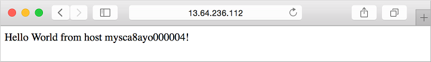

# Tutorial: Create a virtual machine scale set and deploy a highly available app on Linux with the Azure CLI

A virtual machine scale set allows you to deploy and manage a set of identical, auto-scaling virtual machines. You can scale the number of VMs in the scale set manually, or define rules to autoscale based on resource usage such as CPU, memory demand, or network traffic. In this tutorial, you deploy a virtual machine scale set in Azure. You learn how to:

> [!div class="checklist"]
> * Use cloud-init to create an app to scale
> * Create a virtual machine scale set
> * Increase or decrease the number of instances in a scale set
> * Create autoscale rules
> * View connection info for scale set instances
> * Use data disks in a scale set

This tutorial uses the CLI within the [Azure Cloud Shell](https://docs.microsoft.com/azure/cloud-shell/overview), which is constantly updated to the latest version. To open the Cloud Shell, select **Try it** from the top of any code block.

If you choose to install and use the CLI locally, this tutorial requires that you are running the Azure CLI version 2.0.30 or later. Run `az --version` to find the version. If you need to install or upgrade, see [Install Azure CLI]( /cli/azure/install-azure-cli).

## Scale Set overview
A virtual machine scale set allows you to deploy and manage a set of identical, auto-scaling virtual machines. VMs in a scale set are distributed across logic fault and update domains in one or more *placement groups*. These are groups of similarly configured VMs, similar to [availability sets](tutorial-availability-sets.md).

VMs are created as needed in a scale set. You define autoscale rules to control how and when VMs are added or removed from the scale set. These rules can be triggered based on metrics such as CPU load, memory usage, or network traffic.

Scale sets support up to 1,000 VMs when you use an Azure platform image. For workloads with significant installation or VM customization requirements, you may wish to [Create a custom VM image](tutorial-custom-images.md). You can create up to 300 VMs in a scale set when using a custom image.


## Create an app to scale
For production use, you may wish to [Create a custom VM image](tutorial-custom-images.md) that includes your application installed and configured. For this tutorial, lets customize the VMs on first boot to quickly see a scale set in action.

In a previous tutorial, you learned [How to customize a Linux virtual machine on first boot](tutorial-automate-vm-deployment.md) with cloud-init. You can use the same cloud-init configuration file to install NGINX and run a simple 'Hello World' Node.js app.

In your current shell, create a file named *cloud-init.txt* and paste the following configuration. For example, create the file in the Cloud Shell not on your local machine. Enter `sensible-editor cloud-init.txt` to create the file and see a list of available editors. Make sure that the whole cloud-init file is copied correctly, especially the first line:

```yaml
#cloud-config
package_upgrade: true
packages:
  - nginx
  - nodejs
  - npm
write_files:
  - owner: www-data:www-data
  - path: /etc/nginx/sites-available/default
    content: |
      server {
        listen 80;
        location / {
          proxy_pass http://localhost:3000;
          proxy_http_version 1.1;
          proxy_set_header Upgrade $http_upgrade;
          proxy_set_header Connection keep-alive;
          proxy_set_header Host $host;
          proxy_cache_bypass $http_upgrade;
        }
      }
  - owner: azureuser:azureuser
  - path: /home/azureuser/myapp/index.js
    content: |
      var express = require('express')
      var app = express()
      var os = require('os');
      app.get('/', function (req, res) {
        res.send('Hello World from host ' + os.hostname() + '!')
      })
      app.listen(3000, function () {
        console.log('Hello world app listening on port 3000!')
      })
runcmd:
  - service nginx restart
  - cd "/home/azureuser/myapp"
  - npm init
  - npm install express -y
  - nodejs index.js
```


## Create a scale set
Before you can create a scale set, create a resource group with [az group create](/cli/azure/group#az-group-create). The following example creates a resource group named *myResourceGroupScaleSet* in the *eastus* location:

```azurecli-interactive
az group create --name myResourceGroupScaleSet --location eastus
```

Now create a virtual machine scale set with [az vmss create](/cli/azure/vmss#az-vmss-create). The following example creates a scale set named *myScaleSet*, uses the cloud-init file to customize the VM, and generates SSH keys if they do not exist:

```azurecli-interactive
az vmss create \
  --resource-group myResourceGroupScaleSet \
  --name myScaleSet \
  --image UbuntuLTS \
  --upgrade-policy-mode automatic \
  --custom-data cloud-init.txt \
  --admin-username azureuser \
  --generate-ssh-keys
```

It takes a few minutes to create and configure all the scale set resources and VMs. There are background tasks that continue to run after the Azure CLI returns you to the prompt. It may be another couple of minutes before you can access the app.


## Allow web traffic
A load balancer was created automatically as part of the virtual machine scale set. The load balancer distributes traffic across a set of defined VMs using load balancer rules. You can learn more about load balancer concepts and configuration in the next tutorial, [How to load balance virtual machines in Azure](tutorial-load-balancer.md).

To allow traffic to reach the web app, create a rule with [az network lb rule create](/cli/azure/network/lb/rule#az-network-lb-rule-create). The following example creates a rule named *myLoadBalancerRuleWeb*:

```azurecli-interactive
az network lb rule create \
  --resource-group myResourceGroupScaleSet \
  --name myLoadBalancerRuleWeb \
  --lb-name myScaleSetLB \
  --backend-pool-name myScaleSetLBBEPool \
  --backend-port 80 \
  --frontend-ip-name loadBalancerFrontEnd \
  --frontend-port 80 \
  --protocol tcp
```

## Test your app
To see your Node.js app on the web, obtain the public IP address of your load balancer with [az network public-ip show](/cli/azure/network/public-ip#az-network-public-ip-show). The following example obtains the IP address for *myScaleSetLBPublicIP* created as part of the scale set:

```azurecli-interactive
az network public-ip show \
    --resource-group myResourceGroupScaleSet \
    --name myScaleSetLBPublicIP \
    --query [ipAddress] \
    --output tsv
```

Enter the public IP address in to a web browser. The app is displayed, including the hostname of the VM that the load balancer distributed traffic to:



To see the scale set in action, you can force-refresh your web browser to see the load balancer distribute traffic across all the VMs running your app.


## Management tasks
Throughout the lifecycle of the scale set, you may need to run one or more management tasks. Additionally, you may want to create scripts that automate various lifecycle-tasks. The Azure CLI provides a quick way to do those tasks. Here are a few common tasks.

### View VMs in a scale set
To view a list of VMs running in your scale set, use [az vmss list-instances](/cli/azure/vmss#az-vmss-list-instances) as follows:

```azurecli-interactive
az vmss list-instances \
  --resource-group myResourceGroupScaleSet \
  --name myScaleSet \
  --output table
```

The output is similar to the following example:

```bash
  InstanceId  LatestModelApplied    Location    Name          ProvisioningState    ResourceGroup            VmId
------------  --------------------  ----------  ------------  -------------------  -----------------------  ------------------------------------
           1  True                  eastus      myScaleSet_1  Succeeded            MYRESOURCEGROUPSCALESET  c72ddc34-6c41-4a53-b89e-dd24f27b30ab
           3  True                  eastus      myScaleSet_3  Succeeded            MYRESOURCEGROUPSCALESET  44266022-65c3-49c5-92dd-88ffa64f95da
```


### Manually increase or decrease VM instances
To see the number of instances you currently have in a scale set, use [az vmss show](/cli/azure/vmss#az-vmss-show) and query on *sku.capacity*:

```azurecli-interactive
az vmss show \
    --resource-group myResourceGroupScaleSet \
    --name myScaleSet \
    --query [sku.capacity] \
    --output table
```

You can then manually increase or decrease the number of virtual machines in the scale set with [az vmss scale](/cli/azure/vmss#az-vmss-scale). The following example sets the number of VMs in your scale set to *3*:

```azurecli-interactive
az vmss scale \
    --resource-group myResourceGroupScaleSet \
    --name myScaleSet \
    --new-capacity 3
```

### Get connection info
To obtain connection information about the VMs in your scale sets, use [az vmss list-instance-connection-info](/cli/azure/vmss#az-vmss-list-instance-connection-info). This command outputs the public IP address and port for each VM that allows you to connect with SSH:

```azurecli-interactive
az vmss list-instance-connection-info \
    --resource-group myResourceGroupScaleSet \
    --name myScaleSet
```


## Use data disks with scale sets
You can create and use data disks with scale sets. In a previous tutorial, you learned how to [Manage Azure disks](tutorial-manage-disks.md) that outlines the best practices and performance improvements for building apps on data disks rather than the OS disk.

### Create scale set with data disks
To create a scale set and attach data disks, add the `--data-disk-sizes-gb` parameter to the [az vmss create](/cli/azure/vmss#az-vmss-create) command. The following example creates a scale set with *50*Gb data disks attached to each instance:

```azurecli-interactive
az vmss create \
    --resource-group myResourceGroupScaleSet \
    --name myScaleSetDisks \
    --image UbuntuLTS \
    --upgrade-policy-mode automatic \
    --custom-data cloud-init.txt \
    --admin-username azureuser \
    --generate-ssh-keys \
    --data-disk-sizes-gb 50
```

When instances are removed from a scale set, any attached data disks are also removed.

### Add data disks
To add a data disk to instances in your scale set, use [az vmss disk attach](/cli/azure/vmss/disk#az-vmss-disk-attach). The following example adds a *50*Gb disk to each instance:

```azurecli-interactive
az vmss disk attach \
    --resource-group myResourceGroupScaleSet \
    --name myScaleSet \
    --size-gb 50 \
    --lun 2
```

### Detach data disks
To remove a data disk to instances in your scale set, use [az vmss disk detach](/cli/azure/vmss/disk#az-vmss-disk-detach). The following example removes the data disk at LUN *2* from each instance:

```azurecli-interactive
az vmss disk detach \
    --resource-group myResourceGroupScaleSet \
    --name myScaleSet \
    --lun 2
```


## Next steps
In this tutorial, you created a virtual machine scale set. You learned how to:

> [!div class="checklist"]
> * Use cloud-init to create an app to scale
> * Create a virtual machine scale set
> * Increase or decrease the number of instances in a scale set
> * Create autoscale rules
> * View connection info for scale set instances
> * Use data disks in a scale set

Advance to the next tutorial to learn more about load balancing concepts for virtual machines.

> [!div class="nextstepaction"]
> [Load balance virtual machines](tutorial-load-balancer.md)
