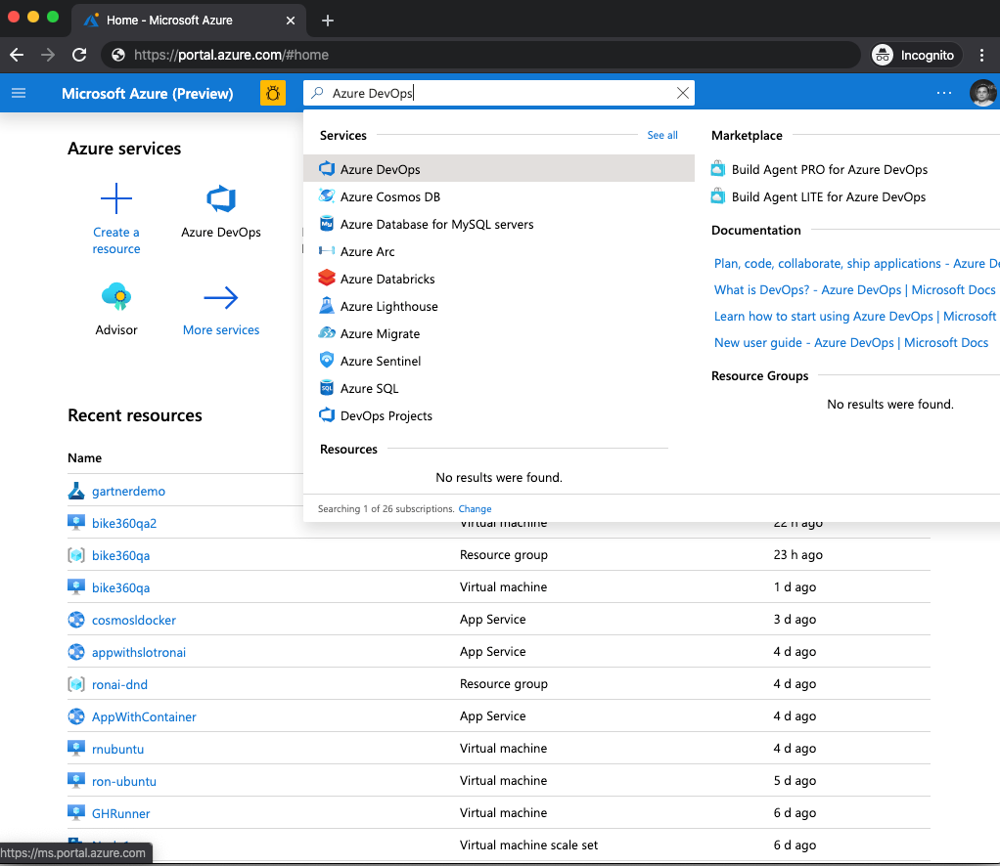
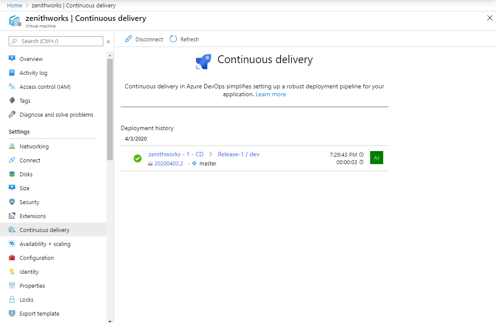
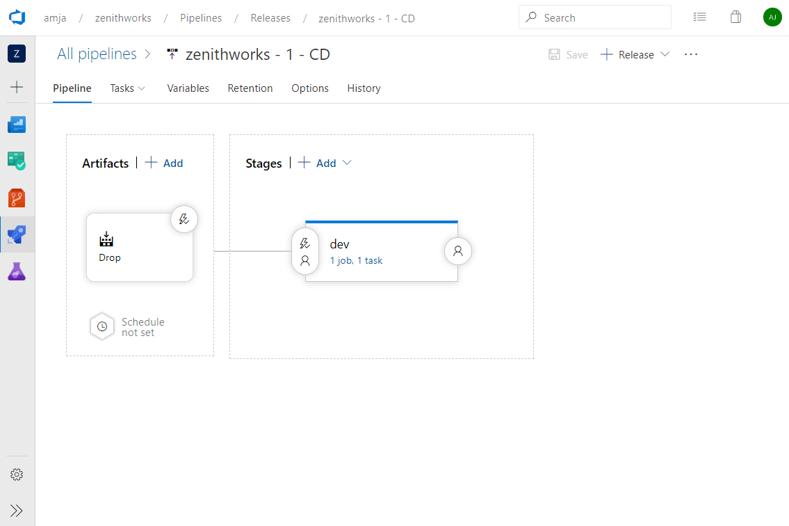

# Tutorial - Configure the rolling deployment strategy for Azure Linux virtual machines

Azure DevOps is a built-in Azure service that automates each part of the DevOps process for any Azure resource. Whether your app uses virtual machines, web apps, Kubernetes, or any other resource, you can implement infrastructure as code (IaaC), continuous integration, continuous testing, continuous delivery, and continuous monitoring with Azure and Azure DevOps.

## Infrastructure as a service (IaaS) - Configure CI/CD

Azure Pipelines provides a fully featured set of CI/CD automation tools for deployments to virtual machines. You can configure a continuous-delivery pipeline for an Azure VM from the Azure portal.

This article shows how to set up a CI/CD pipeline for rolling multimachine deployments from the Azure portal. The Azure portal also supports other strategies like [canary](https://aka.ms/AA7jdrz) and [blue-green](https://aka.ms/AA83fwu).

### Configure CI/CD on virtual machines

You can add virtual machines as targets to a [deployment group](https://docs.microsoft.com/azure/devops/pipelines/release/deployment-groups). You can then target them for multimachine updates. After you deploy to machines, view **Deployment History** within a deployment group. This view lets you trace from VM to the pipeline and then to the commit.

### Rolling deployments

In each iteration, a rolling deployment replaces instances of an application's previous version. It replaces them with instances of the new version on a fixed set of machines (rolling set). The following walk-through shows how to configure a rolling update to virtual machines.

Using the continuous-delivery option, you can configure rolling updates to your virtual machines within the Azure portal. Here is the step-by-step walk-through:

1. Sign in to the Azure portal and navigate to a virtual machine.
1. In the leftmost pane of the VM settings, select **Continuous delivery**. Then select **Configure**.

   

1. In the configuration panel, select **Azure DevOps Organization** to choose an existing account or create a new one. Then select the project under which you want to configure the pipeline.  

   

1. A deployment group is a logical set of deployment target machines that represent the physical environments. Dev, Test, UAT, and Production are examples. You can create a new deployment group or select an existing one.
1. Select the build pipeline that publishes the package to be deployed to the virtual machine. The published package should have a deployment script named deploy.ps1 or deploy.sh in the deployscripts folder in the package's root folder. The pipeline runs this deployment script.
1. In **Deployment strategy**, select **Rolling**.
1. Optionally, you can tag each machine with its role. The tags "web" and "db" are examples. These tags help you target only VMs that have a specific role.
1. Select **OK** to configure the continuous-delivery pipeline.
1. After configuration finishes, you have a continuous-delivery pipeline configured to deploy to the virtual machine.  

   

1. The deployment details for the virtual machine are displayed. You can select the link to go to the pipeline, **Release-1** to view the deployment, or **Edit** to modify the release-pipeline definition.

1. If you're configuring multiple VMs, repeat steps 2 through 4 for other VMs to add to the deployment group. If you select a deployment group that already has a pipeline run, the VMs are just added to the deployment group. No new pipelines are created.
1. After configuration is done, select the pipeline definition, navigate to the Azure DevOps organization, and select **Edit** for the release pipeline.

   

1. Select **1 job, 1 task** in the **dev** stage. Select the **Deploy** phase.

   

1. From the rightmost configuration pane, you can specify the number of machines that you want to deploy in parallel in each iteration. If you want to deploy to multiple machines at a time, you can specify the number of machines as a percentage by using the slider.  

1. The Execute Deploy Script task by default executes the deployment script deploy.ps1 or deploy.sh. The script is in the deployscripts folder in the root folder of the published package.

   

## Other deployment strategies

- [Configure the canary deployment strategy](https://aka.ms/AA7jdrz)
- [Configure the blue-green deployment strategy](https://aka.ms/AA83fwu)

## Azure DevOps Projects

You can get started with Azure easily. With Azure DevOps Projects, start running your application on any Azure service in just three steps by selecting:

- An application language
- A runtime
- An Azure service
 
[Learn more](https://azure.microsoft.com/features/devops-projects/).
 
## Additional resources

- [Deploy to Azure virtual machines by using Azure DevOps Projects](https://docs.microsoft.com/azure/devops-project/azure-devops-project-vms)
- [Implement continuous deployment of your app to an Azure virtual machine scale set](https://docs.microsoft.com/azure/devops/pipelines/apps/cd/azure/deploy-azure-scaleset)
