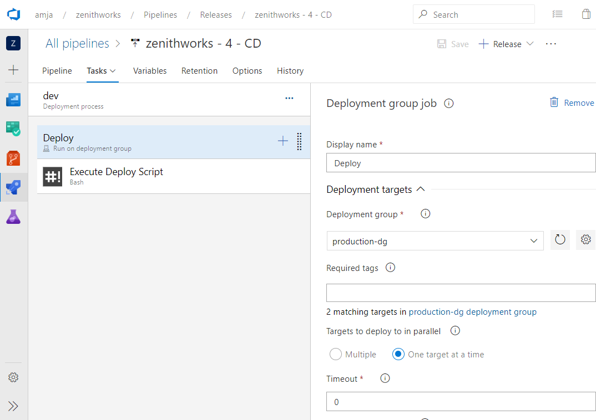

# Tutorial: Integrated DevOps for IaaS and PaaS on Azure

With end-to-end solutions on Azure, teams can implement DevOps practices in each of the application lifecycle phases: plan, develop, deliver, and operate. 

Below are some of the Azure Services that simplify cloud workloads and can be combined to enable amazingly powerful scenarios.
These technologies, combined with people and processes, enable teams to continually provide value to customers. 

- Azure: https://portal.azure.com – Portal for building cloud workloads. Manage and monitor everything from simple web apps to complex cloud applications 
- Azure DevOps: https://dev.azure.com – Plan smarter, collaborate better, and ship faster with a set of modern dev services 
- Azure Machine Learning studio: https://ml.azure.com - Prep data, train, and deploy machine learning models 
 

Azure DevOps is a built-in Azure service that automates each part of the DevOps process with continuous integration and continuous delivery for any Azure resource.
Whether your app uses virtual machines, web apps, Kubernetes, or any other resource, you can implement, infrastructure as code, continuous integration, continuous testing, continuous delivery, and continuous monitoring with Azure and Azure DevOps.  
 
 
 
## IaaS - Configure CI/CD 
Azure Pipelines provides a complete, fully featured set of CI/CD automation tools for deployments to virtual machines. You can configure a continuous delivery pipeline for an Azure VM directly from Azure portal. This document contains the steps associated with setting up a CI/CD pipeline for multi-machine deployments from Azure portal. 

**Configure CI/CD on Virtual Machines**

Virtual machines can be added as targets to a [deployment group](https://docs.microsoft.com/azure/devops/pipelines/release/deployment-groups) and can be targeted for multi-machine update. Based on your requirements, you can choose any one of out-of-box deployment strategies, viz, _Rolling_, _Canary_, _Blue-Green_ or can further customize them. Once deployed, Deployment History views within Deployment Groups provides traceability from VM to the pipeline and then to the commit. 
 
**Rolling Deployments**: A rolling deployment replaces instances of the previous version of an application with instances of the new version of the application on a fixed set of machines (rolling set) in each iteration. Let’s walkthrough how you can configure a rolling update to virtual machines.  
You can configure rolling updates to your “**virtual machines**” within the Azure portal using continuous delivery option. 

Here is the step-by-step walkthrough. 
1. Sign in to your Azure portal and navigate to a virtual machine. 
2. In the VM left pane, navigate to the **continuous delivery** menu. Then click on **Configure**. 

    
3. In the configuration panel, click on “Azure DevOps Organization” to select an existing account or create one. Then select the project under which you would like to configure the pipeline.  

    
4. A deployment group is a logical set of deployment target machines that represent the physical environments; for example, "Dev", "Test", "UAT", and "Production". You can create a new deployment group or select an existing deployment group. 
5. Select the build pipeline which publishes the package to be deployed to the virtual machine. Note that the published package should have a deployment script _deploy.ps1_ or _deploy.sh_ in _deployscripts_ folder at package root. This deployment script will be executed by Azure DevOps pipeline at run time.
6. Select the deployment strategy of your choice. In this case, lets select 'Rolling'.
7. Optionally, you can tag the machine with the role. For example, ‘web’, ‘db’ etc. This helps you   target VMs that have specific role only.
8. Click **OK** on the dialog to configure the continuous delivery pipeline. 
9. Once done, you will have a continuous delivery pipeline configured to deploy to the virtual machine.  

   
10. You will see that the deployment to the virtual machine is in progress. You can click on the link to navigate to the pipeline. Click on **Release-1** to view the deployment. Or you can click on the **Edit** to modify the release pipeline definition. 
11. If you have multiple VMs to be configured, repeat the steps 2-4 for other VMs to be added to the deployment group. Note that if you select an Deployment Group for which a pipeline run already exists, the VM will be just added to the deployment group without creating any new pipelines. 
12. Once done, click on the pipeline definition, navigate to the Azure DevOps organization, and click on **Edit** release pipeline. 
   
13. Click on the link **1 job, 1 task** in **dev** stage. Click on the **Deploy** phase.
   
14. From the configuration pane on the right, you can specify the number of machines that you want to deploy to parallely in each iteration. In case you want to deploy to multiple machines at a time, you can specify it in terms of percentage by using the slider.  

15. The Execute Deploy Script task will by default execute the the deployment script _deploy.ps1_ or _deploy.sh_ in _deployscripts_ folder at the root directory of published package.
  
**Canary Deployments**: A canary deployment reduces risk by slowly rolling out the change to a small subset of users. As you gain more confidence in the new version, you can start releasing it to more servers in your infrastructure and routing more users to it. 
You can configure canary deployments to your “**virtual machines**” with the Azure portal using continuous delivery option. 
Here is the step-by-step walkthrough. 
1. Sign in to your Azure portal and navigate to a virtual machine 
2. Follow the steps 2-7 under the **Rolling Deployments** section to add multiple VMs to the deployment group. For deployment strategy dropdown, select 'Canary'.

3. Add a 'canary' tag to the VMs that are to be part of canary deployments and a 'prod' tag to the VMs that are part of deployments after canary deployment in successful.
4. Once done, you will have a continuous delivery pipeline configured to deploy to the virtual machine.

5. Like in **Rolling Deployments** section, you can click on  **Edit** release pipeline in Azure DevOps to see the pipeline configuration. The pipeline consists of 3 phases - first phase is a DG phase and deploys to VMs that are tagged as _canary_. The second phase, pauses the pipeline and waits for manual intervention to resume the run. Once a user is satisfied that canary deployment is stable, he can resume the pipeline run which will then run the third phase that deploys to VMs tagged as _prod_.

**Blue-Green Deployments**: A Blue-Green deployment reduces downtime by having an identical standby environment. At any time one of the environments is live. As you prepare for a new release, you do your final stage of testing in the green environment. Once the software is working in the green environment, switch the traffic so that all incoming requests go to the green environment - the blue environment is now idle.
You can configure Blue-Green deployments to your “**virtual machines**” from the Azure portal using the continuous delivery option. 

Here is the step-by-step walkthrough.

1. Sign in to your Azure portal and navigate to a Virtual Machine 
2. Follow the steps 2-7 under the **Rolling Deployments** section to add multiple VMs to the deployment group. Add a "blue" or "green" tag to the VMs that are to be part of Blue-Green deployments. If the VM is for standby role, then you should tag it as "green".

4. Once done, you will have a continuous delivery pipeline configured to deploy to the virtual machine.

5. Like in **Rolling Deployments** section, you can click on  **Edit** release pipeline in Azure DevOps to see the pipeline configuration. The pipeline consists of 3 phases - first phase is a DG phase and deploys to VMs that are tagged as _green_ (standby VMs) . The second phase, pauses the pipeline and waits for manual intervention to resume the run. Once a user is satisfied that deployment is stable, he can now redirect the traffic to _green_ VMs and resume the pipeline run which will then swap _blue_ and _green_ tags in the VMs. This makes sure that the VMs that have older application version are tagged as _green_ and are deployed to in the next pipeline run.

6. Note that this deployment strategy requires that there must be atleast one VM  tagged as blue and green each. Make sure that before resuming the pipeline run at Manual Intevention step, you have atleast one VM tagged as _blue_.

 
## Azure DevOps project 
Get started with Azure more easily than ever.
 
With DevOps Projects, start running your application on any Azure service in just three steps: select an application language, a runtime, and an Azure service.
 
[Learn more](https://azure.microsoft.com/features/devops-projects/ ).
 
## Additional resources 
- [Deploy to Azure Virtual Machines using DevOps project](https://docs.microsoft.com/azure/devops-project/azure-devops-project-vms)
- [Implement continuous deployment of your app to an Azure Virtual Machine Scale Set](https://docs.microsoft.com/azure/devops/pipelines/apps/cd/azure/deploy-azure-scaleset)
