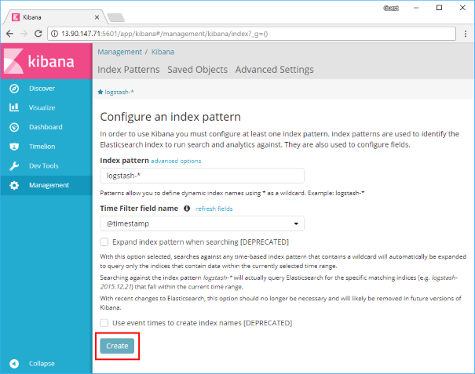
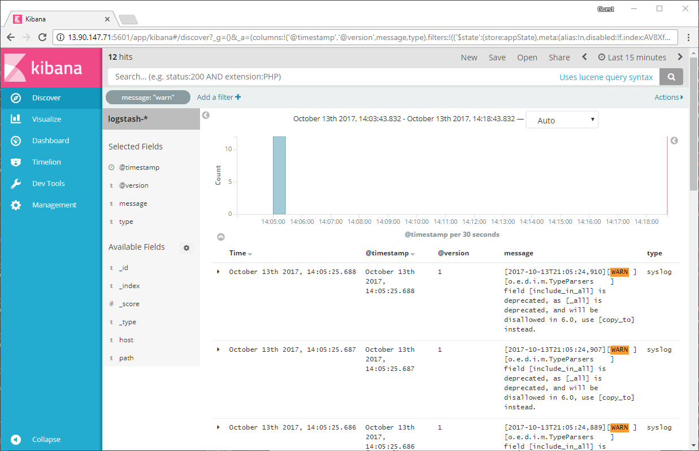

# Install the Elastic Stack on an Azure VM

This article walks you through how to deploy [Elasticsearch](https://www.elastic.co/products/elasticsearch), [Logstash](https://www.elastic.co/products/logstash), and [Kibana](https://www.elastic.co/products/kibana), on an Ubuntu VM in Azure. To see the Elastic Stack in action, you can optionally connect to Kibana  and work with some sample logging data. 

In this tutorial you learn how to:

> [!div class="checklist"]
> * Create an Ubuntu VM in an Azure resource group
> * Install Elasticsearch, Logstash, and Kibana on the VM
> * Send sample data to Elasticsearch with Logstash 
> * Open ports and work with data in the Kibana console


 This deployment is suitable for basic development with the Elastic Stack. For more on the Elastic Stack, including recommendations for a production environment, see the [Elastic documentation](https://www.elastic.co/guide/index.html) and the [Azure Architecture Center](/azure/architecture/elasticsearch/).

[!INCLUDE [cloud-shell-try-it.md](../../../includes/cloud-shell-try-it.md)]

If you choose to install and use the CLI locally, this tutorial requires that you are running the Azure CLI version 2.0.4 or later. Run `az --version` to find the version. If you need to install or upgrade, see [Install Azure CLI]( /cli/azure/install-azure-cli). 

## Create a resource group

Create a resource group with the [az group create](/cli/azure/group) command. An Azure resource group is a logical container into which Azure resources are deployed and managed. 

The following example creates a resource group named *myResourceGroup* in the *eastus* location.

```azurecli-interactive 
az group create --name myResourceGroup --location eastus
```

## Create a virtual machine

Create a VM with the [az vm create](/cli/azure/vm) command. 

The following example creates a VM named *myVM* and creates SSH keys if they do not already exist in a default key location. To use a specific set of keys, use the `--ssh-key-value` option.  

```azurecli-interactive 
az vm create \
    --resource-group myResourceGroup \
    --name myVM \
    --image UbuntuLTS \
    --admin-username azureuser \
    --generate-ssh-keys
```

When the VM has been created, the Azure CLI shows information similar to the following example. Take note of the `publicIpAddress`. This address is used to access the VM.

```azurecli-interactive 
{
  "fqdns": "",
  "id": "/subscriptions/<subscription ID>/resourceGroups/myResourceGroup/providers/Microsoft.Compute/virtualMachines/myVM",
  "location": "eastus",
  "macAddress": "00-0D-3A-23-9A-49",
  "powerState": "VM running",
  "privateIpAddress": "10.0.0.4",
  "publicIpAddress": "40.68.254.142",
  "resourceGroup": "myResourceGroup"
}
```

## SSH into your VM

If you don't already know the public IP address of your VM, run the [az network public-ip list](/cli/azure/network/public-ip) command:

```azurecli-interactive
az network public-ip list --resource-group myResourceGroup --query [].ipAddress
```

Use the following command to create an SSH session with the virtual machine. Substitute the correct public IP address of your virtual machine. In this example, the IP address is *40.68.254.142*.

```bash
ssh azureuser@40.68.254.142
```

## Install the Elastic Stack

Import the Elasticsearch signing key and update your APT sources list to include the Elastic package repository:

```bash
wget -qO - https://artifacts.elastic.co/GPG-KEY-elasticsearch | sudo apt-key add -
echo "deb https://artifacts.elastic.co/packages/5.x/apt stable main" | sudo tee -a /etc/apt/sources.list.d/elastic-5.x.list
```

Install the Java Virtual on the VM and configure the JAVA_HOME variable-this is necessary for the Elastic Stack components to run.

```bash
sudo apt update && sudo apt install openjdk-8-jre-headless
export JAVA_HOME=/usr/lib/jvm/java-8-openjdk-amd64
```

Run the following commands to update Ubuntu package sources and install Elasticsearch, Kibana, and Logstash.

```bash
sudo apt update && sudo apt install elasticsearch kibana logstash   
```

> [!NOTE]
> Detailed installation instructions, including directory layouts and initial configuration, are maintained in [Elastic's documentation](https://www.elastic.co/guide/en/elastic-stack/current/installing-elastic-stack.html)

## Start Elasticsearch 

Start Elasticsearch on your VM with the following command:

```bash
sudo systemctl start elasticsearch.service
```

This command produces no output, so verify that Elasticsearch is running on the VM with this `curl` command:

```bash
sudo curl -XGET 'localhost:9200/'
```

If Elasticsearch is running, you see output like the following:

```json
{
  "name" : "w6Z4NwR",
  "cluster_name" : "elasticsearch",
  "cluster_uuid" : "SDzCajBoSK2EkXmHvJVaDQ",
  "version" : {
    "number" : "5.6.3",
    "build_hash" : "1a2f265",
    "build_date" : "2017-10-06T20:33:39.012Z",
    "build_snapshot" : false,
    "lucene_version" : "6.6.1"
  },
  "tagline" : "You Know, for Search"
}
```

## Start Logstash and add data to Elasticsearch

Start Logstash with the following command:

```bash 
sudo systemctl start logstash.service
```

Test Logstash in interactive mode to make sure it's working correctly:

```bash
sudo /usr/share/logstash/bin/logstash -e 'input { stdin { } } output { stdout {} }'
```

This is a basic logstash [pipeline](https://www.elastic.co/guide/en/logstash/5.6/pipeline.html) that echoes standard input to standard output. 

```output
The stdin plugin is now waiting for input:
hello azure
2017-10-11T20:01:08.904Z myVM hello azure
```

Set up Logstash to forward the kernel messages from this VM to Elasticsearch. Create a new file in an empty directory called `vm-syslog-logstash.conf` and paste in the following Logstash configuration:

```Logstash
input {
    stdin {
        type => "stdin-type"
    }

    file {
        type => "syslog"
        path => [ "/var/log/*.log", "/var/log/*/*.log", "/var/log/messages", "/var/log/syslog" ]
        start_position => "beginning"
    }
}

output {

    stdout {
        codec => rubydebug
    }
    elasticsearch {
        hosts  => "localhost:9200"
    }
}
```

Test this configuration and send the syslog data to Elasticsearch:

```bash
sudo /usr/share/logstash/bin/logstash -f vm-syslog-logstash.conf
```

You see the syslog entries in your terminal echoed as they are sent to Elasticsearch. Use `CTRL+C` to exit out of Logstash once you've sent some data.

## Start Kibana and visualize the data in Elasticsearch

Edit `/etc/kibana/kibana.yml` and change the IP address Kibana listens on so you can access it from your web browser.

```bash
server.host:"0.0.0.0"
```

Start Kibana with the following command:

```bash
sudo systemctl start kibana.service
```

Open port 5601 from the Azure CLI to allow remote access to the Kibana console:

```azurecli-interactive
az vm open-port --port 5601 --resource-group myResourceGroup --name myVM
```

Open up the Kibana console and select **Create** to generate a default index based on the syslog data you sent to Elasticsearch earlier. 



Select **Discover** on the Kibana console to search, browse, and filter through the syslog events.



## Next steps

In this tutorial, you deployed the Elastic Stack into a development VM in Azure. You learned how to:

> [!div class="checklist"]
> * Create an Ubuntu VM in an Azure resource group
> * Install Elasticsearch, Logstash, and Kibana on the VM
> * Send sample data to Elasticsearch from Logstash 
> * Open ports and work with data in the Kibana console
