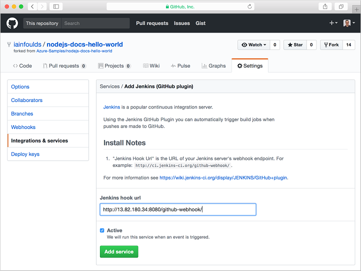
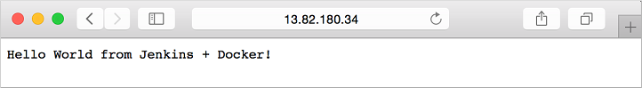
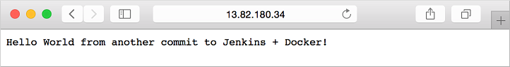

# Tutorial: Create a development infrastructure on a Linux VM in Azure with Jenkins, GitHub, and Docker

To automate the build and test phase of application development, you can use a continuous integration and deployment (CI/CD) pipeline. In this tutorial, you create a CI/CD pipeline on an Azure VM including how to:

> [!div class="checklist"]
> * Create a Jenkins VM
> * Install and configure Jenkins
> * Create webhook integration between GitHub and Jenkins
> * Create and trigger Jenkins build jobs from GitHub commits
> * Create a Docker image for your app
> * Verify GitHub commits build new Docker image and updates running app

[!INCLUDE [cloud-shell-try-it.md](../../../includes/cloud-shell-try-it.md)]

If you choose to install and use the CLI locally, this tutorial requires that you are running the Azure CLI version 2.0.30 or later. Run `az --version` to find the version. If you need to install or upgrade, see [Install Azure CLI]( /cli/azure/install-azure-cli).

## Create Jenkins instance
In a previous tutorial on [How to customize a Linux virtual machine on first boot](tutorial-automate-vm-deployment.md), you learned how to automate VM customization with cloud-init. This tutorial uses a cloud-init file to install Jenkins and Docker on a VM. Jenkins is a popular open-source automation server that integrates seamlessly with Azure to enable continuous integration (CI) and continuous delivery (CD). For more tutorials on how to use Jenkins, see the [Jenkins in Azure hub](https://docs.microsoft.com/azure/jenkins/).

In your current shell, create a file named *cloud-init-jenkins.txt* and paste the following configuration. For example, create the file in the Cloud Shell not on your local machine. Enter `sensible-editor cloud-init-jenkins.txt` to create the file and see a list of available editors. Make sure that the whole cloud-init file is copied correctly, especially the first line:

```yaml
#cloud-config
package_upgrade: true
write_files:
  - path: /etc/systemd/system/docker.service.d/docker.conf
    content: |
      [Service]
        ExecStart=
        ExecStart=/usr/bin/dockerd
  - path: /etc/docker/daemon.json
    content: |
      {
        "hosts": ["fd://","tcp://127.0.0.1:2375"]
      }
runcmd:
  - apt install openjdk-8-jre-headless -y
  - wget -q -O - https://pkg.jenkins.io/debian/jenkins-ci.org.key | sudo apt-key add -
  - sh -c 'echo deb https://pkg.jenkins.io/debian-stable binary/ > /etc/apt/sources.list.d/jenkins.list'
  - apt-get update && apt-get install jenkins -y
  - curl -sSL https://get.docker.com/ | sh
  - usermod -aG docker azureuser
  - usermod -aG docker jenkins
  - service jenkins restart
```

Before you can create a VM, create a resource group with [az group create](/cli/azure/group). The following example creates a resource group named *myResourceGroupJenkins* in the *eastus* location:

```azurecli-interactive 
az group create --name myResourceGroupJenkins --location eastus
```

Now create a VM with [az vm create](/cli/azure/vm). Use the `--custom-data` parameter to pass in your cloud-init config file. Provide the full path to *cloud-init-jenkins.txt* if you saved the file outside of your present working directory.

```azurecli-interactive 
az vm create --resource-group myResourceGroupJenkins \
    --name myVM \
    --image UbuntuLTS \
    --admin-username azureuser \
    --generate-ssh-keys \
    --custom-data cloud-init-jenkins.txt
```

It takes a few minutes for the VM to be created and configured.

To allow web traffic to reach your VM, use [az vm open-port](/cli/azure/vm) to open port *8080* for Jenkins traffic and port *1337* for the Node.js app that is used to run a sample app:

```azurecli-interactive 
az vm open-port --resource-group myResourceGroupJenkins --name myVM --port 8080 --priority 1001
az vm open-port --resource-group myResourceGroupJenkins --name myVM --port 1337 --priority 1002
```


## Configure Jenkins
To access your Jenkins instance, obtain the public IP address of your VM:

```azurecli-interactive 
az vm show --resource-group myResourceGroupJenkins --name myVM -d --query [publicIps] --o tsv
```

For security purposes, you need to enter the initial admin password that is stored in a text file on your VM to start the Jenkins install. Use the public IP address obtained in the previous step to SSH to your VM:

```bash
ssh azureuser@<publicIps>
```

Verify Jenkins is running using the `service` command:

```bash
$ service jenkins status
● jenkins.service - LSB: Start Jenkins at boot time
   Loaded: loaded (/etc/init.d/jenkins; generated)
   Active: active (exited) since Tue 2019-02-12 16:16:11 UTC; 55s ago
     Docs: man:systemd-sysv-generator(8)
    Tasks: 0 (limit: 4103)
   CGroup: /system.slice/jenkins.service

Feb 12 16:16:10 myVM systemd[1]: Starting LSB: Start Jenkins at boot time...
...
```

View the `initialAdminPassword` for your Jenkins install and copy it:

```bash
sudo cat /var/lib/jenkins/secrets/initialAdminPassword
```

If the file isn't available yet, wait a couple more minutes for cloud-init to complete the Jenkins and Docker install.

Now open a web browser and go to `http://<publicIps>:8080`. Complete the initial Jenkins setup as follows:

- Choose **Select plugins to install**
- Search for *GitHub* in the text box across the top. Check the box for *GitHub*, then select **Install**
- Create the first admin user. Enter a username, such as **admin**, then provide your own secure password. Finally, type a full name and e-mail address.
- Select **Save and Finish**
- Once Jenkins is ready, select **Start using Jenkins**
  - If your web browser displays a blank page when you start using Jenkins, restart the Jenkins service. From your SSH session, type `sudo service jenkins restart`, then refresh you web browser.
- If needed, log in to Jenkins with the username and password you created.


## Create GitHub webhook
To configure the integration with GitHub, open the [Node.js Hello World sample app](https://github.com/Azure-Samples/nodejs-docs-hello-world) from the Azure samples repo. To fork the repo to your own GitHub account, select the **Fork** button in the top right-hand corner.

Create a webhook inside the fork you created:

- Select **Settings**, then select **Webhooks** on the left-hand side.
- Choose **Add webhook**, then enter *Jenkins* in filter box.
- For the **Payload URL**, enter `http://<publicIps>:8080/github-webhook/`. Make sure you include the trailing /
- For **Content type**, select *application/x-www-form-urlencoded*.
- For **Which events would you like to trigger this webhook?**, select *Just the push event.*
- Set **Active** to checked.
- Click **Add webhook**.




## Create Jenkins job
To have Jenkins respond to an event in GitHub such as committing code, create a Jenkins job. Use the URLs for your own GitHub fork.

In your Jenkins website, select **Create new jobs** from the home page:

- Enter *HelloWorld* as job name. Choose **Freestyle project**, then select **OK**.
- Under the **General** section, select **GitHub project** and enter your forked repo URL, such as *https://github.com/cynthn/nodejs-docs-hello-world*
- Under the **Source code management** section, select **Git**, enter your forked repo *.git* URL, such as *https://github.com/cynthn/nodejs-docs-hello-world.git*
- Under the **Build Triggers** section, select **GitHub hook trigger for GITscm polling**.
- Under the **Build** section, choose **Add build step**. Select **Execute shell**, then enter `echo "Test"` in the command window.
- Select **Save** at the bottom of the jobs window.


## Test GitHub integration
To test the GitHub integration with Jenkins, commit a change in your fork. 

Back in GitHub web UI, select your forked repo, and then select the **index.js** file. Select the pencil icon to edit this file so line 6 reads:

```javascript
response.end("Hello World!");
```

To commit your changes, select the **Commit changes** button at the bottom.

In Jenkins, a new build starts under the **Build history** section of the bottom left-hand corner of your job page. Choose the build number link and select **Console output** on the left-hand side. You can view the steps Jenkins takes as your code is pulled from GitHub and the build action outputs the message `Test` to the console. Each time a commit is made in GitHub, the webhook reaches out to Jenkins and triggers a new build in this way.


## Define Docker build image
To see the Node.js app running based on your GitHub commits, lets build a Docker image to run the app. The image is built from a Dockerfile that defines how to configure the container that runs the app. 

From the SSH connection to your VM, change to the Jenkins workspace directory named after the job you created in a previous step. In this example, that was named *HelloWorld*.

```bash
cd /var/lib/jenkins/workspace/HelloWorld
```

Create a file in this workspace directory with `sudo sensible-editor Dockerfile` and paste the following contents. Make sure that the whole Dockerfile is copied correctly, especially the first line:

```yaml
FROM node:alpine

EXPOSE 1337

WORKDIR /var/www
COPY package.json /var/www/
RUN npm install
COPY index.js /var/www/
```

This Dockerfile uses the base Node.js image using Alpine Linux, exposes port 1337 that the Hello World app runs on, then copies the app files and initializes it.


## Create Jenkins build rules
In a previous step, you created a basic Jenkins build rule that output a message to the console. Lets create the build step to use our Dockerfile and run the app.

Back in your Jenkins instance, select the job you created in a previous step. Select **Configure** on the left-hand side and scroll down to the **Build** section:

- Remove your existing `echo "Test"` build step. Select the red cross on the top right-hand corner of the existing build step box.
- Choose **Add build step**, then select **Execute shell**
- In the **Command** box, enter the following Docker commands, then select **Save**:

  ```bash
  docker build --tag helloworld:$BUILD_NUMBER .
  docker stop helloworld && docker rm helloworld
  docker run --name helloworld -p 1337:1337 helloworld:$BUILD_NUMBER node /var/www/index.js &
  ```

The Docker build steps create an image and tag it with the Jenkins build number so you can maintain a history of images. Any existing containers running the app are stopped and then removed. A new container is then started using the image and runs your Node.js app based on the latest commits in GitHub.


## Test your pipeline
To see the whole pipeline in action, edit the *index.js* file in your forked GitHub repo again and select **Commit change**. A new job starts in Jenkins based on the webhook for GitHub. It takes a few seconds to create the Docker image and start your app in a new container.

If needed, obtain the public IP address of your VM again:

```azurecli-interactive 
az vm show --resource-group myResourceGroupJenkins --name myVM -d --query [publicIps] --o tsv
```

Open a web browser and enter `http://<publicIps>:1337`. Your Node.js app is displayed and reflects the latest commits in your GitHub fork as follows:



Now make another edit to the *index.js* file in GitHub and commit the change. Wait a few seconds for the job to complete in Jenkins, then refresh your web browser to see the updated version of your app running in a new container as follows:




## Next steps
In this tutorial, you configured GitHub to run a Jenkins build job on each code commit and then deploy a Docker container to test your app. You learned how to:

> [!div class="checklist"]
> * Create a Jenkins VM
> * Install and configure Jenkins
> * Create webhook integration between GitHub and Jenkins
> * Create and trigger Jenkins build jobs from GitHub commits
> * Create a Docker image for your app
> * Verify GitHub commits build new Docker image and updates running app

Advance to the next tutorial to learn more about how to integrate Jenkins with Azure DevOps Services.

> [!div class="nextstepaction"]
> [Deploy apps with Jenkins and Azure DevOps Services](tutorial-build-deploy-jenkins.md)
