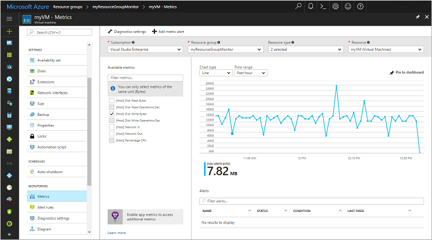
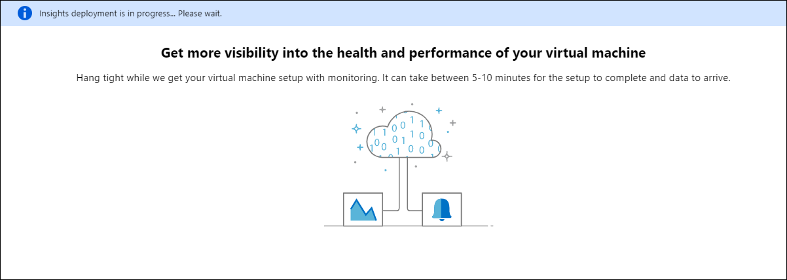

# Tutorial: Monitor a Linux virtual machine in Azure

Azure monitoring uses agents to collect boot and performance data from Azure VMs, store this data in Azure storage, and make it accessible through portal, the Azure PowerShell module, and Azure CLI. Advanced monitoring is delivered with Azure Monitor for VMs by collecting performance metrics, discover application components installed on the VM, and includes performance charts and dependency map.

In this tutorial, you learn how to:

> [!div class="checklist"]
> * Enable boot diagnostics on a VM
> * View boot diagnostics
> * View VM host metrics
> * Enable Azure Monitor for VMs
> * View VM performance metrics
> * Create an alert

## Launch Azure Cloud Shell

The Azure Cloud Shell is a free interactive shell that you can use to run the steps in this article. It has common Azure tools preinstalled and configured to use with your account. 

To open the Cloud Shell, just select **Try it** from the upper right corner of a code block. You can also launch Cloud Shell in a separate browser tab by going to [https://shell.azure.com/powershell](https://shell.azure.com/powershell). Select **Copy** to copy the blocks of code, paste it into the Cloud Shell, and press enter to run it.

If you choose to install and use the CLI locally, this tutorial requires that you are running the Azure CLI version 2.0.30 or later. Run `az --version` to find the version. If you need to install or upgrade, see [Install the Azure CLI](https://docs.microsoft.com/cli/azure/install-azure-cli).

## Create VM

To see diagnostics and metrics in action, you need a VM. First, create a resource group with [az group create](https://docs.microsoft.com/cli/azure/group?view=azure-cli-latest#az-group-create). The following example creates a resource group named *myResourceGroupMonitor* in the *eastus* location.

```azurecli-interactive
az group create --name myResourceGroupMonitor --location eastus
```

Now create a VM with [az vm create](https://docs.microsoft.com/cli/azure/vm?view=azure-cli-latest#az-vm-create). The following example creates a VM named *myVM* and generates SSH keys if they do not already exist in *~/.ssh/*:

```azurecli-interactive
az vm create \
  --resource-group myResourceGroupMonitor \
  --name myVM \
  --image UbuntuLTS \
  --admin-username azureuser \
  --generate-ssh-keys
```

## Enable boot diagnostics

As Linux VMs boot, the boot diagnostic extension captures boot output and stores it in Azure storage. This data can be used to troubleshoot VM boot issues. Boot diagnostics are not automatically enabled when you create a Linux VM using the Azure CLI.

Before enabling boot diagnostics, a storage account needs to be created for storing boot logs. Storage accounts must have a globally unique name, be between 3 and 24 characters, and must contain only numbers and lowercase letters. Create a storage account with the [az storage account create](https://docs.microsoft.com/cli/azure/storage/account?view=azure-cli-latest#az-storage-account-create) command. In this example, a random string is used to create a unique storage account name.

```azurecli-interactive
storageacct=mydiagdata$RANDOM

az storage account create \
  --resource-group myResourceGroupMonitor \
  --name $storageacct \
  --sku Standard_LRS \
  --location eastus
```

When enabling boot diagnostics, the URI to the blob storage container is needed. The following command queries the storage account to return this URI. The URI value is stored in a variable names *bloburi*, which is used in the next step.

```azurecli-interactive
bloburi=$(az storage account show --resource-group myResourceGroupMonitor --name $storageacct --query 'primaryEndpoints.blob' -o tsv)
```

Now enable boot diagnostics with [az vm boot-diagnostics enable](https://docs.microsoft.com/cli/azure/vm/boot-diagnostics#az-vm-boot-diagnostics-enable). The `--storage` value is the blob URI collected in the previous step.

```azurecli-interactive
az vm boot-diagnostics enable \
  --resource-group myResourceGroupMonitor \
  --name myVM \
  --storage $bloburi
```

## View boot diagnostics

When boot diagnostics are enabled, each time you stop and start the VM, information about the boot process is written to a log file. For this example, first deallocate the VM with the [az vm deallocate](https://docs.microsoft.com/cli/azure/vm?view=azure-cli-latest#az-vm-deallocate) command as follows:

```azurecli-interactive
az vm deallocate --resource-group myResourceGroupMonitor --name myVM
```

Now start the VM with the [az vm start](https://docs.microsoft.com/cli/azure/vm?view=azure-cli-latest#az-vm-start) command as follows:

```azurecli-interactive
az vm start --resource-group myResourceGroupMonitor --name myVM
```

You can get the boot diagnostic data for *myVM* with the [az vm boot-diagnostics get-boot-log](https://docs.microsoft.com/cli/azure/vm/boot-diagnostics#az-vm-boot-diagnostics-get-boot-log) command as follows:

```azurecli-interactive
az vm boot-diagnostics get-boot-log --resource-group myResourceGroupMonitor --name myVM
```

## View host metrics

A Linux VM has a dedicated host in Azure that it interacts with. Metrics are automatically collected for the host and can be viewed in the Azure portal as follows:

1. In the Azure portal, select **Resource Groups**, choose **myResourceGroupMonitor**, and then select **myVM** in the resource list.
1. To see how the host VM is performing, select  **Metrics** on the VM window, then choose any of the *[Host]* metrics under **Available metrics**.

    

## Enable advanced monitoring

To enable monitoring of your Azure VM with Azure Monitor for VMs:

1. In the Azure portal, click **Resource Groups**, select **myResourceGroupMonitor**, and then select **myVM** in the resource list.

2. On the VM page, in the **Monitoring** section, select **Insights (preview)**.

3. On the **Insights (preview)** page, select **Try now**.

    

4. On the **Azure Monitor Insights Onboarding** page, if you have an existing Log Analytics workspace in the same subscription, select it in the drop-down list.  

    The list preselects the default workspace and location where the VM is deployed in the subscription. 

    >[!NOTE]
    >To create a new Log Analytics workspace to store the monitoring data from the VM, see [Create a Log Analytics workspace](../../azure-monitor/learn/quick-create-workspace.md). Your Log Analytics workspace must belong to one of the [supported regions](../../azure-monitor/insights/vminsights-enable-overview.md#log-analytics).

After you've enabled monitoring, you might need to wait several minutes before you can view the performance metrics for the VM.



## View VM performance metrics

Azure Monitor for VMs includes a set of performance charts that target several key performance indicators (KPIs) to help you determine how well a virtual machine is performing. To access from your VM, perform the following steps.

1. In the Azure portal, click **Resource Groups**, select **myResourceGroupMonitor**, and then select **myVM** in the resource list.

2. On the VM page, in the **Monitoring** section, select **Insights (preview)**.

3. Select the **Performance** tab.

This page not only includes performance utilization charts, but also a table showing for each logical disk discovered, its capacity, utilization, and total average by each measure.

## Create alerts

You can create alerts based on specific performance metrics. Alerts can be used to notify you when average CPU usage exceeds a certain threshold or available free disk space drops below a certain amount, for example. Alerts are displayed in the Azure portal or can be sent via email. You can also trigger Azure Automation runbooks or Azure Logic Apps in response to alerts being generated.

The following example creates an alert for average CPU usage.

1. In the Azure portal, click **Resource Groups**, select **myResourceGroupMonitor**, and then select **myVM** in the resource list.

2. Click **Alert rules** on the VM blade, then click **Add metric alert** across the top of the alerts blade.

3. Provide a **Name** for your alert, such as *myAlertRule*

4. To trigger an alert when CPU percentage exceeds 1.0 for five minutes, leave all the other defaults selected.

5. Optionally, check the box for *Email owners, contributors, and readers* to send email notification. The default action is to present a notification in the portal.

6. Click the **OK** button.

## Next steps

In this tutorial, you configured and viewed performance of your VM. You learned how to:

> [!div class="checklist"]
> * Create a resource group and VM
> * Enable boot diagnostics on the VM
> * View boot diagnostics
> * View host metrics
> * Enable Azure Monitor for VMs
> * View VM metrics
> * Create an alert

Advance to the next tutorial to learn about Azure Security Center.

> [!div class="nextstepaction"]
> [Manage VM security](../../security/fundamentals/overview.md)
