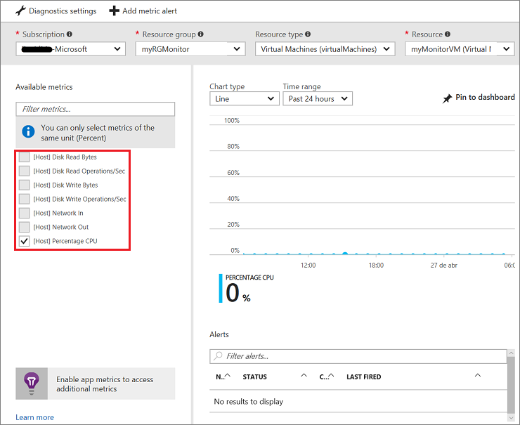

# Monitor a Linux Virtual Machine with the Azure CLI

[Azure Monitor](https://docs.microsoft.com/azure/monitoring-and-diagnostics/monitoring-overview) can be used to investigate diagnostics data that can be collected on a Linux Virtual Machine (VM). In this tutorial, you learn how to:

> [!div class="checklist"]
> * Enable boot diagnostics on the VM
> * View boot diagnostics
> * View host metrics
> * Set up advanced monitoring

This tutorial requires the Azure CLI version 2.0.4 or later. Run `az --version` to find the version. If you need to upgrade, see [Install Azure CLI 2.0]( /cli/azure/install-azure-cli).

## Create VM

Before you can create any Azure resources, you need to create a resource group with az group create. The following example creates a resource group named `myResourceGroupMonitor` in the `eastus` location.

```azurecli
az group create --name myResourceGroupMonitor --location eastus
```

Create `myMonitorVM` with the [az vm create](https://docs.microsoft.com/cli/azure/vm#create) command.

```azurecli
az vm create \
  --resource-group myResourceGroupMonitor \
  --name myMonitorVM \
  --image UbuntuLTS \
  --generate-ssh-keys
```

## Enable boot diagnostics

Using boot diagnostics, you can diagnose and recover your VM from boot failures. Boot diagnostics are not automatically enabled when you create a Linux VM using the Azure CLI.

Before enabling boot diagnostics, a storage account needs to be created for storing boot logs. A storage account can be created using the [az storage account create](/cli/azure/storage/account#create) command. Storage accounts must have a globally unique name, be between 3 and 24 characters, and must contain only numbers and lowercase letters. In this example, a random string is being used to create a unique storage account name. 

```azurecli
storageacct=mydiagdata$RANDOM

az storage account create \
  --resource-group myResourceGroupMonitor \
  --name $storageacct \
  --sku Standard_LRS \
  --location eastus
```

When enabling boot diagnostics, the URI to the blob storage container is needed. The following command queries the storage account to return this URI. The URI value is stored in a variable name *bloburi*, which is used in the next step.

```azurecli
bloburi=$(az storage account show --resource-group myResourceGroupMonitor --name $storageacct --query 'primaryEndpoints.blob' -o tsv)
```

Now you can enable boot diagnostics with the [az vm boot-diagnostics enable](https://docs.microsoft.com/cli/azure/vm/boot-diagnostics#enable). Notice that the `--storage` value is the blob URI collected in the last step.

```azurecli
az vm boot-diagnostics enable \
  --resource-group myResourceGroupMonitor \
  --name myMonitorVM \
  --storage $bloburi
```

## View boot diagnostics

When boot diagnostics are enabled, each time you stop and start the VM, information about the boot process is written to a log file. For this example, deallocate the VM with the [az vm deallocate](/cli/azure/vm#deallocate) command.

```azurecli
az vm deallocate --resource-group myResourceGroupMonitor --name myMonitorVM
```

Start the VM with the [az vm start]( /cli/azure/vm#stop) command.

```azurecli
az vm start --resource-group myResourceGroupMonitor --name myMonitorVM
```

You can get the boot diagnostic data from `myMonitorVM` with the [az vm boot-diagnostics get-boot-log](https://docs.microsoft.com/cli/azure/vm/boot-diagnostics#get-boot-log) command.

```azurecli
az vm boot-diagnostics get-boot-log --resource-group myResourceGroupMonitor --name myMonitorVM
```

## View host metrics

A Linux VM has a dedicated Host VM in Azure that it interacts with. Metrics are automatically collected for the Host VM that you can easily view in the Azure portal.

1. In the Azure portal, click **Resource Groups**, select **myResourceGroupMonitor**, and then select **myMonitorVM** in the resource list.
2. Click **Metrics** on the VM blade, and then select any of the Host metrics under **Available metrics** to see how the Host VM is performing.



## Advanced monitoring 

You can do more advanced monitoring of your VM by using [Operations Management Suite](https://docs.microsoft.com/azure/operations-management-suite/operations-management-suite-overview). If you haven't already done so, you can sign up for a [free trial](https://www.microsoft.com/en-us/cloud-platform/operations-management-suite-trial) of Operations Management Suite.

When you have access to the OMS portal, you can find the workspace key and workspace identifier on the Settings blade. Replace <workspace-key> and <workspace-id> with the values for from your OMS workspace and then you can use **az vm extension set** to add the OMS extension to the VM:

```azurecli
az vm extension set \
  --resource-group myResourceGroupMonitor \
  --vm-name myMonitorVM \
  --name OmsAgentForLinux \
  --publisher Microsoft.EnterpriseCloud.Monitoring \
  --version 1.3 \
  --protected-settings '{"workspaceKey": "<workspace-key>"}' \
  --settings '{"workspaceId": "<workspace-id>"}'
```

On the Log Search blade of the OMS portal, you should see `myMonitorVM` such as what is shown in the following picture:


## Next steps

In this tutorial, you configured and reviewed VMs with Azure Security Center. You learned how to:

> [!div class="checklist"]
> * Enable boot diagnostics on the VM
> * View boot diagnostics
> * View host metrics
> * Set up advanced monitoring

Advance to the next tutorial to learn about Azure security center.

> [!div class="nextstepaction"]
> [Manage VM security](./tutorial-backup-vms.md)