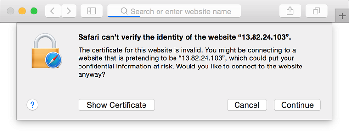
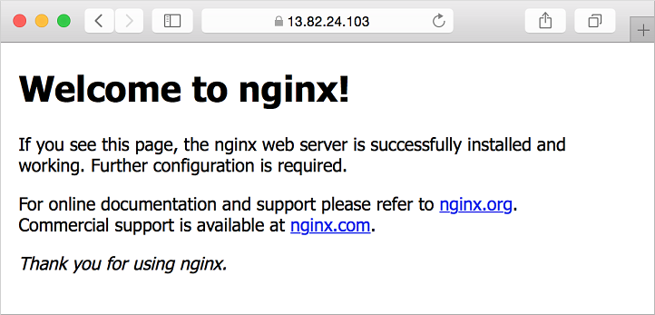

# Tutorial: Use TLS/SSL certificates to secure a web server


**Applies to:** :heavy_check_mark: Linux VMs 

To secure web servers, a Transport Layer Security (TLS), previously known as Secure Sockets Layer (SSL), certificate can be used to encrypt web traffic. These TLS/SSL certificates can be stored in Azure Key Vault, and allow secure deployments of certificates to Linux virtual machines (VMs) in Azure. In this tutorial you learn how to:

> [!div class="checklist"]
> * Create an Azure Key Vault
> * Generate or upload a certificate to the Key Vault
> * Create a VM and install the NGINX web server
> * Inject the certificate into the VM and configure NGINX with a TLS binding

This tutorial uses the CLI within the [Azure Cloud Shell](../../cloud-shell/overview.md), which is constantly updated to the latest version. To open the Cloud Shell, select **Try it** from the top of any code block.

If you choose to install and use the CLI locally, this tutorial requires that you're running the Azure CLI version 2.0.30 or later. Run `az --version` to find the version. If you need to install or upgrade, see [Install Azure CLI]( /cli/azure/install-azure-cli).


## Overview
Azure Key Vault safeguards cryptographic keys and secrets, such as certificates or passwords. Key Vault helps streamline the certificate management process and enables you to maintain control of keys that access those certificates. You can create a self-signed certificate inside Key Vault, or upload an existing, trusted certificate that you already own.

Rather than using a custom VM image that includes certificates baked-in, you inject certificates into a running VM. This process ensures that the most up-to-date certificates are installed on a web server during deployment. If you renew or replace a certificate, you don't also have to create a new custom VM image. The latest certificates are automatically injected as you create more VMs. During the whole process, the certificates never leave the Azure platform or are exposed in a script, command-line history, or template.


## Create an Azure Key Vault
Before you can create a Key Vault and certificates, create a resource group with [az group create](/cli/azure/group). The following example creates a resource group named *myResourceGroupSecureWeb* in the *eastus* location:

```azurecli-interactive 
az group create --name myResourceGroupSecureWeb --location eastus
```

Next, create a Key Vault with [az keyvault create](/cli/azure/keyvault) and enable it for use when you deploy a VM. Each Key Vault requires a unique name, and should be all lowercase. Replace *\<mykeyvault>* in the following example with your own unique Key Vault name:

```azurecli-interactive 
keyvault_name=<mykeyvault>
az keyvault create \
    --resource-group myResourceGroupSecureWeb \
    --name $keyvault_name \
    --enabled-for-deployment
```

## Generate a certificate and store in Key Vault
For production use, you should import a valid certificate signed by trusted provider with [az keyvault certificate import](/cli/azure/keyvault/certificate). For this tutorial, the following example shows how you can generate a self-signed certificate with [az keyvault certificate create](/cli/azure/keyvault/certificate) that uses the default certificate policy:

```azurecli-interactive 
az keyvault certificate create \
    --vault-name $keyvault_name \
    --name mycert \
    --policy "$(az keyvault certificate get-default-policy)"
```

### Prepare a certificate for use with a VM
To use the certificate during the VM create process, obtain the ID of your certificate with [az keyvault secret list-versions](/cli/azure/keyvault/secret). Convert the certificate with [az vm secret format](/cli/azure/vm/secret#az-vm-secret-format). The following example assigns the output of these commands to variables for ease of use in the next steps:

```azurecli-interactive 
secret=$(az keyvault secret list-versions \
          --vault-name $keyvault_name \
          --name mycert \
          --query "[?attributes.enabled].id" --output tsv)
vm_secret=$(az vm secret format --secrets "$secret" -g myResourceGroupSecureWeb --keyvault $keyvault_name)
```

### Create a cloud-init config to secure NGINX
[Cloud-init](https://cloudinit.readthedocs.io) is a widely used approach to customize a Linux VM as it boots for the first time. You can use cloud-init to install packages and write files, or to configure users and security. As cloud-init runs during the initial boot process, there are no extra steps or required agents to apply your configuration.

When you create a VM, certificates and keys are stored in the protected */var/lib/waagent/* directory. To automate adding the certificate to the VM and configuring the web server, use cloud-init. In this example, you install and configure the NGINX web server. You can use the same process to install and configure Apache. 

Create a file named *cloud-init-web-server.txt* and paste the following configuration:

```yaml
#cloud-config
package_upgrade: true
packages:
  - nginx
write_files:
  - owner: www-data:www-data
  - path: /etc/nginx/sites-available/default
    content: |
      server {
        listen 443 ssl;
        ssl_certificate /etc/nginx/ssl/mycert.cert;
        ssl_certificate_key /etc/nginx/ssl/mycert.prv;
      }
runcmd:
  - secretsname=$(find /var/lib/waagent/ -name "*.prv" | cut -c -57)
  - mkdir /etc/nginx/ssl
  - cp $secretsname.crt /etc/nginx/ssl/mycert.cert
  - cp $secretsname.prv /etc/nginx/ssl/mycert.prv
  - service nginx restart
```

### Create a secure VM
Now create a VM with [az vm create](/cli/azure/vm). The certificate data is injected from Key Vault with the `--secrets` parameter. You pass in the cloud-init config with the `--custom-data` parameter:

```azurecli-interactive 
az vm create \
    --resource-group myResourceGroupSecureWeb \
    --name myVM \
    --image UbuntuLTS \
    --admin-username azureuser \
    --generate-ssh-keys \
    --custom-data cloud-init-web-server.txt \
    --secrets "$vm_secret"
```

It takes a few minutes for the VM to be created, the packages to install, and the app to start. When the VM has been created, take note of the `publicIpAddress` displayed by the Azure CLI. This address is used to access your site in a web browser.

To allow secure web traffic to reach your VM, open port 443 from the Internet with [az vm open-port](/cli/azure/vm):

```azurecli-interactive 
az vm open-port \
    --resource-group myResourceGroupSecureWeb \
    --name myVM \
    --port 443
```


### Test the secure web app
Now you can open a web browser and enter *https:\/\/\<publicIpAddress>* in the address bar. Provide your own public IP address from the VM create process. Accept the security warning if you used a self-signed certificate:



Your secured NGINX site is then displayed as in the following example:




## Next steps

In this tutorial, you secured an NGINX web server with a TLS/SSL certificate stored in Azure Key Vault. You learned how to:

> [!div class="checklist"]
> * Create an Azure Key Vault
> * Generate or upload a certificate to the Key Vault
> * Create a VM and install the NGINX web server
> * Inject the certificate into the VM and configure NGINX with a TLS binding

Follow this link to see pre-built virtual machine script samples.

> [!div class="nextstepaction"]
> [Linux virtual machine script samples](https://github.com/Azure-Samples/azure-cli-samples/tree/master/virtual-machine)
