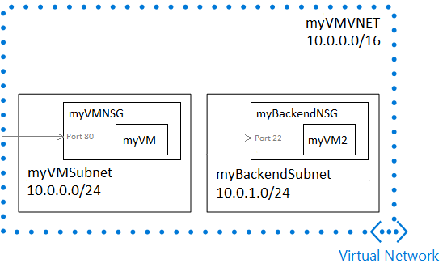

# Manage Azure Virtual Networks and Linux Virtual Machines with the Azure CLI

This tutorial provides information about the basic Azure Virtual Network (VNet) that you get when you create a virtual machine (VM) using `az vm create`. It also shows you how to add a subnet, add a VM, and set up the connections to and from the VMs in that basic network. The following picture shows your VNet structure after you finish this tutorial.



To complete this tutorial, make sure that you have installed the latest [Azure CLI 2.0](/cli/azure/install-azure-cli).

## Step 1 - Create VM and VNet

A VNet is a representation of your own network in the cloud. A VNet is a logical isolation of the Azure cloud dedicated to your subscription. Within a VNet, you find subnets, rules for connectivity to those subnets, and connections from the VMs to the subnets. Azure CLI makes it easy for you to create all the network-related resources that you need to support access to your VMs. 

Before you can create any other Azure resources, you need to create a resource group with az group create. The following example creates a resource group named `myTutorial2` in the `westus` location:

```azurecli
az group create --name myTutorial2 --location westus
```

When you create a virtual machine using Azure CLI, the network resources that it needs are automatically created at the same time. Create `myVM` and its supporting network resources with [az vm create](https://docs.microsoft.com/cli/azure/vm#create):

```azurecli
az vm create \
  --resource-group myTutorial2 \
  --name myVM \
  --image UbuntuLTS \
  --generate-ssh-keys
```

These network resources were created:

- **myVMNSG** – the network security group used for opening ports on myVM
- **myVMPublicIP** – the public IP address that enables access to myVM
- **myVMVMNic** – the network interface card that provides network connectivity for myVM
- **myVMVNET** – the virtual network that myVM is connected to

## Step 2 - Add a subnet

A subnet is a child resource of a VNet, and helps define segments of address spaces within a CIDR block, using IP address prefixes. NICs can be added to subnets, and connected to VMs, providing connectivity for various workloads.

To get started expanding `myVMVNET`, add `myBackEndSubnet` with [az network vnet subnet create](https://docs.microsoft.com/cli/azure/network/vnet/subnet#create):

```azurecli
az network vnet subnet create \
 --address-prefix 10.0.1.0/24 \
 --name myBackendSubnet \
 --resource-group myTutorial2 \
 --vnet-name myVMVNET
```

## Step 3 - Manage network traffic

A network security group (NSG) contains a list of security rules that allow or deny network traffic to resources connected to a VNet. NSGs can be associated to subnets or individual network interface cards (NIC) attached to VMs. When you created `myVM`, an NSG was created named `myVMNSG` associated with `myVMVMNic`.

Add a new network security group named `myBackendNSG` with [az network nsg create](https://docs.microsoft.com/cli/azure/network/nsg#create). 

```azurecli
az network nsg create \
 --resource-group myTutorial2 \
 --name myBackendNSG \
 --location westus
```

The new NSG will be associated with the new virtual machine that you create in `myBackendSubnet`. Create `myVM2` using `myBackendSubnet` and `myBackendNSG` with `az vm create`:

```azurecli
az vm create \
  --resource-group myTutorial2 \
  --name myVM2 \
  --image UbuntuLTS \
  --generate-ssh-keys \
  --subnet myBackendSubnet \
  --vnet-name myVMVNET \
  --public-ip-address "" \
  --nsg myBackendNSG

```

## Step 4 - Open network ports

Opening or closing access to VMs through ports is done using NSG rules. If you let Azure create a network security group for you, inbound port 22 is automatically opened for SSH connectivity. 

In later tutorials, you install Nginx on the Linux VM and open access to the webserver. In this tutorial, you learn how to open port 80, which you use in the later tutorials. You also close and open ports on `myVM2` to enable it to only communicate with `myVM`.

Open port 80 on `myVM` with [az vm open-port](https://docs.microsoft.com/cli/azure/vm#open-port):

```azurecli
az vm open-port --port 80 --resource-group myTutorial2 --name myVM
```

Add an NSG rule that denies all internet bound traffic from `myVM2` with the [az network nsg rule create](https://docs.microsoft.com/cli/azure/network/nsg/rule#create):

```azurecli
az network nsg rule create \
 --resource-group myTutorial2 \
 --nsg-name myBackendNSG \
 --name web-rule \
 --access Deny \
 --protocol Tcp  \
 --direction Outbound  \
 --priority 200 \
 --source-address-prefix "*" \
 --source-port-range "*" \
 --destination-address-prefix "*" \
 --destination-port-range "*"
```

## Step 5 - Configure network traffic between VMs

After limiting `myVM2` from accessing the internet, you can set up a port to enable `myVM` and `myVM2` to communicate with each other in the VNet.

Add an NSG rule that allows traffic to `myBackendSubnet` only from `myVMSubnet` with `az network rule create`:

```azurecli
az network nsg rule create \
 --resource-group myTutorial2 \
 --nsg-name myBackendNSG \
 --name com-rule \
 --access Allow \
 --protocol Tcp \
 --direction Inbound \
 --priority 100 \
 --source-address-prefix 10.0.0.0/24 \
 --source-port-range "*" \
 --destination-address-prefix "*" \
 --destination-port-range 22
```

## Step 6 - Delete the resources

You create the resources that you need in later tutorials, so go ahead and delete the resource group and all the resources with [az group delete](https://docs.microsoft.com/cli/azure/group#delete):

```azurecli
az group delete --name myTutorial2 --no-wait --yes
```

## Next steps

Tutorial - [Create and manage storage](./tutorial-manage-data-disk.md)

Further reading:

- Learn even more about virtual networks in [Virtual Network Overview](../../virtual-network/virtual-networks-overview.md).
- Find out how you can make your virtual network even more secure in [Filter network traffic with network security groups](../../virtual-network/virtual-networks-nsg.md).
- Learn about the network interfaces that are used to connect the VMs to the VNet in [Network Interfaces](../../virtual-network/virtual-network-network-interface.md).
- Start the [Create and manage data disks](tutorial-manage-data-disk.md) tutorial.
