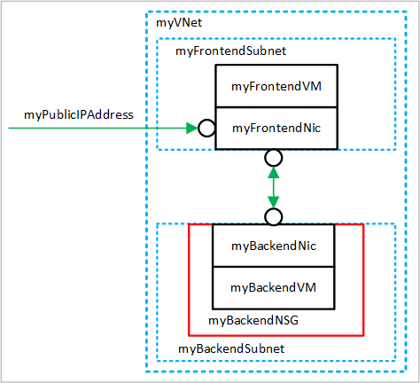

# Tutorial: Create and manage Azure virtual networks for Linux virtual machines with the Azure CLI

Azure virtual machines use Azure networking for internal and external network communication. This tutorial walks through deploying two virtual machines and configuring Azure networking for these VMs. The examples in this tutorial assume that the VMs are hosting a web application with a database back-end, however an application is not deployed in the tutorial. In this tutorial, you learn how to:

> [!div class="checklist"]
> * Create a virtual network and subnet
> * Create a public IP address
> * Create a front-end VM
> * Secure network traffic
> * Create a back-end VM

This tutorial uses the CLI within the [Azure Cloud Shell](../../cloud-shell/overview.md), which is constantly updated to the latest version. To open the Cloud Shell, select **Try it** from the top of any code block.

If you choose to install and use the CLI locally, this tutorial requires that you are running the Azure CLI version 2.0.30 or later. Run `az --version` to find the version. If you need to install or upgrade, see [Install Azure CLI]( /cli/azure/install-azure-cli).

## VM networking overview

Azure virtual networks enable secure network connections between virtual machines, the internet, and other Azure services such as Azure SQL Database. Virtual networks are broken down into logical segments called subnets. Subnets are used to control network flow, and as a security boundary. When deploying a VM, it generally includes a virtual network interface, which is attached to a subnet.

As you complete the tutorial, the following virtual network resources are created:



- *myVNet* - The virtual network that the VMs use to communicate with each other and the internet.
- *myFrontendSubnet* - The subnet in *myVNet* used by the front-end resources.
- *myPublicIPAddress* - The public IP address used to access *myFrontendVM* from the internet.
- *myFrontentNic* - The network interface used by *myFrontendVM* to communicate with *myBackendVM*.
- *myFrontendVM* - The VM used to communicate between the internet and *myBackendVM*.
- *myBackendNSG* - The network security group that controls communication between the *myFrontendVM* and *myBackendVM*.
- *myBackendSubnet* - The subnet associated with *myBackendNSG* and used by the back-end resources.
- *myBackendNic* - The network interface used by *myBackendVM* to communicate with *myFrontendVM*.
- *myBackendVM* - The VM that uses port 22 and 3306 to communicate with *myFrontendVM*.

## Create a virtual network and subnet

For this tutorial, a single virtual network is created with two subnets. A front-end subnet for hosting a web application, and a back-end subnet for hosting a database server.

Before you can create a virtual network, create a resource group with [az group create](/cli/azure/group). The following example creates a resource group named *myRGNetwork* in the eastus location.

```azurecli-interactive 
az group create --name myRGNetwork --location eastus
```

### Create virtual network

Use the [az network vnet create](/cli/azure/network/vnet) command to create a virtual network. In this example, the network is named *mvVNet* and is given an address prefix of *10.0.0.0/16*. A subnet is also created with a name of *myFrontendSubnet* and a prefix of *10.0.1.0/24*. Later in this tutorial a front-end VM is connected to this subnet. 

```azurecli-interactive 
az network vnet create \
  --resource-group myRGNetwork \
  --name myVNet \
  --address-prefix 10.0.0.0/16 \
  --subnet-name myFrontendSubnet \
  --subnet-prefix 10.0.1.0/24
```

### Create subnet

A new subnet is added to the virtual network using the [az network vnet subnet create](/cli/azure/network/vnet/subnet) command. In this example, the subnet is named *myBackendSubnet* and is given an address prefix of *10.0.2.0/24*. This subnet is used with all back-end services.

```azurecli-interactive 
az network vnet subnet create \
  --resource-group myRGNetwork \
  --vnet-name myVNet \
  --name myBackendSubnet \
  --address-prefix 10.0.2.0/24
```

At this point, a network has been created and segmented into two subnets, one for front-end services, and another for back-end services. In the next section, virtual machines are created and connected to these subnets.

## Create a public IP address

A public IP address allows Azure resources to be accessible on the internet. The allocation method of the public IP address can be configured as dynamic or static. By default, a public IP address is dynamically allocated. Dynamic IP addresses are released when a VM is deallocated. This behavior causes the IP address to change during any operation that includes a VM deallocation.

The allocation method can be set to static, which ensures that the IP address remains assigned to a VM, even during a deallocated state. When using a statically allocated IP address, the IP address itself cannot be specified. Instead, it is allocated from a pool of available addresses.

```azurecli-interactive
az network public-ip create --resource-group myRGNetwork --name myPublicIPAddress
```

When creating a VM with the [az vm create](/cli/azure/vm) command, the default public IP address allocation method is dynamic. When creating a virtual machine using the [az vm create](/cli/azure/vm) command, include the `--public-ip-address-allocation static` argument to assign a static public IP address. This operation is not demonstrated in this tutorial, however in the next section a dynamically allocated IP address is changed to a statically allocated address. 

### Change allocation method

The IP address allocation method can be changed using the [az network public-ip update](/cli/azure/network/public-ip) command. In this example, the IP address allocation method of the front-end VM is changed to static.

First, deallocate the VM.

```azurecli-interactive 
az vm deallocate --resource-group myRGNetwork --name myFrontendVM
```

Use the [az network public-ip update](/cli/azure/network/public-ip) command to update the allocation method. In this case, the `--allocation-method` is being set to *static*.

```azurecli-interactive 
az network public-ip update --resource-group myRGNetwork --name myPublicIPAddress --allocation-method static
```

Start the VM.

```azurecli-interactive 
az vm start --resource-group myRGNetwork --name myFrontendVM --no-wait
```

### No public IP address

Often, a VM does not need to be accessible over the internet. To create a VM without a public IP address, use the `--public-ip-address ""` argument with an empty set of double quotes. This configuration is demonstrated later in this tutorial.

## Create a front-end VM

Use the [az vm create](/cli/azure/vm) command to create the VM named *myFrontendVM* using *myPublicIPAddress*.

```azurecli-interactive 
az vm create \
  --resource-group myRGNetwork \
  --name myFrontendVM \
  --vnet-name myVNet \
  --subnet myFrontendSubnet \
  --nsg myFrontendNSG \
  --public-ip-address myPublicIPAddress \
  --image UbuntuLTS \
  --generate-ssh-keys
```

## Secure network traffic

A network security group (NSG) contains a list of security rules that allow or deny network traffic to resources connected to Azure Virtual Networks (VNet). NSGs can be associated to subnets or individual network interfaces. When an NSG is associated with a network interface, it applies only the associated VM. When an NSG is associated to a subnet, the rules apply to all resources connected to the subnet. 

### Network security group rules

NSG rules define networking ports over which traffic is allowed or denied. The rules can include source and destination IP address ranges so that traffic is controlled between specific systems or subnets. NSG rules also include a priority (between 1—and 4096). Rules are evaluated in the order of priority. A rule with a priority of 100 is evaluated before a rule with priority 200.

All NSGs contain a set of default rules. The default rules cannot be deleted, but because they are assigned the lowest priority, they can be overridden by the rules that you create.

The default rules for NSGs are:

- **Virtual network** - Traffic originating and ending in a virtual network is allowed both in inbound and outbound directions.
- **Internet** - Outbound traffic is allowed, but inbound traffic is blocked.
- **Load balancer** - Allow Azure’s load balancer to probe the health of your VMs and role instances. If you are not using a load balanced set, you can override this rule.

### Create network security groups

A network security group can be created at the same time as a VM using the [az vm create](/cli/azure/vm) command. When doing so, the NSG is associated with the VMs network interface and an NSG rule is auto created to allow traffic on port *22* from any source. Earlier in this tutorial, the front-end NSG was auto-created with the front-end VM. An NSG rule was also auto created for port 22. 

In some cases, it may be helpful to pre-create an NSG, such as when default SSH rules should not be created, or when the NSG should be attached to a subnet. 

Use the [az network nsg create](/cli/azure/network/nsg) command to create a network security group.

```azurecli-interactive 
az network nsg create --resource-group myRGNetwork --name myBackendNSG
```

Instead of associating the NSG to a network interface, it is associated with a subnet. In this configuration, any VM that is attached to the subnet inherits the NSG rules.

Update the existing subnet named *myBackendSubnet* with the new NSG.

```azurecli-interactive 
az network vnet subnet update \
  --resource-group myRGNetwork \
  --vnet-name myVNet \
  --name myBackendSubnet \
  --network-security-group myBackendNSG
```

### Secure incoming traffic

When the front-end VM was created, an NSG rule was created to allow incoming traffic on port 22. This rule allows SSH connections to the VM. For this example, traffic should also be allowed on port *80*. This configuration allows a web application to be accessed on the VM.

Use the [az network nsg rule create](/cli/azure/network/nsg/rule) command to create a rule for port *80*.

```azurecli-interactive 
az network nsg rule create \
  --resource-group myRGNetwork \
  --nsg-name myFrontendNSG \
  --name http \
  --access allow \
  --protocol Tcp \
  --direction Inbound \
  --priority 200 \
  --source-address-prefix "*" \
  --source-port-range "*" \
  --destination-address-prefix "*" \
  --destination-port-range 80
```

The front-end VM is only accessible on port *22* and port *80*. All other incoming traffic is blocked at the network security group. It may be helpful to visualize the NSG rule configurations. Return the NSG rule configuration with the [az network rule list](/cli/azure/network/nsg/rule) command. 

```azurecli-interactive 
az network nsg rule list --resource-group myRGNetwork --nsg-name myFrontendNSG --output table
```

### Secure VM to VM traffic

Network security group rules can also apply between VMs. For this example, the front-end VM needs to communicate with the back-end VM on port *22* and *3306*. This configuration allows SSH connections from the front-end VM, and also allow an application on the front-end VM to communicate with a back-end MySQL database. All other traffic should be blocked between the front-end and back-end virtual machines.

Use the [az network nsg rule create](/cli/azure/network/nsg/rule) command to create a rule for port 22. Notice that the `--source-address-prefix` argument specifies a value of *10.0.1.0/24*. This configuration ensures that only traffic from the front-end subnet is allowed through the NSG.

```azurecli-interactive 
az network nsg rule create \
  --resource-group myRGNetwork \
  --nsg-name myBackendNSG \
  --name SSH \
  --access Allow \
  --protocol Tcp \
  --direction Inbound \
  --priority 100 \
  --source-address-prefix 10.0.1.0/24 \
  --source-port-range "*" \
  --destination-address-prefix "*" \
  --destination-port-range "22"
```

Now add a rule for MySQL traffic on port 3306.

```azurecli-interactive 
az network nsg rule create \
  --resource-group myRGNetwork \
  --nsg-name myBackendNSG \
  --name MySQL \
  --access Allow \
  --protocol Tcp \
  --direction Inbound \
  --priority 200 \
  --source-address-prefix 10.0.1.0/24 \
  --source-port-range "*" \
  --destination-address-prefix "*" \
  --destination-port-range "3306"
```

Finally, because NSGs have a default rule allowing all traffic between VMs in the same VNet, a rule can be created for the back-end NSGs to block all traffic. Notice here that the `--priority` is given a value of *300*, which is lower that both the NSG and MySQL rules. This configuration ensures that SSH and MySQL traffic is still allowed through the NSG.

```azurecli-interactive 
az network nsg rule create \
  --resource-group myRGNetwork \
  --nsg-name myBackendNSG \
  --name denyAll \
  --access Deny \
  --protocol Tcp \
  --direction Inbound \
  --priority 300 \
  --source-address-prefix "*" \
  --source-port-range "*" \
  --destination-address-prefix "*" \
  --destination-port-range "*"
```

## Create back-end VM

Now create a virtual machine, which is attached to the *myBackendSubnet*. Notice that the `--nsg` argument has a value of empty double quotes. An NSG does not need to be created with the VM. The VM is attached to the back-end subnet, which is protected with the pre-created back-end NSG. This NSG applies to the VM. Also, notice here that the `--public-ip-address` argument has a value of empty double quotes. This configuration creates a VM without a public IP address. 

```azurecli-interactive 
az vm create \
  --resource-group myRGNetwork \
  --name myBackendVM \
  --vnet-name myVNet \
  --subnet myBackendSubnet \
  --public-ip-address "" \
  --nsg "" \
  --image UbuntuLTS \
  --generate-ssh-keys
```

The back-end VM is only accessible on port *22* and port *3306* from the front-end subnet. All other incoming traffic is blocked at the network security group. It may be helpful to visualize the NSG rule configurations. Return the NSG rule configuration with the [az network rule list](/cli/azure/network/nsg/rule) command. 

```azurecli-interactive 
az network nsg rule list --resource-group myRGNetwork --nsg-name myBackendNSG --output table
```

## Next steps

In this tutorial, you created and secured Azure networks as related to virtual machines. You learned how to:

> [!div class="checklist"]
> * Create a virtual network and subnet
> * Create a public IP address
> * Create a front-end VM
> * Secure network traffic
> * Create back-end VM

To learn about protecting your VM disks, see [Backup and disaster recovery for disks](../backup-and-disaster-recovery-for-azure-iaas-disks.md).