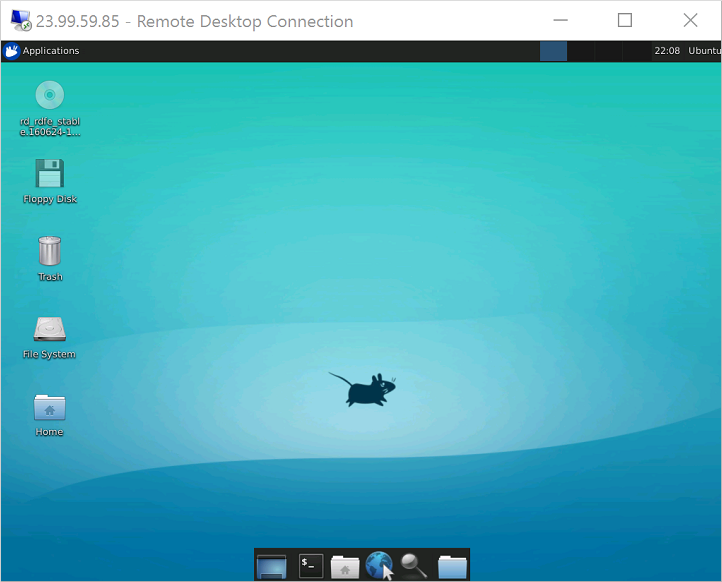

# Install and configure xrdp to use Remote Desktop with Ubuntu

**Applies to:** :heavy_check_mark: Linux VMs :heavy_check_mark: Flexible scale sets

When new to Linux, or for quick troubleshooting scenarios, the use of remote desktop may be easier than Secure Shell (SSH) access. This article details how to install and configure a desktop environment ([xfce](https://www.xfce.org)) and remote desktop ([xrdp](http://xrdp.org)) for your Linux VM running Ubuntu.

The article was written and tested using an Ubuntu 18.04 VM.

> [!NOTE]
> Using Remote Desktop over the internet will introduce noticeable "lag" (input latency) when compared to local desktop use. This can be influenced by multiple factors including local internet speed and distance from the datacenter where the virtual machine is hosted. This lag does not usually reflect the performance of the VM itself.

## Prerequisites

This article requires an existing Ubuntu 18.04 LTS or Ubuntu 20.04 LTS VM in Azure. If you need to create a VM, use one of the following methods:

- The [Azure CLI](quick-create-cli.md)
- The [Azure portal](quick-create-portal.md)
   
## Install a desktop environment on your Linux VM

Most Linux VMs in Azure don't have a desktop environment installed by default. Linux VMs are commonly managed using SSH connections rather than a desktop environment, however there are several desktop environments that you can choose to install. Depending on your choice of desktop environment, it consumes up to 2 GB of disk space and take up to ten minutes to both install and configure all the required packages.

The following example installs the lightweight [xfce4](https://www.xfce.org/) desktop environment on an Ubuntu VM. Commands for other distributions vary slightly (use `yum` to install on Red Hat Enterprise Linux and configure appropriate `selinux` rules, or use `zypper` to install on SUSE, for example).

First, SSH to your VM. The following example connects to the VM named *myvm.westus.cloudapp.azure.com* with the username of *azureuser*. Use your own values:

```bash
ssh azureuser@myvm.westus.cloudapp.azure.com
```

If you're using Windows and need more information on using SSH, see [How to use SSH keys with Windows](ssh-from-windows.md).

Next, install xfce using `apt` :

```bash
sudo apt-get update
sudo DEBIAN_FRONTEND=noninteractive apt-get -y install xfce4
sudo apt install xfce4-session
```

## Install and configure a remote desktop server
Now that you have a desktop environment installed, configure a remote desktop service to listen for incoming remote access connections. [xrdp](http://xrdp.org) is an open source Remote Desktop Protocol (RDP) server that is available on most Linux distributions and works well with xfce. Install xrdp on your Ubuntu VM as follows:

```bash
sudo apt-get -y install xrdp
sudo systemctl enable xrdp
```

On Ubuntu 20, you need to give certificate access to an xrdp user:

```bash
sudo adduser xrdp ssl-cert
```

Tell xrdp what desktop environment to use when you start your session. Configure xrdp to use xfce as your desktop environment as follows:

```bash
echo xfce4-session >~/.xsession
```

Restart the xrdp service for the changes to take effect as follows:

```bash
sudo service xrdp restart
```

## Set a local user account password
If you created a password for your user account when you created your VM, skip this step. If you only use SSH key authentication and don't have a local account password set, specify a password before you use xrdp to log in to your VM. xrdp can't accept SSH keys for authentication. The following example specifies a password for the user account *azureuser*:

```bash
sudo passwd azureuser
```

> [!NOTE]
> Specifying a password does not update your SSHD configuration to permit password logins if it currently does not. From a security perspective, you may wish to connect to your VM with an SSH tunnel using key-based authentication and then connect to xrdp. If so, skip the following step on creating a network security group rule to allow remote desktop traffic.


## Create a Network Security Group rule for Remote Desktop traffic
To allow Remote Desktop traffic to reach your Linux VM, a network security group rule needs to be created that allows TCP on port 3389 to reach your VM. For more information about network security group rules, see [What is a network security group?](../../virtual-network/network-security-groups-overview.md) You can also [use the Azure portal to create a network security group rule](../windows/nsg-quickstart-portal.md).

### [Azure CLI](#tab/azure-cli)

The following example creates a network security group rule with [az vm open-port](/cli/azure/vm#az-vm-open-port) on port *3389*. From the Azure CLI, not the SSH session to your VM, open the following network security group rule:

```azurecli
az vm open-port --resource-group myResourceGroup --name myVM --port 3389
```

### [Azure PowerShell](#tab/azure-powershell)

The following example adds a network security group rule with [Add-AzNetworkSecurityRuleConfig](/powershell/module/az.network/add-aznetworksecurityruleconfig) on port *3389* to the existing network security group. From the Azure PowerShell, not the SSH session to your VM, get the existing network security group named *myVMnsg*:

```azurepowershell
$nsg = Get-AzNetworkSecurityGroup -ResourceGroupName myResourceGroup -Name myVMnsg
```

Add an RDP network security rule named *open-port-3389* to your `$nsg` network security group and update the network security group with [Set-AzNetworkSecurityGroup](/powershell/module/az.network/set-aznetworksecuritygroup) in order for your changes to take effect:

```azurepowershell
$params = @{
    Name                     = 'open-port-3389'
    Description              = 'Allow RDP'
    NetworkSecurityGroup     = $nsg
    Access                   = 'Allow'
    Protocol                 = 'TCP'
    Direction                = 'Inbound'
    Priority                 = 100
    SourceAddressPrefix      = 'Internet'
    SourcePortRange          = '*'
    DestinationAddressPrefix = '*'
    DestinationPortRange     = '3389'
}

Add-AzNetworkSecurityRuleConfig @params | Set-AzNetworkSecurityGroup
```

---
## Connect your Linux VM with a Remote Desktop client

Open your local remote desktop client and connect to the IP address or DNS name of your Linux VM.

:::image type="content" source="media/use-remote-desktop/remote-desktop.png" alt-text="Screenshot of the remote desktop client.":::

Enter the username and password for the user account on your VM as follows:

:::image type="content" source="media/use-remote-desktop/xrdp-login.png" alt-text="Screenshot of the xrdp log in screen.":::

After authenticating, the xfce desktop environment will load and look similar to the following example:




If your local RDP client uses network level authentication (NLA), you may need to disable that connection setting. XRDP does not currently support NLA. You can also look at alternative RDP solutions that do support NLA, such as [FreeRDP](https://www.freerdp.com).


## Troubleshoot
If you can't connect to your Linux VM using a Remote Desktop client, use `netstat` on your Linux VM to verify that your VM is listening for RDP connections as follows:

```bash
sudo netstat -plnt | grep rdp
```

The following example shows the VM listening on TCP port 3389 as expected:

```bash
tcp     0     0      127.0.0.1:3350     0.0.0.0:*     LISTEN     53192/xrdp-sesman
tcp     0     0      0.0.0.0:3389       0.0.0.0:*     LISTEN     53188/xrdp
```

If the *xrdp-sesman* service isn't listening, on an Ubuntu VM restart the service as follows:

```bash
sudo service xrdp restart
```

Review logs in */var/log* on your Ubuntu VM for indications as to why the service may not be responding. You can also monitor the syslog during a remote desktop connection attempt to view any errors:

```bash
tail -f /var/log/syslog
```

Other Linux distributions such as Red Hat Enterprise Linux and SUSE may have different ways to restart services and alternate log file locations to review.

If you don't receive any response in your remote desktop client and don't see any events in the system log, this behavior indicates that remote desktop traffic can't reach the VM. Review your network security group rules to ensure that you have a rule to permit TCP on port 3389. For more information, see [Troubleshoot application connectivity issues](/troubleshoot/azure/virtual-machines/troubleshoot-app-connection).


## Next steps
For more information about creating and using SSH keys with Linux VMs, see [Create SSH keys for Linux VMs in Azure](mac-create-ssh-keys.md).

For information on using SSH from Windows, see [How to use SSH keys with Windows](ssh-from-windows.md).

