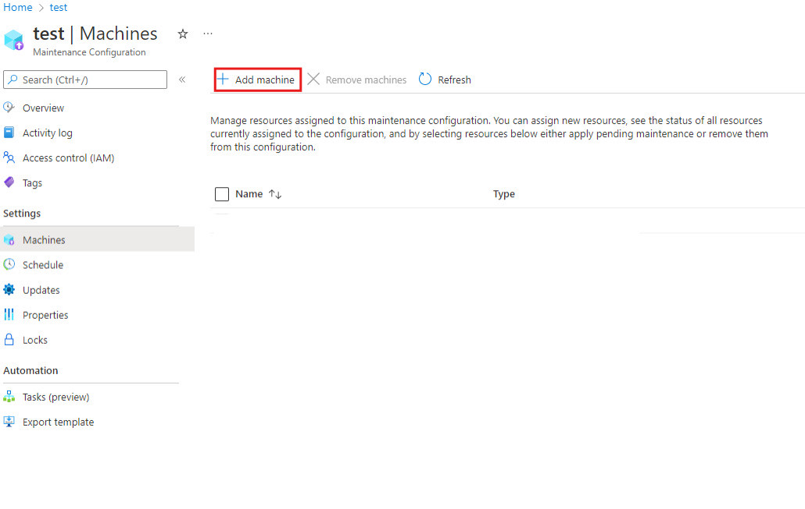
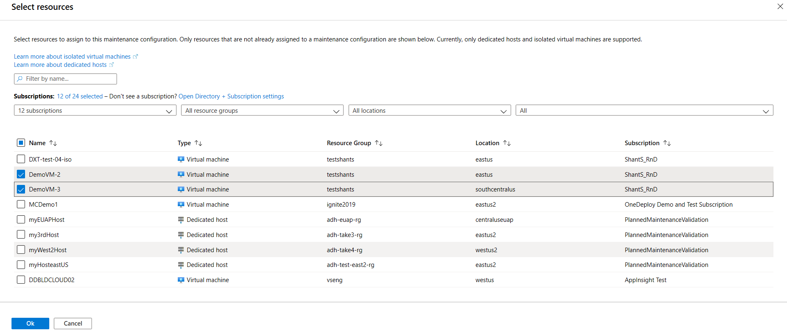
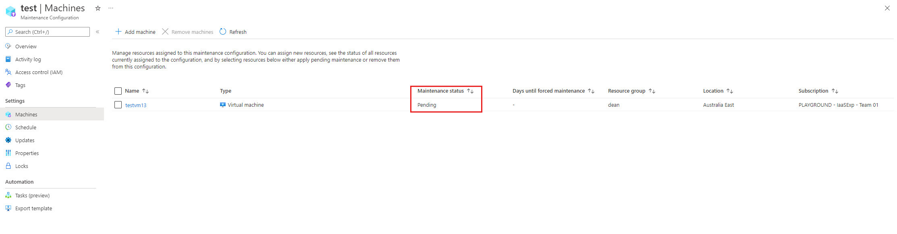

# Control updates with Maintenance Configurations and the Azure portal

**Applies to:** :heavy_check_mark: Linux VMs :heavy_check_mark: Windows VMs :heavy_check_mark: Flexible scale sets :heavy_check_mark: Uniform scale sets

With Maintenance Configurations, you can now take more control over when to apply updates to various Azure resources. This topic covers the Azure portal options for creating Maintenance Configurations. For more about benefits of using Maintenance Configurations, its limitations, and other management options, see [Managing platform updates with Maintenance Configurations](maintenance-configurations.md).

## Create a Maintenance Configuration

1. Sign in to the Azure portal.

1. Search for **Maintenance Configurations**.
    
    :::image type="content" source="media/virtual-machines-maintenance-control-portal/maintenance-configurations-search-bar.png" alt-text="Screenshot showing how to open Maintenance Configurations":::

1. Click **Create**.

    :::image type="content" source="media/virtual-machines-maintenance-control-portal/maintenance-configurations-add-2.png" alt-text="Screenshot showing how to add a maintenance configuration":::

1. In the Basics tab, choose a subscription and resource group, provide a name for the configuration, choose a region, and select one of the scopes we offer which you wish to apply updates for. Click **Add a schedule** to add or modify the schedule for your configuration.
    
    > [!IMPORTANT]
    > Certain virtual machine types and schedules will require a specific kind of scope. Check out [maintenance configuration scopes](maintenance-configurations.md#scopes) to find the right one for your virtual machine.

    :::image type="content" source="media/virtual-machines-maintenance-control-portal/maintenance-configurations-basics-tab.png" alt-text="Screenshot showing Maintenance Configuration basics":::

1. In the Schedule tab, declare a scheduled window when Azure will apply the updates on your resources. Set a start date, maintenance window, and recurrence if your resource requires it. Once you create a scheduled window you no longer have to apply the updates manually. Click **Next**. 

    > [!IMPORTANT]
    > Maintenance window **duration** must be *2 hours* or longer. 

    :::image type="content" source="media/virtual-machines-maintenance-control-portal/maintenance-configurations-schedule-tab.png" alt-text="Screenshot showing Maintenance Configuration schedule":::

1. In the Machines tab, assign resources now or skip this step and assign resources later after maintenance configuration deployment. Click **Next**.

1. Add tags and values. Click **Next**.
    
    :::image type="content" source="media/virtual-machines-maintenance-control-portal/maintenance-configurations-tags-tab.png" alt-text="Screenshot showing how to add tags to a maintenance configuration":::

1. Review the summary. Click **Create**.

1. After the deployment is complete, click **Go to resource**.

## Assign the configuration

On the details page of the maintenance configuration, click Machines and then click **Add Machine**. 

Select the resources that you want the maintenance configuration assigned to and click **Ok**. The VM needs to be running to assign the configuration. An error occurs if you try to assign a configuration to a VM that is stopped. 

<!---Shantanu to add details about the error case--->

## Check configuration

You can verify that the configuration was applied correctly or check to see any maintenance configuration that is currently assigned to a machine by going to the **Maintenance Configurations** and checking under the **Machines** tab. You should see any machine you have assigned the configuration in this tab.

## Check for pending updates

You can check if there are any updates pending for a maintenance configuration. In **Maintenance Configurations**, on the details for the configuration, click **Machines** and check **Maintenance status**.

## Delete a maintenance configuration

To delete a configuration, open the configuration details and click **Delete**.

## Next steps

To learn more, see [Maintenance and updates](maintenance-and-updates.md).
