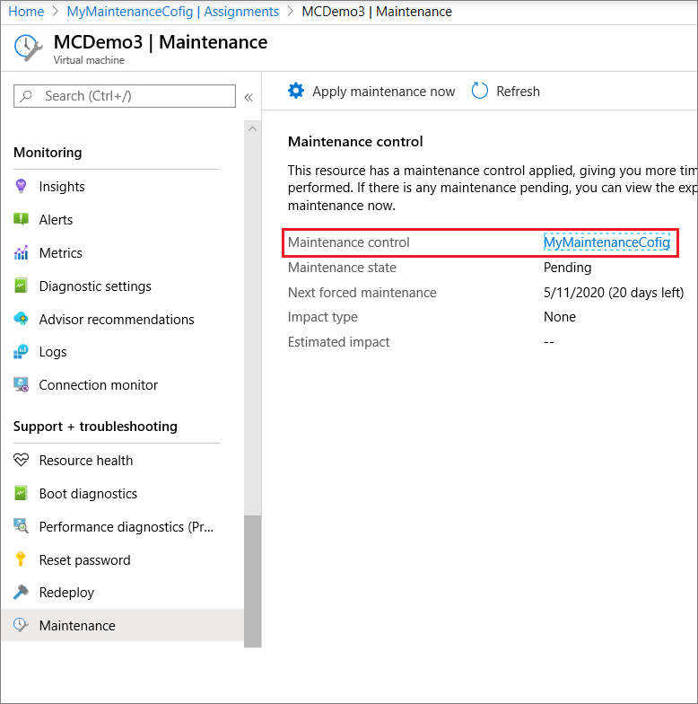
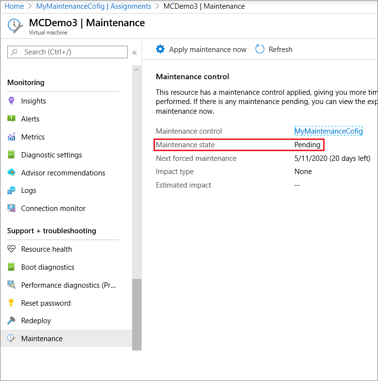
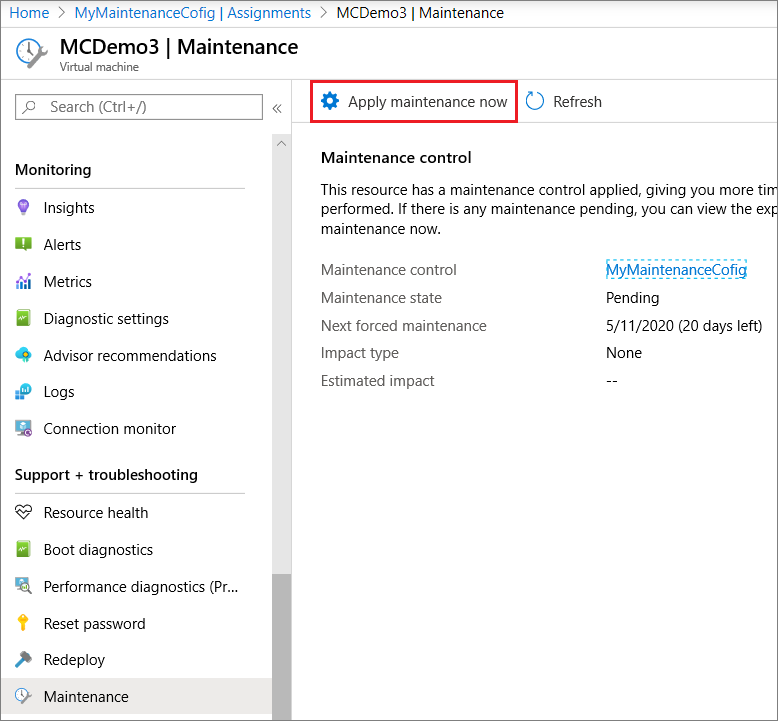
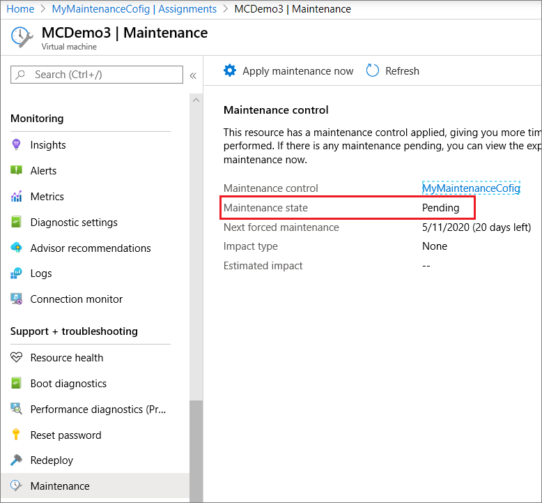

# Control updates with Maintenance Control and the Azure portal

Maintenance control lets you decide when to apply updates to your isolated VMs and Azure dedicated hosts. This topic covers the Azure portal options for Maintenance control. For more about benefits of using Maintenance control, its limitations, and other management options, see [Managing platform updates with Maintenance Control](maintenance-control.md).

## Create a maintenance configuration

1. Sign in to the Azure portal.

1. Search for **Maintenance Configurations**.
    
    :::image type="content" source="media/virtual-machines-maintenance-control-portal/maintenance-configurations-search-bar.png" alt-text="Screenshot showing how to open Maintenance Configurations":::

1. Click **Add**.

    :::image type="content" source="media/virtual-machines-maintenance-control-portal/maintenance-configurations-add-2.png" alt-text="Screenshot showing how to add a maintenance configuration":::

1. In the Basics tab, choose a subscription and resource group, provide a name for the configuration, choose a region, and select *Host* for the scope. Click **Next**.
    
    :::image type="content" source="media/virtual-machines-maintenance-control-portal/maintenance-configurations-basics-tab.png" alt-text="Screenshot showing Maintenance Configuration basics":::

1. In the Schedule tab, declare a scheduled window when Azure will apply the updates on your resources. Set a start date, maintenance window, and recurrence. Once you create a scheduled window you no longer have to apply the updates manually. Click **Next**. 

    > [!IMPORTANT]
    > Maintenance window **duration** must be *2 hours* or longer. Maintenance **recurrence** must be set to repeat at least once in 35-days. 

    :::image type="content" source="media/virtual-machines-maintenance-control-portal/maintenance-configurations-schedule-tab.png" alt-text="Screenshot showing Maintenance Configuration schedule":::

1. In the Assignment tab, assign resources now or skip this step and assign resources later after maintenance configuration deployment. Click **Next**.

1. Add tags and values. Click **Next**.
    
    :::image type="content" source="media/virtual-machines-maintenance-control-portal/maintenance-configurations-tags-tab.png" alt-text="Screenshot showing how to add tags to a maintenance configuration":::

1. Review the summary. Click **Create**.

1. After the deployment is complete, click **Go to resource**.

## Assign the configuration

On the details page of the maintenance configuration, click Assignments and then click **Assign resource**. 

Select the resources that you want the maintenance configuration assigned to and click **Ok**. The **Type** column shows whether the resource is an isolated VM or Azure dedicated host. The VM needs to be running to assign the configuration. An error occurs if you try to assign a configuration to a VM that is stopped. 

<!---Shantanu to add details about the error case--->

## Check configuration

You can verify that the configuration was applied correctly or check to see any maintenance configuration that is currently assigned using **Maintenance Configurations**. The **Type** column shows whether the configuration is assigned to an isolated VM or Azure dedicated host. 

You can also check the configuration for a specific virtual machine on its properties page. Click **Maintenance** to see the configuration assigned to that virtual machine.

## Check for pending updates

There are also two ways to check if updates are pending for a maintenance configuration. In **Maintenance Configurations**, on the details for the configuration, click **Assignments** and check **Maintenance status**.

You can also check a specific host using **Virtual Machines** or properties of the dedicated host. 

## Apply updates

You can apply pending updates on demand. On the VM or Azure Dedicated Host details, click **Maintenance** and click **Apply maintenance now**. Apply update calls can take upto 2 hours to complete.

## Check the status of applying updates 

You can check on the progress of the updates for a configuration in **Maintenance Configurations** or using **Virtual Machines**. On the VM details, click **Maintenance**. In the following example, the **Maintenance state** shows an update is **Pending**.

## Delete a maintenance configuration

To delete a configuration, open the configuration details and click **Delete**.

## Next steps

To learn more, see [Maintenance and updates](maintenance-and-updates.md).
