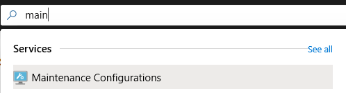
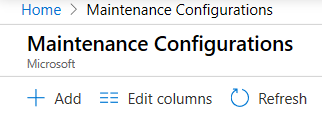
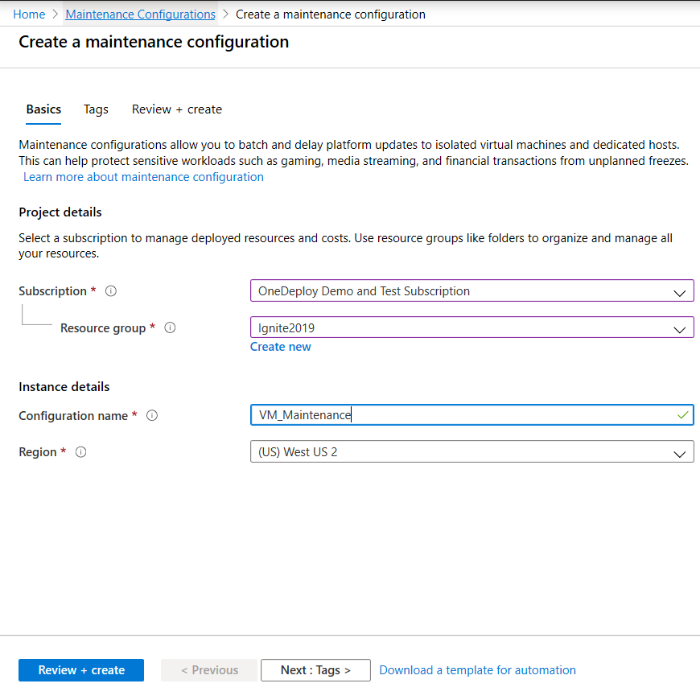
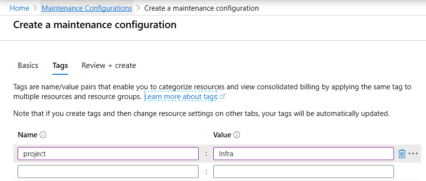
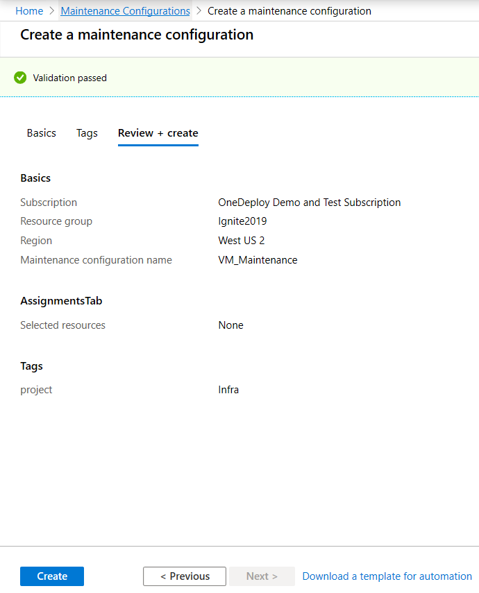
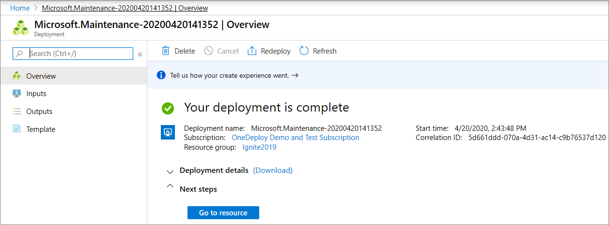

# Control updates with Maintenance Control and the Azure portal

Manage platform updates, that don't require a reboot, using maintenance control. Azure frequently updates its infrastructure to improve reliability, performance, security or launch new features. Most updates are transparent to users. Some sensitive workloads, like gaming, media streaming, and financial transactions, can't tolerate even few seconds of a VM freezing or disconnecting for maintenance. Maintenance control gives you the option to wait on platform updates and apply them within a 35-day rolling window. 

Maintenance control lets you decide when to apply updates to your isolated VMs and Azure Dedicated Hosts.

With maintenance control, you can:
- Batch updates into one update package.
- Wait up to 35 days to apply updates. 
- Automate platform updates for your maintenance window using Azure Functions.
- Maintenance configurations work across subscriptions and resource groups. 

## Limitations

- VMs must be on a [dedicated host](./linux/dedicated-hosts.md), or be created using an [isolated VM size](./linux/isolation.md).
- After 35 days, an update will automatically be applied.
- User must have **Resource Contributor** access.

## Create a maintenance configuration

1. Sign in to the Azure portal.

1. Search for **Maintenance Configurations**.

   

1. Click **Add**.

   

1. Choose a subscription and resource group, provide a name for the configuration, and choose a region. Click **Next**.

   

1. Add tags and values. Click **Next**.

   

1. Review the summary. Click **Create**.

   

1. After the deployment is complete, click **Go to resource**.

   

## Assign the configuration

On the details page of the maintenance configuration, click Assignments and then click **Assign resource**. 

Select the resources that you want the maintenance configuration assigned to and click **Ok**. The **Type** column shows whether the resource is an isolated VM or Azure Dedicated Host. The VM needs to be running to assign the configuration. An error occurs if you try to assign a configuration to a VM that is stopped. 

<!---Shantanu to add details about the error case--->

## Check configuration

You can verify that the configuration was applied correctly or check to see any maintenance configuration that is currently assigned using **Maintenance Configurations**. The **Type** column shows whether the configuration is assigned to an isolated VM or Azure Dedicated Host. 

You can also check the configuration for a specific virtual machine on its properties page. Click **Maintenance** to see the configuration assigned to that virtual machine.

## Check for pending updates

There are also two ways to check if updates are pending for a maintenance configuration. In **Maintenance Configurations**, on the details for the configuration, click **Assignments** and check **Maintenance status**.

You can also check a specific host using **Virtual Machines** or properties of the Dedicated Host. 

## Apply updates

You can apply pending updates on demand using **Virtual Machines**. On the VM details, click **Maintenance** and click **Apply maintenance now**.

## Check the status of applying updates 

You can check on the progress of the updates for a configuration in **Maintenance Configurations** or using **Virtual Machines**. On the VM details, click **Maintenance**. In the following example, the **Maintenance state** shows an update is **Pending**.

## Delete a maintenance configuration

To delete a configuration, open the configuration details and click **Delete**.

## Next steps

To learn more, see [Maintenance and updates](maintenance-and-updates.md).
