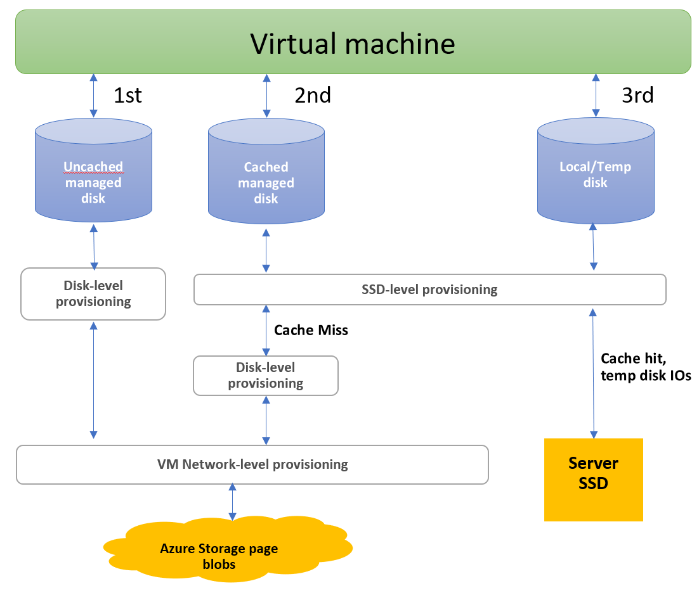
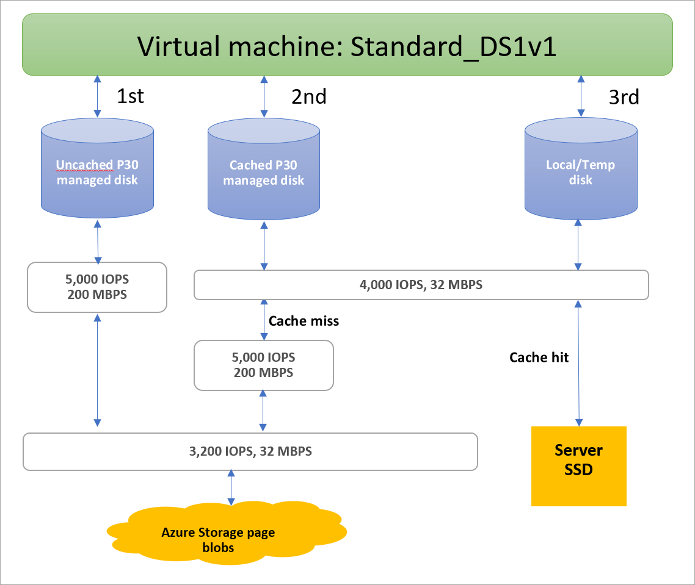

# Introduction to Azure managed disks

**Applies to:** :heavy_check_mark: Linux VMs :heavy_check_mark: Windows VMs :heavy_check_mark: Flexible scale sets :heavy_check_mark: Uniform scale sets

Azure managed disks are block-level storage volumes that are managed by Azure and used with Azure Virtual Machines. Managed disks are like a physical disk in an on-premises server but, virtualized. With managed disks, all you have to do is specify the disk size, the disk type, and provision the disk. Once you provision the disk, Azure handles the rest.

The available types of disks are ultra disks, premium solid-state drives (SSD), standard SSDs, and standard hard disk drives (HDD). For information about each individual disk type, see [Select a disk type for IaaS VMs](disks-types.md).

Alternatively, you could use an Azure Elastic SAN Preview as your VM's storage. An Elastic SAN allows you to consolidate the storage for all your workloads into a single storage backend and can be more cost effective if you've a sizeable amount of large scale IO-intensive workloads and top tier databases. To learn more, see [What is Azure Elastic SAN? Preview](../storage/elastic-san/elastic-san-introduction.md)

## Benefits of managed disks

Let's go over some of the benefits you gain by using managed disks.

### Highly durable and available

Managed disks are designed for 99.999% availability. Managed disks achieve this by providing you with three replicas of your data, allowing for high durability. If one or even two replicas experience issues, the remaining replicas help ensure persistence of your data and high tolerance against failures. This architecture has helped Azure consistently deliver enterprise-grade durability for infrastructure as a service (IaaS) disks, with an industry-leading ZERO% annualized failure rate. Locally redundant storage (LRS) disks provide at least 99.999999999% (11 9's) of durability over a given year and zone-redundant storage (ZRS) disks provide at least 99.9999999999% (12 9's) of durability over a given year.

### Simple and scalable VM deployment

Using managed disks, you can create up to 50,000 VM **disks** of a type in a subscription per region, allowing you to create thousands of **VMs** in a single subscription. This feature also further increases the scalability of [virtual machine scale sets](../virtual-machine-scale-sets/overview.md) by allowing you to create up to 1,000 VMs in a virtual machine scale set using a Marketplace image.

### Integration with availability sets

Managed disks are integrated with availability sets to ensure that the disks of [VMs in an availability set](./availability-set-overview.md) are sufficiently isolated from each other to avoid a single point of failure. Disks are automatically placed in different storage scale units (stamps). If a stamp fails due to hardware or software failure, only the VM instances with disks on those stamps fail. For example, let's say you have an application running on five VMs, and the VMs are in an Availability Set. The disks for those VMs won't all be stored in the same stamp, so if one stamp goes down, the other instances of the application continue to run.

### Integration with Availability Zones

Managed disks support [Availability Zones](../availability-zones/az-overview.md), which is a high-availability offering that protects your applications from datacenter failures. Availability Zones are unique physical locations within an Azure region. Each zone is made up of one or more datacenters equipped with independent power, cooling, and networking. To ensure resiliency, there's a minimum of three separate zones in all enabled regions. With Availability Zones, Azure offers industry best 99.99% VM uptime SLA.

### Azure Backup support

To protect against regional disasters, [Azure Backup](../backup/backup-overview.md) can be used to create a backup job with time-based backups and backup retention policies. This allows you to perform VM or managed disk restorations at will. Currently Azure Backup supports disk sizes up to 32 tebibyte (TiB) disks. [Learn more](../backup/backup-support-matrix-iaas.md) about Azure VM backup support.

#### Azure Disk Backup

Azure Backup offers Azure Disk Backup (preview) as a  native, cloud-based backup solution that protects your data in managed disks. It's a simple, secure, and cost-effective solution that enables you to configure protection for managed disks in a few steps. Azure Disk Backup offers a turnkey solution that provides snapshot lifecycle management for managed disks by automating periodic creation of snapshots and retaining it for configured duration using backup policy. For details on Azure Disk Backup, see [Overview of Azure Disk Backup](../backup/disk-backup-overview.md).

### Granular access control

You can use [Azure role-based access control (Azure RBAC)](../role-based-access-control/overview.md) to assign specific permissions for a managed disk to one or more users. Managed disks expose a variety of operations, including read, write (create/update), delete, and retrieving a [shared access signature (SAS) URI](../storage/common/storage-sas-overview.md) for the disk. You can grant access to only the operations a person needs to perform their job. For example, if you don't want a person to copy a managed disk to a storage account, you can choose not to grant access to the export action for that managed disk. Similarly, if you don't want a person to use an SAS URI to copy a managed disk, you can choose not to grant that permission to the managed disk.

### Upload your vhd

Direct upload makes it easy to transfer your vhd to an Azure managed disk. Previously, you had to follow a more involved process that included staging your data in a storage account. Now, there are fewer steps. It is easier to upload on premises VMs to Azure, upload to large managed disks, and the backup and restore process is simplified. It also reduces cost by allowing you to upload data to managed disks directly without attaching them to VMs. You can use direct upload to upload vhds up to 32 TiB in size.

To learn how to transfer your vhd to Azure, see the [CLI](linux/disks-upload-vhd-to-managed-disk-cli.md) or [PowerShell](windows/disks-upload-vhd-to-managed-disk-powershell.md) articles.

## Security

### Private Links

Private Link support for managed disks can be used to import or export a managed disk internal to your network. Private Links allow you to generate a time bound Shared Access Signature (SAS) URI for unattached managed disks and snapshots that you can use to export the data to other regions for regional expansion, disaster recovery, and forensic analysis. You can also use the SAS URI to directly upload a VHD to an empty disk from on-premises. Now you can leverage [Private Links](../private-link/private-link-overview.md) to restrict the export and import of managed disks so that it can only occur within your Azure virtual network. Private Links allows you to ensure your data only travels within the secure Microsoft backbone network.

To learn how to enable Private Links for importing or exporting a managed disk, see the [CLI](linux/disks-export-import-private-links-cli.md) or [Portal](disks-enable-private-links-for-import-export-portal.md) articles.

### Encryption

Managed disks offer two different kinds of encryption. The first is Server Side Encryption (SSE), which is performed by the storage service. The second one is Azure Disk Encryption (ADE), which you can enable on the OS and data disks for your VMs.

#### Server-side encryption

Server-side encryption provides encryption-at-rest and safeguards your data to meet your organizational security and compliance commitments. Server-side encryption is enabled by default for all managed disks, snapshots, and images, in all the regions where managed disks are available. (Temporary disks, on the other hand, are not encrypted by server-side encryption unless you enable encryption at host; see [Disk Roles: temporary disks](#temporary-disk)).

You can either allow Azure to manage your keys for you, these are platform-managed keys, or you can manage the keys yourself, these are customer-managed keys. Visit the [Server-side encryption of Azure Disk Storage](./disk-encryption.md) article for details.

#### Azure Disk Encryption

Azure Disk Encryption allows you to encrypt the OS and Data disks used by an IaaS Virtual Machine. This encryption includes managed disks. For Windows, the drives are encrypted using industry-standard BitLocker encryption technology. For Linux, the disks are encrypted using the DM-Crypt technology. The encryption process is integrated with Azure Key Vault to allow you to control and manage the disk encryption keys. For more information, see [Azure Disk Encryption for Linux VMs](linux/disk-encryption-overview.md) or [Azure Disk Encryption for Windows VMs](windows/disk-encryption-overview.md).

## Disk roles

There are three main disk roles in Azure: the data disk, the OS disk, and the temporary disk. These roles map to disks that are attached to your virtual machine.

### Data disk

A data disk is a managed disk that's attached to a virtual machine to store application data, or other data you need to keep. Data disks are registered as SCSI drives and are labeled with a letter that you choose. Each data disk has a maximum capacity of 32,767 gibibytes (GiB). The size of the virtual machine determines how many data disks you can attach to it and the type of storage you can use to host the disks.

### OS disk

Every virtual machine has one attached operating system disk. That OS disk has a pre-installed OS, which was selected when the VM was created. This disk contains the boot volume.

This disk has a maximum capacity of 4,095 GiB. However, many operating systems are partitioned with [master boot record (MBR)](https://wikipedia.org/wiki/Master_boot_record) by default. MBR limits the usable size to 2 TiB. If you need more than 2 TiB, create and attach [data disks](#data-disk) and use them for data storage. If you need to store data on the OS disk and require the additional space, [convert it to GUID Partition Table](/windows-server/storage/disk-management/change-an-mbr-disk-into-a-gpt-disk) (GPT). To learn about the differences between MBR and GPT on Windows deployments, see [Windows and GPT FAQ](/windows-hardware/manufacture/desktop/windows-and-gpt-faq).

### Temporary disk

Most VMs contain a temporary disk, which is not a managed disk. The temporary disk provides short-term storage for applications and processes, and is intended to only store data such as page files, swap files, or SQL Server tempdb. Data on the temporary disk may be lost during a [maintenance event](./understand-vm-reboots.md), when you [redeploy a VM](/troubleshoot/azure/virtual-machines/redeploy-to-new-node-windows?toc=%2fazure%2fvirtual-machines%2fwindows%2ftoc.json), or when you stop the VM. During a successful standard reboot of the VM, data on the temporary disk will persist. For more information about VMs without temporary disks, see [Azure VM sizes with no local temporary disk](azure-vms-no-temp-disk.yml).

On Azure Linux VMs, the temporary disk is typically /dev/sdb and on Windows VMs the temporary disk is D: by default. The temporary disk is not encrypted unless (for server side encryption) you enable encryption at host or (for Azure Disk Encryption) with the [VolumeType parameter set to All on Windows](./windows/disk-encryption-windows.md#enable-encryption-on-a-newly-added-data-disk) or [EncryptFormatAll on Linux](./linux/disk-encryption-linux.md#use-encryptformatall-feature-for-data-disks-on-linux-vms).

## Managed disk snapshots

A managed disk snapshot is a read-only crash-consistent full copy of a managed disk that is stored as a standard managed disk by default. With snapshots, you can back up your managed disks at any point in time. These snapshots exist independent of the source disk and can be used to create new managed disks. 

Snapshots are billed based on the used size. For example, if you create a snapshot of a managed disk with provisioned capacity of 64 GiB and actual used data size of 10 GiB, that snapshot is billed only for the used data size of 10 GiB. You can see the used size of your snapshots by looking at the [Azure usage report](../cost-management-billing/understand/review-individual-bill.md). For example, if the used data size of a snapshot is 10 GiB, the **daily** usage report will show 10 GiB/(31 days) = 0.3226 as the consumed quantity.

To learn more about how to create snapshots for managed disks, see the [Create a snapshot of a managed disk](windows/snapshot-copy-managed-disk.md) article.

### Images

Managed disks also support creating a managed custom image. You can create an image from your custom VHD in a storage account or directly from a generalized (sysprepped) VM. This process captures a single image. This image contains all managed disks associated with a VM, including both the OS and data disks. This managed custom image enables creating hundreds of VMs using your custom image without the need to copy or manage any storage accounts.

For information on creating images, see the following articles:

- [How to capture a managed image of a generalized VM in Azure](windows/capture-image-resource.md)
- [How to generalize and capture a Linux virtual machine using the Azure CLI](linux/capture-image.md)

#### Images versus snapshots

It's important to understand the difference between images and snapshots. With managed disks, you can take an image of a generalized VM that has been deallocated. This image includes all of the disks attached to the VM. You can use this image to create a VM, and it includes all of the disks.

A snapshot is a copy of a disk at the point in time the snapshot is taken. It applies only to one disk. If you have a VM that has one disk (the OS disk), you can take a snapshot or an image of it and create a VM from either the snapshot or the image.

A snapshot doesn't have awareness of any disk except the one it contains. This makes it problematic to use in scenarios that require the coordination of multiple disks, such as striping. Snapshots would need to be able to coordinate with each other and this is currently not supported.

## Disk allocation and performance

The following diagram depicts real-time allocation of bandwidth and IOPS for disks, with three different paths an IO can take: 

The first IO path is the uncached managed disk path. This path is taken if you are using a managed disk and set the host caching to none. An IO using this path will execute based on disk-level provisioning and then VM network-level provisioning for IOPs and throughput.   

The second IO Path is the cached managed disk path. Cached managed disk IO uses an SSD close to the VM, which has its own own IOPs and throughput provisioned, and is labeled SSD-level provisioning in the diagram. When a cached managed disk initiates a read, the request first checks to see if the data is in the server SSD. If the data isn't present, this created a cached miss and the IO then executes based on SSD-level provisioning, disk-level provisioning and then VM network-level provisioning for IOPs and throughput. When the server SSD initiates reads on cached IO that are present on the server SSD, it creates a cache hit and the IO will then execute based on the SSD-level provisioning. Writes initiated by a cached managed disk always follow the path of a cached-miss, and need to go through SSD-level, disk-level, and VM network-level provisioning.  

Finally, the third path is for the local/temp disk. This is available only on VMs that support local/temp disks. An IO using this path will execute based on SSD-Level Provisioning for IOPs and throughput.   

As an example of these limitations, a Standard_D2s_v3 VM is prevented from achieving the 5,000 IOPS potential of a P30 disk, whether it is cached or not, because of limits at the SSD and network levels:

Azure uses prioritized network channel for disk traffic, which gets the precedence over other low priority of network traffic. This helps disks maintain their expected performance in case of network contentions. Similarly, Azure Storage handles resource contentions and other issues in the background with automatic load balancing. Azure Storage allocates required resources when you create a disk, and applies proactive and reactive balancing of resources to handle the traffic level. This further ensures disks can sustain their expected IOPS and throughput targets. You can use the VM-level and Disk-level metrics to track the performance and setup alerts as needed.

Refer to our [design for high performance](premium-storage-performance.md) article, to learn the best practices for optimizing VM + Disk configurations so that you can achieve your desired performance

## Next steps

If you'd like a video going into more detail on managed disks, check out: [Better Azure VM Resiliency with Managed Disks](/shows/azure/managed-disks-azure-resiliency).

Learn more about the individual disk types Azure offers, which type is a good fit for your needs, and learn about their performance targets in our article on disk types.

> [!div class="nextstepaction"]
> [Select a disk type for IaaS VMs](disks-types.md)
