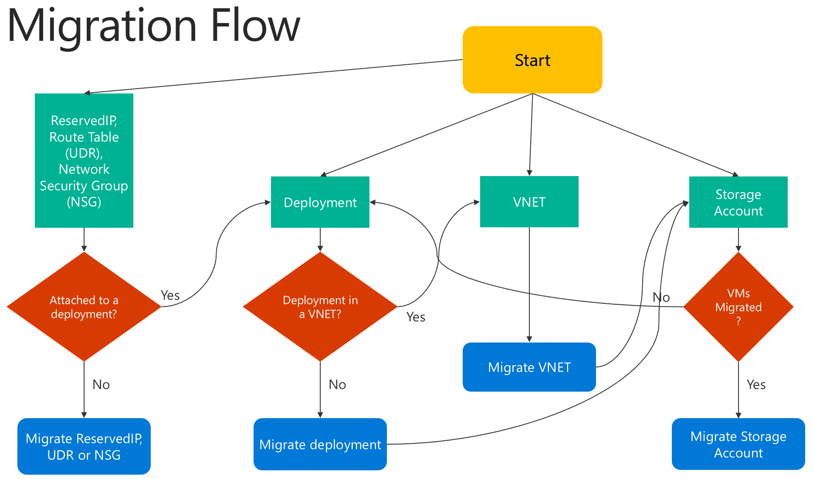

# Migrate IaaS resources from classic to Azure Resource Manager by using Azure CLI

**Applies to:** :heavy_check_mark: Linux VMs :heavy_check_mark: Windows VMs

> [!IMPORTANT]
> Today, about 90% of IaaS VMs are using [Azure Resource Manager](https://azure.microsoft.com/features/resource-manager/). As of February 28, 2020, classic VMs have been deprecated and will be fully retired on September 1, 2023. [Learn more]( https://aka.ms/classicvmretirement) about this deprecation and [how it affects you](classic-vm-deprecation.md#how-does-this-affect-me).

These steps show you how to use CLI commands to migrate infrastructure as a service (IaaS) resources from the classic deployment model to the Azure Resource Manager deployment model. The article requires the [Azure classic CLI](/cli/azure/install-classic-cli). Since Azure CLI only applies to Azure Resource Manager resources, it cannot be used for this migration.

> [!NOTE]
> All the operations described here are idempotent. If you have a problem other than an unsupported feature or a configuration error, we recommend that you retry the prepare, abort, or commit operation. The platform will then try the action again.
> 
> 

<br>
Here is a flowchart to identify the order in which steps need to be executed during a migration process



## Step 1: Prepare for migration
Here are a few best practices that we recommend as you evaluate migrating IaaS resources from classic to Resource Manager:

* Read through the [list of unsupported configurations or features](migration-classic-resource-manager-overview.md). If you have virtual machines that use unsupported configurations or features, we recommend that you wait for the feature/configuration support to be announced. Alternatively, you can remove that feature or move out of that configuration to enable migration if it suits your needs.
* If you have automated scripts that deploy your infrastructure and applications today, try to create a similar test setup by using those scripts for migration. Alternatively, you can set up sample environments by using the Azure portal.

> [!IMPORTANT]
> Application Gateways are not currently supported for migration from classic to Resource Manager. To migrate a classic virtual network with an Application gateway, remove the gateway before running a Prepare operation to move the network. After you complete the migration, reconnect the gateway in Azure Resource Manager. 
>
>ExpressRoute gateways connecting to ExpressRoute circuits in another subscription cannot be migrated automatically. In such cases, remove the ExpressRoute gateway, migrate the virtual network and recreate the gateway. Please see [Migrate ExpressRoute circuits and associated virtual networks from the classic to the Resource Manager deployment model](../expressroute/expressroute-migration-classic-resource-manager.md) for more information.
> 
> 

## Step 2: Set your subscription and register the provider
For migration scenarios, you need to set up your environment for both classic and Resource Manager. [Install the Azure classic CLI](/cli/azure/install-classic-cli) and [select your subscription](/cli/azure/authenticate-azure-cli).

Sign-in to your account.

```azurecli
azure login
```

Select the Azure subscription by using the following command.

```azurecli
azure account set "<azure-subscription-name>"
```

> [!NOTE]
> Registration is a one time step but it needs to be done once before attempting migration. Without registering you'll see the following error message 
> 
> *BadRequest : Subscription is not registered for migration.* 
> 
> 

Register with the migration resource provider by using the following command. Note that in some cases, this command times out. However, the registration will be successful.

```azurecli
azure provider register Microsoft.ClassicInfrastructureMigrate
```

Please wait five minutes for the registration to finish. You can check the status of the approval by using the following command. Make sure that RegistrationState is `Registered` before you proceed.

```azurecli
azure provider show Microsoft.ClassicInfrastructureMigrate
```

Now switch CLI to the `asm` mode.

```azurecli
azure config mode asm
```

## Step 3: Make sure you have enough Azure Resource Manager Virtual Machine vCPUs in the Azure region of your current deployment or VNET
For this step you'll need to switch to `arm` mode. Do this with the following command.

```azurecli
azure config mode arm
```

You can use the following CLI command to check the current number of vCPUs you have in Azure Resource Manager. To learn more about vCPU quotas, see [Limits and the Azure Resource Manager](../azure-resource-manager/management/azure-subscription-service-limits.md#managing-limits).

```azurecli
azure vm list-usage -l "<Your VNET or Deployment's Azure region"
```

Once you're done verifying this step, you can switch back to `asm` mode.

```azurecli
azure config mode asm
```

## Step 4: Option 1 - Migrate virtual machines in a cloud service
Get the list of cloud services by using the following command, and then pick the cloud service that you want to migrate. Note that if the VMs in the cloud service are in a virtual network or if they have web/worker roles, you will get an error message.

```azurecli
azure service list
```

Run the following command to get the deployment name for the cloud service from the verbose output. In most cases, the deployment name is the same as the cloud service name.

```azurecli
azure service show <serviceName> -vv
```

First, validate if you can migrate the cloud service using the following commands:

```shell
azure service deployment validate-migration <serviceName> <deploymentName> new "" "" ""
```

Prepare the virtual machines in the cloud service for migration. You have two options to choose from.

If you want to migrate the VMs to a platform-created virtual network, use the following command.

```azurecli
azure service deployment prepare-migration <serviceName> <deploymentName> new "" "" ""
```

If you want to migrate to an existing virtual network in the Resource Manager deployment model, use the following command.

```azurecli
azure service deployment prepare-migration <serviceName> <deploymentName> existing <destinationVNETResourceGroupName> <subnetName> <vnetName>
```

After the prepare operation is successful, you can look through the verbose output to get the migration state of the VMs and ensure that they are in the `Prepared` state.

```azurecli
azure vm show <vmName> -vv
```

Check the configuration for the prepared resources by using either CLI or the Azure portal. If you are not ready for migration and you want to go back to the old state, use the following command.

```azurecli
azure service deployment abort-migration <serviceName> <deploymentName>
```

If the prepared configuration looks good, you can move forward and commit the resources by using the following command.

```azurecli
azure service deployment commit-migration <serviceName> <deploymentName>
```

## Step 4: Option 2 -  Migrate virtual machines in a virtual network
Pick the virtual network that you want to migrate. Note that if the virtual network contains web/worker roles or VMs with unsupported configurations, you will get a validation error message.

Get all the virtual networks in the subscription by using the following command.

```azurecli
azure network vnet list
```

The output will look something like this:


In the above example, the **virtualNetworkName** is the entire name **"Group classicubuntu16 classicubuntu16"**.

First, validate if you can migrate the virtual network using the following command:

```shell
azure network vnet validate-migration <virtualNetworkName>
```

Prepare the virtual network of your choice for migration by using the following command.

```azurecli
azure network vnet prepare-migration <virtualNetworkName>
```

Check the configuration for the prepared virtual machines by using either CLI or the Azure portal. If you are not ready for migration and you want to go back to the old state, use the following command.

```azurecli
azure network vnet abort-migration <virtualNetworkName>
```

If the prepared configuration looks good, you can move forward and commit the resources by using the following command.

```azurecli
azure network vnet commit-migration <virtualNetworkName>
```

## Step 5: Migrate a storage account
Once you're done migrating the virtual machines, we recommend you migrate the storage account.

Prepare the storage account for migration by using the following command

```azurecli
azure storage account prepare-migration <storageAccountName>
```

Check the configuration for the prepared storage account by using either CLI or the Azure portal. If you are not ready for migration and you want to go back to the old state, use the following command.

```azurecli
azure storage account abort-migration <storageAccountName>
```

If the prepared configuration looks good, you can move forward and commit the resources by using the following command.

```azurecli
azure storage account commit-migration <storageAccountName>
```

## Next steps

* [Overview of platform-supported migration of IaaS resources from classic to Azure Resource Manager](migration-classic-resource-manager-overview.md)
* [Technical deep dive on platform-supported migration from classic to Azure Resource Manager](migration-classic-resource-manager-deep-dive.md)
* [Planning for migration of IaaS resources from classic to Azure Resource Manager](migration-classic-resource-manager-plan.md)
* [Use PowerShell to migrate IaaS resources from classic to Azure Resource Manager](migration-classic-resource-manager-ps.md)
* [Community tools for assisting with migration of IaaS resources from classic to Azure Resource Manager](migration-classic-resource-manager-community-tools.md)
* [Review most common migration errors](migration-classic-resource-manager-errors.md)
* [Review the most frequently asked questions about migrating IaaS resources from classic to Azure Resource Manager](migration-classic-resource-manager-faq.yml)
