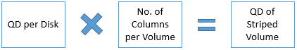

# Premium Storage: Design for high performance

**Applies to:** :heavy_check_mark: Linux VMs :heavy_check_mark: Windows VMs :heavy_check_mark: Flexible scale sets :heavy_check_mark: Uniform scale sets

This article provides guidelines for building high-performance applications by using the Azure Storage Premium tier (Premium Storage). You can use the instructions provided in this document combined with performance best practices applicable to technologies used by your application. To illustrate the guidelines, we use SQL Server running on Premium Storage as an example throughout this document.

While we address performance scenarios for the storage layer in this article, you need to optimize the application layer. For example, if you're hosting a SharePoint Farm on Premium Storage, you can use the SQL Server examples from this article to optimize the database server. You can also optimize the SharePoint Farm's web server and application server to get the most performance.

This article helps to answer the following common questions about optimizing application performance on Premium Storage:

* How can you measure your application performance?
* Why aren't you seeing expected high performance?
* Which factors influence your application performance on Premium Storage?
* How do these factors influence performance of your application on Premium Storage?
* How can you optimize for input/output operations per second (IOPS), bandwidth, and latency?

We provide these guidelines specifically for Premium Storage because workloads running on Premium Storage are highly performance sensitive. We provide examples where appropriate. You can also apply some of these guidelines to applications running on infrastructure as a service (IaaS) VMs with standard storage disks.

> [!NOTE]
> Sometimes what appears to be a disk performance issue is actually a network bottleneck. In these situations, you should optimize your [network performance](../virtual-network/virtual-network-optimize-network-bandwidth.md).
>
> If you're looking to benchmark your disk, see the following articles:
>
> * For Linux: [Benchmark your application on Azure Disk Storage](./disks-benchmarks.md)
> * For Windows: [Benchmark a disk](./disks-benchmarks.md)
>
> If your VM supports accelerated networking, make sure it's enabled. If it's not enabled, you can enable it on already deployed VMs on both [Windows](../virtual-network/create-vm-accelerated-networking-powershell.md#enable-accelerated-networking-on-existing-vms) and [Linux](../virtual-network/create-vm-accelerated-networking-cli.md#enable-accelerated-networking-on-existing-vms).

Before you begin, if you're new to Premium Storage, first read [Select an Azure disk type for IaaS VMs](disks-types.md) and [Scalability targets for premium page blob storage accounts](../storage/blobs/scalability-targets-premium-page-blobs.md).

## Application performance indicators

We assess whether an application is performing well or not by using performance indicators like:

* How fast an application is processing a user request.
* How much data an application is processing per request.
* How many requests an application is processing in a specific period of time.
* How long a user has to wait to get a response after submitting their request.

The technical terms for these performance indicators are IOPS, throughput or bandwidth, and latency.

In this section, we discuss the common performance indicators in the context of Premium Storage. In the section [Performance application checklist for disks](#performance-application-checklist-for-disks), you learn how to measure these performance indicators for your application. Later in [Optimize application performance](#optimize-application-performance), you learn about the factors that affect these performance indicators and recommendations to optimize them.

## IOPS

IOPS is the number of requests that your application is sending to storage disks in one second. An input/output operation could be read or write, sequential, or random. Online transaction processing (OLTP) applications like an online retail website need to process many concurrent user requests immediately. The user requests are insert- and update-intensive database transactions, which the application must process quickly. For this reason, OLTP applications require very high IOPS.

OLTP applications handle millions of small and random I/O requests. If you have such an application, you must design the application infrastructure to optimize for IOPS. For more information on all the factors to consider to get high IOPS, see [Optimize application performance](#optimize-application-performance).

When you attach a premium storage disk to your high-scale VM, Azure provisions for you a guaranteed number of IOPS according to the disk specification. For example, a P50 disk provisions 7,500 IOPS. Each high-scale VM size also has a specific IOPS limit that it can sustain. For example, a Standard GS5 VM has an 80,000 IOPS limit.

## Throughput

Throughput, or bandwidth, is the amount of data that your application is sending to the storage disks in a specified interval. If your application is performing input/output operations with large I/O unit sizes, it requires high throughput. Data warehouse applications tend to issue scan-intensive operations that access large portions of data at a time and commonly perform bulk operations. In other words, such applications require higher throughput. If you have such an application, you must design its infrastructure to optimize for throughput. In the next section, we discuss the factors you must tune to achieve this optimization.

When you attach a premium storage disk to a high-scale VM, Azure provisions throughput according to that disk specification. For example, a P50 disk provisions 250 MB/sec disk throughput. Each high-scale VM size also has a specific throughput limit that it can sustain. For example, Standard GS5 VM has a maximum throughput of 2,000 MB/sec.

There's a relation between throughput and IOPS, as shown in the following formula.

It's important to determine the optimal throughput and IOPS values that your application requires. As you try to optimize one, the other is also affected. For more information about optimizing IOPS and throughput, see [Optimize application performance](#optimize-application-performance).

## Latency

Latency is the time it takes an application to receive a single request, send it to storage disks, and send the response to the client. Latency is a critical measure of an application's performance in addition to IOPS and throughput. The latency of a premium storage disk is the time it takes to retrieve the information for a request and communicate it back to your application. Premium Storage provides consistently low latencies. Premium Disks are designed to provide single-digit millisecond latencies for most I/O operations. If you enable **ReadOnly** host caching on premium storage disks, you can get much lower read latency. For more information on disk caching, see [Disk caching](#disk-caching).

When you optimize your application to get higher IOPS and throughput, it affects the latency of your application. After you tune the application performance, always evaluate the latency of the application to avoid unexpected high latency behavior.

The following control plane operations on managed disks might involve movement of the disk from one storage location to another. This movement is orchestrated via the background copy of data, which can take several hours to complete. Typically, the time is less than 24 hours depending on the amount of data in the disks. During that time, your application can experience higher than usual read latency because some reads can get redirected to the original location and take longer to complete.

There's no effect on write latency during this period. For Premium SSD v2 and Ultra Disks, if the disk has a 4K sector size, it experiences higher read latency. If the disk has a 512e sector size, it experiences both higher read and write latency.

Control plane operations are used to:

- Update the storage type.
- Detach and attach a disk from one VM to another.
- Create a managed disk from a VHD.
- Create a managed disk from a snapshot.
- Convert unmanaged disks to managed disks.

## Performance application checklist for disks

The first step in designing high-performance applications running on Premium Storage is understanding the performance requirements of your application. After you gather performance requirements, you can optimize your application to achieve the most optimal performance.

In the previous section, we explained the common performance indicators: IOPS, throughput, and latency. You must identify which of these performance indicators are critical to your application to deliver the desired user experience. For example, high IOPS matters most to OLTP applications processing millions of transactions in a second. High throughput is critical for data warehouse applications processing large amounts of data in a second. Extremely low latency is crucial for real-time applications like live video-streaming websites.

Next, measure the maximum performance requirements of your application throughout its lifetime. Use the following sample checklist as a start. Record the maximum performance requirements during normal, peak, and off-hour workload periods. By identifying requirements for all workload levels, you can determine the overall performance requirement of your application.

For example, the normal workload of an e-commerce website is the transactions it serves during most days in a year. The peak workload of the website is the transactions it serves during holiday seasons or special sale events. The peak workload is typically experienced for a limited period but can require your application to scale two or more times its normal operation. Find out the 50 percentile, 90 percentile, and 99 percentile requirements. This information helps filter out any outliers in the performance requirements, and you can focus your efforts on optimizing for the right values.

## Application performance requirements checklist

| Performance requirements | 50 percentile | 90 percentile | 99 percentile |
| --- | --- | --- | --- |
| Maximum transactions per second | | | |
| % Read operations | | | |
| % Write operations | | | |
| % Random operations | | | |
| % Sequential operations | | | |
| I/O request size | | | |
| Average throughput | | | |
| Maximum throughput | | | |
| Minimum latency | | | |
| Average latency | | | |
| Maximum CPU | | | |
| Average CPU | | | |
| Maximum memory | | | |
| Average memory | | | |
| Queue depth | | | |

> [!NOTE]
> Consider scaling these numbers based on expected future growth of your application. It's a good idea to plan for growth ahead of time because it could be harder to change the infrastructure for improving performance later.

If you have an existing application and want to move to Premium Storage, first build the preceding checklist for the existing application. Then, build a prototype of your application on Premium Storage and design the application based on guidelines described in [Optimize application performance](#optimize-application-performance). The next article describes the tools you can use to gather the performance measurements.

### Counters to measure application performance requirements

The best way to measure performance requirements of your application is to use `PerfMon`-monitoring tools provided by the operating system of the server. You can use `PerfMon` for Windows and `iostat` for Linux. These tools capture counters corresponding to each measure explained in the preceding section. You must capture the values of these counters when your application is running its normal, peak, and off-hour workloads.

The `PerfMon` counters are available for processor, memory, and each logical disk and physical disk of your server. When you use premium storage disks with a VM, the physical disk counters are for each premium storage disk, and logical disk counters are for each volume created on the premium storage disks. You must capture the values for the disks that host your application workload. If there's a one-to-one mapping between logical and physical disks, you can refer to physical disk counters. Otherwise, refer to the logical disk counters.

On Linux, the `iostat` command generates a CPU and disk utilization report. The disk utilization report provides statistics per physical device or partition. If you have a database server with its data and logs on separate disks, collect this data for both disks. The following table describes counters for disks, processors, and memory.

| Counter | Description | PerfMon | iostat |
| --- | --- | --- | --- |
| IOPS or transactions/sec |Number of I/O requests issued to the storage disk/sec |Disk reads/sec   Disk writes/sec |tps   r/s   w/s |
| Disk reads and writes |% of read and write operations performed on the disk |% Disk read time   % Disk write time |r/s   w/s |
| Throughput |Amount of data read from or written to the disk/sec |Disk read bytes/sec   Disk write bytes/sec |kB_read/s   kB_wrtn/s |
| Latency |Total time to complete a disk I/O request |Average disk sec/read   Average disk sec/write |await   svctm |
| I/O size |The size of I/O request issues to the storage disks |Average disk bytes/read   Average disk bytes/write |avgrq-sz |
| Queue depth |Number of outstanding I/O requests waiting to be read from or written to the storage disk |Current disk queue length |avgqu-sz |
| Maximum memory |Amount of memory required to run the application smoothly |% Committed bytes in use |Use vmstat |
| Maximum CPU |Amount of CPU required to run the application smoothly |% Processor time |%util |

Learn more about [iostat](https://linux.die.net/man/1/iostat) and [PerfMon](/windows/win32/perfctrs/performance-counters-portal).

## Optimize application performance

The main factors that influence performance of an application running on Premium Storage are the nature of I/O requests, VM size, disk size, number of disks, disk caching, multithreading, and queue depth. You can control some of these factors with knobs provided by the system.

Most applications might not give you an option to alter the I/O size and queue depth directly. For example, if you're using SQL Server, you can't choose the I/O size and queue depth. SQL Server chooses the optimal I/O size and queue depth values to get the most performance. It's important to understand the effects of both types of factors on your application performance so that you can provision appropriate resources to meet performance needs.

Throughout this section, refer to the application requirements checklist that you created to identify how much you need to optimize your application performance. Based on the checklist, you can determine which factors from this section you need to tune.

To witness the effects of each factor on your application performance, run benchmarking tools on your application setup. For steps to run common benchmarking tools on Windows and Linux VMs, see the benchmarking articles at the end of this document.

### Optimize IOPS, throughput, and latency at a glance

The following table summarizes performance factors and the steps necessary to optimize IOPS, throughput, and latency. The sections following this summary describe each factor in more depth.

For more information on VM sizes and on the IOPS, throughput, and latency available for each type of VM, see [Sizes for virtual machines in Azure](sizes.md).

| Performance factors | IOPS | Throughput | Latency |
| --- | --- | --- | --- |
| Example scenario |Enterprise OLTP application requiring very high transactions per second rate. |Enterprise Data warehousing application processing large amounts of data. |Near real-time applications requiring instant responses to user requests, like online gaming. |
| Performance factors | &nbsp; | &nbsp; | &nbsp; |
| I/O size |Smaller I/O size yields higher IOPS. |Larger I/O size yields higher throughput. | &nbsp;|
| VM size |Use a VM size that offers IOPS greater than your application requirement. |Use a VM size with a throughput limit greater than your application requirement. |Use a VM size that offers scale limits greater than your application requirement. |
| Disk size |Use a disk size that offers IOPS greater than your application requirement. |Use a disk size with a throughput limit greater than your application requirement. |Use a disk size that offers scale limits greater than your application requirement. |
| VM and disk scale limits |IOPS limit of the VM size chosen should be greater than the total IOPS driven by the storage disks attached to it. |Throughput limit of the VM size chosen should be greater than the total throughput driven by the premium storage disks attached to it. |Scale limits of the VM size chosen must be greater than the total scale limits of the attached premium storage disks. |
| Disk caching |Enable **ReadOnly** cache on premium storage disks with read-heavy operations to get higher read IOPS. | &nbsp; |Enable **ReadOnly** cache on premium storage disks with read-heavy operations to get very low read latencies. |
| Disk striping |Use multiple disks and stripe them together to get a combined higher IOPS and throughput limit. The combined limit per VM should be higher than the combined limits of attached premium disks. | &nbsp; | &nbsp; |
| Stripe size |Smaller stripe size for random small I/O pattern seen in OLTP applications. For example, use a 64-KB stripe size for a SQL Server OLTP application. |Larger stripe size for sequential large I/O pattern seen in data warehouse applications. For example, use a 256-KB stripe size for a SQL Server data warehouse application. | &nbsp; |
| Multithreading |Use multithreading to push a higher number of requests to Premium Storage to lead to higher IOPS and throughput. For example, on SQL Server, set a high MAXDOP value to allocate more CPUs to SQL Server. | &nbsp; | &nbsp; |
| Queue depth |Larger queue depth yields higher IOPS. |Larger queue depth yields higher throughput. |Smaller queue depth yields lower latencies. |

## Nature of I/O requests

An I/O request is a unit of input/output operation that your application is performing. Identifying the nature of I/O requests, random or sequential, read or write, small or large, helps you determine the performance requirements of your application. It's important to understand the nature of I/O requests to make the right decisions when you design your application infrastructure. I/Os must be distributed evenly to achieve the best performance possible.

I/O size is one of the more important factors. The I/O size is the size of the input/output operation request generated by your application. The I/O size affects performance significantly, especially on the IOPS and bandwidth that the application can achieve. The following formula shows the relationship between IOPS, I/O size, and bandwidth/throughput.
    

Some applications allow you to alter their I/O size, while some applications don't. For example, SQL Server determines the optimal I/O size itself and doesn't provide users with any knobs to change it. On the other hand, Oracle provides a parameter called [DB\_BLOCK\_SIZE](https://docs.oracle.com/cd/B19306_01/server.102/b14211/iodesign.htm#i28815), which you can use to configure the I/O request size of the database.

If you're using an application, which doesn't allow you to change the I/O size, use the guidelines in this article to optimize the performance KPI that's most relevant to your application. For example:

* An OLTP application generates millions of small and random I/O requests. To handle these types of I/O requests, you must design your application infrastructure to get higher IOPS.
* A data warehousing application generates large and sequential I/O requests. To handle these types of I/O requests, you must design your application infrastructure to get higher bandwidth or throughput.

If you're using an application that allows you to change the I/O size, use this rule of thumb for the I/O size in addition to other performance guidelines:

* Smaller I/O size to get higher IOPS. For example, 8 KB for an OLTP application.
* Larger I/O size to get higher bandwidth/throughput. For example, 1,024 KB for a data warehouse application.

Here's an example of how you can calculate the IOPS and throughput/bandwidth for your application.

Consider an application that uses a P30 disk. The maximum IOPS and throughput/bandwidth a P30 disk can achieve is 5,000 IOPS and 200 MB/sec, respectively. If your application requires the maximum IOPS from the P30 disk and you use a smaller I/O size, like 8 KB, the resulting bandwidth you can get is 40 MB/sec. If your application requires the maximum throughput/bandwidth from a P30 disk and you use a larger I/O size, like 1,024 KB, the resulting IOPS is less, such as 200 IOPS.

Tune the I/O size so that it meets both your application's IOPS and throughput/bandwidth requirement. The following table summarizes the different I/O sizes and their corresponding IOPS and throughput for a P30 disk.

| Application requirement | I/O size | IOPS | Throughput/Bandwidth |
| --- | --- | --- | --- |
| Maximum IOPS |8 KB |5,000 |40 MB/sec |
| Maximum throughput |1,024 KB |200 |200 MB/sec |
| Maximum throughput + high IOPS |64 KB |3,200 |200 MB/sec |
| Maximum IOPS + high throughput |32 KB |5,000 |160 MB/sec |

To get IOPS and bandwidth higher than the maximum value of a single premium storage disk, use multiple premium disks striped together. For example, stripe two P30 disks to get a combined IOPS of 10,000 IOPS or a combined throughput of 400 MB/sec. As explained in the next section, you must use a VM size that supports the combined disk IOPS and throughput.

> [!NOTE]
> As you increase either IOPS or throughput, the other also increases. Make sure you don't hit throughput or IOPS limits of the disk or VM when you increase either one.

To witness the effects of I/O size on application performance, you can run benchmarking tools on your VM and disks. Create multiple test runs and use different I/O size for each run to see the effect. For more information, see the benchmarking articles at the end of this document.

## High-scale VM sizes

When you start designing an application, one of the first things to do is choose a VM to host your application. Premium Storage comes with high-scale VM sizes that can run applications requiring higher compute power and a high local disk I/O performance. These VMs provide faster processors, a higher memory-to-core ratio, and a solid-state drive (SSD) for the local disk. Examples of high-scale VMs supporting Premium Storage are the DS and GS series VMs.

High-scale VMs are available in different sizes with a different number of CPU cores, memory, OS, and temporary disk size. Each VM size also has a maximum number of data disks that you can attach to the VM. The chosen VM size affects how much processing, memory, and storage capacity are available for your application. It also affects the compute and storage cost. For example, the following specifications are for the largest VM size in a DS series and a GS series.

| VM size | CPU cores | Memory | VM disk sizes | Maximum data disks | Cache size | IOPS | Bandwidth cache I/O limits |
| --- | --- | --- | --- | --- | --- | --- | --- |
| Standard_DS14 |16 |112 GB |OS = 1,023 GB   Local SSD = 224 GB |32 |576 GB |50,000 IOPS   512 MB/sec |4,000 IOPS and 33 MB/sec |
| Standard_GS5 |32 |448 GB |OS = 1,023 GB   Local SSD = 896 GB |64 |4224 GB |80,000 IOPS   2,000 MB/sec |5,000 IOPS and 50 MB/sec |

To view a complete list of all available Azure VM sizes, see [Sizes for virtual machines in Azure](sizes.md). Choose a VM size that can meet and scale to your desired application performance requirements. Also take into account the following important considerations when you choose VM sizes.

### Scale limits

The maximum IOPS limits per VM and per disk are different and independent of each other. Make sure that the application is driving IOPS within the limits of the VM and the premium disks attached to it. Otherwise, application performance experiences throttling.

As an example, suppose an application requirement is a maximum of 4,000 IOPS. To achieve this level, you provision a P30 disk on a DS1 VM. The P30 disk can deliver up to 5,000 IOPS. However, the DS1 VM is limited to 3,200 IOPS. So, the application performance is constrained by the VM limit at 3,200 IOPS and performance is degraded. To prevent this situation, choose a VM and disk size that both meet application requirements.

### Cost of operation

In many cases, it's possible that your overall cost of operation using Premium Storage is lower than using Standard Storage.

For example, consider an application requiring 16,000 IOPS. To achieve this performance, you need a Standard\_D14 Azure IaaS VM, which can give a maximum IOPS of 16,000 by using 32 standard storage 1-TB disks. Each 1-TB standard storage disk can achieve a maximum of 500 IOPS. The estimated cost of this VM per month is $1,570. The monthly cost of 32 standard storage disks is $1,638. The estimated total monthly cost is $3,208.

If you hosted the same application on Premium Storage, you need a smaller VM size and fewer premium storage disks, reducing the overall cost. A Standard\_DS13 VM can meet the 16,000 IOPS requirement by using four P30 disks. The DS13 VM has a maximum IOPS of 25,600, and each P30 disk has a maximum IOPS of 5,000. Overall, this configuration can achieve 5,000 x 4 = 20,000 IOPS. The estimated cost of this VM per month is $1,003. The monthly cost of four P30 premium storage disks is $544.34. The estimated total monthly cost is $1,544.

The following table summarizes the cost breakdown of this scenario for Standard and Premium Storage.

| Monthly cost | Standard | Premium |
| --- | --- | --- |
| Cost of VM per month |$1,570.58 (Standard\_D14) |$1,003.66 (Standard\_DS13) |
| Cost of disks per month |$1,638.40 (32 x 1-TB disks) |$544.34 (4 x P30 disks) |
| Overall cost per month |$3,208.98 |$1,544.34 |

### Linux distros

With Premium Storage, you get the same level of performance for VMs running Windows and Linux. We support many flavors of Linux distros. For more information, see [Linux distributions endorsed on Azure](linux/endorsed-distros.md).

Different distros are better suited for different types of workloads. You see different levels of performance depending on the distro on which your workload is running. Test the Linux distros with your application and choose the one that works best.

When you run Linux with Premium Storage, check the latest updates about required drivers to ensure high performance.

## Premium Storage disk sizes

Premium Storage offers various sizes so you can choose one that best suits your needs. Each disk size has a different scale limit for IOPS, bandwidth, and storage. Choose the right premium storage disk size depending on the application requirements and the high-scale VM size. The following table shows the disks sizes and their capabilities. P4, P6, P15, P60, P70, and P80 sizes are currently only supported for managed disks.

[!INCLUDE [disk-storage-premium-ssd-sizes](../../includes/disk-storage-premium-ssd-sizes.md)]

How many disks you choose depends on the disk size chosen. You could use a single P50 disk or multiple P10 disks to meet your application requirement. Take into account considerations listed here when you're making the choice.

### Scale limits (IOPS and throughput)

The IOPS and throughput limits of each premium disk size is different and independent from the VM scale limits. Make sure that the total IOPS and throughput from the disks are within scale limits of the chosen VM size.

For example, if an application requirement is a maximum of 250 MB/sec throughput and you're using a DS4 VM with a single P30 disk, the DS4 VM can give up to 256 MB/sec throughput. However, a single P30 disk has a throughput limit of 200 MB/sec. So, the application is constrained at 200 MB/sec because of the disk limit. To overcome this limit, provision more than one data disk to the VM or resize your disks to P40 or P50.

> [!NOTE]
> Reads served by the cache aren't included in the disk IOPS and throughput, so they aren't subject to disk limits. Cache has its separate IOPS and throughput limit per VM.
>
> For example, initially your reads and writes are 60 MB/sec and 40 MB/sec, respectively. Over time, the cache warms up and serves more and more of the reads from the cache. Then, you can get higher write throughput from the disk.

### Number of disks

Determine the number of disks you need by assessing application requirements. Each VM size also has a limit on the number of disks that you can attach to the VM. Typically, this amount is twice the number of cores. Ensure that the VM size you choose can support the number of disks needed.

Remember, the premium storage disks have higher performance capabilities compared to standard storage disks. If you're migrating your application from an Azure IaaS VM using Standard Storage to Premium Storage, you likely need fewer premium disks to achieve the same or higher performance for your application.

## Disk caching

High-scale VMs that use Premium Storage have a multitier caching technology called **BlobCache**. **BlobCache** uses a combination of the host RAM and local SSD for caching. This cache is available for the Premium Storage persistent disks and the VM local disks. By default, this cache setting is set to **ReadWrite** for OS disks and **ReadOnly** for data disks hosted on Premium Storage. With disk caching enabled on the premium storage disks, the high-scale VMs can achieve extremely high levels of performance that exceed the underlying disk performance.

> [!WARNING]
> Disk caching isn't supported for disks 4 TiB and larger. If multiple disks are attached to your VM, each disk that's smaller than 4 TiB supports caching.
>
> Changing the cache setting of an Azure disk detaches and reattaches the target disk. If it's the operating system disk, the VM is restarted. Stop all applications and services that might be affected by this disruption before you change the disk cache setting. Not following those recommendations could lead to data corruption.

To learn more about how **BlobCache** works, see the Inside [Azure Premium Storage](https://azure.microsoft.com/blog/azure-premium-storage-now-generally-available-2/) blog post.

It's important to enable caching on the right set of disks. Whether you should enable disk caching on a premium disk or not depends on the workload pattern that disk is handling. The following table shows the default cache settings for OS and data disks.

| Disk type | Default cache setting |
| --- | --- |
| OS disk |ReadWrite |
| Data disk |ReadOnly |

We recommend the following disk cache settings for data disks.

| Disk caching setting | Recommendation for when to use this setting |
| --- | --- |
| None |Configure host-cache as **None** for write-only and write-heavy disks. |
| ReadOnly |Configure host-cache as **ReadOnly** for read-only and read-write disks. |
| ReadWrite |Configure host-cache as **ReadWrite** only if your application properly handles writing cached data to persistent disks when needed. |

### ReadOnly

By configuring **ReadOnly** caching on premium storage data disks, you can achieve low read latency and get very high read IOPS and throughput for your application for two reasons:

1. Reads performed from cache, which is on the VM memory and local SSD, are faster than reads from the data disk, which is on Azure Blob Storage.
1. Premium Storage doesn't count the reads served from the cache toward the disk IOPS and throughput. For this reason, your application can achieve higher total IOPS and throughput.

### ReadWrite

By default, the OS disks have **ReadWrite** caching enabled. We recently added support for **ReadWrite** caching on data disks too. If you're using **ReadWrite** caching, you must have a proper way to write the data from cache to persistent disks. For example, SQL Server handles writing cached data to the persistent storage disks on its own. Using **ReadWrite** cache with an application that doesn't handle persisting the required data can lead to data loss, if the VM crashes.

### None

Currently, **None** is only supported on data disks. It isn't supported on OS disks. If you set **None** on an OS disk, it overrides this setting internally and sets it to **ReadOnly**.

As an example, you can apply these guidelines to SQL Server running on Premium Storage by following these steps:

1. Configure the **ReadOnly** cache on premium storage disks hosting data files
   1. The fast reads from cache lower the SQL Server query time because data pages are retrieved faster from the cache compared to directly from the data disks.
   1. Serving reads from cache means there's more throughput available from premium data disks. SQL Server can use this extra throughput toward retrieving more data pages and other operations like backup/restore, batch loads, and index rebuilds.
1. Configure the **None** cache on premium storage disks hosting the log files.
   1. Log files have primarily write-heavy operations, so they don't benefit from the **ReadOnly** cache.

## Optimize performance on Linux VMs

For all Premium SSDs or Ultra Disks, you might be able to disable *barriers* for file systems on the disk to improve performance when it's known that there are no caches that could lose data. If Azure disk caching is set to **ReadOnly** or **None**, you can disable barriers. But if caching is set to **ReadWrite**, barriers should remain enabled to ensure write durability. Barriers are typically enabled by default, but you can disable barriers by using one of the following methods depending on the file system type:

* **reiserFS**: Use the **barrier=none** mount option to disable barriers. To explicitly enable barriers, use **barrier=flush**.
* **ext3/ext4**: Use the **barrier=0** mount option to disable barriers. To explicitly enable barriers, use **barrier=1**.
* **XFS**: Use the **nobarrier** mount option to disable barriers. To explicitly enable barriers, use **barrier**. As of version 4.10 of the mainline Linux kernel, the design of the XFS file system always ensures durability. Disabling barriers has no effect and the **nobarrier** option is deprecated. However, some Linux distributions might have backported the changes to a distribution release with an earlier kernel version. Check with your distribution vendor for the status in the distribution and version that you're running.

## Disk striping

When a high-scale VM is attached with several premium storage persistent disks, the disks can be striped together to aggregate their IOPs, bandwidth, and storage capacity.

On Windows, you can use Storage Spaces to stripe disks together. You must configure one column for each disk in a pool. Otherwise, the overall performance of striped volume can be lower than expected because of uneven distribution of traffic across the disks.

By using the Server Manager UI, you can set the total number of columns up to `8` for a striped volume. When you're attaching more than eight disks, use PowerShell to create the volume. By using PowerShell, you can set the number of columns equal to the number of disks. For example, if there are 16 disks in a single stripe set, specify `16` columns in the `NumberOfColumns` parameter of the `New-VirtualDisk` PowerShell cmdlet.

On Linux, use the MDADM utility to stripe disks together. For steps on how to stripe disks on Linux, see [Configure Software RAID on Linux](/previous-versions/azure/virtual-machines/linux/configure-raid).

### Stripe size

An important configuration in disk striping is the stripe size. The stripe size or block size is the smallest chunk of data that an application can address on a striped volume. The stripe size you configure depends on the type of application and its request pattern. If you choose the wrong stripe size, it could lead to I/O misalignment, which leads to degraded performance of your application.

For example, if an I/O request generated by your application is bigger than the disk stripe size, the storage system writes it across stripe unit boundaries on more than one disk. When it's time to access that data, it has to seek across more than one stripe unit to complete the request. The cumulative effect of such behavior can lead to substantial performance degradation. On the other hand, if the I/O request size is smaller than the stripe size, and if it's random in nature, the I/O requests might add up on the same disk, causing a bottleneck and ultimately degrading the I/O performance.

Depending on the type of workload your application is running, choose an appropriate stripe size. For random small I/O requests, use a smaller stripe size. For large sequential I/O requests, use a larger stripe size. Find out the stripe size recommendations for the application you'll be running on Premium Storage. For SQL Server, configure a stripe size of 64 KB for OLTP workloads and 256 KB for data warehousing workloads. For more information, see [Performance best practices for SQL Server on Azure VMs](/azure/azure-sql/virtual-machines/windows/performance-guidelines-best-practices-checklist).

> [!NOTE]
> You can stripe together a maximum of 32 premium storage disks on a DS series VM and 64 premium storage disks on a GS series VM.

## Multithreading

Azure designed the Premium Storage platform to be massively parallel. For this reason, a multithreaded application achieves higher performance than a single-threaded application. A multithreaded application splits up its tasks across multiple threads and increases efficiency of its execution by utilizing the VM and disk resources to the maximum.

For example, if your application is running on a single core VM using two threads, the CPU can switch between the two threads to achieve efficiency. While one thread is waiting on a disk I/O to complete, the CPU can switch to the other thread. In this way, two threads can accomplish more than a single thread would. If the VM has more than one core, it further decreases running time because each core can run tasks in parallel.

You might not be able to change the way an off-the-shelf application implements single threading or multithreading. For example, SQL Server is capable of handling multi-CPU and multicore. However, SQL Server decides under what conditions it uses one or more threads to process a query. It can run queries and build indexes by using multithreading. For a query that involves joining large tables and sorting data before returning to the user, SQL Server likely uses multiple threads. A user can't control whether SQL Server runs a query by using a single thread or multiple threads.

There are configuration settings that you can alter to influence the multithreading or parallel processing of an application. For example, for SQL Server it's the `max degree of parallelism` configuration. This setting called MAXDOP allows you to configure the maximum number of processors SQL Server can use when parallel processing. You can configure MAXDOP for individual queries or index operations. This capability is beneficial when you want to balance resources of your system for a performance critical application.

For example, say your application that's using SQL Server is running a large query and an index operation at the same time. Let's assume that you wanted the index operation to be more performant compared to the large query. In such a case, you can set the MAXDOP value of the index operation to be higher than the MAXDOP value for the query. This way, SQL Server has more processors than it can use for the index operation compared to the number of processors it can dedicate to the large query. Remember, you don't control the number of threads that SQL Server uses for each operation. You can control the maximum number of processors being dedicated for multithreading.

Learn more about [degrees of parallelism](/previous-versions/sql/sql-server-2008-r2/ms188611(v=sql.105)) in SQL Server. Find out how such settings influence multithreading in your application and their configurations to optimize performance.

## Queue depth

The queue depth or queue length or queue size is the number of pending I/O requests in the system. The value of queue depth determines how many I/O operations your application can line up, which the storage disks process. It affects all three application performance indicators discussed in this article: IOPS, throughput, and latency.

Queue depth and multithreading are closely related. The queue depth value indicates how much multithreading can be achieved by the application. If the queue depth is large, the application can run more operations concurrently, in other words, more multithreading. If the queue depth is small, even though the application is multithreaded, it won't have enough requests lined up for concurrent execution.

Typically, off-the-shelf applications don't allow you to change queue depth, because if it's set incorrectly, it does more harm than good. Applications set the right value of queue depth to get the optimal performance. It's important to understand this concept so that you can troubleshoot performance issues with your application. You can also observe the effects of queue depth by running benchmarking tools on your system.

Some applications provide settings to influence the queue depth. For example, the MAXDOP setting in SQL Server explained in the previous section. MAXDOP is a way to influence queue depth and multithreading, although it doesn't directly change the queue depth value of SQL Server.

### High queue depth

A high queue depth lines up more operations on the disk. The disk knows the next request in its queue ahead of time. So, the disk can schedule operations ahead of time and process them in an optimal sequence. Because the application is sending more requests to the disk, the disk can process more parallel I/Os. Ultimately, the application can achieve higher IOPS. Because the application is processing more requests, the total throughput of the application also increases.

Typically, an application can achieve maximum throughput with 8 to 16+ outstanding I/Os per attached disk. If a queue depth is one, the application isn't pushing enough I/Os to the system, and it processes a smaller amount in a given period. In other words, less throughput.

For example, in SQL Server, setting the MAXDOP value for a query to `4` informs SQL Server that it can use up to four cores to run the query. SQL Server determines the best queue depth value and the number of cores for the query execution.

### Optimal queue depth

A very high queue depth value also has its drawbacks. If the queue depth value is too high, the application tries to drive very high IOPS. Unless the application has persistent disks with sufficient provisioned IOPS, a very high queue depth value can negatively affect application latencies. The following formula shows the relationship between IOPS, latency, and queue depth.

You shouldn't configure queue depth to any high value, but to an optimal value, which can deliver enough IOPS for the application without affecting latencies. For example, if the application latency needs to be 1 millisecond, the queue depth required to achieve 5,000 IOPS is QD = 5,000 x 0.001 = 5.

### Queue depth for striped volume

For a striped volume, maintain a high-enough queue depth so that every disk has a peak queue depth individually. For example, consider an application that pushes a queue depth of `2` and there are four disks in the stripe. The two I/O requests go to two disks and the remaining two disks are idle. Therefore, configure the queue depth so that all the disks can be busy. The following formula shows how to determine the queue depth of striped volumes.

## Throttling

Premium Storage provisions a specified number of IOPS and throughput depending on the VM sizes and disk sizes you choose. Anytime your application tries to drive IOPS or throughput above these limits of what the VM or disk can handle, Premium Storage throttles it. The result is degraded performance in your application, which can mean higher latency, lower throughput, or lower IOPS.

If Premium Storage doesn't throttle, your application could completely fail by exceeding what its resources are capable of achieving. To avoid performance issues because of throttling, always provision sufficient resources for your application. Take into consideration what we discussed in the previous VM sizes and disk sizes sections. Benchmarking is the best way to figure out what resources you need to host your application.

## Next steps

If you're looking to benchmark your disk, see the following articles:

* For Linux: [Benchmark your application on Azure Disk Storage](./disks-benchmarks.md)
* For Windows: [Benchmark a disk](./disks-benchmarks.md)

Learn more about the available disk types:

* For Linux: [Select a disk type](disks-types.md)
* For Windows: [Select a disk type](disks-types.md)

For SQL Server users, see the articles on performance best practices for SQL Server:

* [Performance best practices for SQL Server in Azure VMs](/azure/azure-sql/virtual-machines/windows/performance-guidelines-best-practices-checklist)
* [Azure Premium Storage provides highest performance for SQL Server in Azure VM](https://cloudblogs.microsoft.com/sqlserver/2015/04/23/azure-premium-storage-provides-highest-performance-for-sql-server-in-azure-vm/)
