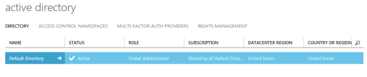
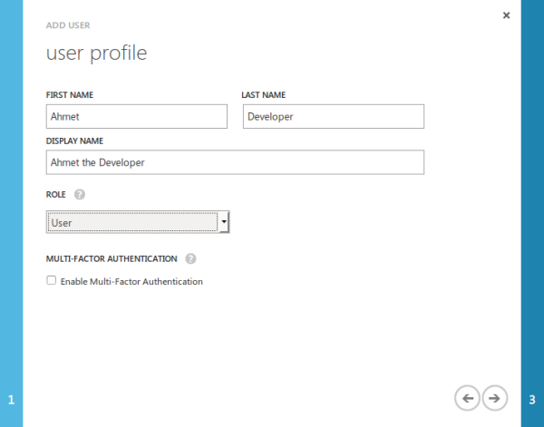
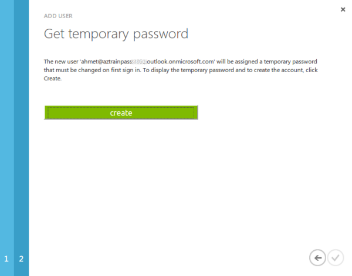
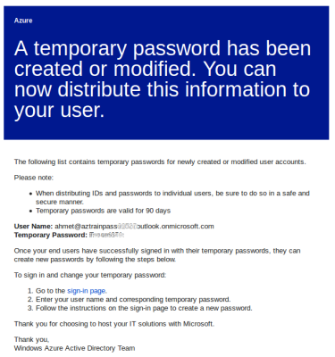
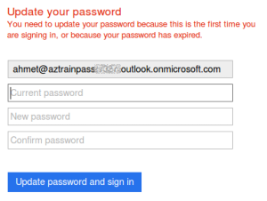
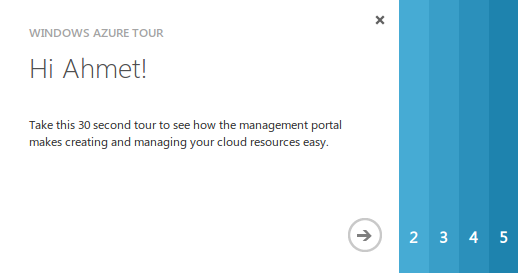

<properties
   pageTitle="Creating a Work or School identity in Azure Active Directory"
   description="Describes how to create a work or school identity from your personal identity to use with resource group templates or role-based access, among other features."
   services="virtual-machines"
   documentationCenter=""
   authors="squillace"
   manager="timlt"
   editor=""/>

<tags
   ms.service="virtual-machines"
   ms.devlang="na"
   ms.topic="article"
   ms.tgt_pltfrm="na"
   ms.workload="infrastructure"
   ms.date="09/01/2015"
   ms.author="rasquill"/>

# Creating a Work or School identity in Azure Active Directory

If you created a personal Azure account or have a personal MSDN subscription and created the Azure account to take advantage of the MSDN Azure credits -- you used a *Microsoft account* identity to create it. Many great features of Azure -- [resource group templates](../resource-group-overview.md) is one example -- require a work or school account (an identity managed by Azure Active Directory) to work.

Fortunately, one of the best things about your personal Azure account is that it comes with a default Azure Active Directory domain that you can use to create a new work or school account that you can use with Azure features that require it.

> [AZURE.NOTE] If you were given a user name and password by an administrator, there's a good chance that you already have a work or school ID (also sometimes called an *organizational ID*). If so, you can immediately begin to use your Azure account to access Azure resources that require one. If you find that you cannot use those resources, you may need to return to this article for help. For more information, see [Accounts that you can use for sign in](https://msdn.microsoft.com/library/azure/dn629581.aspx#BKMK_SignInAccounts) and [How an Azure subscription is related to Azure AD](https://msdn.microsoft.com/library/azure/dn629581.aspx#BKMK_SubRelationToDir).

The steps are simple. You need to locate your signed on identity in the Azure portal, discover your default Azure Active Directory domain, and add a new user to it as an Azure co-administrator.

## Locate your default directory in the Azure Portal

Start by logging in to the [Azure portal](https://manage.windowsazure.com) with your personal Microsoft account identity. After you are logged in, scroll down the blue panel on the left side and click **ACTIVE DIRECTORY**.

Let's start by finding some information about your identity in Azure. You should see something like the following in the main pane, showing that you have one default directory.

Let's find out some more information about it. Click the default directory row, which brings you into the default directory properties.  

To view the default domain name, click **DOMAINS**.

Here you should be able to see that when the Azure account was created, Azure Active Directory created a personal default domain that is a hash value (a number generated from a string of text) of your personal ID used as a subdomain of onmicrosoft.com. That's the domain to which you will now add a new user.

## Creating a new user in the default domain

Click **USERS** and look for your single personal account. You should see in the **SOURCED FROM** column that it is a **Microsoft account**. We want to create a user in your default .onmicrosoft.com Azure Active Directory domain.

We're going to follow [these instructions](https://technet.microsoft.com/library/hh967632.aspx#BKMK_1) in the next few steps, but use a specific example.

At the bottom of the page, click **+ADD USER**. In the page that appears, type the new user name, and make the **Type of User** a **New user in your organization**. In this example, the new user name is `ahmet`. Select the default domain that you discovered previously as the domain for ahmet's email address. Click the next arrow when finished.

Add more details for Ahmet, but make sure to select the appropriate **ROLE** value. It's easy to use **Global Admin** to make sure things are working, but if you can use a lesser role, that's a good idea. This example uses the **User** role. (Find out more about these roles [here](https://msdn.microsoft.com/library/azure/dn468213.aspx#BKMK_1).) Do not enable multi-factor authentication unless you want to use multifactor authentication for each log in operation. Click the next arrow when you're finished.

Click the **create** button to generate and display a temporary password for Ahmet.

Copy the user name email address, or use **SEND PASSWORD IN EMAIL**. You'll need the information to log on shortly.

Now you should see the new user, **Ahmet the Developer**, sourced from Azure Active Directory. You've created the new work or school identity with Azure Active Directory. However, this identity does not yet have permissions to use Azure resources.

If you use **SEND PASSWORD IN EMAIL**, the following kind of email is sent.

## Adding Azure co-administrator rights for subscriptions

Now you need to add the new user as a co-administrator of your subscription so the new user can sign in to the Management Portal. To do this, in the lower-left panel click **Settings**.

In the main settings area, click **ADMINISTRATORS** at the top and you should see only your personal Microsoft account identity. At the bottom of the page, click **+ADD** to specify a co-administrator. Here, enter the email address of the new user you had created, including your default domain. As shown in the next screenshot, a green check mark appears next to the user for the default directory. Remember to select all of the subscriptions that you would like this user to be able to administer.

When you are done, you should now see two users, including your new co-administrator identity. Log out of the portal.

## Logging in and changing the new user's password

Log in as the new user you created.

You will immediately be prompted to create a new password.

You should be rewarded with success that looks like the following.

## Next steps

You can now use your new Azure Active Directory identity to use [Azure resource group templates](xplat-cli-azure-resource-manager.md).

     azure login
    info:    Executing command login
    warn:    Please note that currently you can login only via Microsoft organizational account or service principal. For instructions on how to set them up, please read http://aka.ms/Dhf67j.
    Username: ahmet@aztrainpassxxxxxoutlook.onmicrosoft.com
    Password: *********
    /info:    Added subscription Azure Pass
    info:    Setting subscription Azure Pass as default
    +
    info:    login command OK
    ralph@local:~$ azure config mode arm
    info:    New mode is arm
    ralph@local:~$ azure group list
    info:    Executing command group list
    + Listing resource groups
    info:    No matched resource groups were found
    info:    group list command OK
    ralph@local:~$ azure group create newgroup westus
    info:    Executing command group create
    + Getting resource group newgroup
    + Creating resource group newgroup
    info:    Created resource group newgroup
    data:    Id:                  /subscriptions/xxxxxxxx-xxxx-xxxx-xxxx-xxxxxxxxxxxx/resourceGroups/newgroup
    data:    Name:                newgroup
    data:    Location:            westus
    data:    Provisioning State:  Succeeded
    data:    Tags:
    data:
    info:    group create command OK
