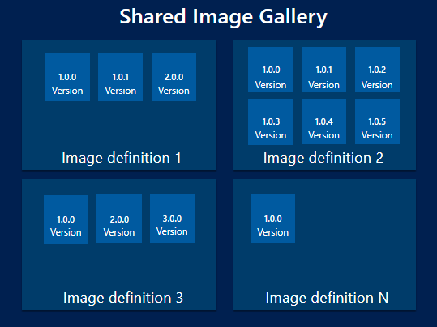

# Store and share images in an Azure Compute Gallery

**Applies to:** :heavy_check_mark: Linux VMs :heavy_check_mark: Windows VMs :heavy_check_mark: Flexible scale sets :heavy_check_mark: Uniform scale sets

An image is a copy of either a full VM (including any attached data disks) or just the OS disk, depending on how it's created. When you create a VM  from the image, a copy of the VHDs in the image are used to create the disks for the new VM. The image remains in storage and can be used over and over again to create new VMs.

If you have a large number of images that you need to maintain, and would like to make them available throughout your company, you can use an [Azure Compute Gallery](azure-compute-gallery.md) as a repository. 

When you use a gallery to store images, multiple resource types are created:

| Resource | Description|
|----------|------------|
| **Image source** | This is a resource that can be used to create an **image version** in a gallery. An image source can be an existing Azure VM that is either [generalized or specialized](#generalized-and-specialized-images), a managed image, a snapshot, a VHD or an image version in another gallery. |
| **Gallery** | Like the Azure Marketplace, a **gallery** is a repository for managing and sharing images and other resources, but you control who has access. |
| **Image definition** | Image definitions are created within a gallery and they carry information about the image and any requirements for using it to create VMs. This includes whether the image is Windows or Linux, release notes, and minimum and maximum memory requirements. It's a definition of a type of image. |
| **Image version** | An **image version** is what you use to create a VM when using a gallery. You can have multiple versions of an image as needed for your environment. Like a managed image, when you use an **image version** to create a VM, the image version is used to create new disks for the VM. Image versions can be used multiple times. |

<br>



## Image definitions

Image definitions are a logical grouping for versions of an image. The image definition holds information about why the image was created and also contains Image metadata such as, what OS it is for, features it supports and other information about using the image. An image definition is like a plan for all of the details around creating a specific image. You don't deploy a VM from an image definition, but from the image versions created from the definition.

There are three parameters for each image definition that are used in combination - **Publisher**, **Offer** and **SKU**. These are used to find a specific image definition. You can have image versions that share one or two, but not all three values.  For example, here are three image definitions and their values:

|Image Definition|Publisher|Offer|Sku|
|---|---|---|---|
|myImage1|Contoso|Finance|Backend|
|myImage2|Contoso|Finance|Frontend|
|myImage3|Testing|Finance|Frontend|

All three of these have unique sets of values. The format is similar to how you can currently specify publisher, offer, and SKU for [Azure Marketplace images](./windows/cli-ps-findimage.md) in Azure PowerShell to get the latest version of a Marketplace image. Each image definition needs to have a unique set of these values.

The following parameters determine which types of image versions they can contain:

- Operating system state - You can set the OS state to [generalized or specialized](#generalized-and-specialized-images). This field is required.
- Operating system - can be either Windows or Linux. This field is required.
- Hyper-V generation - specify whether the image was created from a generation 1 or [generation 2](generation-2.md) Hyper-V VHD. Default is generation 1.


Image definitions contain metadata for the image to allow grouping of images that support the same features, plan, OS State, OS type and others. The following are other parameters that can be set on your image definition so that you can more easily track your resources:

- Description - use description to give more detailed information on why the image definition exists. For example, you might have an image definition for your front-end server that has the application preinstalled.
- EULA - can be used to point to an end-user license agreement specific to the image definition.
- Privacy Statement and Release notes - store release notes and privacy statements in Azure storage and provide a URI for accessing them as part of the image definition.
- End-of-life date - establish a default date after which the image shouldn't be used, for all image versions in the image definition. End-of-life dates are informational; users will still be able to create VMs from images and versions past the end-of-life date.
- Tag - you can add tags when you create your image definition. For more information about tags, see [Using tags to organize your resources](../azure-resource-manager/management/tag-resources.md)
- Minimum and maximum vCPU and memory recommendations - if your image has vCPU and memory recommendations, you can attach that information to your image definition.
- Disallowed disk types - you can provide information about the storage needs for your VM. For example, if the image isn't suited for standard HDD disks, you add them to the disallow list.
- Purchase plan information for Marketplace images - `-PurchasePlanPublisher`, `-PurchasePlanName`, and `-PurchasePlanProduct`. For more information about purchase plan information, see [Find images in the Azure Marketplace](./windows/cli-ps-findimage.md) and [Supply Azure Marketplace purchase plan information when creating images](marketplace-images.md).
- Architecture
  - x64 or ARM64 [Architecture](/cli/azure/sig/image-definition?&branch=main#az-sig-image-definition-create)
- Features allow you to specify additional features and SecurityType(s) that are supported on the image, based on the type of gallery:

   | Features | Accepted Values | Definition | Supported in |
   |--|--|--|
   | IsHibernateSupported | True, False | Create VMs with support for hibernation. | Private, direct shared, community |
   | IsAcceleratedNetworkSupported | True, False | Create VMs with accelerated networking enabled. When set to `True` on Image definition, capturing VMs that don't support accelerated networking is not supported. | Private, direct shared, community |
   | DiskControllerType | ["SCSI", "NVMe"], ["SCSI"] | Set this to use either SCSI or NVMe disk type. NVMe VMs and disks can only be captured in image definitions that are tagged to be supporting NVMe. | Private, direct shared, community |
 
   When you specify a SecurityType using the `features` parameter, it limits the security features that are enabled on the VM. Some types limited, based on the type of gallery that they are stored in:

   | SecurityType | Definition | Supported in |
    |--|--|--|
   | [ConfidentialVMSupported](../confidential-computing/create-confidential-vm-from-compute-gallery.md#confidential-vm-supported-images) | It's a generic Gen2 image that does not contain VMGS blob. Gen2 VM or Confidential VM can be created from this image type | Private, Direct shared, Community |
   | [Confidential VM](../confidential-computing/create-confidential-vm-from-compute-gallery.md#confidential-vm-images) | Only Confidential VMs can be created from this image type | Private |
   | TrustedLaunchSupported | It's a generic Gen2 image that does not contain the VMGS blob. Gen2 VM or TrustedLaunch VM can be created from this image type. | Private, direct shared, community |
   | TrustedLaunch | Only TrustedLaunch VM can be   created from this image type | Private |
   | TrustedLaunchAndConfidentialVmSupported | It's a generic Gen2 image that does not contain the VMGS blob. Gen2 VM, TrustedLaunch VM, or a ConfidentialVM can be created from this image type. | Private, direct shared, community |

   For more information, see the CLI examples for adding [image definition features and SecurityType](/cli/azure/sig/image-definition?&branch=main#az-sig-image-definition-create) or the [PowerShell examples](/powershell/module/az.compute/new-azgalleryimagedefinition#example-4-create-an-image-definition-for-generalized-windows-images-and-set-features).
   
   **ConfidentialVM is only supported in the regions where it's available, You can find the supported regions [here](/azure/confidential-computing/confidential-vm-overview#regions).
## Image versions

An **image version** is what you use to create a VM. You can have multiple versions of an image as needed for your environment. When you use an **image version** to create a VM, the image version is used to create new disks for the VM. Image versions can be used multiple times.

The properties of an image version are:

- Version number. This is used as the name of the image version. It is always in the format: MajorVersion.MinorVersion.Patch. When you specify to use **latest** when creating a VM, the latest image is chosen based on the highest MajorVersion, then MinorVersion, then Patch. 
- Source. The source can be a VM, managed disk, snapshot, managed image, or another image version. 
- End of life date. Indicate the end-of-life date for the image version. End-of-life dates are informational; users will still be able to create VMs from versions past the end-of-life date.


## Generalized and specialized images

There are two operating system states supported by Azure Compute Gallery. Typically images require that the VM used to create the image has been [generalized](generalize.md) before taking the image. Generalizing is a process that removes machine and user specific information from the VM.  For Linux, you can use [waagent](https://github.com/Azure/WALinuxAgent) `-deprovision` or `-deprovision+user` parameters. For Windows, the Sysprep tool is used.

Specialized VMs haven't been through a process to remove machine specific information and accounts. Also, VMs created from specialized images don't have an `osProfile` associated with them. This means that specialized images will have some limitations in addition to some benefits.

- VMs and scale sets created from specialized images can be up and running quicker. Because they're created from a source that has already been through first boot, VMs created from these images boot faster.
- Accounts that could be used to log into the VM can also be used on any VM created using the specialized image that is created from that VM.
- VMs will have the **Computer name** of the VM the image was taken from. You should change the computer name to avoid collisions.
- The `osProfile` is how some sensitive information is passed to the VM, using `secrets`. This may cause issues using KeyVault, WinRM and other functionality that uses `secrets` in the `osProfile`. In some cases, you can use managed service identities (MSI) to work around these limitations.


## Updating resources

Once created, you can make some changes to the gallery resources. These are limited to:
 
Azure Compute Gallery:
- Description

Image definition:
- Recommended vCPUs
- Recommended memory
- Description
- End of life date
- ReleaseNotes

Image version:
- Regional replica count
- Target regions
- Exclude from latest
- End of life date

## Sharing

There are three main ways to share images an Azure Compute Gallery, depending on who you want to share with:

| Sharing with: | People | Groups | Service Principal | All users in a specific subscription (or) tenant | Publicly with all users in Azure |
|---|---|---|---|---|---|
| [RBAC Sharing](./share-gallery.md) | Yes | Yes | Yes | No | No |
| RBAC + [Direct shared gallery](./share-gallery-direct.md)  | Yes | Yes | Yes | Yes | No |
| RBAC + [Community gallery](./share-gallery-community.md) | Yes | Yes | Yes | No | Yes |

## Shallow replication 

When you create an image version, you can set the replication mode to shallow for development and test. Shallow replication skips copying the image, so the image version is ready faster. But, it also means you can't deploy a large number of VMs from that image version. This is similar to the way that the older managed images worked.

Shallow replication can also be useful if you have large images (up to 32 TB) that aren't frequently deployed. Because the source image isn't copied, larger disks can be used. But, they also can't be used for deploying large numbers of VMs concurrently.

To set an image for shallow replication, use `--replication-mode Shallow` with the Azure CLI.

## SDK support

The following SDKs support creating Azure Compute Galleries:

- [.NET](/dotnet/api/azure.resourcemanager.compute)
- [Java](/java/azure/)
- [Node.js](/javascript/api/overview/azure/arm-compute-readme)
- [Python](/python/api/overview/azure/virtualmachines)
- [Go](/azure/go/)

## Templates

You can create Azure Compute Gallery resource using templates. There are several quickstart templates available: 

- [Create a gallery](https://azure.microsoft.com/resources/templates/sig-create/)
- [Create an image definition in a gallery](https://azure.microsoft.com/resources/templates/sig-image-definition-create/)
- [Create an image version in a gallery](https://azure.microsoft.com/resources/templates/sig-image-version-create/)

## Frequently asked questions 

* [How can I list all the Azure Compute Gallery resources across subscriptions?](#how-can-i-list-all-the-azure-compute-gallery-resources-across-subscriptions) 
* [Can I move my existing image to an Azure Compute Gallery?](#can-i-move-my-existing-image-to-an-azure-compute-gallery)
* [Can I create an image version from a specialized disk?](#can-i-create-an-image-version-from-a-specialized-disk)
* [Can I move the Azure Compute Gallery resource to a different subscription after it has been created?](#can-i-move-the-azure-compute-gallery-resource-to-a-different-subscription-after-it-has-been-created)
* [Can I replicate my image versions across clouds such as Microsoft Azure operated by 21Vianet, Azure Germany, or Azure Government Cloud?](#can-i-replicate-my-image-versions-across-clouds-such-as-azure-operated-by-21vianet-or-azure-germany-or-azure-government-cloud)
* [Can I replicate my image versions across subscriptions?](#can-i-replicate-my-image-versions-across-subscriptions)
* [Can I share image versions across Azure AD tenants?](#can-i-share-image-versions-across-azure-ad-tenants)
* [How long does it take to replicate image versions across the target regions?](#how-long-does-it-take-to-replicate-image-versions-across-the-target-regions)
* [What is the difference between source region and target region?](#what-is-the-difference-between-source-region-and-target-region)
* [How do I specify the source region while creating the image version?](#how-do-i-specify-the-source-region-while-creating-the-image-version)
* [How do I specify the number of image version replicas to be created in each region?](#how-do-i-specify-the-number-of-image-version-replicas-to-be-created-in-each-region)
* [Can I create the gallery in a different location than the one for the image definition and image version?](#can-i-create-the-gallery-in-a-different-location-than-the-one-for-the-image-definition-and-image-version)
* [What are the charges for using an Azure Compute Gallery?](#what-are-the-charges-for-using-an-azure-compute-gallery)
* [What API version should I use when creating images?](#what-api-version-should-i-use-when-creating-images)
* [What API version should I use to create a VM or Virtual Machine Scale Set out of the image version?](#what-api-version-should-i-use-to-create-a-vm-or-virtual-machine-scale-set-out-of-the-image-version)
* [Can I update my Virtual Machine Scale Set created using managed image to use Azure Compute Gallery images?](#can-i-update-my-virtual-machine-scale-set-created-using-managed-image-to-use-azure-compute-gallery-images)

### How can I list all the Azure Compute Gallery resources across subscriptions?

To list all the Azure Compute Gallery resources across subscriptions that you have access to on the Azure portal, follow the steps below:

1. Open the [Azure portal](https://portal.azure.com).
1. Scroll down the page and select **All resources**.
1. Select all the subscriptions under which you'd like to list all the resources.
1. Look for resources of the **Azure Compute Gallery** type.
  
### [Azure CLI](#tab/azure-cli)

To list all the Azure Compute Gallery resources, across subscriptions that you have permissions to, use the following command in the Azure CLI:

```azurecli
   az account list -otsv --query "[].id" | xargs -n 1 az sig list --subscription
```

### [Azure PowerShell](#tab/azure-powershell)

To list all the Azure Compute Gallery resources, across subscriptions that you have permissions to, use the following command in the Azure PowerShell:

```azurepowershell
$params = @{
    Begin   = { $currentContext = Get-AzContext }
    Process = { $null = Set-AzContext -SubscriptionObject $_; Get-AzGallery }
    End     = { $null = Set-AzContext -Context $currentContext }
}

Get-AzSubscription | ForEach-Object @params
```

---

For more information, see [List, update, and delete image resources](update-image-resources.md).

### Can I move my existing image to an Azure Compute Gallery?
 
Yes. There are 3 scenarios based on the types of images you may have.

 Scenario 1: If you have a managed image, then you can create an image definition and image version from it. For more information, see [Create and image definition and an image version](image-version.md).

 Scenario 2: If you have an unmanaged image, you can create a managed image from it, and then create an image definition and image version from it. 

 Scenario 3: If you have a VHD in your local file system, then you need to upload the VHD to a managed image, then you can create an image definition and image version from it.

- If the VHD is of a Windows VM, see [Upload a VHD](./windows/upload-generalized-managed.md).
- If the VHD is for a Linux VM, see [Upload a VHD](./linux/upload-vhd.md#option-1-upload-a-vhd)

### Can I create an image version from a specialized disk?

Yes, can create a VM from a [specialized image](windows/create-vm-specialized.md). 

### Can I move the Azure Compute Gallery resource to a different subscription after it has been created?

No, you can't move the gallery image resource to a different subscription. You can replicate the image versions in the gallery to other regions or copy an [image from another gallery](image-version.md).


### Can I replicate my image versions across clouds such as Azure operated by 21Vianet or Azure Germany or Azure Government Cloud?

No, you can't replicate image versions across clouds.

### Can I replicate my image versions across subscriptions?

No, you may replicate the image versions across regions in a subscription and use it in other subscriptions through RBAC.

### Can I share image versions across Azure AD tenants? 

Yes, you can use RBAC to share to individuals across tenants. But, to share at scale, see "Share gallery images across Azure tenants" using [PowerShell](share-gallery.md?tabs=powershell) or [CLI](share-gallery.md?tabs=cli).

### How long does it take to replicate image versions across the target regions?

The image version replication time is entirely dependent on the size of the image and the number of regions it's being replicated to. However, as a best practice, it's recommended that you keep the image small, and the source and target regions close for best results. You can check the status of the replication using the -ReplicationStatus flag.

### What is the difference between source region and target region?

Source region is the region in which your image version will be created, and target regions are the regions in which a copy of your image version will be stored. For each image version, you can only have one source region. Also, make sure that you pass the source region location as one of the target regions when you create an image version.

### How do I specify the source region while creating the image version?

While creating an image version, you can use the **--location** argument in CLI and the **-Location** parameter in PowerShell to specify the source region. Ensure the managed image that you're using as the base image to create the image version is in the same location as the location in which you intend to create the image version. Also, make sure that you pass the source region location as one of the target regions when you create an image version.  

### How do I specify the number of image version replicas to be created in each region?

There are two ways you can specify the number of image version replicas to be created in each region:
 
1. The regional replica count which specifies the number of replicas you want to create per region. 
2. The common replica count which is the default per region count in case regional replica count isn't specified. 

### [Azure CLI](#tab/azure-cli)

To specify the regional replica count, pass the location along with the number of replicas you want to create in that region: "South Central US=2".

If regional replica count isn't specified with each location, then the default number of replicas will be the common replica count that you specified.

To specify the common replica count in Azure CLI, use the **--replica-count** argument in the `az sig image-version create` command.

### [Azure PowerShell](#tab/azure-powershell)

To specify the regional replica count, pass the location along with the number of replicas you want to create in that region, `@{Name = 'South Central US';ReplicaCount = 2}`, to the **-TargetRegion** parameter in the `New-AzGalleryImageVersion` command.

If regional replica count isn't specified with each location, then the default number of replicas will be the common replica count that you specified.

To specify the common replica count in Azure PowerShell, use the **-ReplicaCount** parameter in the `New-AzGalleryImageVersion` command.

---

### Can I create the gallery in a different location than the one for the image definition and image version?

Yes, it's possible. But, as a best practice, we encourage you to keep the resource group, gallery, image definition, and image version in the same location.

### What are the charges for using an Azure Compute Gallery?

There are no charges for using an Azure Compute Gallery, except the storage charges for storing the image versions and network egress charges for replicating the image versions from source region to target regions.

### What API version should I use when creating images?

To work with galleries, image definitions, and image versions, we recommend you use API version 2018-06-01. Zone Redundant Storage (ZRS) requires version 2019-03-01 or later.

### What API version should I use to create a VM or Virtual Machine Scale Set out of the image version?

For VM and Virtual Machine Scale Set deployments using an image version, we recommend you use API version 2018-04-01 or higher.

### Can I update my Virtual Machine Scale Set created using managed image to use Azure Compute Gallery images?

Yes, you can update the scale set image reference from a managed image to an Azure Compute Gallery image, as long as the OS type, Hyper-V generation, and the data disk layout matches between the images.

## Troubleshoot
If you have issues with performing any operations on the gallery resources, consult the list of common errors in the [troubleshooting guide](troubleshooting-shared-images.md).

In addition, you can post and tag your question with `azure-virtual-machines-images` at [Q&A](/answers/topics/azure-virtual-machines-images.html).

## Next steps

Learn how to deploy images using the [Azure Compute Gallery](create-gallery.md).
