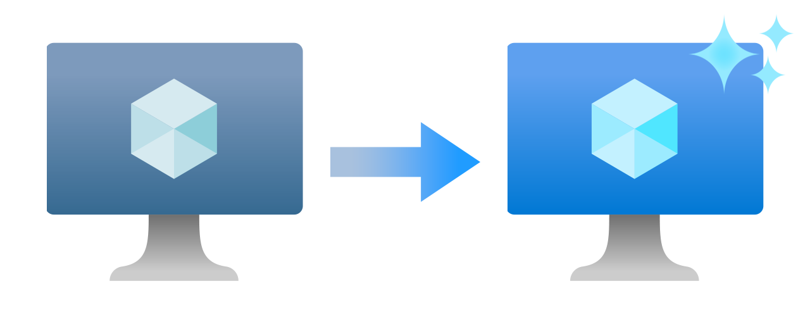

# Previous-gen and retired VM size series

Azure virtual machine sizes are the amount of resources allocated to a virtual machine in the cloud. These resources are a portion of the physical server’s hardware capabilities. A *size series* is a collection of all sizes that are available within a single physical server’s hardware. As a size series' physical hardware ages and newer components are released, Microsoft stops deploying more of previously established series' hardware. Once users migrate off of said hardware or the hardware becomes sufficiently outdated, it's retired to make room for new infrastructure.

When hardware becomes *previous-gen* or begins the retirement process, we recommend migrating workloads to newer generation hardware. Newer hardware provides better performance and future scalability. Migrating also helps you to avoid any potential issues that may arise from using outdated hardware. By keeping your hardware up-to-date, you can ensure that your workloads are running smoothly and efficiently.

This article describes the various states of older hardware and explains the processes behind these states.

## Previous-gen sizes

Previous generation size series **are not currently retired** and can still be used. These sizes are still fully supported, but they aren't guaranteed to receive more capacity. We recommend migrating to the latest generation replacements as soon as possible, especially when trying to scale up your installations.

There are two types of previous-gen sizes; *next-gen available* and *capacity limited*.

### Next-gen available

Size series listed as *next-gen available* means that while no capacity limitation plans have been made, there are sufficient deployments of newer alternative sizes to justify considering these series "previous-gen". *Next-gen available* series have no formal announcement of retirement timelines, but they'll eventually be retired.

For a list of previous-gen size series that are considered *next-gen available*, see the [list of previous-gen sizes](./previous-gen-sizes-list.md).

### Capacity limited

Size series listed as *capacity limited* means that while no retirement plans have been made, no extra capacity for this series will be deployed. Similar to *next-gen available* previous-gen series, there are sufficient deployments of newer alternative sizes available to replace *capacity limited* size deployments.

If you had one VM running on a *capacity limited* size and require another VM of a similar size in the same series, there is no guarantee that capacity will be able to fulfill this request. Any new VMs should be created using sizes in [series that aren't considered previous-gen](../sizes.md). Migrating to sizes considered *next-gen available* is not recommended since these sizes are also similarly outdated.

For a list of previous-gen size series that are considered *capacity limited*, see the [list of previous-gen sizes](./previous-gen-sizes-list.md). 

## Retired sizes

Retired size series are **no longer available** and can't be used. If you have VMs running on sizes that are considered *retired*, migrate to a newer next-gen size as soon as possible.

Retiring hardware is necessary over time to ensure that the latest and greatest technology is available on Azure. Retirement ensures that the hardware is reliable, secure, and efficient. It also allows for the latest features and capabilities that may not be present on previous generations of hardware.

Hardware which is currently listed as *previous-gen* are often preparing for retirement which will be announced formally prior to the retirement date.

For information on size series that have been retired or are scheduled for retirement, see the [list of retired sizes](./retired-sizes-list.md).

## Migrate to newer sizes

Migrating to newer sizes allows you to keep up with the latest hardware and features available on Azure.

Some size series have specific migration instructions due to the unique hardware or software features. To see a list of migration guide, see [retired size migration guides](./retired-sizes-list.md) and [previous-gen size migration guides](./previous-gen-sizes-list.md).

For sizes without specific instructions, you can [resize your VM](./resize-vm.md) to a newer size using the Azure portal, Azure PowerShell, Azure CLI, or Terraform. Make sure that the new size has support for all features that your workload requires.

## Next steps
- For more information on VM sizes, see [Sizes for virtual machines in Azure](../sizes.md).
- For a list of retired sizes, see [Retired Azure VM sizes](./retired-sizes-list.md).
- For a list of previous-gen sizes, see [Previous generation Azure VM sizes](./previous-gen-sizes-list.md).
