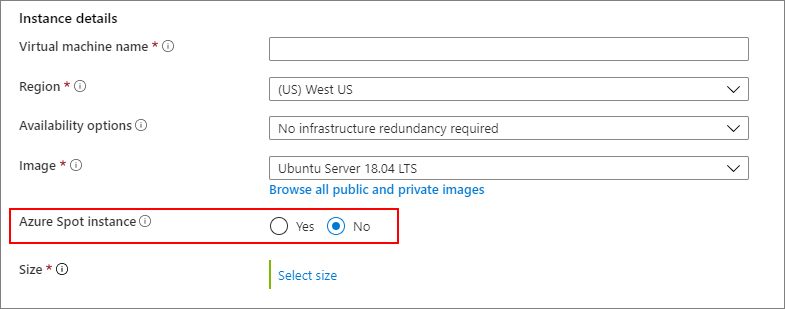
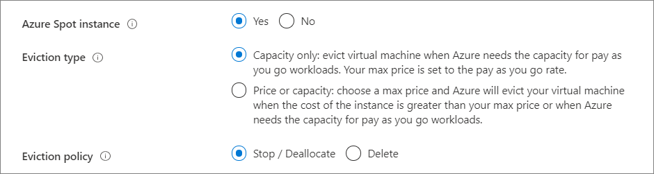

# Deploy Azure Spot Virtual Machines using the Azure portal

**Applies to:** :heavy_check_mark: Linux VMs :heavy_check_mark: Windows VMs :heavy_check_mark: Uniform scale sets

Using [Azure Spot Virtual Machines](spot-vms.md) allows you to take advantage of our unused capacity at a significant cost savings. At any point in time when Azure needs the capacity back, the Azure infrastructure will evict Azure Spot Virtual Machines. Therefore, Azure Spot Virtual Machines are great for workloads that can handle interruptions like batch processing jobs, dev/test environments, large compute workloads, and more.

Pricing for Azure Spot Virtual Machines is variable, based on region and SKU. For more information, see VM pricing for [Linux](https://azure.microsoft.com/pricing/details/virtual-machines/linux/) and [Windows](https://azure.microsoft.com/pricing/details/virtual-machines/windows/). For more information about setting the max price, see [Azure Spot Virtual Machines - Pricing](spot-vms.md#pricing).

You have option to set a max price you are willing to pay, per hour, for the VM. The max price for an Azure Spot Virtual Machine can be set in US dollars (USD), using up to 5 decimal places. For example, the value `0.05701`would be a max price of $0.05701 USD per hour. If you set the max price to be `-1`, the VM won't be evicted based on price. The price for the VM will be the current price for spot or the price for a standard VM, which ever is less, as long as there is capacity and quota available.

When the VM is evicted, you have the option to either delete the VM and the underlying disk or deallocate the VM so that it can be restarted later.


## Create the VM

When you are deploying a VM, you can choose to use an Azure spot instance.


On the **Basics** tab, in the **Instance details** section, **No** is the default for using an Azure spot instance.



If you select **Yes**, the section expands and you can choose your [eviction type and eviction policy](spot-vms.md#eviction-policy). 



You can also compare the pricing and eviction rates with other similar regions by selecting **View pricing history and compare prices in nearby regions**.

In this example, the Canada Central region is less expensive and has a lower eviction rate than the East US region.

:::image type="content" source="./media/spot-portal/pricing.png" alt-text="Screenshot of the region options with the difference in pricing and eviction rates.":::

You can change the region by selecting the choice that works the best for you and then selecting **OK**.

## Simulate an eviction

You can [simulate an eviction](/rest/api/compute/virtualmachines/simulateeviction) of an Azure Spot Virtual Machine, to testing how well your application will respond to a sudden eviction. 

Replace the following with your information: 

- `subscriptionId`
- `resourceGroupName`
- `vmName`


```rest
POST https://management.azure.com/subscriptions/{subscriptionId}/resourceGroups/{resourceGroupName}/providers/Microsoft.Compute/virtualMachines/{vmName}/simulateEviction?api-version=2020-06-01
```

`Response Code: 204` means the simulated eviction was successful. 

## Next steps

You can also create Azure Spot Virtual Machines using [PowerShell](./windows/spot-powershell.md), [CLI](./linux/spot-cli.md), or a [template](./linux/spot-template.md).
