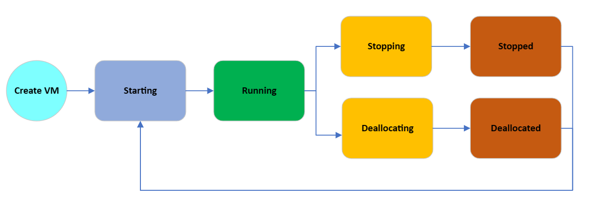

# Virtual machines lifecycle and states

Azure Virtual Machines (VMs) go through different states that can be categorized into *provisioning* and *power* states. The purpose of this article is to describe these states and specifically highlight when customers are billed for instance usage. 

## Power states

The power state represents the last known state of the VM.



<br>
The following table provides a  description of each instance state and indicates whether it is billed for instance usage or not.

:::row:::
   :::column span="":::

   **State**
   
   :::column-end:::
   :::column span="":::

   **Description**

   :::column-end:::
   :::column span="":::

   **Instance usage billed**

   :::column-end:::
:::row-end:::

:::row:::
   :::column span="":::

   **Starting**

   :::column-end:::
   :::column span="":::

   VM is starting up.

   ```json
   "statuses": [
    {
    "code": "PowerState/starting",
    "level": "Info",
    "displayStatus": "VM starting"
    }
   ]
   ```
   :::column-end:::
   :::column span="":::

   **Not billed**

   :::column-end:::
:::row-end:::

:::row:::
   :::column span="":::

   **Running**

   :::column-end:::
   :::column span="":::

   Normal working state for a VM

   ```json
   "statuses": [
    {
    "code": "PowerState/running",
    "level": "Info",
    "displayStatus": "VM running"
    }
  ]
  ```
   :::column-end:::
   :::column span="":::

   **Billed**

   :::column-end:::
:::row-end:::

:::row:::
   :::column span="":::

   **Stopping**

   :::column-end:::
   :::column span="":::

   This is a transitional state. When completed, it will show as **Stopped**.

   ```json
   "statuses": [
    {
    "code": "PowerState/stopping",
    "level": "Info",
    "displayStatus": "VM stopping"
    }
   ]
  ```
   :::column-end:::
   :::column span="":::

   **Billed**

   :::column-end:::
:::row-end:::

:::row:::
   :::column span="":::

   **Stopped**

   :::column-end:::
   :::column span="":::

   The VM has been shut down from within the guest OS or using the PowerOff APIs.

   Hardware is still allocated to the VM and it remains on the host.

   ```json
   "statuses": [
    {
    "code": "PowerState/stopped",
    "level": "Info",
    "displayStatus": "VM stopped"
    }
   ]
  ```
   :::column-end:::
   :::column span="":::

   **Billed***

   :::column-end:::
:::row-end:::

:::row:::
   :::column span="":::

   **Deallocating**

   :::column-end:::
   :::column span="":::

   Transitional state. When completed, the VM will show as **Deallocated**.

   ```json
   "statuses": [
    {
    "code": "PowerState/deallocating",
    "level": "Info",
    "displayStatus": "VM deallocating"
    }
   ]
  ```
   :::column-end:::
   :::column span="":::

   **Not billed***

   :::column-end:::
:::row-end:::

:::row:::
   :::column span="":::

   **Deallocated**

   :::column-end:::
   :::column span="":::

   The VM has been stopped successfully and removed from the host.

   ```json
   "statuses": [
    {
    "code": "PowerState/deallocated",
    "level": "Info",
    "displayStatus": "VM deallocated"
    }
   ]
  ```
   :::column-end:::
   :::column span="":::

   **Not billed**

   :::column-end:::
:::row-end:::


&#42; Some Azure resources, such as Disks and Networking, incur charges. Software licenses on the instance do not incur charges.

## Provisioning states

A provisioning state is the status of a user-initiated, control-plane operation on the VM. These states are separate from the power state of a VM.

- **Create** – VM creation.

- **Update** – updates the model for an existing VM. Some non-model changes to VM such as Start/Restart also fall under update.

- **Delete** – VM deletion.

- **Deallocate** – is where a VM is stopped and removed from the host. Deallocating a VM is considered an update, so it will display provisioning states related to updating.


Here are the transitional operation states after the platform has accepted a user-initiated action:

:::row:::
   :::column span="":::

   **State**
   
   :::column-end:::
   :::column span="2":::

   **Description**

   :::column-end:::

:::row-end:::

:::row:::
   :::column span="":::

   **Creating**

   :::column-end:::
   :::column span="2":::

  ```json
   "statuses": [
    {
    "code": "ProvisioningState/creating",
    "level": "Info",
    "displayStatus": "Creating"
    }
   [
   ```
   :::column-end:::

:::row-end:::

:::row:::
   :::column span="":::

   **Updating**

   :::column-end:::
   :::column span="2":::

   ```json
   "statuses": [
    {
    "code": "ProvisioningState/updating",
    "level": "Info",
    "displayStatus": "Updating"
    }
   [
   ```
   :::column-end:::

:::row-end:::

:::row:::
   :::column span="":::

   **Deleting**

   :::column-end:::
   :::column span="2":::

   ```json
   "statuses": [
    {
    "code": "ProvisioningState/deleting",
    "level": "Info",
    "displayStatus": "Deleting"
    }
   [
   ```
   :::column-end:::

:::row-end:::

:::row:::
   :::column span="":::

   **OS provisioning states**
   
   :::column-end:::
   :::column span="2":::

   **Description**

   :::column-end:::

:::row-end:::

:::row:::
   :::column span="":::


   :::column-end:::
   :::column span="2":::

   If a VM is created with an OS image and not with a specialized image, then following substates can be observed:

   :::column-end:::

:::row-end:::

:::row:::
   :::column span="":::

   **OSProvisioningInprogress**

   :::column-end:::
   :::column span="2":::

   The VM is running, and installation of guest OS is in progress.
 
   ```json
   "statuses": [
    {
    "code": "ProvisioningState/creating/OSProvisioningInprogress",
    "level": "Info",
    "displayStatus": "OS Provisioning In progress"
    }
   [
   ```
   :::column-end:::

:::row-end:::

:::row:::
   :::column span="":::

   **OSProvisioningComplete**

   :::column-end:::
   :::column span="2":::
   
   Short-lived state. The VM quickly transitions to **Success** unless any extensions need to be installed. Installing extensions can take time.
   
   ```json
   "statuses": [
    {
    "code": "ProvisioningState/creating/OSProvisioningComplete",
    "level": "Info",
    "displayStatus": "OS Provisioning Complete"
    }
   [
   ```
   
   **Note**: OS Provisioning can transition to **Failed** if there is an OS failure or the OS doesn't install in time. Customers will be billed for the deployed VM on the infrastructure.

   :::column-end:::

:::row-end:::

Once the operation is complete, the VM will transition into one of the following states:

- **Succeeded** – the user-initiated actions have completed.

    ```
  "statuses": [ 
  {
     "code": "ProvisioningState/succeeded",
     "level": "Info",
     "displayStatus": "Provisioning succeeded",
     "time": "time"
  }
  ]
    ```

 

- **Failed** – represents a failed operation. Refer to the error codes to get more information and possible solutions.

    ```
  "statuses": [
    {
      "code": "ProvisioningState/failed/InternalOperationError",
      "level": "Error",
      "displayStatus": "Provisioning failed",
      "message": "Operation abandoned due to internal error. Please try again later.",
      "time": "time"
    }
	]
    ```


## VM instance view

The instance view API provides VM running-state information. For more information, see the [Virtual Machines - Instance View](/rest/api/compute/virtualmachines/instanceview) API documentation.

Azure Resources explorer provides a simple UI for viewing the VM running state: [Resource Explorer](https://resources.azure.com/).

Provisioning states are visible on VM properties and instance view. Power states are available in instance view of VM.

To retrieve the power state of all the VMs in your subscription, use the [Virtual Machines - List All API](/rest/api/compute/virtualmachines/listall) with parameter **statusOnly** set to *true*.

## Next steps

To learn more about monitoring your VM, see [Monitor virtual machines in Azure](../azure-monitor/insights/monitor-vm-azure.md).