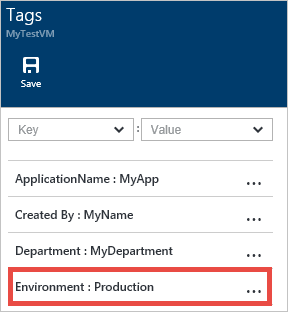

# Tagging a Virtual Machine through the portal
First, let’s look at tagging through templates. [This template](https://github.com/Azure/azure-quickstart-templates/tree/master/101-vm-tags) places tags on the following resources: Compute (Virtual Machine), Storage (Storage Account), and Network (Public IP Address, Virtual Network, and Network Interface). This template is for a Windows VM but can be adapted for Linux VMs.

Click the **Deploy to Azure** button from the [template link](https://github.com/Azure/azure-quickstart-templates/tree/master/101-vm-tags). This will navigate to the [Azure portal](https://portal.azure.com/) where you can deploy this template.


This template includes the following tags: *Department*, *Application*, and *Created By*. You can add/edit these tags directly in the template if you would like different tag names.


As you can see, the tags are defined as key/value pairs, separated by a colon (:). The tags must be defined in this format:

```config
"tags": {
    "Key1" : "Value1",
    "Key2" : "Value2"
}
```

Save the template file after you finish editing it with the tags of your choice.

Next, in the **Edit Parameters** section, you can fill out the values for your tags.


Click **Create** to deploy this template with your tag values.

## Tagging using the Portal
After creating your resources with tags, you can view, add, and delete tags in the portal.

Select the tags icon to view your tags:


Add a new tag through the portal by defining your own Key/Value pair, and save it.


Your new tag should now appear in the list of tags for your resource.



[!INCLUDE [virtual-machines-common-tag-usage](../../includes/virtual-machines-common-tag-usage.md)]

## Next steps
* To learn more about tagging your Azure resources, see [Azure Resource Manager Overview](../azure-resource-manager/management/overview.md) and [Using Tags to organize your Azure Resources](../azure-resource-manager/management/tag-resources.md).
* To see how tags can help you manage your use of Azure resources, see [Understanding your Azure Bill](../cost-management-billing/understand/review-individual-bill.md) and [Gain insights into your Microsoft Azure resource consumption](../cost-management-billing/manage/usage-rate-card-overview.md).