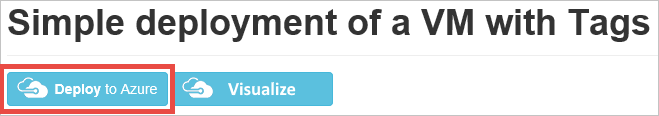
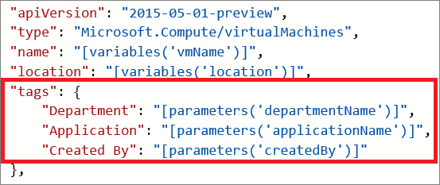
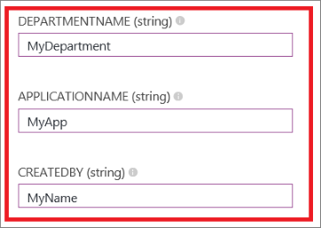

# Tagging a VM using a template

This article describes how to tag a VM in Azure using a Resource Manager template. Tags are user-defined key/value pairs which can be placed directly on a resource or a resource group. Azure currently supports up to 50 tags per resource and resource group. Tags may be placed on a resource at the time of creation or added to an existing resource.

[This template](https://github.com/Azure/azure-quickstart-templates/tree/master/quickstarts/microsoft.compute/vm-tags) places tags on the following resources: Compute (Virtual Machine), Storage (Storage Account), and Network (Public IP Address, Virtual Network, and Network Interface). This template is for a Windows VM but can be adapted for Linux VMs.

Click the **Deploy to Azure** button from the [template link](https://github.com/Azure/azure-quickstart-templates/tree/master/quickstarts/microsoft.compute/vm-tags). This will navigate to the [Azure portal](https://portal.azure.com/) where you can deploy this template.



This template includes the following tags: *Department*, *Application*, and *Created By*. You can add/edit these tags directly in the template if you would like different tag names.



As you can see, the tags are defined as key/value pairs, separated by a colon (:). The tags must be defined in this format:

```config
"tags": {
    "Key1" : "Value1",
    "Key2" : "Value2"
}
```

Save the template file after you finish editing it with the tags of your choice.

Next, in the **Edit Parameters** section, you can fill out the values for your tags.



Click **Create** to deploy this template with your tag values.

### Next steps

- To learn more about tagging your Azure resources, see [Azure Resource Manager Overview](../azure-resource-manager/management/overview.md) and [Using Tags to organize your Azure Resources](../azure-resource-manager/management/tag-resources.md).
- To see how tags can help you manage your use of Azure resources, see [Understanding your Azure Bill](../cost-management-billing/understand/review-individual-bill.md).
