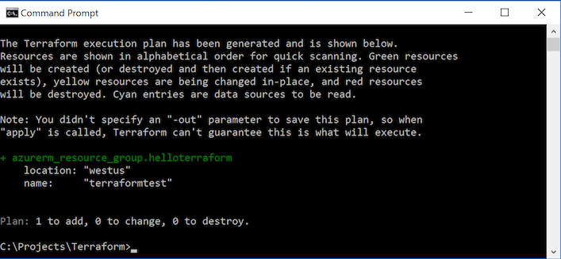

# Create basic infrastructure in Azure by using Terraform
This article describes the steps you need to take to provision a virtual machine, together with underlying infrastructure, into Azure. You will learn how to write Terraform scripts and how to visualize the changes before you make them in your cloud infrastructure. You also will learn how to create infrastructure in Azure by using Terraform.

To get started, create a file called \_terraform_azure101.tf_ in your text editor of choice (Visual Studio Code/Sublime/Vim/etc.). The exact name of the file isn't important because Terraform accepts the folder name as a parameter: all scripts in the folder get executed. Paste the following code in the new file:

~~~~
# Configure the Microsoft Azure Provider
# NOTE: if you defined these values as environment variables, you do not have to include this block
provider "azurerm" {
  subscription_id = "your_subscription_id_from_script_execution"
  client_id       = "your_client_id_from_script_execution"
  client_secret   = "your_client_secret_from_script_execution"
  tenant_id       = "your_tenant_id_from_script_execution"
}

# create a resource group 
resource "azurerm_resource_group" "helloterraform" {
    name = "terraformtest"
    location = "West US"
}
~~~~
In the "provider" section of the script, you tell Terraform to use an Azure provider to provision resources in the script. To get values for subscription_id, client_id, client_secret, and tenant_id, see the [Install and configure Terraform](terraform-install-configure.md) guide. If you have created environment variables for the values in this block, you don't need to include it. 

The "azurerm_resource_group" resource instructs Terraform to create a new resource group. You can see more resource types that are available in Terraform later in this article.

## Execute the script
After you save the script, exit to the console/command line, and type the following:
```
terraform plan terraformscripts
```
We assume that "terraformscripts" is the folder where the script was saved. We used the "plan" Terraform command, which looks at the resources defined in the scripts. It compares them to the state information saved by Terraform and then outputs the planned execution _without_ actually creating resources in Azure. 

After you execute the previous command, you should see something like the following screen:



If everything looks correct, provision this new resource group in Azure by executing the following: 
```
terraform apply terraformscripts
```
In the Azure portal, you should see the new empty resource group called "terraformtest". In the following section, you add a virtual machine and all the supporting infrastructure for that virtual machine to the resource group.

## Provision an Ubuntu VM with Terraform
Let's extend the Terraform script we've created with the details that are necessary to provision a virtual machine running Ubuntu. The resources that you provision in the following sections are:

* A network with a single subnet
* A network interface card 
* A storage account with a storage container
* A public IP
* A virtual machine that utilizes all the previous resources 

For thorough documentation for each of the Azure Terraform resources, see the [Terraform documentation](https://www.terraform.io/docs/providers/azurerm/index.html).

The full version of the [provisioning script](#complete-terraform-script) is also provided for convenience.

### Extend the Terraform script
Extend the script that was created with the following resources: 
~~~~
# create a virtual network
resource "azurerm_virtual_network" "helloterraformnetwork" {
    name = "acctvn"
    address_space = ["10.0.0.0/16"]
    location = "West US"
    resource_group_name = "${azurerm_resource_group.helloterraform.name}"
}

# create subnet
resource "azurerm_subnet" "helloterraformsubnet" {
    name = "acctsub"
    resource_group_name = "${azurerm_resource_group.helloterraform.name}"
    virtual_network_name = "${azurerm_virtual_network.helloterraformnetwork.name}"
    address_prefix = "10.0.2.0/24"
}
~~~~
The previous script creates a virtual network and a subnet within that virtual network. Note the reference to the resource group you have created already via the "${azurerm_resource_group.helloterraform.name}" both in the virtual network and the subnet definition.

~~~~
# create public IP
resource "azurerm_public_ip" "helloterraformips" {
    name = "terraformtestip"
    location = "West US"
    resource_group_name = "${azurerm_resource_group.helloterraform.name}"
    public_ip_address_allocation = "dynamic"

    tags {
        environment = "TerraformDemo"
    }
}

# create network interface
resource "azurerm_network_interface" "helloterraformnic" {
    name = "tfni"
    location = "West US"
    resource_group_name = "${azurerm_resource_group.helloterraform.name}"

    ip_configuration {
        name = "testconfiguration1"
        subnet_id = "${azurerm_subnet.helloterraformsubnet.id}"
        private_ip_address_allocation = "static"
        private_ip_address = "10.0.2.5"
        public_ip_address_id = "${azurerm_public_ip.helloterraformips.id}"
    }
}
~~~~
The previous script snippets create a public IP and a network interface that makes use of the public IP created. Note the references to subnet_id and public_ip_address_id. Terraform has built-in intelligence to understand that the network interface has a dependency on the resources that need to be created before the creation of the network interface.

~~~~
# create storage account
resource "azurerm_storage_account" "helloterraformstorage" {
    name = "helloterraformstorage"
    resource_group_name = "${azurerm_resource_group.helloterraform.name}"
    location = "westus"
    account_type = "Standard_LRS"

    tags {
        environment = "staging"
    }
}

# create storage container
resource "azurerm_storage_container" "helloterraformstoragestoragecontainer" {
    name = "vhd"
    resource_group_name = "${azurerm_resource_group.helloterraform.name}"
    storage_account_name = "${azurerm_storage_account.helloterraformstorage.name}"
    container_access_type = "private"
    depends_on = ["azurerm_storage_account.helloterraformstorage"]
}
~~~~
Here, you created a storage account and defined a storage container within that storage account. This is where you store virtual hard disks (VHDs) for the virtual machine about to be created.

~~~~
# create virtual machine
resource "azurerm_virtual_machine" "helloterraformvm" {
    name = "terraformvm"
    location = "West US"
    resource_group_name = "${azurerm_resource_group.helloterraform.name}"
    network_interface_ids = ["${azurerm_network_interface.helloterraformnic.id}"]
    vm_size = "Standard_A0"

    storage_image_reference {
        publisher = "Canonical"
        offer = "UbuntuServer"
        sku = "14.04.2-LTS"
        version = "latest"
    }

    storage_os_disk {
        name = "myosdisk"
        vhd_uri = "${azurerm_storage_account.helloterraformstorage.primary_blob_endpoint}${azurerm_storage_container.helloterraformstoragestoragecontainer.name}/myosdisk.vhd"
        caching = "ReadWrite"
        create_option = "FromImage"
    }

    os_profile {
        computer_name = "hostname"
        admin_username = "testadmin"
        admin_password = "Password1234!"
    }

    os_profile_linux_config {
        disable_password_authentication = false
    }

    tags {
        environment = "staging"
    }
}
~~~~
Finally, the previous snippet creates a virtual machine that utilizes all the resources provisioned already. They are a storage account and container for a VHD, a network interface with public IP and subnet specified, and the resource group you already created. Note the vm_size property, where the script specifies an Azure A0 SKU.

### Execute the script
With the full script saved, exit to the console/command line and type the following:
```
terraform apply terraformscripts
```
After some time, the resources, including a virtual machine, appear in the "terraformtest" resource group in the Azure portal.

## Complete the Terraform script

```
variable "resourcesname" {
  default = "helloterraform"
}

# Configure the Microsoft Azure Provider
provider "azurerm" {
  subscription_id = "XXX"
  client_id       = "XXX"
  client_secret   = "XXX"
  tenant_id       = "XXX"
}

# create a resource group if it doesn't exist
resource "azurerm_resource_group" "helloterraform" {
    name = "terraformtest"
    location = "West US"
}

# create virtual network
resource "azurerm_virtual_network" "helloterraformnetwork" {
    name = "tfvn"
    address_space = ["10.0.0.0/16"]
    location = "West US"
    resource_group_name = "${azurerm_resource_group.helloterraform.name}"
}

# create subnet
resource "azurerm_subnet" "helloterraformsubnet" {
    name = "tfsub"
    resource_group_name = "${azurerm_resource_group.helloterraform.name}"
    virtual_network_name = "${azurerm_virtual_network.helloterraformnetwork.name}"
    address_prefix = "10.0.2.0/24"
}


# create public IPs
resource "azurerm_public_ip" "helloterraformips" {
    name = "terraformtestip"
    location = "West US"
    resource_group_name = "${azurerm_resource_group.helloterraform.name}"
    public_ip_address_allocation = "dynamic"

    tags {
        environment = "TerraformDemo"
    }
}

# create network interface
resource "azurerm_network_interface" "helloterraformnic" {
    name = "tfni"
    location = "West US"
    resource_group_name = "${azurerm_resource_group.helloterraform.name}"

    ip_configuration {
        name = "testconfiguration1"
        subnet_id = "${azurerm_subnet.helloterraformsubnet.id}"
        private_ip_address_allocation = "static"
        private_ip_address = "10.0.2.5"
        public_ip_address_id = "${azurerm_public_ip.helloterraformips.id}"
    }
}

# create storage account
resource "azurerm_storage_account" "helloterraformstorage" {
    name = "helloterraformstorage"
    resource_group_name = "${azurerm_resource_group.helloterraform.name}"
    location = "westus"
    account_type = "Standard_LRS"

    tags {
        environment = "staging"
    }
}

# create storage container
resource "azurerm_storage_container" "helloterraformstoragestoragecontainer" {
    name = "vhd"
    resource_group_name = "${azurerm_resource_group.helloterraform.name}"
    storage_account_name = "${azurerm_storage_account.helloterraformstorage.name}"
    container_access_type = "private"
    depends_on = ["azurerm_storage_account.helloterraformstorage"]
}

# create virtual machine
resource "azurerm_virtual_machine" "helloterraformvm" {
    name = "terraformvm"
    location = "West US"
    resource_group_name = "${azurerm_resource_group.helloterraform.name}"
    network_interface_ids = ["${azurerm_network_interface.helloterraformnic.id}"]
    vm_size = "Standard_A0"

    storage_image_reference {
        publisher = "Canonical"
        offer = "UbuntuServer"
        sku = "14.04.2-LTS"
        version = "latest"
    }

    storage_os_disk {
        name = "myosdisk"
        vhd_uri = "${azurerm_storage_account.helloterraformstorage.primary_blob_endpoint}${azurerm_storage_container.helloterraformstoragestoragecontainer.name}/myosdisk.vhd"
        caching = "ReadWrite"
        create_option = "FromImage"
    }

    os_profile {
        computer_name = "hostname"
        admin_username = "testadmin"
        admin_password = "Password1234!"
    }

    os_profile_linux_config {
        disable_password_authentication = false
    }

    tags {
        environment = "staging"
    }
}
```

## Next steps
You have created basic infrastructure in Azure by using Terraform. For more complex scenarios, including examples that use load balancers and virtual machine scale sets, see numerous [Terraform examples for Azure](https://github.com/hashicorp/terraform/tree/master/examples). For an up-to-date list of supported Azure providers, see the [Terraform documentation](https://www.terraform.io/docs/providers/azurerm/index.html).