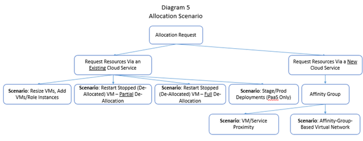

# Troubleshooting steps specific to allocation failure scenarios in the classic deployment model

The following are common allocation scenarios that cause an allocation request to be pinned. We'll dive into each scenario later in this article.

- Resize a VM or add VMs or role instances to an existing cloud service
- Restart partially stopped (deallocated) VMs
- Restart fully stopped (deallocated) VMs
- Staging and production deployments (platform as a service only)
- Affinity group (VM or service proximity)
- Affinity–group-based virtual network

When you receive an allocation error, check whether any of the listed scenarios apply to your error. Use the allocation error that’s returned by the Azure platform to identify the corresponding scenario. If your request is pinned, remove some of the pinning constraints to open your request to more clusters, thereby increasing the chance of allocation success.
In general, if the error does not state that "the requested VM size is not supported," you can always retry at a later time. This is because enough resources may have been freed in the cluster to accommodate your request. If the problem is that the requested VM size is not supported, try a different VM size. Otherwise, the only option is to remove the pinning constraint.

Two common failure scenarios are related to affinity groups. In the past, an affinity group was used to provide close proximity to VMs and service instances, or it was used to enable the creation of a virtual network. With the introduction of regional virtual networks, affinity groups are no longer required to create a virtual network. With the reduction of network latency in Azure infrastructure, the recommendation to use affinity groups for VMs or service proximity has changed.

The following Diagram presents the taxonomy of the (pinned) allocation scenarios. 

## Resize a VM or add VMs or role instances to an existing cloud service
**Error**

Upgrade_VMSizeNotSupported or GeneralError

**Cause of cluster pinning**

A request to resize a VM or add a VM or a role instance to an existing cloud service has to be attempted at the original cluster that hosts the existing cloud service. Creating a new cloud service allows the Azure platform to find another cluster that has free resources or supports the VM size that you requested.

**Workaround**

If the error is Upgrade_VMSizeNotSupported*, try a different VM size. If using a different VM size is not an option, but if it's acceptable to use a different virtual IP address (VIP), create a new cloud service to host the new VM and add the new cloud service to the regional virtual network where the existing VMs are running. If your existing cloud service does not use a regional virtual network, you can still create a new virtual network for the new cloud service, and then connect your [existing virtual network to the new virtual network](https://azure.microsoft.com/blog/vnet-to-vnet-connecting-virtual-networks-in-azure-across-different-regions/). See more about [regional virtual networks](https://azure.microsoft.com/blog/2014/05/14/regional-virtual-networks/).

If the error is GeneralError*, it's likely that the type of resource (such as a particular VM size) is supported by the cluster, but the cluster does not have free resources at the moment. Similar to the above scenario, add the desired compute resource through creating a new cloud service (note that the new cloud service has to use a different VIP) and use a regional virtual network to connect your cloud services.

## Restart partially stopped (deallocated) VMs
**Error**

GeneralError*

**Cause of cluster pinning**

Partial deallocation means that you stopped (deallocated) one or more, but not all, VMs in a cloud service. When you stop (deallocate) a VM, the associated resources are released. Restarting that stopped (deallocated) VM is therefore a new allocation request. Restarting VMs in a partially deallocated cloud service is equivalent to adding VMs to an existing cloud service. The allocation request has to be attempted at the original cluster that hosts the existing cloud service. Creating a different cloud service allows the Azure platform to find another cluster that has free resource or supports the VM size that you requested.

**Workaround**

If it's acceptable to use a different VIP, delete the stopped (deallocated) VMs (but keep the associated disks) and add the VMs back through a different cloud service. Use a regional virtual network to connect your cloud services:

* If your existing cloud service uses a regional virtual network, simply add the new cloud service to the same virtual network.
* If your existing cloud service does not use a regional virtual network, create a new virtual network for the new cloud service, and then [connect your existing virtual network to the new virtual network](https://azure.microsoft.com/blog/vnet-to-vnet-connecting-virtual-networks-in-azure-across-different-regions/). See more about [regional virtual networks](https://azure.microsoft.com/blog/2014/05/14/regional-virtual-networks/).

## Restart fully stopped (deallocated) VMs
**Error**

GeneralError*

**Cause of cluster pinning**

Full deallocation means that you stopped (deallocated) all VMs from a cloud service. The allocation requests to restart these VMs have to be attempted at the original cluster that hosts the cloud service. Creating a new cloud service allows the Azure platform to find another cluster that has free resources or supports the VM size that you requested.

**Workaround**

If it's acceptable to use a different VIP, delete the original stopped (deallocated) VMs (but keep the associated disks) and delete the corresponding cloud service (the associated compute resources were already released when you stopped (deallocated) the VMs). Create a new cloud service to add the VMs back.

## Staging/production deployments (platform as a service only)
**Error**

New_General* or New_VMSizeNotSupported*

**Cause of cluster pinning**

The staging deployment and the production deployment of a cloud service are hosted in the same cluster. When you add the second deployment, the corresponding allocation request will be attempted in the same cluster that hosts the first deployment.

**Workaround**

Delete the first deployment and the original cloud service and redeploy the cloud service. This action may land the first deployment in a cluster that has enough free resources to fit both deployments or in a cluster that supports the VM sizes that you requested.

## Affinity group (VM/service proximity)
**Error**

New_General* or New_VMSizeNotSupported*

**Cause of cluster pinning**

Any compute resource assigned to an affinity group is tied to one cluster. New compute resource requests in that affinity group are attempted in the same cluster where the existing resources are hosted. This is true whether the new resources are created through a new cloud service or through an existing cloud service.

**Workaround**

If an affinity group is not necessary, do not use an affinity group, or group your compute resources into multiple affinity groups.

## Affinity-group-based virtual network
**Error**

New_General* or New_VMSizeNotSupported*

**Cause of cluster pinning**

Before regional virtual networks were introduced, you were required to associate a virtual network with an affinity group. As a result, compute resources placed into an affinity group are bound by the same constraints as described in the "Allocation scenario: Affinity group (VM/service proximity)" section above. The compute resources are tied to one cluster.

**Workaround**

If you do not need an affinity group, create a new regional virtual network for the new resources you're adding, and then [connect your existing virtual network to the new virtual network](https://azure.microsoft.com/blog/vnet-to-vnet-connecting-virtual-networks-in-azure-across-different-regions/). See more about [regional virtual networks](https://azure.microsoft.com/blog/2014/05/14/regional-virtual-networks/).

Alternatively, you can [migrate your affinity-group-based virtual network to a regional virtual network](https://azure.microsoft.com/blog/2014/11/26/migrating-existing-services-to-regional-scope/), and then add the desired resources again.

