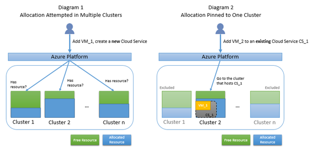
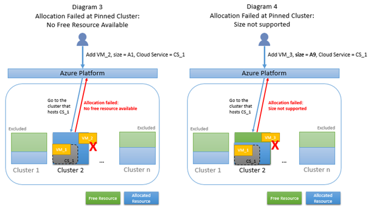

# Troubleshoot allocation failures when you create, restart, or resize VMs in Azure

When you create a virtual machine (VM), restart stopped (deallocated) VMs, or resize a VM, Microsoft Azure allocates compute resources to your subscription. We are continually investing in additional infrastructure and features to make sure that we always have all VM types available to support customer demand. However, you may occasionally experience resource allocation failures because of unprecedented growth in demand for Azure services in specific regions. This problem can occur when you try to create or start VMs in a region while the VMs display the following error code and message:

**Error code**: AllocationFailed or ZonalAllocationFailed

**Error message**: "Allocation failed. We do not have sufficient capacity for the requested VM size in this region. Read more about improving likelihood of allocation success at https:\//aka.ms/allocation-guidance"

This article explains the causes of some of the common allocation failures and suggests possible remedies.

If your Azure issue is not addressed in this article, visit the [Azure forums on MSDN and Stack Overflow](https://azure.microsoft.com/support/forums/). You can post your issue on these forums or to @AzureSupport on Twitter. Also, you can file an Azure support request by selecting Get support on the [Azure support](https://azure.microsoft.com/support/options/) site.

Until your preferred VM type is available in your preferred region, we advise customers who encounter deployment issues to consider the guidance in the following table as a temporary workaround. 

Identify the scenario that best matches your case, and then retry the allocation request by using the corresponding suggested workaround to increase the likelihood of allocation success. Alternatively, you can always retry later. This is because enough resources may have been freed in the cluster, region, or zone to accommodate your request. 

## Resize a VM or add VMs to an existing availability set

### Cause

A request to resize a VM or add a VM to an existing availability set must be tried at the original cluster that hosts the existing availability set. The requested VM size is supported by the cluster, but the cluster may not currently have sufficient capacity. 

### Workaround

If the VM can be part of a different availability set, create a VM in a different availability set (in the same region). This new VM can then be added to the same virtual network.

Stop (deallocate) all VMs in the same availability set, then restart each one.
To stop: Click Resource groups > [your resource group] > Resources > [your availability set] > Virtual Machines > [your virtual machine] > Stop.
After all VMs stop, select the first VM, and then click Start.
This step makes sure that a new allocation attempt is run and that a new cluster can be selected that has sufficient capacity.

## Restart partially stopped (deallocated) VMs

### Cause

Partial deallocation means that you stopped (deallocated) one or more, but not all, VMs in an availability set. When you deallocate a VM, the associated resources are released. Restarting VMs in a partially deallocated availability set is the same as adding VMs to an existing availability set. Therefore, the allocation request must be tried at the original cluster that hosts the existing availability set that may not have sufficient capacity.

### Workaround

Stop (deallocate) all VMs in the same availability set, then restart each one.
To stop: Click Resource groups > [your resource group] > Resources > [your availability set] > Virtual Machines > [your virtual machine] > Stop.
After all VMs stop, select the first VM, and then click Start.
This will make sure that a new allocation attempt is run and that a new cluster can be selected that has sufficient capacity.

## Restart fully stopped (deallocated) VMs

### Cause

Full deallocation means that you stopped (deallocated) all VMs in an availability set. The allocation request to restart these VMs will target all clusters that support the desired size within the region or zone. Change your allocation request per the suggestions in this article, and retry the request to improve the chance of allocation success. 

### Workaround

If you use older VM series or sizes, such as Dv1, DSv1, Av1, D15v2, or DS15v2, consider moving to newer versions. See these recommendations for specific VM sizes.
If you don’t have the option to use a different VM size, try deploying to a different region within the same geo. For more information about the available VM sizes in each region at https://aka.ms/azure-regions

If you are using availability zones, try another zone within the region that may have available capacity for the requested VM size.

If your allocation request is large (more than 500 cores), see the guidance in the following sections to break up the request into smaller deployments.

## Allocation failures for older VM sizes (Av1, Dv1, DSv1, D15v2, DS15v2, etc.)

As we expand Azure infrastructure, we deploy newer-generation hardware that’s designed to support the latest virtual machine types. Some of the older series VMs do not run on our latest generation infrastructure. For this reason, customers may occasionally experience allocation failures for these legacy SKUs. To avoid this problem, we encourage customers who are using legacy series virtual machines to consider moving to the equivalent newer VMs per the following recommendations: These VMs are optimized for the latest hardware and will let you take advantage of better pricing and performance. 

|Legacy VM-series/size|Recommended newer VM-series/size|More information|
|----------------------|----------------------------|--------------------|
|Av1-series|[Av2-series](../windows/sizes-general.md#av2-series)|https://azure.microsoft.com/blog/new-av2-series-vm-sizes/
|Dv1 or DSv1-series (D1 to D5)|[Dv3 or DSv3-series](../windows/sizes-general.md#dsv3-series-1)|https://azure.microsoft.com/blog/introducing-the-new-dv3-and-ev3-vm-sizes/
|Dv1 or DSv1-series (D11 to D14)|[Ev3 or ESv3-series](../windows/sizes-memory.md#ev3-series)|
|D15v2 or DS15v2|If you are using theResource Manager deployment model in order to take advantage of the larger VM sizes, consider moving to D16v3/DS16v3 or D32v3/DS32v3. These are designed to run on the latest generation hardware. If you are using the Resource Manager deployment model to make sure your VM instance is isolated to hardware dedicated to a single customer, consider moving to the new isolated VM sizes, E64i_v3 or E64is_v3, which are designed to run on the latest generation hardware. |https://azure.microsoft.com/blog/new-isolated-vm-sizes-now-available/

## Allocation failures for large deployments (more than 500 cores)

Reduce the number of instances of the requested VM size, and then retry the deployment operation. Additionally, for larger deployments, you may want to evaluate [Azure virtual machine scale sets](https://docs.microsoft.com/azure/virtual-machine-scale-sets/). The number of VM instances can automatically increase or decrease in response to demand or a defined schedule, and you have a greater chance of allocation success because the deployments can be spread across multiple clusters. 

## Background information
### How allocation works
The servers in Azure datacenters are partitioned into clusters. Normally, an allocation request is attempted in multiple clusters, but it's possible that certain constraints from the allocation request force the Azure platform to attempt the request in only one cluster. In this article, we'll refer to this as "pinned to a cluster." Diagram 1 below illustrates the case of a normal allocation that is attempted in multiple clusters. Diagram 2 illustrates the case of an allocation that's pinned to Cluster 2 because that's where the existing Cloud Service CS_1 or availability set is hosted.

### Why allocation failures happen
When an allocation request is pinned to a cluster, there's a higher chance of failing to find free resources since the available resource pool is smaller. Furthermore, if your allocation request is pinned to a cluster but the type of resource you requested is not supported by that cluster, your request will fail even if the cluster has free resources. The following Diagram 3 illustrates the case where a pinned allocation fails because the only candidate cluster does not have free resources. Diagram 4 illustrates the case where a pinned allocation fails because the only candidate cluster does not support the requested VM size, even though the cluster has free resources.

