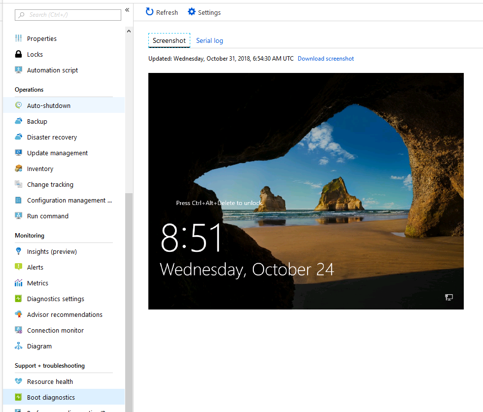
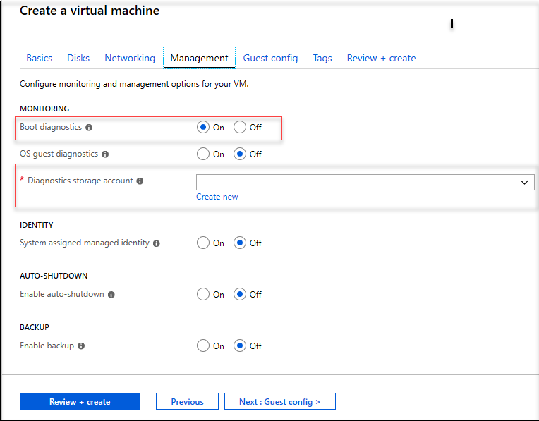
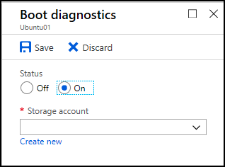

# How to use boot diagnostics to troubleshoot virtual machines in Azure

There can be many reasons that a virtual machine enters a non-bootable state. To address issues with your virtual machines created using Resource Manager deployment model you can use the following debugging features: Console Output and Screenshot support for Azure virtual machines. 

For Linux virtual machines, you can view the output of your console log from the Portal. For both Windows and Linux virtual machines, Azure enables you to see a screenshot of the VM from the hypervisor. Both features are supported for Azure virtual machines in all regions. Note, screenshots, and output can take up to 10 minutes to appear in your storage account.

You can select the **Boot diagnostics** option to view the log and the screenshot.



## Common boot errors

- [0xC000000E](https://support.microsoft.com/help/4010129)
- [0xC000000F](https://support.microsoft.com/help/4010130)
- [0xC0000011](https://support.microsoft.com/help/4010134)
- [0xC0000034](https://support.microsoft.com/help/4010140)
- [0xC0000098](https://support.microsoft.com/help/4010137)
- [0xC00000BA](https://support.microsoft.com/help/4010136)
- [0xC000014C](https://support.microsoft.com/help/4010141)
- [0xC0000221](https://support.microsoft.com/help/4010132)
- [0xC0000225](https://support.microsoft.com/help/4010138)
- [0xC0000359](https://support.microsoft.com/help/4010135)
- [0xC0000605](https://support.microsoft.com/help/4010131)
- [An operating system wasn't found](https://support.microsoft.com/help/4010142)
- [Boot failure or INACCESSIBLE_BOOT_DEVICE](https://support.microsoft.com/help/4010143)

## Enable diagnostics on a virtual machine created using the Azure Portal

The following procedure is for a virtual machine created using the Resource Manager deployment model.

On the **Management** tab, in **Monitoring** section, make sure that **Boot diagnostics** is turned on. From the **Diagnostics storage account** drop-down list, select a storage account in which to place the diagnostic files.
 


> [!NOTE]
> The Boot diagnostics feature does not support premium storage account. If you use the premium storage account for Boot diagnostics, you might receive the StorageAccountTypeNotSupported error when you start the VM.
>

### Deploying from an Azure Resource Manager template

If you are deploying from an Azure Resource Manager template, navigate to your virtual machine resource and append the diagnostics profile section. Set the API version header to "2015-06-15" or later. The latest version is "2018-10-01".

```json
{
  "apiVersion": "2018-10-01",
  "type": "Microsoft.Compute/virtualMachines",
  … 
```

The diagnostics profile enables you to select the storage account where you want to put these logs.

```json
    "diagnosticsProfile": {
	"bootDiagnostics": {
	"enabled": true,
	"storageUri": "[concat('https://', parameters('newStorageAccountName'), '.blob.core.windows.net')]"
	}
    }
    }
}
```

For more information on deploying resources using templates, see [Quickstart: Create and deploy Azure Resource Manager templates by using the Azure portal](../../azure-resource-manager/templates/quickstart-create-templates-use-the-portal.md).

## Enable boot diagnostics on existing virtual machine 

To enable Boot diagnostics on an existing virtual machine, follow these steps:

1. Sign in to the [Azure portal](https://portal.azure.com), and then select the virtual machine.
2. In the **Support + troubleshooting** section, select **Boot diagnostics**, then select the **Settings** tab.
3. In **Boot diagnostics** settings, change the status to **On**, and from the **Storage account** drop-down list select a storage account. 
4. Save the change.

    

You must restart the virtual machine for the change to take effect.

### Enable boot diagnostics using the Azure CLI

You can use the Azure CLI to enable boot diagnostics on an existing Azure virtual machine. For more information, see [az vm boot-diagnostics](
https://docs.microsoft.com/cli/azure/vm/boot-diagnostics?view=azure-cli-latest).
