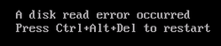
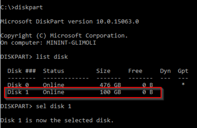
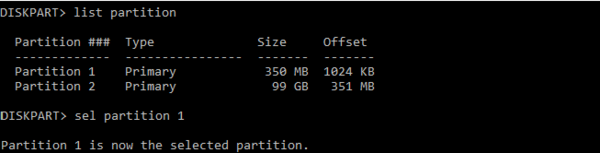
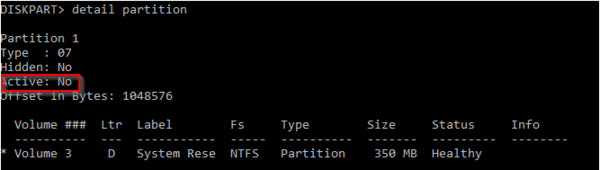
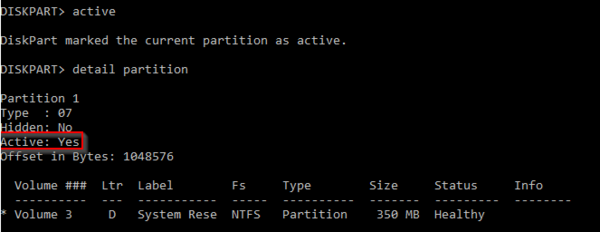

# Troubleshoot boot error - disk read error occurred

This article provides steps to resolve issues where the disk cannot be read in an Azure virtual machine (VM).

## Symptoms

When you use [Boot diagnostics](https://docs.microsoft.com/azure/virtual-machines/troubleshooting/boot-diagnostics) to view the screenshot of the VM, you will see that the screenshot displays a prompt with the message "A disk read error occurred. Press Ctrl+Alt+Del to restart".

   

## Cause

This error message indicates that the disk structure is corrupted and unreadable. If you are using a Generation 1 VM, it's also possible that the disk partition containing the boot configuration data isn’t set to **Active**.

## Solution

### Process overview

1. Create and Access a Repair VM.
1. Select a Solution:
   - [Set Partition Status to Active](#set-partition-status-to-active)
   - [Fix the Disk Partition](#fix-the-disk-partition)
1. Enable serial console and memory dump collection.
1. Rebuild the VM.

> [!NOTE]
> When encountering this boot error, the Guest operating system (OS) is not operational. You'll be troubleshooting in offline mode to resolve this issue.

### Create and access a repair VM

1. Use steps 1-3 of the [VM Repair Commands](https://docs.microsoft.com/azure/virtual-machines/troubleshooting/repair-windows-vm-using-azure-virtual-machine-repair-commands) to prepare a Repair VM.
1. Using Remote Desktop Connection, connect to the Repair VM.

### Set partition status to active

Generation 1 VMs should first verify that the OS partition which holds the BCD store is marked as **Active**. If you have a Generation 2 VM, skip ahead to [Fix the Disk Partition](#fix-the-disk-partition), as the Status flag was deprecated in the later generation.

1. Open an elevated command prompt (cmd.exe).
1. Enter **diskpart** to launch the **DISKPART** tool.
1. Enter **list disk** to list the disks on the system and identify the attached OS virtual hard disk (VHD).
1. Once the attached OS VHD is located, enter **sel disk #** to select the disk. See the following image for an example of where Disk 1 is the attached OS VHD.

   

1. Once the disk is selected, enter **list partition** to list the partitions of the selected disk.
1. Once the boot partition is identified, enter **sel partition #** to select the partition. The boot partition is often approximately 350 MB in size.  See the following image for example where Partition 1 is the boot partition.

   

1. Enter **detail partition** to check the status of the partition. See the following screenshots for examples of the partition being set to **Active: No** or **Active: Yes**.

   **Active: No**

   

   **Active: Yes**

   

1. If the partition is not set to **Active**, enter **active** to change the Active flag.
1. Enter **detail partition** to check that the status change was completed properly, and verify that the output includes **Active: Yes**. 
1. Enter **exit** to close the DISKPART tool and save your configuration changes.

### Fix the disk partition

1. Open an elevated command prompt (cmd.exe).
1. Use the following command to run **CHKDSK** on the disk(s) and perform error fixes:

   `chkdsk <DRIVE LETTER>: /f`

   Adding the **/f** command option will fix any errors on the disk. Make sure to replace **< DRIVE LETTER >** with the letter of the attached OS VHD.

### Enable the serial console and memory dump collection

**Recommended**: Before you rebuild the VM, enable the Serial Console and memory dump collection by running the following script:

1. Open an elevated command prompt session as an Administrator.
1. Run the following commands:

   **Enable the Serial Console**:
   
   ```
   bcdedit /store <VOLUME LETTER WHERE THE BCD FOLDER IS>:\boot\bcd /ems {<BOOT LOADER IDENTIFIER>} ON 
   bcdedit /store <VOLUME LETTER WHERE THE BCD FOLDER IS>:\boot\bcd /emssettings EMSPORT:1 EMSBAUDRATE:115200
   ```

1. Verify that the free space on the OS disk is larger than the memory size (RAM) on the VM.

   If there's not enough space on the OS disk, change the location where the memory dump file will be created, and refer that location to any data disk attached to the VM that has enough free space. To change the location, replace **%SystemRoot%** with the drive letter of the data disk, such as **F:**, in the following commands.

   Suggested configuration to enable OS Dump:

   **Load Registry Hive from the broken OS Disk:**

   ```
   REG LOAD HKLM\BROKENSYSTEM <VOLUME LETTER OF BROKEN OS DISK>:\windows\system32\config\SYSTEM
   ```

   **Enable on ControlSet001:**

   ```
   REG ADD "HKLM\BROKENSYSTEM\ControlSet001\Control\CrashControl" /v CrashDumpEnabled /t REG_DWORD /d 1 /f 
   REG ADD "HKLM\BROKENSYSTEM\ControlSet001\Control\CrashControl" /v DumpFile /t REG_EXPAND_SZ /d "%SystemRoot%\MEMORY.DMP" /f 
   REG ADD "HKLM\BROKENSYSTEM\ControlSet001\Control\CrashControl" /v NMICrashDump /t REG_DWORD /d 1 /f 
   ```

   **Enable on ControlSet002:**

   ```
   REG ADD "HKLM\BROKENSYSTEM\ControlSet002\Control\CrashControl" /v CrashDumpEnabled /t REG_DWORD /d 1 /f 
   REG ADD "HKLM\BROKENSYSTEM\ControlSet002\Control\CrashControl" /v DumpFile /t REG_EXPAND_SZ /d "%SystemRoot%\MEMORY.DMP" /f 
   REG ADD "HKLM\BROKENSYSTEM\ControlSet002\Control\CrashControl" /v NMICrashDump /t REG_DWORD /d 1 /f 
   ```

   **Unload Broken OS Disk:**

   ```
   REG UNLOAD HKLM\BROKENSYSTEM
   ```
   
### Rebuild the VM

Use [step 5 of the VM Repair Commands](https://docs.microsoft.com/azure/virtual-machines/troubleshooting/repair-windows-vm-using-azure-virtual-machine-repair-commands#repair-process-example) to rebuild the VM.
