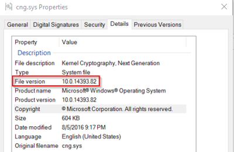
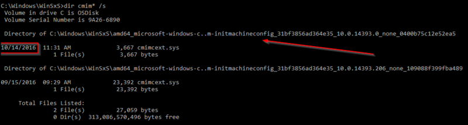
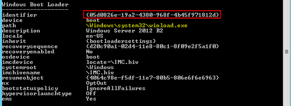
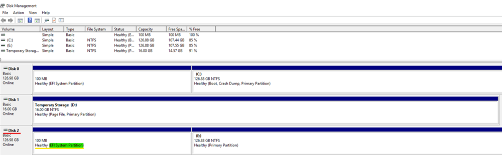
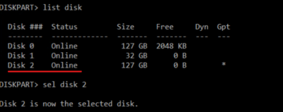
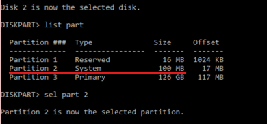
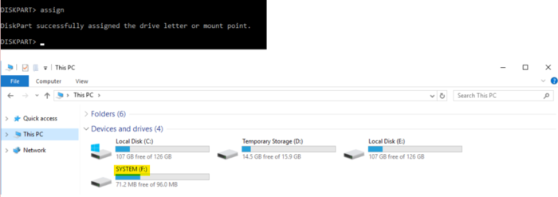
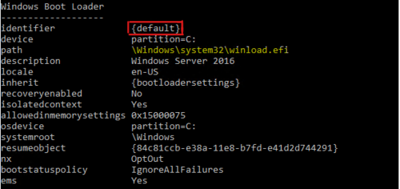
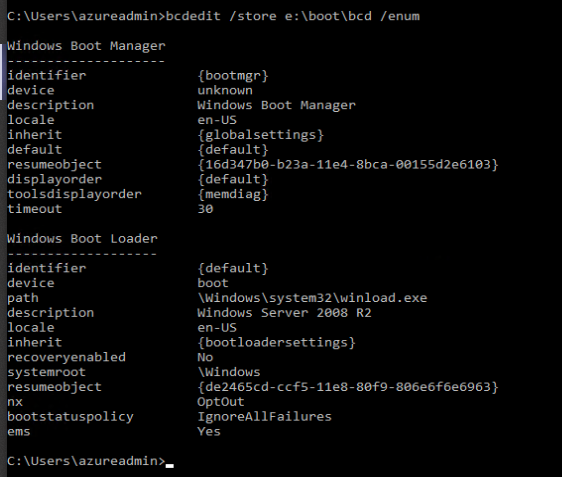

# Troubleshoot Windows Boot Manager error  - 0xC0000225 "Status not found"
 
This article provides steps to resolve issues where error code 0xC0000225 occurs in an Azure VM. This error states that the status or object is not found.

## Symptoms

When you use [Boot diagnostics](https://docs.microsoft.com/azure/virtual-machines/troubleshooting/boot-diagnostics) to view the screenshot of the VM, you will see that the screenshot displays a Windows failed to start error with the Status code *0xc0000225*.

The file associated with this error code will inform you which steps to take in order to resolve the issue. Locate the **File:** section’s text to determine the appropriate course of action.

### Drivers, OS Related or Third Party

If the file is present but refers to a driver (as is shown) or is OS related or third party, follow the steps under the section [Repair the System File](#repair-the-system-file).
 
In the following image, Windows Boot Manager states "Windows failed to start. A recent hardware or software change might be the cause." The image also shows the Status as "0xc0000225", **File:** as `\windows\System32\drivers\atapi.sys`, and **Info:** as "The operating system couldn’t be loaded because a critical system driver is missing or contains errors."


### No File

If presented with the Status code, but no file is shown, follow the steps under the section [Add the OSDEVICE Variable](#add-the-osdevice-variable).

In the following image, Windows Boot Manager states "Windows failed to start. A recent hardware or software change might be the cause." The image also shows the Status as "0xc0000225", and **Info:** as "The boot selection failed because a required device is inaccessible."


### Registry File

If it refers to any of the registry files, such as \windows\system32\config\system, follow the steps under the section [Create a Support Ticket](#contact-support).
 
In the following image, Windows Boot Manager states "Windows failed to start. A recent hardware or software change might be the cause." The image also shows the Status as "0xc0000225", the File as `\windows\System32\config\system`, and **Info:** as "The operating system couldn’t be loaded because the system registry file is missing or contains errors."


In the following image, the recovery screen states "Your PC/Device needs to be repaired. The operating system couldn’t be loaded because the system registry file is missing or contains errors." The image also shows the Error code as "0xc0000225" and the File as `\windows\System32\config\system`.


## Causes

### Missing Binary

You may be encountering missing or corrupted binary on your System **(.sys)** file.

### BCD Corruption or Improper VHD Migration

In this case, either the **Boot Configuration Data (BCD)** is corrupted, or the **virtual hard drive (VHD)** was migrated from on-premises, but wasn’t properly prepared. The result is that the **OSDEVICE** variable is missing and will need to be added.

### Registry Hive Corruption

A registry hive corruption could be due to:

- The Hive fails
- The Hive mounts, but is empty
- The Hive was not closed properly
## Solution

### Process Overview

1. Create and access a Repair VM.
1. Select a Solution:
   - [Repair the System File](#repair-the-system-file)
   - [Add the OSDevice Variable](#add-the-osdevice-variable)
   - [Create a Support Ticket](#contact-support)
1. Enable serial console and memory dump collection.
1. Rebuild the VM.

### Create and Access a Repair VM

1. Use steps 1-3 of the [VM Repair Commands](https://docs.microsoft.com/azure/virtual-machines/troubleshooting/repair-windows-vm-using-azure-virtual-machine-repair-commands) to prepare a Repair VM.
1. Using Remote Desktop Connection, connect to the Repair VM.

### Select a Solution

1. Open an elevated command prompt.
1. Based on the symptom that you identified earlier, follow the steps in the corresponding solution. You may skip the steps in the other solutions, as they won’t apply to your issue:

- [Repair the System File](#repair-the-system-file)
- [Add the OSDevice Variable](#add-the-osdevice-variable)
- [Create a Support Ticket](#contact-support)

### Repair the System File

1. Using the attached VHD, navigate to the file location of the binary shown in your virtual machine (VM) screenshot.
1. Right-click the file, select **Properties**, and then select the **Details** tab to see information on the file.
   1. Note the version of the file, as shown in the image below:

      

1. Rename the file to **< BINARY.SYS >.old**, replacing **< BINARY.SYS >** with the name of the file.

   For the image in the step above, the file **cng.sys** would be renamed to **cng.sys.old**

   > [!NOTE]
   > If you try to rename the file and receive the message "The file is corrupted and unreadable", [contact support for assistance](https://azure.microsoft.com/support/create-ticket/), as this solution will not work.

1. Now that the corrupt file is renamed, fix the file by restoring it from its internal repository.
   1. Launch a **CMD** session.
   1. Navigate to **\windows\winsxs**.

   1. Search for the binary located at the beginning of this section using the following command:

      `dir <BINARY WITH ".SYS" EXTENSION>  /s`

      This command will list all versions of the file that the machine has, giving you the path history of that component.
	  
	  For example, **dir cng.sys** would be renamed **dir cng.sys /s**

   1. Choose the latest version of the file on the list (or any that you prefer) and copy the file to the **windows\system32** folder using previous path and the following command:

      `copy <drive>:\Windows\WinSxS\<DIRECTORY WHERE FILE IS>\<BINARY WITH ".SYS" EXTENSION> <DRIVE>:\Windows\System32\Drivers\`

      > [!NOTE]
      > If the latest binary didn’t work, try a version before that one, or any of which you know there is a stable file, such as a version before a patch.

      For example, if the binary you are looking for is **cmimcext.sys**, the faulty drive is drive **F:**, and you just ran a search for the latest version, you would see the following image, where a query in command prompt of `dir cmim* /s` locates the latest version of the cmimcext.sys file.

      

      In the example image above, the query was performed on **C:**, whereas the drive letter should be that of the faulty drive, **F:**, which is the OS disk attached as a data disk on the repair VM.

      The resulting command to copy the file would be: `copy F:\Windows\WinSxS\amd64_xxxxxx\cmimcext.sys F:\Windows\System32\Drivers`.

Once this task is complete, continue to [Enable the Serial Console and memory dump collection](#enable-the-serial-console-and-memory-dump-collection).

### Add the OSDEVICE Variable

Collect the current booting setup information and note the identifier on the active partition. You will then use this information to add the **OSDEVICE** variable, following the directions for the generation of your VM.

If this information collection gives an error where there's no **\boot\bcd** file, then use the instructions in [Repair the System File](#repair-the-system-file) instead. 

1. For Generation 1 VMs, open an elevated command prompt as an Administrator and enter the following command:

   `bcdedit /store <LETTER OF BOOT FOLDER>:\boot\bcd /enum`

   This image shows Windows Boot Loader in a Generation 1 VM, with the identifier attribute highlighted. The identifier attribute highlighted shows a unique alphanumeric string.

   

   Note the identifier of the Windows Boot Loader, whose path is **\windows\system32\winload.exe**.

1. For Generation 2 VMs, verify both that the OS disk is online, and that its partition drive letters have been assigned. When this has been verified, collect the boot setup information.
   1. In **Windows search**, type **Disk Management** and open the disk management console. Use this console to identify the disk number attached on your repair VM and the Extensible Firmware Interface (EFI) partition which holds the BCD store.

   In the following image, Disk 2 is the disk number attached to the Repair VM. The image also shows the EFI System Partition on Disk 2, which is 100MB in size and doesn’t have an assigned letter.

   

   1. Open an elevated command prompt as an Administrator and enter the following commands:
      1. Open the **DISKPART TOOL** using the command `diskpart`.
      1. List all disks, then select the attached disk identified in the previous step:
	  
	     ```
         list disk
         sel disk <DISK #>
	     ```

         The following image shows the results of listing and selecting a disk. Disk 0 (127 GB | Online), Disk 1 (32 GB | Online), and Disk 2 (127 GB | Online) are listed, with Disk 2 being selected using the command `sel disk 2`.

         

      1. List the partitions and select the EFI system partition identified in the previous step:
	  
	     ```
         list partition
         sel partition <PARTITION #>
	     ```

         The following image shows the results of listing and selecting a partition. Partition 1 (Reserved | 16MB), Partition 2 (System | 100MB), and Partition 3 (Primary | 126 GB) are listed, with Partition 2 being selected using the command `sel part 2`.

         

      1. Assign a letter to the EFI partition using the command `assign`.

         In the following image, the `assign` command and the new drive **SYSTEM (F:)** are both viewable in File Explorer.

         

      1. List the BCD store data using the following command:
	  
         `bcdedit /store <LETTER OF EFI SYSTEM PARTITION>:EFI\Microsoft\boot\bcd /enum`

         In the following image, Windows Boot Loader is in a generation 2 VM with the identifier attribute highlighted. The highlighted identifier attribute has a value of **{default}**.

         

         Note the identifier of the Windows Boot Loader, whose path is **\windows\system32\winload.efi**.

1. Notice that the OSDEVICE variable on the active partition is missing:

   
   
   In this image, Windows Boot Manager and Windows Boot Loader’s attributes are listed in the command prompt, but the OSDEVICE attribute is missing.

1. Add the OSDEVICE variable based on the following information:

   For single partitions OS disks, add `BOOT`.

   > [!NOTE]
   > The boot-able folder will be on the same partition as the windows folder **\windows folder**.
   > - The bootable folder for Generation 1 VMs is **(\boot\bcd folder)**.
   > - The bootable folder for Generation 2 VMs is **EFI\Microsoft\boot\bcd**.

   For Generation 1 VMs, enter the following command:

   `bcdedit /store <LETTER OF BOOT FOLDER>:\boot\bcd /set {<IDENTIFIER>} OSDEVICE BOOT`

   For Generation 2 VMs, enter the following command:

   `bcdedit /store <LETTER OF EFI FOLDER>:EFI\Microsoft\boot\bcd /set {<IDENTIFIER>} OSDEVICE BOOT`

   For multiple partition OS disks, add `PARTITION=<LETTER OF WINDOWS FOLDER>:`.

   > [!NOTE]
   > The boot-able folder will most likely be on a different partition than the windows folder **\windows folder**.
   > - The bootable folder for Generation 1 VMs is **(\boot\bcd folder)**.
   > - The bootable folder for Generation 2 VMs is **EFI\Microsoft\boot\bcd**.

   For Generation 1 VMs, enter the following command:

   `bcdedit /store <LETTER OF BOOT FOLDER>:\boot\bcd /set {<IDENTIFIER>} OSDEVICE partition=<LETTER OF WINDOWS FOLDER>:`

   For Generation 2 VMs, enter the following command:

   `bcdedit /store <LETTER OF EFI FOLDER>:EFI\Microsoft\boot\bcd /set {< IDENTIFIER>} OSDEVICE partition=<LETTER OF WINDOWS FOLDER>:`

Once this task is complete, continue to [Enable the Serial Console and memory dump collection](#enable-the-serial-console-and-memory-dump-collection).

### Contact Support

The **Registry File** error has a solution, but you will need to [create a support ticket](https://azure.microsoft.com/support/create-ticket/) for further assistance.

### Enable the Serial Console and memory dump collection

**Recommended**: Before you rebuild the VM, enable the Serial Console and memory dump collection by running the following script:

1. Open an elevated command prompt session as an Administrator.
1. Run the following commands:

   **Enable the Serial Console**:
   
   ```
   bcdedit /store <VOLUME LETTER WHERE THE BCD FOLDER IS>:\boot\bcd /ems {<BOOT LOADER IDENTIFIER>} ON 
   bcdedit /store <VOLUME LETTER WHERE THE BCD FOLDER IS>:\boot\bcd /emssettings EMSPORT:1 EMSBAUDRATE:115200
   ```

1. Verify that the free space on the OS disk is larger than the memory size (RAM) on the VM.

   If there's not enough space on the OS disk, change the location where the memory dump file will be created, and refer that location to any data disk attached to the VM that has enough free space. To change the location, replace **%SystemRoot%** with the drive letter of the data disk, such as **F:**, in the following commands.

   Suggested configuration to enable OS Dump:

   **Load Registry Hive from the broken OS Disk:**

   ```
   REG LOAD HKLM\BROKENSYSTEM <VOLUME LETTER OF BROKEN OS DISK>:\windows\system32\config\SYSTEM
   ```

   **Enable on ControlSet001:**

   ```
   REG ADD "HKLM\BROKENSYSTEM\ControlSet001\Control\CrashControl" /v CrashDumpEnabled /t REG_DWORD /d 1 /f 
   REG ADD "HKLM\BROKENSYSTEM\ControlSet001\Control\CrashControl" /v DumpFile /t REG_EXPAND_SZ /d "%SystemRoot%\MEMORY.DMP" /f 
   REG ADD "HKLM\BROKENSYSTEM\ControlSet001\Control\CrashControl" /v NMICrashDump /t REG_DWORD /d 1 /f 
   ```

   **Enable on ControlSet002:**

   ```
   REG ADD "HKLM\BROKENSYSTEM\ControlSet002\Control\CrashControl" /v CrashDumpEnabled /t REG_DWORD /d 1 /f 
   REG ADD "HKLM\BROKENSYSTEM\ControlSet002\Control\CrashControl" /v DumpFile /t REG_EXPAND_SZ /d "%SystemRoot%\MEMORY.DMP" /f 
   REG ADD "HKLM\BROKENSYSTEM\ControlSet002\Control\CrashControl" /v NMICrashDump /t REG_DWORD /d 1 /f 
   ```

   **Unload Broken OS Disk:**

   ```
   REG UNLOAD HKLM\BROKENSYSTEM
   ```
   
### Rebuild the VM

Use [step 5 of the VM Repair Commands](https://docs.microsoft.com/azure/virtual-machines/troubleshooting/repair-windows-vm-using-azure-virtual-machine-repair-commands#repair-process-example) to rebuild the VM.
