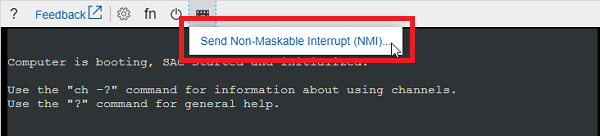

# Azure Windows VM shutdown is stuck on "Restarting", “Shutting Down”, or “Stopping services”

This article provides steps to resolve the issues of "Restarting", “Shutting down”, or “Stopping services” messages that you may encounter when you reboot a Windows virtual machine (VM) in Microsoft Azure.

## Symptoms

When you use [Boot diagnostics](https://docs.microsoft.com/azure/virtual-machines/troubleshooting/boot-diagnostics) to view the screenshot of the VM, you may see that the screenshot displays the message "Restarting", “Shutting down”, or “Stopping services”.


 
## Cause

Windows uses the shutdown process to perform system maintenance operations, and process changes such as updates, roles, and features. It's not recommended to interrupt this critical process until it completes. Depending on the number of updates/changes and the VM size, the process may take a long time. If the process is stopped, it's possible for the OS to become corrupt. Only interrupt the process if it's taking excessively long.

## Solution

### Collect a Process memory dump

1. Download [Procdump tool](http://download.sysinternals.com/files/Procdump.zip) into a new or existing data disk, which is attached to a working VM from the same region.

2. Detach the disk containing the files needed from the working VM and attach the disk to your broken VM. We are calling this disk the **Utility disk**.

Use [Serial Console](https://docs.microsoft.com/azure/virtual-machines/troubleshooting/serial-console-windows) to complete the following steps:

1. Open an administrative Powershell and check the service that stops responding upon stopping.

   ``
   Get-Service | Where-Object {$_.Status -eq "STOP_PENDING"}
   ``

2. On an administrative CMD, get the PID of the unresponsive service.

   ``
   tasklist /svc | findstr /i <STOPING SERVICE>
   ``

3. Get a memory dump sample from the unresponsive process <STOPPING SERVICE>.

   ``
   procdump.exe -s 5 -n 3 -ma <PID>
   ``

4. Now kill the unresponsive process to unlock the shutdown process.

   ``
   taskkill /PID <PID> /t /f
   ``

Once the OS starts again, if it boots normally, then just ensure the OS consistency is ok. If corruption is reported run the following command until the disk is corruption free:

``
dism /online /cleanup-image /restorehealth
``

If you are unable to collect a process memory dump, or this issue is recursive and you require a root cause analysis, proceed with collecting an OS memory dump below, the proceed to open a support request.

### Collect an OS memory dump

If the issue does not resolve after waiting for the changes to process, you would need to collect a memory dump file and contact support. To collect the Dump file, follow these steps:

**Attach the OS disk to a recovery VM**

1. Take a snapshot of the OS disk of the affected VM as a backup. For more information, see [Snapshot a disk](https://docs.microsoft.com/azure/virtual-machines/windows/snapshot-copy-managed-disk).

2. [Attach the OS disk to a recovery VM](https://docs.microsoft.com/azure/virtual-machines/windows/troubleshoot-recovery-disks-portal).

3. Remote desktop to the recovery VM.

4. If the OS disk is encrypted, you must turn off the encryption before you move to the next step. For more information, see [Decrypt the encrypted OS disk in the VM that cannot boot](https://docs.microsoft.com/azure/virtual-machines/troubleshooting/troubleshoot-bitlocker-boot-error#solution).

**Locate dump file and submit a support ticket**

1. On the recovery VM, go to windows folder in the attached OS disk. If the driver letter that is assigned to the attached OS disk is F, you need to go to F:\Windows.

2. Locate the memory.dmp file, and then [submit a support ticket](https://portal.azure.com/?#blade/Microsoft_Azure_Support/HelpAndSupportBlade) with the dump file.

If you cannot find the dump file, move the next step to enable dump log and Serial Console.

**Enable dump log and Serial Console**

To enable dump log and Serial Console, run the following script.

1. Open elevated command Prompt session (Run as administrator).

2. Run the following script:

   In this script, we assume that the drive letter that is assigned to the attached OS disk is F. Replace it with the appropriate value in your VM.

   ```
   reg load HKLM\BROKENSYSTEM F:\windows\system32\config\SYSTEM.hiv
   
   REM Enable Serial Console
   bcdedit /store F:\boot\bcd /set {bootmgr} displaybootmenu yes
   bcdedit /store F:\boot\bcd /set {bootmgr} timeout 5
   bcdedit /store F:\boot\bcd /set {bootmgr} bootems yes
   bcdedit /store F:\boot\bcd /ems {<BOOT LOADER IDENTIFIER>} ON
   bcdedit /store F:\boot\bcd /emssettings EMSPORT:1 EMSBAUDRATE:115200
   
   REM Suggested configuration to enable OS Dump
   REG ADD "HKLM\BROKENSYSTEM\ControlSet001\Control\CrashControl" /v CrashDumpEnabled /t REG_DWORD /d 1 /f
   REG ADD "HKLM\BROKENSYSTEM\ControlSet001\Control\CrashControl" /v DumpFile /t REG_EXPAND_SZ /d "%SystemRoot%\MEMORY.DMP" /f
   REG ADD "HKLM\BROKENSYSTEM\ControlSet001\Control\CrashControl" /v NMICrashDump /t REG_DWORD /d 1 /f

   REG ADD "HKLM\BROKENSYSTEM\ControlSet002\Control\CrashControl" /v CrashDumpEnabled /t REG_DWORD /d 1 /f
   REG ADD "HKLM\BROKENSYSTEM\ControlSet002\Control\CrashControl" /v DumpFile /t REG_EXPAND_SZ /d "%SystemRoot%\MEMORY.DMP" /f
   REG ADD "HKLM\BROKENSYSTEM\ControlSet002\Control\CrashControl" /v NMICrashDump / t REG_DWORD /d 1 /f
   
   reg unload HKLM\BROKENSYSTEM
   ```

3. Verify that there's enough space on the disk to allocate as much memory as the RAM, which depends on the size that you are selecting for this VM.

4. If there's not enough space or the VM is large (G, GS or E series), you could change the location where this file will be created and refer that to any other data disk, which is attached to the VM. To change the location, you must change the following key:

   ```
   reg load HKLM\BROKENSYSTEM F:\windows\system32\config\SYSTEM.hiv

   REG ADD "HKLM\BROKENSYSTEM\ControlSet001\Control\CrashControl" /v DumpFile /t REG_EXPAND_SZ /d "<DRIVE LETTER OF YOUR DATA DISK>:\MEMORY.DMP" /f
   REG ADD "HKLM\BROKENSYSTEM\ControlSet002\Control\CrashControl" /v DumpFile /t REG_EXPAND_SZ /d "<DRIVE LETTER OF YOUR DATA DISK>:\MEMORY.DMP" /f
   
   reg unload HKLM\BROKENSYSTEM
   ```

5. [Detach the OS disk and then reattach the OS disk to the affected VM](https://docs.microsoft.com/azure/virtual-machines/windows/troubleshoot-recovery-disks-portal).

6. Start the VM and access the Serial Console.

7. Select Send Non-Maskable Interrupt (NMI) to trigger the memory dump.

   

8. Attach the OS disk to a recovery VM again, collect dump file.

## Contact Microsoft support

After you collect the dump file, contact Microsoft support to determine the root cause.
