# Troubleshooting a Linux VM when there is no access to the Azure serial console and the disk layout is using LVM (Logical Volume Manager)

This troubleshooting guide is of benefit for scenarios where a Linux VM is not booting,ssh is not possible and the underlying file system layout is configured with LVM (Logical Volume Manager).

## Take snapshot of the failing VM

Take a snapshot of the affected VM. 

The snapshot will then be attached to a **rescue** VM. 
Follow instructions [here](https://docs.microsoft.com/azure/virtual-machines/linux/snapshot-copy-managed-disk#use-azure-portal) on how to take a **snapshot**.

## Create a rescue VM
Usually a rescue VM of the same or similar Operating system version is recommended. Use the same **region** and **resource group** of the affected VM

## Connect to the rescue VM
Connect using ssh into the **rescue** VM. Elevate privileges and become super user using

`sudo su -`

## Attach the disk
Attach a disk to the **rescue** VM made from the snapshot taken previously.

Azure portal -> select the **rescue** VM -> **Disks** 

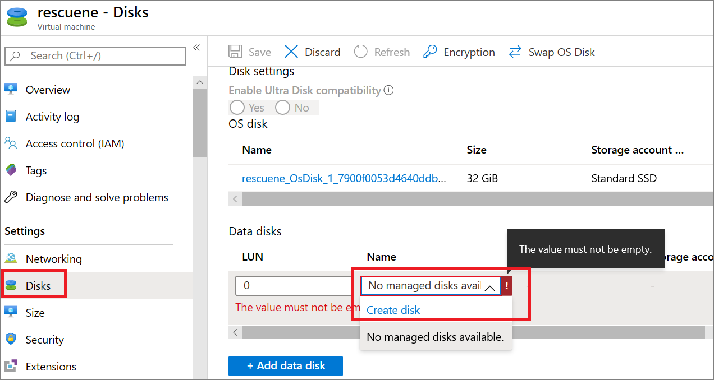

Populate the fields. 
Assign a name to your new disk, select the same Resource Group as the snapshot, affected VM, and Rescue VM.

The **Source type** is **Snapshot** .
The **Source snapshot** is the name of the **snapshot** previously created.

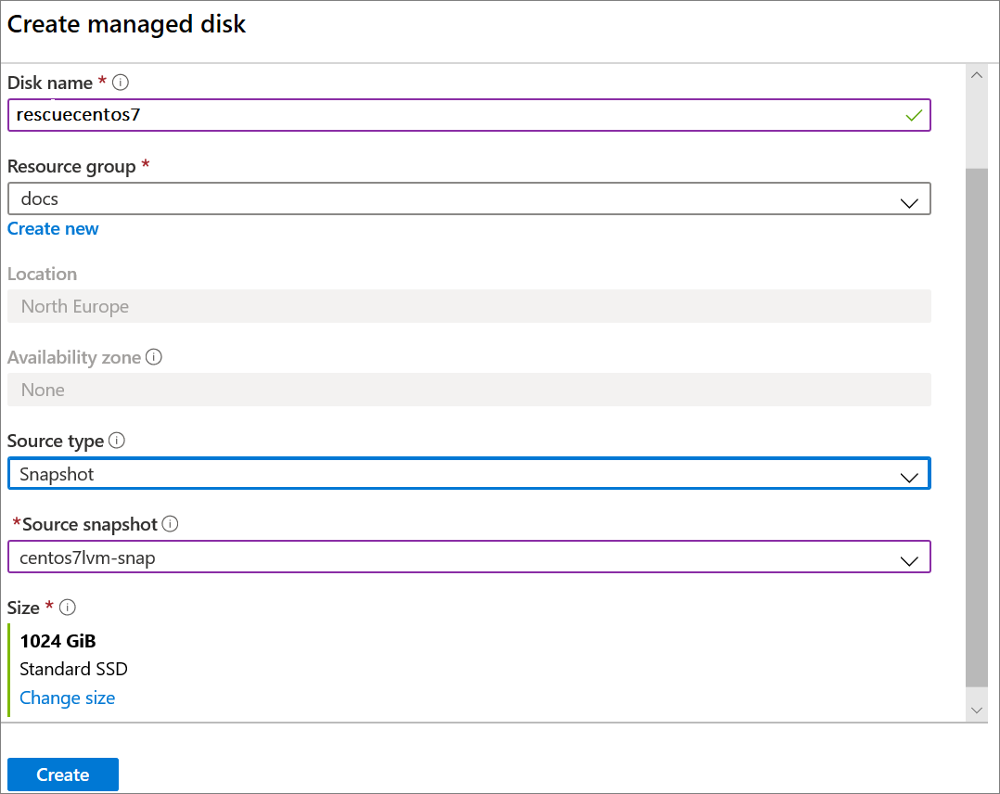

Create a mount point for the attached disk.

`mkdir /rescue`

Run the **fdisk -l** command to verify the snapshot disk has been attached and list all devices and partitions available

`fdisk -l`

Most scenarios, the attached snapshot disk will be seen as **/dev/sdc** displaying two partitions **/dev/sdc1** and **/dev/sdc2**

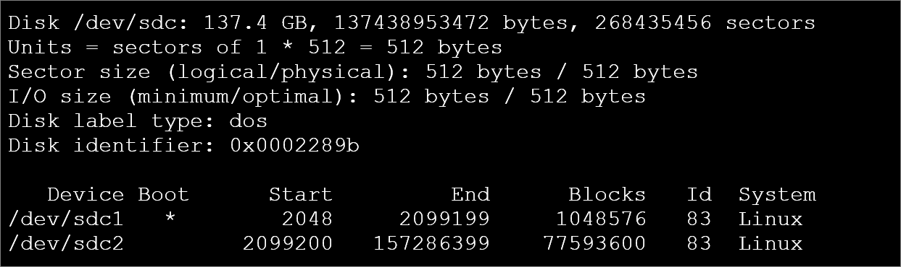

The **\*** indicates a boot partition, both partitions are to be mounted.

Run the command **lsblk** to see the LVMs of the affected VM

`lsblk`

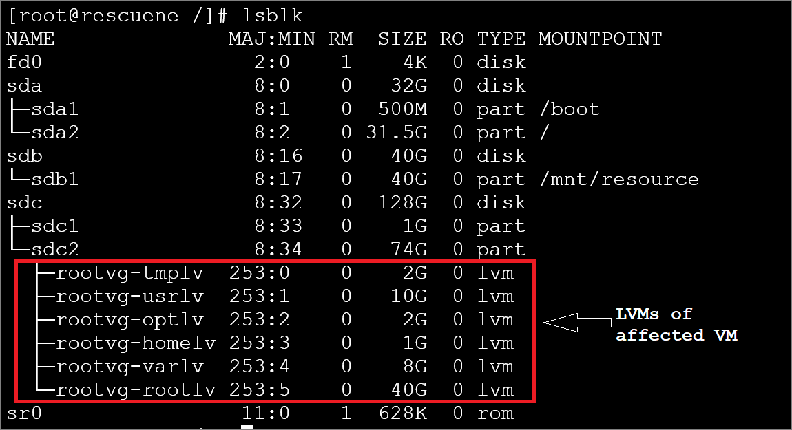


Verify if LVMs from the affected VM are displayed.
If not, use the below commands to enable them and rerun **lsblk**.
Ensure to have the LVMs from the attached disk visible before proceeding.

```
vgscan --mknodes
vgchange -ay
lvscan
mount –a
lsblk
```

Locate the path to mount the Logical Volume that contains the / (root)  partition. It has the configuration files such as /etc/default/grub

In this example, taking the output from the previous **lsblk** command  **rootvg-rootlv** is the correct **root** LV to mount and can be used in the next command.

The output of the next command will show the path to mount for the **root** LV

`pvdisplay -m | grep -i rootlv`

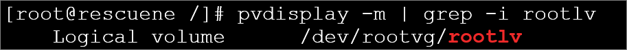

Proceed to mount this device on the directory /rescue

`mount /dev/rootvg/rootlv /rescue`

Mount the partition that has the **Boot flag** set on /rescue/boot

`
mount /dev/sdc1 /rescue/boot
`

Verify the file systems of the attached disk are now correctly mounted using the **lsblk** command

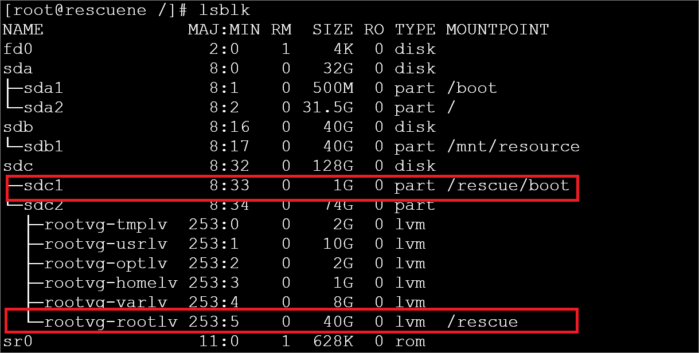

or the **df -Th** command

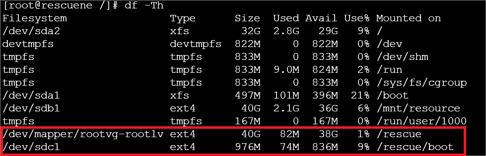

## Gaining chroot access

Gain **chroot** access, which will enable you to perform various fixes, slight variations exist for each Linux distribution.

```
 cd /rescue​
 mount -t proc proc proc
 mount -t sysfs sys sys/​
 mount -o bind /dev dev/​
 mount -o bind /dev/pts dev/pts/​
 chroot /rescue​
```

If an error is experienced such as:

**chroot: failed to run command ‘/bin/bash’: No such file or directory**

attempt to mount the **usr** Logical Volume

`
mount  /dev/mapper/rootvg-usrlv /rescue/usr
`

> [!TIP]
> When executing commands in a **chroot** environment, note they are run against the attached OS Disk and not the local **rescue** VM. 

Commands can be used to install, remove and update software. Troubleshoot VMs in order to fix errors.


Execute the lsblk command and the /rescue is now / and /rescue/boot is /boot
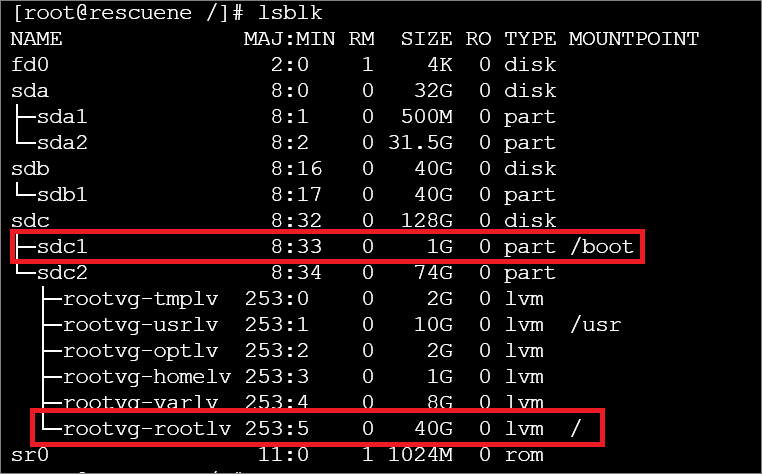

## Perform Fixes

### Example 1 - configure the VM to boot from a different kernel

A common scenario is to force a VM to boot from a previous kernel as the current installed kernel may have become corrupt or an upgrade did not complete correctly.


```
cd /boot/grub2

grep -i linux grub.cfg

grub2-editenv list

grub2-set-default "CentOS Linux (3.10.0-1062.1.1.el7.x86_64) 7 (Core)"

grub2-editenv list

grub2-mkconfig -o /boot/grub2/grub.cfg
```

*walkthrough*

The **grep** command lists the kernels that **grub.cfg** is aware of.
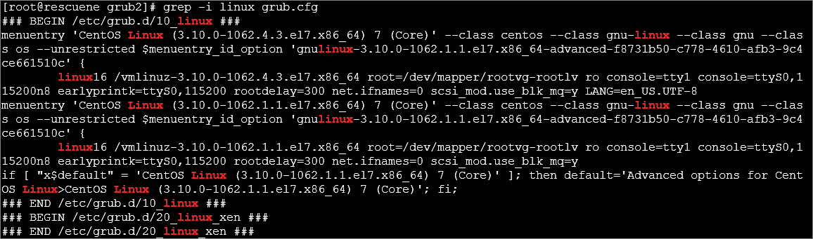

**grub2-editenv list** displays which kernel will be loaded at next boot
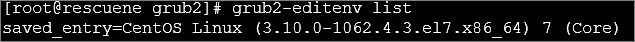

**grub2-set-default** is used to change to another kernel
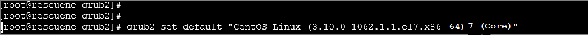

**grub2-editenv** list displays which kernel will be loaded at next boot
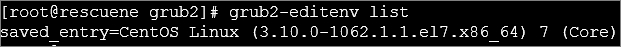

**grub2-mkconfig** rebuilds grub.cfg using the versions required
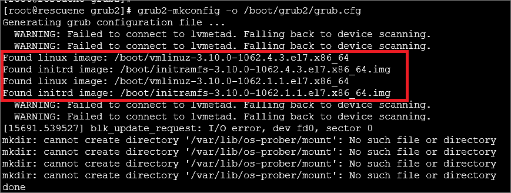


### Example 2 - upgrade packages

A failed kernel upgrade can render the VM non-bootable.
Mount all the Logical Volumes to allow packages to be removed or reinstalled

Run the **lvs** command to verify which **LVs** are available for mounting, every VM, which has been migrated or comes from another Cloud Provider will vary in configuration.

Exit the **chroot** environment mount the required **LV**

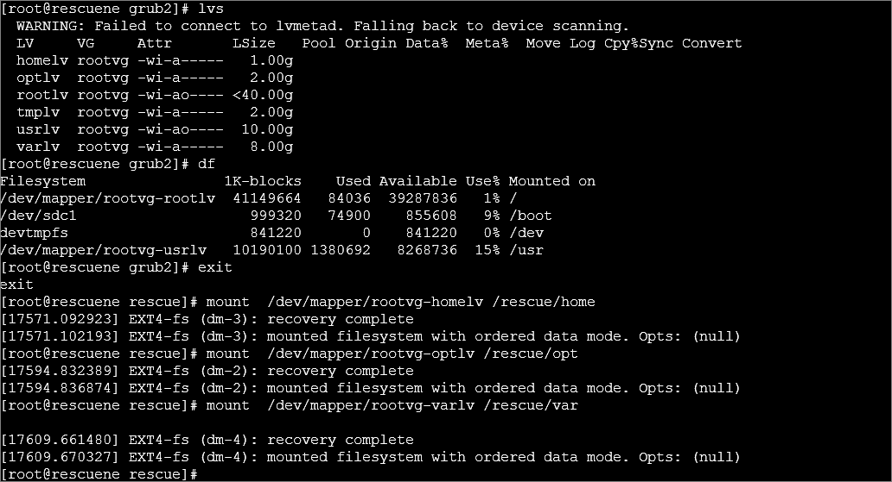

Now access the **chroot** environment again by running

`chroot /rescue`

All LVs should be visible as mounted partitions

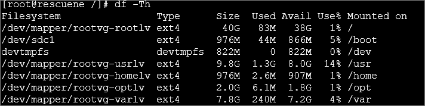

Query the installed **kernel**

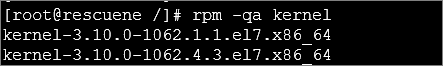

If needed remove or upgrade the **kernel**
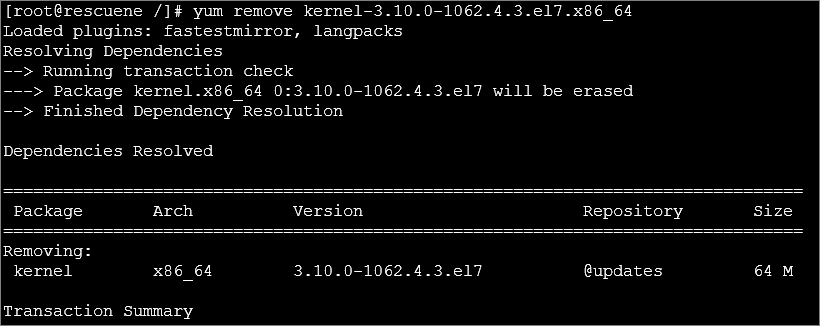


### Example 3 - enable Serial Console
If access has not been possible to the Azure serial console, verify GRUB configuration parameters for your Linux VM and correct them. Detailed information can be found [in this doc](https://docs.microsoft.com/azure/virtual-machines/troubleshooting/serial-console-grub-proactive-configuration)

### Example 4 - kernel loading with problematic LVM swap volume

A  VM may fail to fully boot and drops into the **dracut** prompt.
More details of the failure can be located from either Azure serial console or navigate to Azure portal -> boot diagnostics -> Serial log


An error similar to this may be present:

```
[  188.000765] dracut-initqueue[324]: Warning: /dev/VG/SwapVol does not exist
         Starting Dracut Emergency Shell...
Warning: /dev/VG/SwapVol does not exist
```

The grub.cfg is configured in this example to load an LV with the name of **rd.lvm.lv=VG/SwapVol** and the VM is unable to locate this. This line shows how the kernel is being loaded referencing the LV SwapVol

```
[    0.000000] Command line: BOOT_IMAGE=/vmlinuz-3.10.0-1062.4.1.el7.x86_64 root=/dev/mapper/VG-OSVol ro console=tty0 console=ttyS0 earlyprintk=ttyS0 net.ifnames=0 biosdevname=0 crashkernel=256M rd.lvm.lv=VG/OSVol rd.lvm.lv=VG/SwapVol nodmraid rhgb quiet
[    0.000000] e820: BIOS-provided physical RAM map:
```

 Remove the offending LV from the /etc/default/grub configuration and rebuild grub2.cfg


## Exit chroot and swap the OS disk

After repairing the issue, proceed to unmount and detach the disk from the rescue VM allowing it to be swapped with the affected VM OS disk.

```
exit
cd /
umount /rescue/proc/
umount /rescue/sys/
umount /rescue/dev/pts
umount /rescue/dev/
umount /rescue/boot
umount /rescue
```

Detach the disk from the rescue VM and perform a Disk Swap.

Select the VM from the portal **Disks** and select **detach**
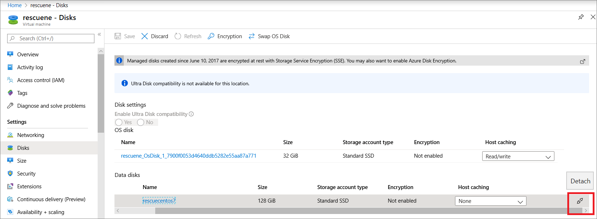 

Save the changes
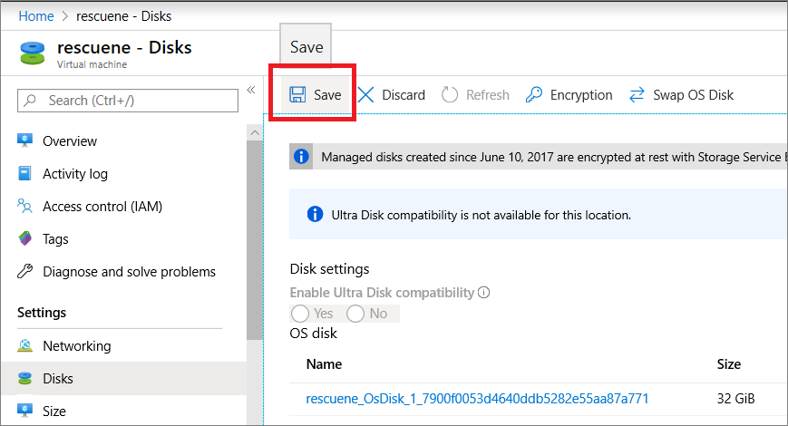 

The disk will now become available allowing it to be swapped with the original OS disk of the affected VM.

Navigate in the Azure portal to the failing VM and select **Disks** -> **Swap OS Disk**
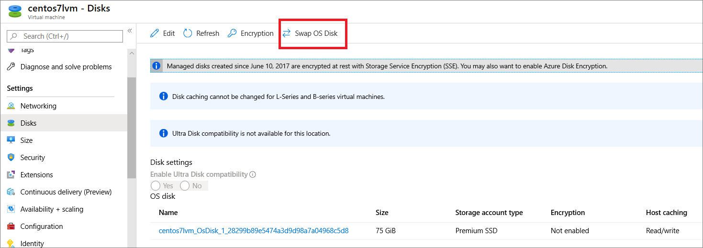 

Complete the fields the **Choose disk** is the snapshot disk just detached in the previous step. The VM name of the affected VM is also required then select **OK**

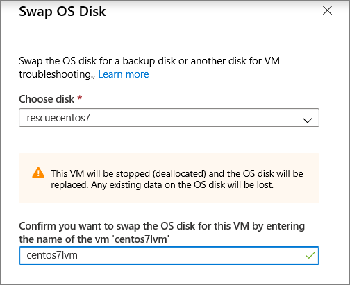 

If the VM is running the Disk Swap will shut it down, reboot the VM once the disk swap operation has completed.


## Next steps
Learn more about

 [Azure Serial Console]( https://docs.microsoft.com/azure/virtual-machines/troubleshooting/serial-console-linux)

[Single user mode](https://docs.microsoft.com/azure/virtual-machines/troubleshooting/serial-console-grub-single-user-mode)
