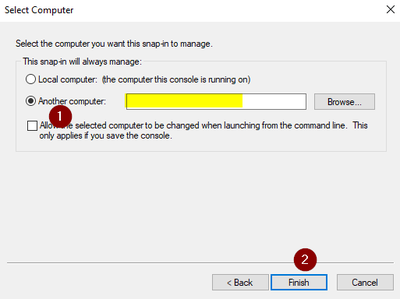

# Troubleshoot Azure VM RDP connection issues by Event ID 

This article explains how to use event IDs to troubleshoot issues that prevent a Remote Desktop protocol (RDP) connection to an Azure Virtual Machine (VM).

## Symptoms

You try to use a Remote Desktop protocol (RDP) session to connect to an Azure VM. After you input your credentials, the connection fails, and you receive the following error message:

**This computer can't connect to the remote computer. Try connecting again, if the problem continues, contact the owner of the remote computer or your network administrator.**

To troubleshoot this issue, review the event logs on the VM, and then refer to the following scenarios.

## Before you troubleshoot

### Create a backup snapshot

To create a backup snapshot, follow the steps in [Snapshot a disk](../windows/snapshot-copy-managed-disk.md).

### Connect to the VM remotely

To connect to the VM remotely, use one of the methods in [How to use remote tools to troubleshoot Azure VM issues](remote-tools-troubleshoot-azure-vm-issues.md).

## Scenario 1

### Event logs

In a CMD instance, run the following commands to check whether event 1058 or event 1057 is logged in the System log within the past 24 hours:

```cmd
wevtutil qe system /c:1 /f:text /q:"Event[System[Provider[@Name='Microsoft-Windows-TerminalServices-RemoteConnectionManager'] and EventID=1058 and TimeCreated[timediff(@SystemTime) <= 86400000]]]" | more
wevtutil qe system /c:1 /f:text /q:"Event[System[Provider[@Name='Microsoft-Windows-TerminalServices-RemoteConnectionManager'] and EventID=1057 and TimeCreated[timediff(@SystemTime) <= 86400000]]]" | more
```

**Log Name:**      System <br />
**Source:**        Microsoft-Windows-TerminalServices-RemoteConnectionManager <br />
**Date:**          *time* <br />
**Event ID:**      1058 <br />
**Task Category:** None <br />
**Level:**         Error <br />
**Keywords:**      Classic <br />
**User:**          N/A <br />
**Computer:**      *computer* <br />
**Description:**
The RD Session Host Server has failed to replace the expired self signed certificate used for RD Session Host Server authentication on TLS connections. The relevant status code was Access is denied.

**Log Name:**      System <br />
**Source:**        Microsoft-Windows-TerminalServices-RemoteConnectionManager <br />
**Date:**          *time* <br />
**Event ID:**      1058 <br />
**Task Category:** None <br />
**Level:**         Error <br />
**Keywords:**      Classic <br />
**User:**          N/A <br />
**Computer:**      *computer* <br />
**Description:**
RD Session host server has failed to create a new self-signed certificate to be used for RD Session host server authentication on TLS connections, the relevant status code was object already exists.

**Log Name:**      System <br />
**Source:**        Microsoft-Windows-TerminalServices-RemoteConnectionManager <br />
**Date:**          *time* <br />
**Event ID:**      1057 <br />
**Task Category:** None <br />
**Level:**         Error <br />
**Keywords:**      Classic <br />
**User:**          N/A <br />
**Computer:**      *computer* <br />
**Description:**
The RD Session Host Server has failed to create a new self signed certificate to be used for RD Session Host Server authentication on TLS connections. The relevant status code was Keyset does not exist

You can also check for SCHANNEL error events 36872 and 36870 by running the following commands:

```cmd
wevtutil qe system /c:1 /f:text /q:"Event[System[Provider[@Name='Schannel'] and EventID=36870 and TimeCreated[timediff(@SystemTime) <= 86400000]]]" | more
wevtutil qe system /c:1 /f:text /q:"Event[System[Provider[@Name='Schannel'] and EventID=36872 and TimeCreated[timediff(@SystemTime) <= 86400000]]]" | more
```

**Log Name:**      System <br />
**Source:**        Schannel <br />
**Date:**          — <br />
**Event ID:**      36870 <br />
**Task Category:** None <br />
**Level:**         Error <br />
**Keywords:**       <br />
**User:**          SYSTEM <br />
**Computer:**      *computer* <br />
**Description:** A fatal error occurred when attempting to access the TLS server credential private key. The error code returned from the cryptographic module is 0x8009030D.  <br />
The internal error state is 10001.

### Cause
This issue occurs because the local RSA encryption keys in the MachineKeys folder on the VM can't be accessed. This issue can occur for one of the following reasons:

1. Wrong permissions configuration on the Machinekeys folder or the RSA files.

2. Corrupted or missing RSA key.

### Resolution

To troubleshoot this issue, you have to set up the correct permissions on the RDP Certificate by using these steps.

#### Grant permission to the MachineKeys folder

1. Create a script by using the following content:

   ```powershell
   remove-module psreadline 
   icacls C:\ProgramData\Microsoft\Crypto\RSA\MachineKeys /t /c > c:\temp\BeforeScript_permissions.txt
   takeown /f "C:\ProgramData\Microsoft\Crypto\RSA\MachineKeys" /a /r
   icacls C:\ProgramData\Microsoft\Crypto\RSA\MachineKeys /t /c /grant "NT AUTHORITY\System:(F)"
   icacls C:\ProgramData\Microsoft\Crypto\RSA\MachineKeys /t /c /grant "NT AUTHORITY\NETWORK SERVICE:(R)"
   icacls C:\ProgramData\Microsoft\Crypto\RSA\MachineKeys /t /c /grant "BUILTIN\Administrators:(F)"
   icacls C:\ProgramData\Microsoft\Crypto\RSA\MachineKeys /t /c > c:\temp\AfterScript_permissions.txt
   Restart-Service TermService -Force
   ```

2.	Run this script to reset the permissions of the MachineKey folder and to reset the RSA files to the default values.

3.	Try to access the VM again.

After running the script, you can check the following files that are experiencing permissions issues:

* c:\temp\BeforeScript_permissions.txt
* c:\temp\AfterScript_permissions.txt

#### Renew RDP self-signed certificate

If the issue persists, run the following script to make sure that the RDP self-signed certificate is renewed:

```powershell
Import-Module PKI
Set-Location Cert:\LocalMachine
$RdpCertThumbprint = 'Cert:\LocalMachine\Remote Desktop\'+((Get-ChildItem -Path 'Cert:\LocalMachine\Remote Desktop\').thumbprint)
Remove-Item -Path $RdpCertThumbprint
Stop-Service -Name "SessionEnv"
Start-Service -Name "SessionEnv"
```

If you can't renew the certificate, follow these steps to try to delete the certificate:

1. On another VM in the same VNET, open the **Run** box, type **mmc**, and then press **OK**. 

2. On the **File** menu, select **Add/Remove Snap-in**.

3. In the **Available snap-Ins** list, select **Certificates**, and then select **Add**.

4. Select **Computer account**, and then select **Next**.

5. Select **Another computer**, and then add the IP address of the VM that has problems.
   >[!Note]
   >Try to use the internal network to avoid using a virtual IP address.

6. Select **Finish**, and then select **OK**.

   

7. Expand the certificates, go to the Remote Desktop\Certificates folder, right-click the certificate, and then select **Delete**.

8. Restart the Remote Desktop Configuration service:

   ```cmd
   net stop SessionEnv
   net start SessionEnv
   ```

   >[!Note]
   >At this point, if you refresh the store from mmc, the certificate reappears. 

Try to access the VM by using RDP again.

#### Update TLS/SSL certificate

If you set up the VM to use a TLS/SSL certificate, run the following command to get the thumbprint. Then check whether it's the same as the certificate's thumbprint:

```cmd
reg query "HKLM\SYSTEM\CurrentControlSet\Control\Terminal Server\WinStations\RDP-Tcp" /v SSLCertificateSHA1Hash
```

If it isn't, change the thumbprint:

```cmd
reg add "HKLM\SYSTEM\CurrentControlSet\Control\Terminal Server\WinStations\RDP-Tcp" /v SSLCertificateSHA1Hash /t REG_BINARY /d <CERTIFICATE THUMBPRINT>
```

You can also try to delete the key so that the RDP uses the self-signed certificate for RDP:

```cmd
reg delete "HKLM\SYSTEM\CurrentControlSet\Control\Terminal Server\WinStations\RDP-Tcp" /v SSLCertificateSHA1Hash
```

## Scenario 2

### Event log

In a CMD instance, run the following commands to check whether SCHANNEL error event 36871 is logged in the System log within the past 24 hours:

```cmd
wevtutil qe system /c:1 /f:text /q:"Event[System[Provider[@Name='Schannel'] and EventID=36871 and TimeCreated[timediff(@SystemTime) <= 86400000]]]" | more
```

**Log Name:**      System <br />
**Source:**        Schannel <br />
**Date:**          — <br />
**Event ID:**      36871 <br />
**Task Category:** None <br />
**Level:**         Error <br />
**Keywords:**       <br />
**User:**          SYSTEM <br />
**Computer:**      *computer* <br />
**Description:** 
A fatal error occurred while creating a TLS server credential. The internal error state is 10013.
 
### Cause

This issue is caused by security policies. When older versions of TLS (such as 1.0) are disabled, RDP access fails.

### Resolution

RDP uses TLS 1.0 as the default protocol. However, the protocol might be changed to TLS 1.1, which is the new standard.

To troubleshoot this issue, see [Troubleshoot authentication errors when you use RDP to connect to Azure VM](troubleshoot-authentication-error-rdp-vm.md#tls-version).

## Scenario 3

If you have installed the **Remote Desktop Connection Broker** role on the VM, check whether there's event 2056 or event 1296 within the past 24 hours. In a CMD instance, run the following commands: 

```cmd
wevtutil qe system /c:1 /f:text /q:"Event[System[Provider[@Name=' Microsoft-Windows-TerminalServices-SessionBroker '] and EventID=2056 and TimeCreated[timediff(@SystemTime) <= 86400000]]]" | more
wevtutil qe system /c:1 /f:text /q:"Event[System[Provider[@Name=' Microsoft-Windows-TerminalServices-SessionBroker-Client '] and EventID=1296 and TimeCreated[timediff(@SystemTime) <= 86400000]]]" | more
```

**Log Name:**      Microsoft-Windows-TerminalServices-SessionBroker/Operational <br />
**Source:**        Microsoft-Windows-TerminalServices-SessionBroker <br />
**Date:**          *time* <br />
**Event ID:**      2056 <br />
**Task Category:** (109) <br />
**Level:**         Error <br />
**Keywords:**       <br />
**User:**          NETWORK SERVICE <br />
**Computer:**      *computer fqdn* <br />
**Description:**
The description for Event ID 2056 from source Microsoft-Windows-TerminalServices-SessionBroker cannot be found. Either the component that raises this event is not installed on your local computer or the installation is corrupted. You can install or repair the component on the local computer. <br />
If the event originated on another computer, the display information had to be saved with the event. <br />
The following information was included with the event: <br />
NULL <br />
NULL <br />
Logon to the database failed.

**Log Name:**      Microsoft-Windows-TerminalServices-SessionBroker-Client/Operational <br />
**Source:**        Microsoft-Windows-TerminalServices-SessionBroker-Client <br />
**Date:**          *time* <br />
**Event ID:**      1296 <br />
**Task Category:** (104) <br />
**Level:**         Error <br />
**Keywords:**       <br />
**User:**          NETWORK SERVICE <br />
**Computer:**      *computer fqdn* <br />
**Description:**
The description for Event ID 1296 from source Microsoft-Windows-TerminalServices-SessionBroker-Client cannot be found. Either the component that raises this event is not installed on your local computer or the installation is corrupted. You can install or repair the component on the local computer.
If the event originated on another computer, the display information had to be saved with the event.
The following information was included with the event:  <br />
*text* <br />
*text* <br />
Remote Desktop Connection Broker is not ready for RPC communication.

### Cause

This issue occurs because the host name of the Remote Desktop Connection Broker server is changed, which is not a supported change. 

The hostname has entries and dependencies on the Windows Internal Database, which is required by Remote Desktop Service farm in order to be able to work. Changing the hostname after the farm is already built causes many errors and can cause the broker server to stop working.

### Resolution 

To fix this issue, the Remote Desktop Connection Broker role and the Windows Internal Database must be reinstalled.

## Next Steps

[Schannel Events](https://technet.microsoft.com/library/dn786445(v=ws.11).aspx)

[Schannel SSP Technical Overview](https://technet.microsoft.com/library/dn786429(v=ws.11).aspx)

[RDP Fails with Event ID 1058 & Event 36870 with Remote Desktop Session Host Certificate & SSL Communication](https://blogs.technet.microsoft.com/askperf/2014/10/22/rdp-fails-with-event-id-1058-event-36870-with-remote-desktop-session-host-certificate-ssl-communication/)

[Schannel 36872 or Schannel 36870 on a Domain Controller](https://blogs.technet.microsoft.com/instan/2009/01/05/schannel-36872-or-schannel-36870-on-a-domain-controller/)

[Event ID 1058 — Remote Desktop Services Authentication and Encryption](https://technet.microsoft.com/library/ee890862(v=ws.10).aspx)

