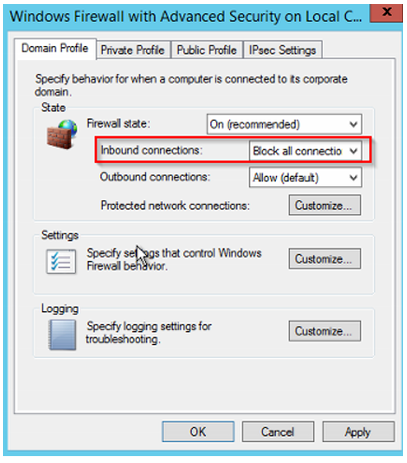
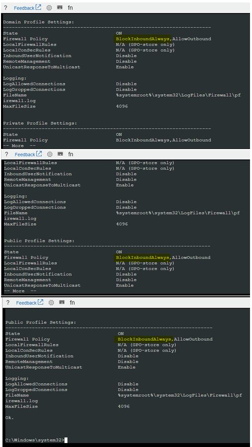

# Azure VM Guest OS firewall is blocking inbound traffic

This article discusses how to fix the Remote Desktop Portal (RDP) issue that occurs if the guest operating system firewall blocks inbound traffic.

## Symptoms

You cannot use an RDP connection to connect to an Azure virtual machine (VM). From Boot diagnostics -> Screenshot, it shows that the operating system is fully loaded at the Welcome screen (Ctrl+Alt+Del).

## Cause

### Cause 1

The RDP rule is not set up to allow the RDP traffic.

### Cause 2

The guest system firewall profiles are set up to block all inbound connections, including the RDP traffic.



## Solution

Before you follow these steps, take a snapshot of the system disk of the affected VM as a backup. For more information, see [Snapshot a disk](../windows/snapshot-copy-managed-disk.md).

To fix the issue, use one of the methods in [How to use remote tools to troubleshoot Azure VM issues](remote-tools-troubleshoot-azure-vm-issues.md) to connect to the VM remotely, and then edit the guest operating system firewall rules to **Allow** RDP traffic.

### Online troubleshooting

Connect to the [Serial Console, and then open a PowerShell instance](serial-console-windows.md#use-cmd-or-powershell-in-serial-console). If the Serial Console is not enabled on the VM, go to "[Repair the VM Offline](troubleshoot-rdp-internal-error.md#repair-the-vm-offline).

#### Mitigation 1

1.	If Azure Agent is installed and working correctly on the VM, you can use the "Reset configuration only" option under **Support + troubleshooting** > **Reset password** on the VM menu.

2.	Running this recovery option does the following:

    *   Enables an RDP component if it’s disabled.

    *   Enables all Windows firewall profiles.

    *   Make sure that the RDP rule is turned on in Windows Firewall.

    *   If the previous steps don’t work, manually reset the firewall rule. To do this, query all the rules that contain the name "Remote Desktop" by running the following command:

        ```cmd
        netsh advfirewall firewall show rule dir=in name=all | select-string -pattern "(Name.*Remote Desktop)" -context 9,4 | more
        ```

        If the RDP port was set to any other port other than 3389, you have to find any custom rule that might have been created and set to this port. To query for all the inbound rules that have a custom port, run the following command:

        ```cmd
        netsh advfirewall firewall show rule dir=in name=all | select-string -pattern "(LocalPort.*<CUSTOM PORT>)" -context 9,4 | more
        ```

3.	If you see that the rule is disabled, enable it. To open a whole group, such as the built-in Remote Desktop group, run the following command:

    ```cmd
    netsh advfirewall firewall set rule group="Remote Desktop" new enable=yes
    ```

    Otherwise, to open the specific Remote Desktop (TCP-In) rule, run the following command:

    ```cmd
    netsh advfirewall firewall set rule name="<CUSTOM RULE NAME>" new enable=yes
    ```

4.	For troubleshooting, you can turn the firewall profiles to OFF:

    ```cmd
    netsh advfirewall set allprofiles state off
    ```

    After you finish troubleshooting and setting the firewall correctly, re-enable the firewall.

    > [!Note]
    > You don't have to restart the VM to apply these changes.

5.	Try to make an RDP connection to access the VM.

#### Mitigation 2

1.	Query the firewall profiles to determine whether the inbound firewall policy is set to *BlockInboundAlways*:

    ```cmd
    netsh advfirewall show allprofiles | more
    ```

    

    > [!Note]
    > The following guidelines apply to the firewall policy, depending on how it’s set up:
    >    * *BlockInbound*: All inbound traffic will be blocked unless you have a rule in effect to allow that traffic.
    >    * *BlockInboundAlways*: All firewall rules will be ignored and all traffic will be blocked.

2.	Edit the *DefaultInboundAction* to set these profiles to **Allow** traffic. To do this, run the following command:

    ```cmd
    netsh advfirewall set allprofiles firewallpolicy allowinbound,allowoutbound
    ```

3.	Query the profiles again to make sure that your change was made successfully. To do this, run the following command:

    ```cmd
    netsh advfirewall show allprofiles | more
    ```

    > [!Note]
    > You don't have to restart the VM to apply the changes.

4.	Try again to access your VM through RDP.

### Offline Mitigations

1.	[Attach the system disk to a recovery VM](troubleshoot-recovery-disks-portal-windows.md).

2.	Start a Remote Desktop connection to the recovery VM.

3.	Make sure that the disk is flagged as **Online** in the Disk Management console. Note the drive letter that is assigned to the attached system disk.

#### Mitigation 1

See [How to Enable-Disable a Firewall rule on a Guest OS](enable-disable-firewall-rule-guest-os.md).

#### Mitigation 2

1.	[Attach the system disk to a recovery VM](troubleshoot-recovery-disks-portal-windows.md).

2.	Start a Remote Desktop connection to the recovery VM.

3.	After the system disk is attached to the recovery VM, make sure that the disk is flagged as **Online** in the Disk Management console. Note the drive letter that is assigned to the attached OS disk.

4.	Open an elevated CMD instance, and then run the following script:

    ```cmd
    REM Backup the registry prior doing any change
    robocopy f:\windows\system32\config f:\windows\system32\config.BACK /MT

    REM Mount the hive
    reg load HKLM\BROKENSYSTEM f:\windows\system32\config\SYSTEM

    REM Delete the keys to block all inbound connection scenario
    REG DELETE "HKLM\BROKENSYSTEM\ControlSet001\services\SharedAccess\Parameters\FirewallPolicy\DomainProfile" /v DoNotAllowExceptions
    REG DELETE "HKLM\BROKENSYSTEM\ControlSet001\services\SharedAccess\Parameters\FirewallPolicy\PublicProfile" /v DoNotAllowExceptions
    REG DELETE "HKLM\BROKENSYSTEM\ControlSet001\services\SharedAccess\Parameters\FirewallPolicy\StandardProfile" /v DoNotAllowExceptions
    REG DELETE "HKLM\BROKENSYSTEM\ControlSet002\services\SharedAccess\Parameters\FirewallPolicy\DomainProfile" /v DoNotAllowExceptions
    REG DELETE "HKLM\BROKENSYSTEM\ControlSet002\services\SharedAccess\Parameters\FirewallPolicy\PublicProfile" /v DoNotAllowExceptions
    REG DELETE "HKLM\BROKENSYSTEM\ControlSet002\services\SharedAccess\Parameters\FirewallPolicy\StandardProfile" /v DoNotAllowExceptions

    REM Unmount the hive
    reg unload HKLM\BROKENSYSTEM
    ```

5.	[Detach the system disk and re-create the VM](troubleshoot-recovery-disks-portal-windows.md).

6.	Check whether the issue is resolved.
