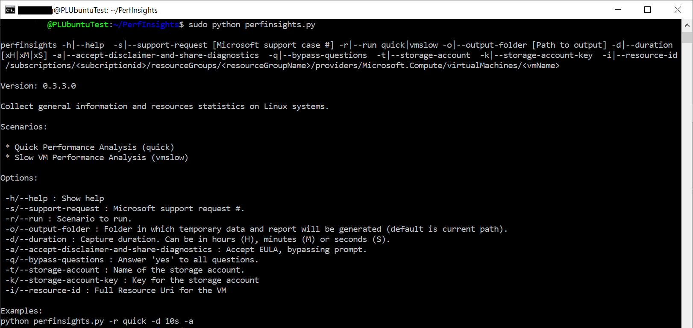
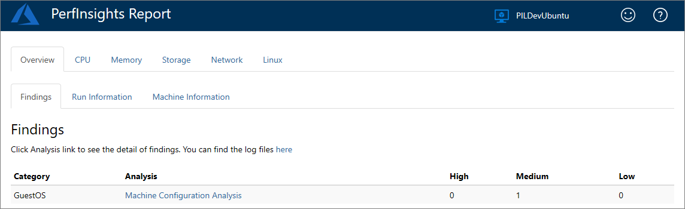
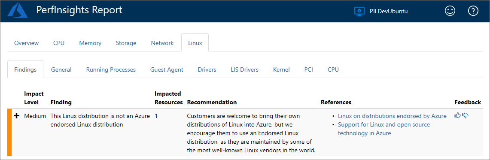
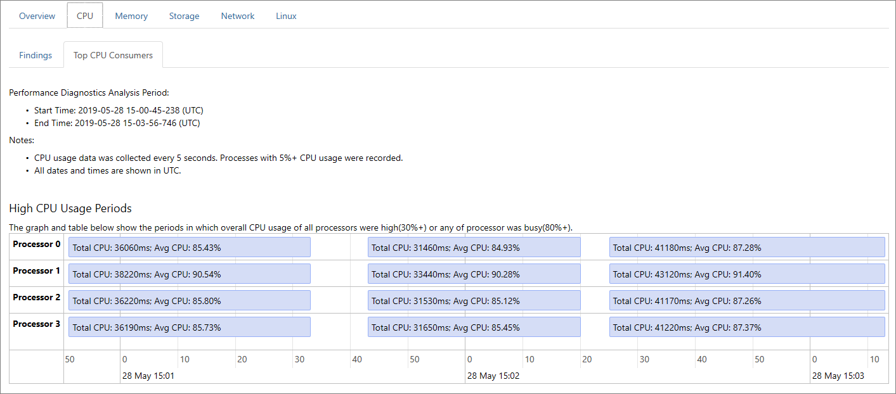
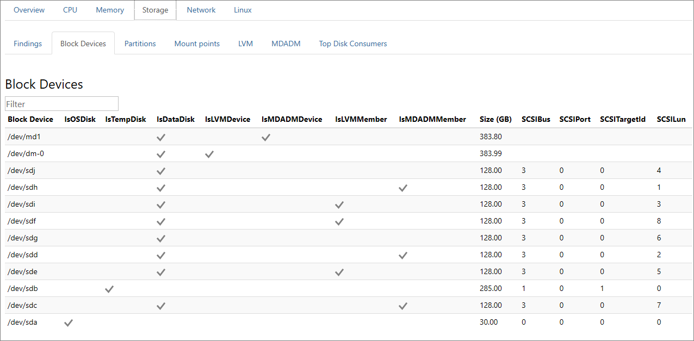
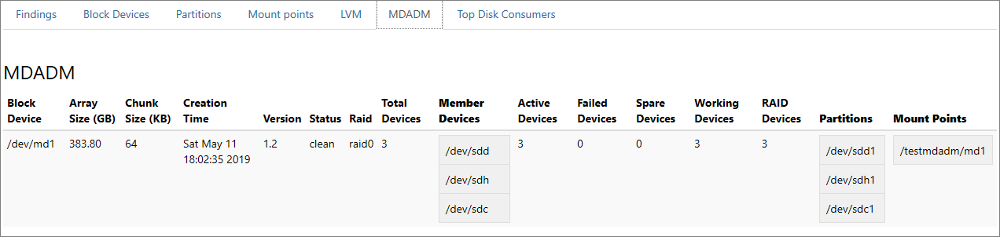
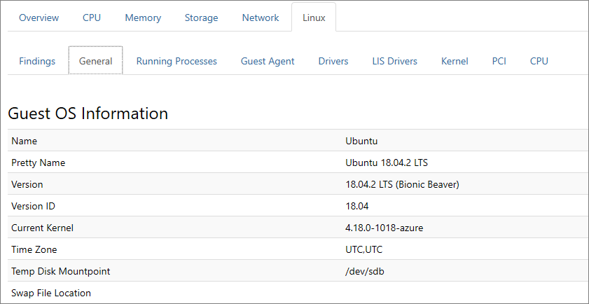

# How to use PerfInsights

[PerfInsights Linux](https://aka.ms/perfinsightslinuxdownload) is a self-help diagnostics tool that collects and analyzes the diagnostic data, and provides a report to help troubleshoot Linux virtual machine performance problems in Azure. PerfInsights can be run on supported virtual machines as a standalone tool, or directly from the portal by using [Performance Diagnostics for Azure virtual machines](performance-diagnostics.md).

If you are experiencing performance problems with virtual machines, before contacting support, run this tool.

## Supported troubleshooting scenarios

PerfInsights can collect and analyze several kinds of information. The following sections cover common scenarios.

### Quick performance analysis

This scenario collects basic information such as storage and hardware configuration of your virtual machine, various logs, including:

- Operating System information

- PCI device information

- General Guest OS logs

- Configuration files

- Storage information

- Azure Virtual Machine Configuration (collected using [Azure Instance Metadata Service](../windows/instance-metadata-service.md))

- List of running processes, Disk, Memory, and CPU usage

- Networking information

This is a passive collection of information that shouldn't affect the system.

>[!Note]
>Quick performance analysis scenario is automatically included in each of the following scenarios:

### Performance analysis

This scenario is similar to Quick performance analysis but allows capturing diagnostics information for longer duration.

## What kind of information is collected by PerfInsights

Information about the Linux virtual machine, operating system, block devices, high resource consumers, configuration, and various logs are collected. Here are more details:

- Operating system
  - Linux distribution and version
  - Kernel information
  - Driver information

- Hardware
  - PCI devices [`*`]

- Processes and memory
  - List of processes (task name, memory used, files opened)
  - Total, available, and free physical memory
  - Total, available, and free swap memory
  - Profiling capture of CPU and processes CPU usage at 5-second interval
  - Profiling capture of processes memory usage at 5-second interval

- Networking  
  - List of network adapters with adapters statistics
  - Network routing table
  - Opened ports and status

- Storage
  - Block devices list
  - Partitions list
  - Mount points list
  - MDADM volume information
  - LVM volume information
  - Profiling capture on all disks at 5-second interval

- Logs
  - /var/log/messages
  - /var/log/syslog
  - /var/log/kern.log
  - /var/log/cron.log
  - /var/log/boot.log
  - /var/log/yum.log
  - /var/log/dpkg.log
  - /var/log/sysstat or /var/log/sa [`**`]
  - /var/log/cloud-init.log
  - /var/log/cloud-init-output.log
  - /var/log/gpu-manager.log
  - /var/log/waagent.log
  - /var/log/azure/[extension folder]/\*log\*
  - /var/opt/microsoft/omsconfig/omsconfig.log
  - /var/opt/microsoft/omsagent/log/omsagent.log
  - /etc/waagent.config
  - Output of journalctl for the last five days

- [Azure virtual machine instance metadata](../windows/instance-metadata-service.md)

>[!Note]
>[`*`] PCI information is not yet collected on Debian and SLES distributions.
> 
>[`**`] /var/log/sysstat or /var/log/sa contains the System Activity Report (SAR) files that are collected by the sysstat package. If the sysstat package is not installed on the VM, the PerfInsights tool provides a recommendation to install it.

## Run the PerfInsights Linux on your VM

### What do I have to know before I run the tool

#### Tool requirements

- This tool must be run on the VM that has the performance issue.
- Python 3.x or Python 2.7 must be installed on the VM.

- The following distributions are currently supported:

    | Distribution               | Version                                         |
    |----------------------------|-------------------------------------------------|
    | Oracle Linux Server        | 6.10 [`*`], 7.3, 7.6, 7.5 |
    | CentOS                     | 6.5 [`*`], 7.6                                    |
    | RHEL                       | 7.2, 7.5, 8.0 [`*`]                               |
    | Ubuntu                     | 14.04, 16.04, 18.04, 20.04                               |
    | Debian                     | 8, 9, 10 [`*`]                                    |
    | SLES                       | 12 SP4 [`*`]                                      |
    |                            |                                                   |

>[!Note]
>[`*`] Please refer to [Known issues](#known-issues) section

### Known issues

- RHEL 8 does not have Python installed by default. To run PerfInsights Linux, you must first install Python 2.7

- Guest Agent information collection may fail on CentOS 6.x

- PCI devices information is not collected on Debian based distributions

- LVM information is partially collected on some distributions

### How do I run PerfInsights

You can run PerfInsights on a virtual machine by installing Azure Performance Diagnostics from Azure portal. You can also run it as a standalone tool.

>[!Note]
>PerfInsights simply collects and analyzes the data. It does not make any modifications to the system.

#### Install and run PerfInsights from the Azure portal

For more information about this option, see [Azure Performance Diagnostics](performance-diagnostics.md).  

#### Run PerfInsights in standalone mode

To run the PerfInsights tool, follow these steps:

1. Download [PerfInsights.tar.gz](https://aka.ms/perfinsightslinuxdownload) to a folder on your virtual machine and extract the contents using the below commands from the terminal.

   ```bash
   wget https://download.microsoft.com/download/9/F/8/9F80419C-D60D-45F1-8A98-718855F25722/PerfInsights.tar.gz
   ```

   ```bash
   tar xzvf PerfInsights.tar.gz
   ```

2. Navigate to the folder that contains `perfinsights.py` file, and then run `perfinsights.py` to view the available commandline parameters.

    ```bash
    cd <the path of PerfInsights folder>
    sudo python perfinsights.py
    ```

    

    The basic syntax for running PerfInsights scenarios is:

    ```bash
    sudo python perfinsights.py -r <ScenarioName> -d [duration]<H | M | S> [AdditionalOptions]
    ```

    You can use the below example to run Quick performance analysis scenario for 1 minute and create the results under /tmp/output folder:

    ```bash
    sudo python perfinsights.py -r quick -d 1M -a -o /tmp/output
    ```

    You can use the below example to run performance analysis scenario for 5 mins and upload the result tar ball to the storage account:

    ```bash
    sudo python perfinsights.py -r vmslow -d 300S -a -t <StorageAccountName> -k <StorageAccountKey> -i <full resource Uri of the current VM>
    ```

    >[!Note]
    >Before running a scenario, PerfInsights prompts the user to agree to share diagnostic information and to agree to the EULA. Use **-a or --accept-disclaimer-and-share-diagnostics** option to skip these prompts.
    >
    >If you have an active support ticket with Microsoft and running PerfInsights per the request of the support engineer you are working with, make sure to provide the support ticket number using the **-s or --support-request** option.

When the run is completed, a new tar file appears in the same folder as PerfInsights unless no output folder is specified. The name of the file is **PerformanceDiagnostics\_yyyy-MM-dd\_hh-mm-ss-fff.tar.gz.** You can send this file to the support agent for analysis or open the report inside the file to review findings and recommendations.

## Review the diagnostics report

Within the **PerformanceDiagnostics\_yyyy-MM-dd\_hh-mm-ss-fff.tar.gz** file, you can find an HTML report that details the findings of PerfInsights. To review the report, expand the **PerformanceDiagnostics\_yyyy-MM-dd\_hh-mm-ss-fff.tar.gz** file, and then open the **PerfInsights Report.html** file.

### Overview tab

The **Overview** tab provides basic run details and virtual machine information. The **Findings** tab displays a summary of the recommendations from all the different sections of the PerfInsights report.

  


> [!NOTE]
> Findings categorized as high are known issues that might cause performance issues. Findings categorized as medium represent non-optimal configurations that do not necessarily cause performance issues. Findings categorized as low are informative statements only.

Review the recommendations and links for all high and medium findings. Learn about how they can affect performance, and also about best practices for performance-optimized configurations.

### CPU tab

**CPU** tab provides information about system-wide CPU consumption during the PerfInsights run. Information about high CPU usage periods and top long running CPU consumers will be helpful to troubleshoot high CPU-related issues.



### Storage tab

The **Findings** section displays various findings and recommendations related to storage.

The **Block Devices** and other related sections such as **Partitions**, **LVM**, and **MDADM** tabs describe how block devices are configured and related to each other.

  


### Linux tab

The **Linux** tab contains information on the hardware and the operating system running in your VM. Details include a list of running processes and information about Guest Agent, PCI, CPU, Drivers, and LIS drivers.



## Next steps

You can upload diagnostics logs and reports to Microsoft Support for further review. When you work with the Microsoft Support staff, they might request that you transmit the output that is generated by PerfInsights to assist with the troubleshooting process.

The following screenshot shows a message similar to what you might receive:


Follow the instructions in the message to access the file transfer workspace. For additional security, you have to change your password on first use.

After you sign in, you will find a dialog box to upload the **PerformanceDiagnostics\_yyyy-MM-dd\_hh-mm-ss-fff.tar.gz** file that was collected by PerfInsights.
