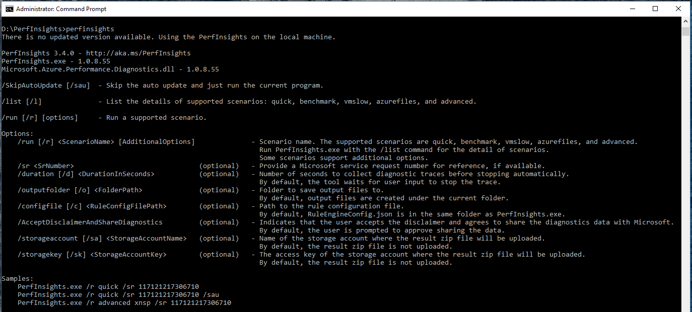
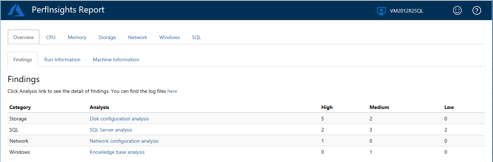
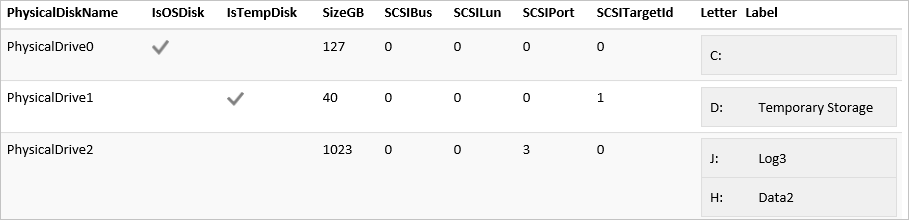

# How to use PerfInsights

[PerfInsights](https://aka.ms/perfinsightsdownload) is a self-help diagnostics tool that collects and analyzes the diagnostic data, and provides a report to help troubleshoot Windows virtual machine performance problems in Azure. PerfInsights can be run on virtual machines as a standalone tool, directly from the portal by using [Performance Diagnostics for Azure virtual machines](performance-diagnostics.md), or by installing [Azure Performance Diagnostics VM Extension](performance-diagnostics-vm-extension.md).

If you are experiencing performance problems with virtual machines, before contacting support, run this tool.

## Supported troubleshooting scenarios

PerfInsights can collect and analyze several kinds of information. The following sections cover common scenarios.

### Quick performance analysis

This scenario collects the disk configuration and other important information, including:

-   Event logs

-   Network status for all incoming and outgoing connections

-   Network and firewall configuration settings

-   Task list for all applications that are currently running on the system

-   Microsoft SQL Server database configuration settings (if the VM is identified
    as a server that is running SQL Server)

-   Storage reliability counters

-   Important Windows hotfixes

-   Installed filter drivers

This is a passive collection of information that shouldn't affect the system. 

>[!Note]
>This scenario is automatically included in each of the following scenarios:

### Benchmarking

This scenario runs the [Diskspd](https://github.com/Microsoft/diskspd) benchmark test (IOPS and MBPS) for all drives that are attached to the VM. 

> [!Note]
> This scenario can affect the system, and shouldn’t be run on a live production system. If necessary, run this scenario in a dedicated maintenance window to avoid any problems. An increased workload that is caused by a trace or benchmark test can adversely affect the performance of your VM.
>

### Performance analysis

This scenario runs a [performance counter](https://msdn.microsoft.com/library/windows/desktop/aa373083(v=vs.85).aspx) trace by using the counters that are specified in the RuleEngineConfig.json file. If the VM is identified as a server that is running SQL Server, a performance counter trace is run. It does so by using the counters that are found in the RuleEngineConfig.json file. This scenario also includes performance diagnostics data.

### Azure Files analysis

This scenario runs a special performance counter capture together with a network trace. The capture includes all the Server Message Block (SMB) client shares counters. The following are some key SMB client share performance counters that are part of the capture:

| **Type**     | **SMB client shares counter** |
|--------------|-------------------------------|
| IOPS         | Data Requests/sec             |
|              | Read Requests/sec             |
|              | Write Requests/sec            |
| Latency      | Avg. sec/Data Request         |
|              | Avg. sec/Read                 |
|              | Avg. sec/Write                |
| IO Size      | Avg. Bytes/Data Request       |
|              | Avg. Bytes/Read               |
|              | Avg. Bytes/Write              |
| Throughput   | Data Bytes/sec                |
|              | Read Bytes/sec                |
|              | Write Bytes/sec               |
| Queue Length | Avg. Read Queue Length        |
|              | Avg. Write Queue Length       |
|              | Avg. Data Queue Length        |

### Advanced performance analysis

When you run an advanced performance analysis, you select traces to run in parallel. If you want, you can run them all (Performance Counter, Xperf, Network, and StorPort).  

> [!Note]
> This scenario can affect the system, and shouldn’t be run on a live production system. If necessary, run this scenario in a dedicated maintenance window to avoid any problems. An increased workload that is caused by a trace or benchmark test can adversely affect the performance of your VM.
>

## What kind of information is collected by PerfInsights?

Information about Windows VM, disks or storage pools configuration, performance counters, logs, and various traces are collected. It depends on the performance scenario you are using. The following table provides details:

|Data collected                              |  |  | Performance scenarios |  |  | |
|----------------------------------|----------------------------|------------------------------------|--------------------------|--------------------------------|----------------------|----------------------|
|                               | Quick performance analysis | Benchmarking | Performance analysis | Azure Files analysis | Advanced performance analysis |
| Information from event logs       | Yes                        | Yes                                | Yes                      | Yes                  | Yes                  |
| System information                | Yes                        | Yes                                | Yes                      | Yes                  | Yes                  |
| Volume map                        | Yes                        | Yes                                | Yes                      | Yes                  | Yes                  |
| Disk map                          | Yes                        | Yes                                | Yes                      | Yes                  | Yes                  |
| Running tasks                     | Yes                        | Yes                                | Yes                      | Yes                  | Yes                  |
| Storage reliability counters      | Yes                        | Yes                                | Yes                      | Yes                  | Yes                  |
| Storage information               | Yes                        | Yes                                | Yes                      | Yes                  | Yes                  |
| Fsutil output                     | Yes                        | Yes                                | Yes                      | Yes                  | Yes                  |
| Filter driver info                | Yes                        | Yes                                | Yes                      | Yes                  | Yes                  |
| Netstat output                    | Yes                        | Yes                                | Yes                      | Yes                  | Yes                  |
| Network configuration             | Yes                        | Yes                                | Yes                      | Yes                  | Yes                  |
| Firewall configuration            | Yes                        | Yes                                | Yes                      | Yes                  | Yes                  |
| SQL Server configuration          | Yes                        | Yes                                | Yes                      | Yes                  | Yes                  |
| Performance diagnostics traces *  | Yes                        | Yes                                | Yes                      | Yes                  | Yes                  |
| Performance counter trace **      |                            |                                    | Yes                      |                      | Yes                  |
| SMB counter trace **              |                            |                                    |                          | Yes                  |                      |
| SQL Server counter trace **       |                            |                                    | Yes                      |                      | Yes                  |
| Xperf trace                       |                            |                                    |                          |                      | Yes                  |
| StorPort trace                    |                            |                                    |                          |                      | Yes                  |
| Network trace                     |                            |                                    |                          | Yes                  | Yes                  |
| Diskspd benchmark trace ***       |                            | Yes                                |                          |                      |                      |
|       |                            |                         |                                                   |                      |                      |

### Performance diagnostics trace (*)

Runs a rule-based engine in the background to collect data and diagnose ongoing performance issues. The following rules are currently supported:

- HighCpuUsage rule: Detects high CPU usage periods, and shows the top CPU usage consumers during those periods.
- HighDiskUsage rule: Detects high disk usage periods on physical disks, and shows the top disk usage consumers during those periods.
- HighResolutionDiskMetric rule: Shows IOPS, throughput, and I/O latency metrics per 50 milliseconds for each physical disk. It helps to quickly identify disk throttling periods.
- HighMemoryUsage rule: Detects high memory usage periods, and shows the top memory usage consumers during those periods.

> [!NOTE] 
> Currently, Windows versions that include the .NET Framework 4.5 or later versions are supported.

### Performance counter trace (**)

Collects the following performance counters:

- \Process, \Processor, \Memory, \Thread, \PhysicalDisk, and \LogicalDisk
- \Cache\Dirty Pages, \Cache\Lazy Write Flushes/sec, \Server\Pool Nonpaged, Failures, and \Server\Pool Paged Failures
- Selected counters under \Network Interface, \IPv4\Datagrams, \IPv6\Datagrams, \TCPv4\Segments, \TCPv6\Segments,  \Network Adapter, \WFPv4\Packets, \WFPv6\Packets, \UDPv4\Datagrams, \UDPv6\Datagrams, \TCPv4\Connection, \TCPv6\Connection, \Network QoS Policy\Packets, \Per Processor Network Interface Card Activity, and \Microsoft Winsock BSP

#### For SQL Server instances
- \SQL Server:Buffer Manager, \SQLServer:Resource Pool Stats, and \SQLServer:SQL Statistics\
- \SQLServer:Locks, \SQLServer:General, Statistics
- \SQLServer:Access Methods

#### For Azure Files
\SMB Client Shares

### Diskspd benchmark trace (***)
Diskspd I/O workload tests (OS Disk [write] and pool drives [read/write])

## Run the PerfInsights tool on your VM

### What do I have to know before I run the tool? 

#### Tool requirements

-  This tool must be run on the VM that has the performance issue. 

-  The following operating systems are supported: Windows Server 2008 R2, Windows Server 2012, Windows Server 2012 R2, and Windows Server 2016; Windows 8.1 and Windows 10.

#### Possible problems when you run the tool on production VMs

-  For the benchmarking scenario or the "Advanced performance analysis" scenario that is configured to use Xperf or Diskspd, the tool might adversely affect the performance of the VM. These scenarios should not be run in a live production environment.

-  For the benchmarking scenario or the "Advanced performance analysis" scenario that is configured to use Diskspd, ensure that no other background activity interferes with the I/O workload.

-  By default, the tool uses the temporary storage drive to collect data. If tracing stays enabled for a longer time, the amount of data that is collected might be relevant. This can reduce the availability of space on the temporary disk, and can therefore affect any application that relies on this drive.

### How do I run PerfInsights? 

You can run PerfInsights on a virtual machine by installing [Azure Performance Diagnostics VM Extension](performance-diagnostics-vm-extension.md). You can also run it as a standalone tool. 

**Install and run PerfInsights from the Azure portal**

For more information about this option, see [Install Azure Performance Diagnostics VM Extension](performance-diagnostics-vm-extension.md#install-the-extension).  

**Run PerfInsights in standalone mode**

To run the PerfInsights tool, follow these steps:


1. Download [PerfInsights.zip](https://aka.ms/perfinsightsdownload).

2. Unblock the PerfInsights.zip file. To do this, right-click the PerfInsights.zip file, and select **Properties**. In the **General** tab, select **Unblock**, and then select **OK**. This ensures that the tool runs without any additional security prompts.  

    

3.  Expand the compressed PerfInsights.zip file into your temporary drive (by default, this is usually the D drive). 

4.  Open Windows command prompt as an administrator, and then run PerfInsights.exe to view the available commandline parameters.

    ```
    cd <the path of PerfInsights folder>
    PerfInsights
    ```
    
    
    The basic syntax for running PerfInsights scenarios is:
    
    ```
    PerfInsights /run <ScenarioName> [AdditionalOptions]
    ```

    You can use the below example to run performance analysis scenario for 5 mins:
    
    ```
    PerfInsights /run vmslow /d 300 /AcceptDisclaimerAndShareDiagnostics
    ```

    You can use the following example to run the advanced scenario with Xperf and Performance counter traces for 5 mins:
    
    ```
    PerfInsights /run advanced xp /d 300 /AcceptDisclaimerAndShareDiagnostics
    ```

    You can use the below example to run performance analysis scenario for 5 mins and upload the result zip file to the storage account:
    
    ```
    PerfInsights /run vmslow /d 300 /AcceptDisclaimerAndShareDiagnostics /sa <StorageAccountName> /sk <StorageAccountKey>
    ```

    You can look up all the available scenarios and options by using the **/list** command:
    
    ```
    PerfInsights /list
    ```

    >[!Note]
    >Before running a scenario, PerfInsights prompts the user to agree to share diagnostic information and to agree to the EULA. Use **/AcceptDisclaimerAndShareDiagnostics** option to skip these prompts. 
    >
    >If you have an active support ticket with Microsoft and running PerfInsights per the request of the support engineer you are working with, make sure to provide the support ticket number using the **/sr** option.
    >
    >By default, PerfInsights will try updating itself to the latest version if available. Use **/SkipAutoUpdate** or **/sau** parameter to skip auto update.  
    >
    >If the duration switch **/d** is not specified, PerfInsights will prompt you to repro the issue while running vmslow, azurefiles and advanced scenarios. 

When the traces or operations are completed, a new file appears in the same folder as PerfInsights. The name of the file is **PerformanceDiagnostics\_yyyy-MM-dd\_hh-mm-ss-fff.zip.** You can send this file to the support agent for analysis or open the report inside the zip file to review findings and recommendations.

## Review the diagnostics report

Within the **PerformanceDiagnostics\_yyyy-MM-dd\_hh-mm-ss-fff.zip** file, you can find an HTML report that details the findings of PerfInsights. To review the report, expand the **PerformanceDiagnostics\_yyyy-MM-dd\_hh-mm-ss-fff.zip** file, and then open the **PerfInsights Report.html** file.

Select the **Findings** tab.




> [!NOTE] 
> Findings categorized as high are known issues that might cause performance issues. Findings categorized as medium represent non-optimal configurations that do not necessarily cause performance issues. Findings categorized as low are informative statements only.

Review the recommendations and links for all high and medium findings. Learn about how they can affect performance, and also about best practices for performance-optimized configurations.

### Storage tab

The **Findings** section displays various findings and recommendations related to storage.

The **Disk Map** and **Volume Map** sections describe how logical volumes and physical disks are related to each other.

In the physical disk perspective (Disk Map), the table shows all logical volumes that are running on the disk. In the following example, **PhysicalDrive2** runs two logical volumes created on multiple partitions (J and H):



In the volume perspective (Volume Map), the tables show all the physical disks under each logical volume. Notice that for RAID/Dynamic disks, you might run a logical volume on multiple physical disks. In the following example, *C:\\mount* is a mount point configured as *SpannedDisk* on physical disks 2 and 3:


### SQL tab

If the target VM hosts any SQL Server instances, you see an additional tab in the report, named **SQL**:


This section contains a **Findings** tab, and additional tabs for each of the SQL Server instances hosted on the VM.

The **Findings** tab contains a list of all the SQL related performance issues found, along with the recommendations.

In the following example, **PhysicalDrive0** (running the C drive) is displayed. This is because both the **modeldev** and **modellog** files are located on the C drive, and they are of different types (such as data file and transaction log, respectively).


The tabs for specific instances of SQL Server contain a general section that displays basic information about the selected instance. The tabs also contain additional sections for advanced information, including settings, configurations, and user options.

### Diagnostic tab
The **Diagnostic** tab contains information about top CPU, disk, and memory consumers on the computer for the duration of the running of PerfInsights. You can also find information about critical patches that the system might be missing, the task list, and important system events. 

## References to the external tools used

### Diskspd

Diskspd is a storage load generator and performance test tool from Microsoft. For more information, see [Diskspd](https://github.com/Microsoft/diskspd).

### Xperf

Xperf is a command-line tool to capture traces from the Windows Performance Toolkit. For more information, see [Windows Performance Toolkit – Xperf](https://blogs.msdn.microsoft.com/ntdebugging/2008/04/03/windows-performance-toolkit-xperf/).

## Next steps

You can upload diagnostics logs and reports to Microsoft Support for further review. Support might request that you transmit the output that is generated by PerfInsights to assist with the troubleshooting process.

The following screenshot shows a message similar to what you might receive:


Follow the instructions in the message to access the file transfer workspace. For additional security, you have to change your password on first use.

After you sign in, you will find a dialog box to upload the **PerformanceDiagnostics\_yyyy-MM-dd\_hh-mm-ss-fff.zip** file that was collected by PerfInsights.

