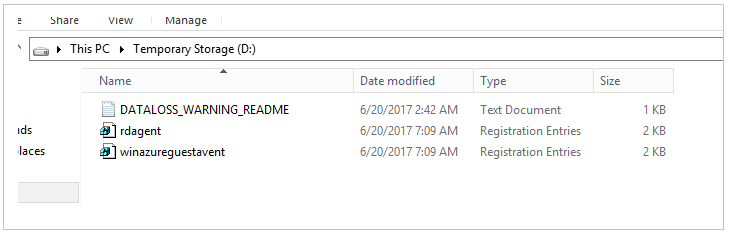
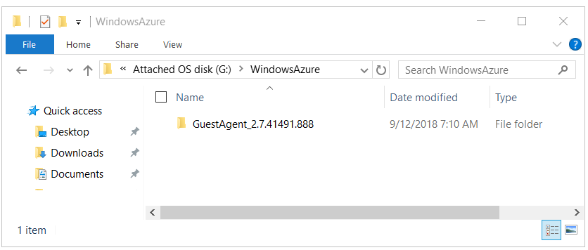

# Install the Azure Virtual Machine Agent in offline mode 

The Azure Virtual Machine Agent (VM Agent) provides useful features, such as local administrator password reset and script pushing. This article shows you how to install the VM Agent for an offline Windows virtual machine (VM). 

## When to use the VM Agent in offline mode

Install the VM Agent in offline mode in the following scenarios:

- The deployed Azure VM doesn't have the VM Agent installed or the agent isn't working.
- You forgot the administrator password for the VM or you can't access the VM.

## How to install the VM Agent in offline mode

Use the following steps to install the VM Agent in offline mode.

### Step 1: Attach the OS disk of the VM to another VM as a data disk

1. Take a snapshot for the OS disk of the affected VM,  create a disk from the snapshot, and then attach the disk to a troubleshoot VM. For more information, see [Troubleshoot a Windows VM by attaching the OS disk to a recovery VM using the Azure portal](troubleshoot-recovery-disks-portal-windows.md). For the classic VM, delete the VM and keep the OS disk, and then attach the OS disk to the troubleshoot VM.

2.  Connect to the troubleshooter VM. Open **Computer management** > **Disk management**. Confirm that the OS disk is online and that drive letters are assigned to the disk partitions.

### Step 2: Modify the OS disk to install the Azure VM Agent

1.  Make a remote desktop connection to the troubleshooter VM.

2.  In the troubleshooter VM, browse to the OS disk that you attached, open the \windows\system32\config folder. Copy all of the files in this folder as a backup, in case a rollback is required.

3.  Start the **Registry Editor** (regedit.exe).

4.  Select the **HKEY_LOCAL_MACHINE** key. On the menu, select **File** > **Load Hive**:

    

5.  Browse to the \windows\system32\config\SYSTEM folder on the OS disk that you attached. For the name of the hive, enter **BROKENSYSTEM**. The new registry hive is displayed under the **HKEY_LOCAL_MACHINE** key.

6.  Browse to the \windows\system32\config\SOFTWARE folder on the OS disk that you attached. For the name of the hive software, enter **BROKENSOFTWARE**.

7. If the Attached OS disk has the VM agent installed, perform a backup of the current configuration. If it does not have VM agent installed, move to the next step.
      
    1. Rename the \windowsazure folder to \windowsazure.old.

    2. Export the following registries:
        - HKEY_LOCAL_MACHINE\BROKENSYSTEM\ControlSet001\Services\WindowsAzureGuestAgent
        - HKEY_LOCAL_MACHINE\BROKENSYSTEM\\ControlSet001\Services\WindowsAzureTelemetryService
        - HKEY_LOCAL_MACHINE\BROKENSYSTEM\ControlSet001\Services\RdAgent

8.	Use the existing files on the troubleshooter VM as a repository for the VM Agent installation. Complete the following steps:

    1. From the troubleshooter VM, export the following subkeys in registry format (.reg): 
        - HKEY_LOCAL_MACHINE  \SYSTEM\ControlSet001\Services\WindowsAzureGuestAgent
        - HKEY_LOCAL_MACHINE  \SYSTEM\ControlSet001\Services\WindowsAzureTelemetryService
        - HKEY_LOCAL_MACHINE  \SYSTEM\ControlSet001\Services\RdAgent

          

    2. Edit the registry files. In each file, change the entry value **SYSTEM** to **BROKENSYSTEM** (as shown in the following images) and save the file. Remember the **ImagePath** of the current VM agent. We will need to copy the corresponding folder to the attached OS disk. 

        

    3. Import the registry files into the repository by double-clicking each registry file.

    4. Confirm that the following three subkeys are successfully imported into the **BROKENSYSTEM** hive:
        - WindowsAzureGuestAgent
        - WindowsAzureTelemetryService
        - RdAgent

    5. Copy the installation folder of the current VM Agent to the attached OS disk: 

        1.	On the OS disk that you attached, create a folder named WindowsAzure in the root path.

        2.	Go to C:\WindowsAzure on the troubleshooter VM, look for any folder with the name C:\WindowsAzure\GuestAgent_X.X.XXXX.XXX. Copy the GuestAgent folder that has latest version number from C:\WindowsAzure to the WindowsAzure folder in the attached OS disk. If you are not sure which folder should be copied, copy all GuestAgent folders. The following image shows an example of the GuestAgent folder that is copied to the attached OS disk.

             

9.  Select **BROKENSYSTEM**. From the menu, select **File** > **Unload Hive**​.

10.  Select **BROKENSOFTWARE**. From the menu, select **File** > **Unload Hive**​.

11.  Detach the OS disk, and then [change the OS disk for the affected VM](troubleshoot-recovery-disks-portal-windows.md#swap-the-os-disk-for-the-vm). For the classic VM, create a new VM by using the repaired OS disk.

12.  Access the VM. Notice that the RdAgent is running and the logs are being generated.

If you created the VM by using the Resource Manager deployment model, you're done.

### Use the ProvisionGuestAgent property for classic VMs

[!INCLUDE [classic-vm-deprecation](../../../includes/classic-vm-deprecation.md)]

If you created the VM by using the classic model, use the Azure PowerShell module to update the **ProvisionGuestAgent** property. The property informs Azure that the VM has the VM Agent installed.

To set the **ProvisionGuestAgent** property, run the following commands in Azure PowerShell:

   ```powershell
   $vm = Get-AzureVM –ServiceName <cloud service name> –Name <VM name>
   $vm.VM.ProvisionGuestAgent = $true
   Update-AzureVM –Name <VM name> –VM $vm.VM –ServiceName <cloud service name>
   ```

Then run the `Get-AzureVM` command. Notice that the **GuestAgentStatus** property is now populated with data:

   ```powershell
   Get-AzureVM –ServiceName <cloud service name> –Name <VM name>
   GuestAgentStatus:Microsoft.WindowsAzure.Commands.ServiceManagement.Model.PersistentVMModel.GuestAgentStatus
   ```

## Next steps

- [Azure Virtual Machine Agent overview](../extensions/agent-windows.md)
- [Virtual machine extensions and features for Windows](../extensions/features-windows.md)
