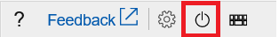

# Troubleshoot Linux VM starting issues due to file system errors

You cannot connect to an Azure Linux virtual machine (VM) by using Secure Shell (SSH). When you run the Boot Diagnostics feature on [Azure portal](https://portal.azure.com/), you see log entries that resemble the following examples.

## Examples

The following are examples of possible errors.

### Example 1 

```
Checking all file systems.
[/sbin/fsck.ext4 (1) — /] fsck.ext4 -a /dev/sda1
/dev/sda1 contains a file system with errors, check forced.
/dev/sda1: Inodes that were part of a corrupted orphan linked list found.
/dev/sda1: UNEXPECTED INCONSISTENCY; RUN fsck MANUALLY
```

### Example 2

```
EXT4-fs (sda1): INFO: recovery required on readonly filesystem
EXT4-fs (sda1): write access will be enabled during recovery
EXT4-fs warning (device sda1): ext4_clear_journal_err:4531: Filesystem error recorded from previous mount: IO failure
EXT4-fs warning (device sda1): ext4_clear_journal_err:4532: Making fs in need of filesystem check.
```

### Example 3

```
[  14.252404] EXT4-fs (sda1): Couldn’t remount RDWR because of unprocessed orphan inode list.  Please unmount/remount instead
An error occurred while mounting /.
```

### Example 4 

This example is caused by a clean fsck. In this case, there are also additional data disks attached to the VM (/dev/sdc1 and /dev/sde1).

```
Checking all file systems. 
[/sbin/fsck.ext4 (1) — /] fsck.ext4 -a /dev/sda1
/dev/sda1: clean, 65405/1905008 files, 732749/7608064 blocks
[/sbin/fsck.ext4 (1) — /tmp] fsck.ext4 -a /dev/sdc1
[/sbin/fsck.ext4 (2) — /backup] fsck.ext4 -a /dev/sde1
/dev/sdc1: clean, 12/1048576 files, 109842/4192957 blocks
/dev/sde1 : clean, 51/67043328 files, 4259482/268173037 blocks
```

This problem may occur if the file system was not shut down cleanly or storage related issues. The issues include hardware or software errors, issues with drivers or programs, write errors, etc. It is always important to have a backup of critical data. The tools that describe in this article may help recover file systems, but it is data loss can still occur.

Linux has several file system checkers available. The most common for the distributions in Azure are: [FSCK](https://access.redhat.com/documentation/en-us/red_hat_enterprise_linux/6/html/storage_administration_guide/fsck-fs-specific), [E2FSCK](https://access.redhat.com/documentation/en-us/red_hat_enterprise_linux/7/html/storage_administration_guide/fsck-fs-specific), and [Xfs_repair](https://access.redhat.com/documentation/en-us/red_hat_enterprise_linux/7/html/storage_administration_guide/xfsrepair).

## Resolution

To resolve this problem, boot the VM into emergency mode by using the [serial console](https://docs.microsoft.com/azure/virtual-machines/troubleshooting/serial-console-linux) and use that tool to repair the file system. If the serial console is not enabled on your VM or doesn't work, see the [Repair the VM offline](#repair-the-vm-offline) section of this article.

## Use the serial console

1. Connect to the serial console.

   > [!Note]
   > For more information about using serial console for Linux, see:
   > * [Use serial console to access GRUB and single user mode](https://docs.microsoft.com/azure/virtual-machines/linux/serial-console-grub-single-user-mode)
   > * [Use serial console for SysRq and NMI calls](https://docs.microsoft.com/azure/virtual-machines/troubleshooting/serial-console-nmi-sysrq)

2. Select the Power icon button, and then select Restart VM. (If the serial console is not enabled or not connected successfully, you won't see the button.)

   

3. Boot the VM in to emergency mode.

4. Enter the password of your root account to sign in to emergency mode.

5. Use xfs_repair with the -n option to detect the errors in the file system. In the following sample, we assume that the system partition is /dev/sda1. Replace it with the appropriate value for your VM:

   ```
   xfs_repair -n /dev/sda1
   ```

6. Run the following command to repair the file system:

   ```
   xfs_repair /dev/sda1
   ```

7. If you receive the error message "ERROR: The filesystem has valuable metadata changes in a log which needs to be replayed", create a temporary directory and mount the filesystem:

   ```
   mkdir /temp
   mount /dev/sda1 /temp
   ```

8. If the disk fails to mount, run the xfs_repair command with the -L option (force log zeroing):

   ```
   xfs_repair /dev/sda1 -L
   ```

9. Next, try to mount the file system. If the disk is mounted successfully, you will receive the following output:
 
   ```
   XFS (sda1): Mounting V1 Filesystem
   XFS (sda1): Ending clean mount
   ```

10. Restart the VM, and then check if the problem is resolved.

    ```
    Reboot -f
    ```

## Repair the VM offline

1. Attach the system disk of the VM as a data disk to a recovery VM (any working Linux VM). To do this, you can use [CLI commands](https://docs.microsoft.com/azure/virtual-machines/troubleshooting/troubleshoot-recovery-disks-linux) or you can automate setting up the recovery VM using the [VM repair commands](repair-linux-vm-using-azure-virtual-machine-repair-commands.md).

2. Locate the drive label of the system disk that you attached. In this case, we assume that the label of the system disk that you attached is /dev/sdc1. Replace it with the appropriate value for your VM.

3. Use xfs_repair with the -n option to detect the errors in the file system.

   ```
   xfs_repair -n /dev/sdc1
   ```

4. Run the following command to repair the file system:

   ```
   xfs_repair /dev/sdc1
   ```

5. If you receive the error message "ERROR: The filesystem has valuable metadata changes in a log which needs to be replayed", create a temporary directory and mount the filesystem:

   ```
   mkdir /temp

   mount /dev/sdc1 /temp
   ```

   If the disk fails to mount, run the xfs_repair command with the -L option (force log zeroing):

   ```
   xfs_repair /dev/sdc1 -L
   ```

6. Next, try to mount the file system. If the disk is mounted successfully, you will receive the following output:

   ```
   XFS (sdc1): Mounting V1 Filesystem
   
   XFS (sdc1): Ending clean mount
   ```

7. Unmount and detach the original virtual hard disk, and then create a VM from the original system disk. To do this, you can use [CLI commands](troubleshoot-recovery-disks-linux.md) or the [VM repair commands](repair-linux-vm-using-azure-virtual-machine-repair-commands.md) if you used them to create the recovery VM.

8. Check if the problem is resolved.

## Next steps

* [Troubleshoot a Linux VM by attaching the OS disk to a recovery VM with the Azure CLI 2.0](https://docs.microsoft.com/azure/virtual-machines/virtual-machines-linux-troubleshoot-recovery-disks)
* [Use the portal to attach a data disk to a Linux VM](https://docs.microsoft.com/azure/virtual-machines/linux/attach-disk-portal)

