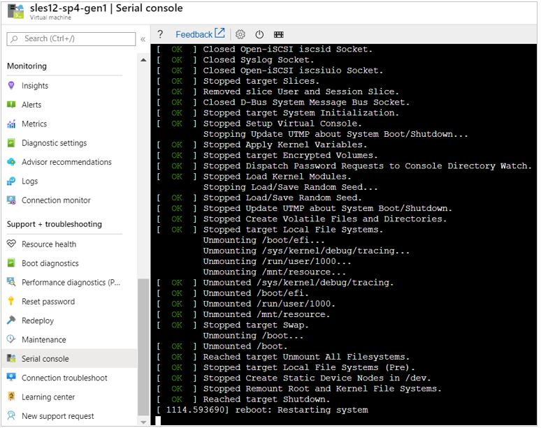
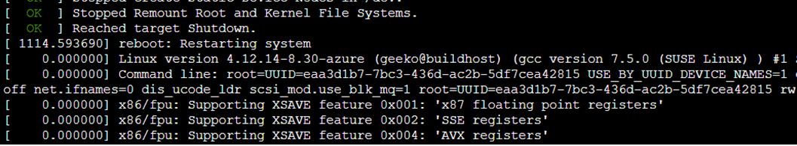
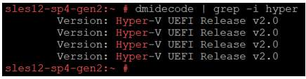

# Upgrade Azure VM with SLES 12 to SLES 15 SP1

This article provides general steps about how to upgrade SUSE Linux Enterprise server (SLES) 12 to SLES 15 SP1 for an Azure virtual machine (VM). For more information, see [Using the SUSE Distribution Migration System](https://documentation.suse.com/suse-distribution-migration-system/1.0/single-html/distribution-migration-system/index.html) and [SUSE Linux Enterprise Server 15 SP1 Upgrade Guide](https://documentation.suse.com/sles/15-SP1/single-html/SLES-upgrade/index.html#sec-update-preparation-update).

## Supported upgrade paths
The current SLES version must be SLES 12 SP4 or 12 SP5 before you can proceed to SLES 15 SP1.


## Prerequisites

- Plan the migration activity as per the approved downtime window. This is because the VM reboots during the migration.
- Prior to the migration activity, take a complete backup of the VM.
- If backup is not configured, take a snapshot backup of the OS disk.
- [Check if the VM is generation V1 or generation V2](#check-the-generation-version-for-a-vm).

## Upgrade from SUSE 12 SP4 or SP5 to SUSE 15 SP1

1. Install the latest package for the VM:

    ```
    zypper clean --all
    zypper refresh
    zypper update
    ```

2. After the installation is finished, restart the VM.

3. Verify the kernel and OS version. Make sure that the version is SUSE 12 SP4 or SUSE 12 SP5.

    ```
    uname -a
    cat /etc/os-release
    ```

4. Install the **suse-migration-sle15-activation**. When the package **suse-migration-sle15-activation** gets installed, another package **SLES15-Migration** will be automatically installed as a dependency package. 

   ```
   zypper install suse-migration-sle15-activation
   ```

5. After the installation is finished, run the `reboot` command to restart the VM.

6. Go to the [Azure portal](https://portal.azure.com), select the VM, and then select **Serial console**. You will see that the system stops at "reboot: Restarting system". This process should take about 15-45 minutes. For Generation 2 VM, it might be stuck on the "reboot: Restarting system" screen. In this case, wait for 45 minutes. If it still doesn't progress further, go to the **Overview** page of the VM in the Azure portal, stop the VM, and then restart it.

     

8. After the system is restarted with new kernel, you will see the following message.

     
9. Verify the kernel and OS version to check whether the system is upgraded successfully.

    ```
    uname -a
    cat /etc/os-release
    ```

## Check the generation version for a VM

You can use one of the following methods to check the generation version:

- In the SLES terminal,  run the command `dmidecode | grep -i hyper`. If it's a generation V1 VM,  there is no output returned. For the generations V2 VMs, you will see the following output:

     
- In the [Azure portal](https://portal.azure.com),  go to **Properties**  of the VM, and then check the **VM generation** field.
