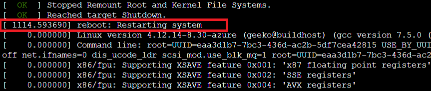

# Upgrade Azure VM with SUSE Linux Enterprise Server to SUSE 15 SP1

This article provides general steps about how to use SUSE Distribution Migration System to upgrade SUSE Linux Enterprise server to SUSE 15 SP1 for an Azure virtual machine (VM). For more information, see [Using the SUSE Distribution Migration System](https://documentation.suse.com/suse-distribution-migration-system/1.0/single-html/distribution-migration-system/index.html) and [SUSE Linux Enterprise Server 15 SP1 Upgrade Guide](https://documentation.suse.com/sles/15-SP1/single-html/SLES-upgrade/index.html#sec-update-preparation-update).

## Prerequisites

- The current SUSE version must be SUSE 12 SP4  or 12 SP5.
- Plan the migration activity as per the approved downtime window. This is because the VM reboots during the migration.
- Prior to the migration activity, take a complete backup of the VM.
- If backup is not configured, take a snapshot backup of the OS disk.

## Upgrade from SUSE 12 SP4 or SP5 to SUSE 15 SP1

1. Install the latest package for the VM:

    ```
    zypper clean --all
    zypper refresh
    zypper update
    ```

2. After the installation is finished, restart the VM.

3. Verify the kernel and OS version. Make sure that the version is SUSE 12 SP4 or SUSE 12 SP5.

    ```
    uname -a
    ```

4. Install the **suse-migration-sle15-activation** and **SLES15-Migration** package.

   ```
   zypper install suse-migration-sle15-activation
   ```

5. After the installation is finished, run the `reboot` command to restart the VM.

6. Go to the [Azure portal](https://portal.azure.com), select the VM, and then select **Serial console** to check whether the upgrade process is finished. You will see that the system stops at "reboot: Restarting system". It may take 30-45 minutes to install the package and restart the system. If the system is stuck on this screen, go to the **Overview** page of the VM in the Azure portal, stop the VM, and then restart it.
    

7.  After the system is restarted, verify the kernel and OS version to check whether the system is upgraded successfully.

    ```
    uname -a
    ```
