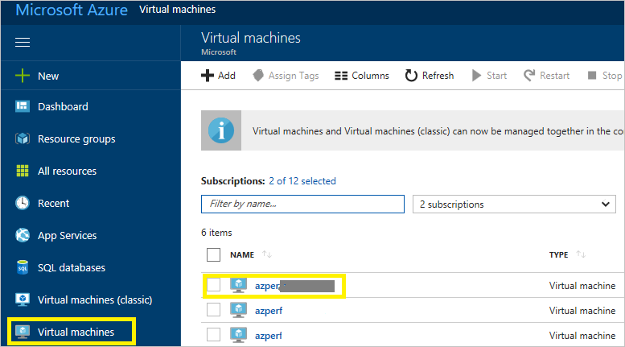
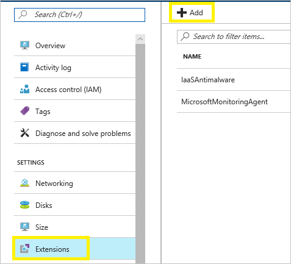
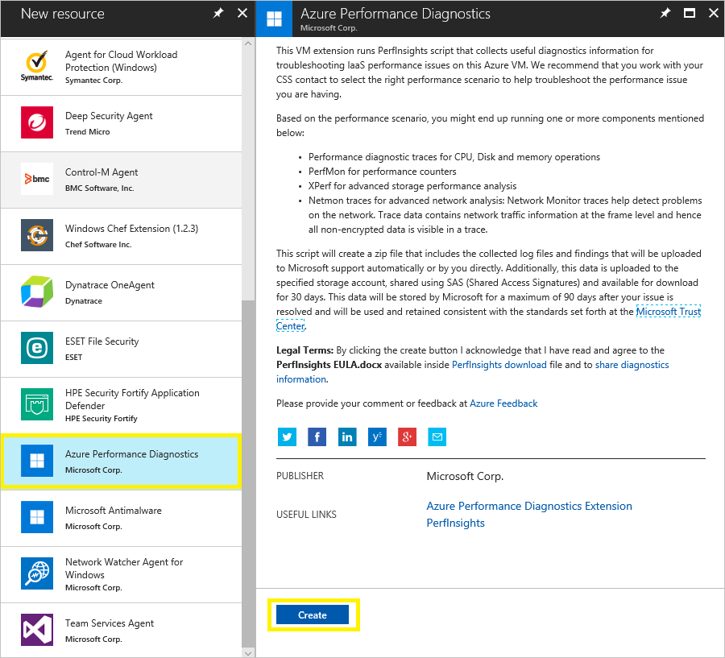
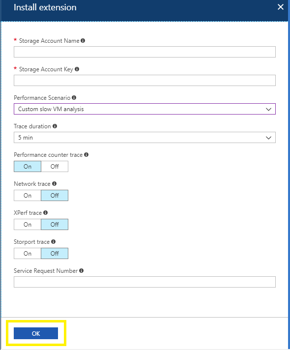
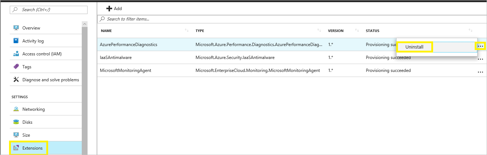
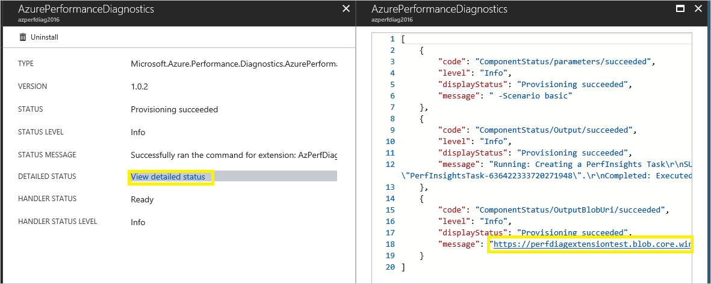

# Azure Performance Diagnostics VM Extension for Windows

Azure Performance Diagnostics VM Extension helps collect performance diagnostic data from Windows VMs. The extension performs analysis, and provides a report of findings and recommendations to identify and resolve performance issues on the virtual machine. This extension installs a troubleshooting tool called [PerfInsights](http://aka.ms/perfinsights).

> [!NOTE]
    > If you want to run diagnostics on your VM from the Azure portal for non-classic VMs, it is recommended to use the new experience. For more information, see [Performance Diagnostics for Azure virtual machines](performance-diagnostics.md) 

## Prerequisites

This extension can be installed on Windows Server 2008 R2, Windows Server 2012, Windows Server 2012 R2, and Windows Server 2016. It can also be installed on Windows 8.1 and Windows 10.

## Extension schema
The following JSON shows the schema for Azure Performance Diagnostics VM Extension. This extension requires the name and key for a storage account to store the diagnostics output and report. These values are sensitive. Storage account key should be stored inside a protected setting configuration. Azure VM extension protected setting data is encrypted, and it is only decrypted on the target virtual machine. Note that **storageAccountName** and **storageAccountKey** are case-sensitive. Other required parameters are listed in the following section.

```JSON
    {
      "name": "[concat(parameters('vmName'),'/AzurePerformanceDiagnostics')]",
      "type": "Microsoft.Compute/virtualMachines/extensions",
      "location": "[parameters('location')]",
      "apiVersion": "2015-06-15",
      "properties": {
        "publisher": "Microsoft.Azure.Performance.Diagnostics",
        "type": "AzurePerformanceDiagnostics",
        "typeHandlerVersion": "1.0",
        "autoUpgradeMinorVersion": true,
        "settings": {
            "storageAccountName": "[parameters('storageAccountName')]",
            "performanceScenario": "[parameters('performanceScenario')]",
            "traceDurationInSeconds": "[parameters('traceDurationInSeconds')]",
            "perfCounterTrace": "[parameters('perfCounterTrace')]",
            "networkTrace": "[parameters('networkTrace')]",
            "xperfTrace": "[parameters('xperfTrace')]",
            "storPortTrace": "[parameters('storPortTrace')]",
            "srNumber": "[parameters('srNumber')]",
            "requestTimeUtc":  "[parameters('requestTimeUtc')]",
            "resourceId": "[resourceId('Microsoft.Compute/virtualMachines', parameters('vmName'))]"
        },
        "protectedSettings": {
            "storageAccountKey": "[parameters('storageAccountKey')]"		
        }
      }
    }
```

### Property values

|   **Name**   |**Value / Example**|       **Description**      |
|--------------|-------------------|----------------------------|
|apiVersion|2015-06-15|The version of the API.
|publisher|Microsoft.Azure.Performance.Diagnostics|The publisher namespace for the extension.
|type|AzurePerformanceDiagnostics|The type of the VM extension.
|typeHandlerVersion|1.0|The version of the extension handler.
|performanceScenario|basic|The performance scenario for which to capture data. Valid values are: **basic**, **vmslow**, **azurefiles**, and **custom**.
|traceDurationInSeconds|300|The duration of the traces, if any of the trace options are selected.
|perfCounterTrace|p|Option to enable Performance Counter Trace. Valid values are **p** or empty value. If you do not want to capture this trace, leave the value as empty.
|networkTrace|n|Option to enable Network Trace. Valid values are **n** or empty value. If you do not want to capture this trace, leave the value as empty.
|xperfTrace|x|Option to enable XPerf Trace. Valid values are **x** or empty value. If you do not want to capture this trace, leave the value as empty.
|storPortTrace|s|Option to enable StorPort Trace. Valid values are **s** or empty value. If you do not want to capture this trace, leave the value as empty.
|srNumber|123452016365929|The support ticket number, if available. Leave the value as empty if you don’t have it.
|requestTimeUtc|2017-09-28T22:08:53.736Z|Current Date Time in Utc. If you are using the portal to install this extension, you do not need to provide this value.
|resourceId|/subscriptions/{subscriptionId}/resourceGroups/{resourceGroupName}/providers/{resourceProviderNamespace}/{resourceType}/{resourceName}|The unique identifier of a VM.
|storageAccountName|mystorageaccount|The name of the storage account to store the diagnostics logs and results.
|storageAccountKey|lDuVvxuZB28NNP…hAiRF3voADxLBTcc==|The key for the storage account.

## Install the extension

Follow these instructions to install the extension on Windows virtual machines:

1. Sign in to the [Azure portal](http://portal.azure.com).
2. Select the virtual machine where you want to install this extension.

    
3. Select the **Extensions** blade, and select **Add**.

    
4. Select **Azure Performance Diagnostics**, review the terms and conditions, and select **Create**.

    
5. Provide the parameter values for the installation, and select **OK** to install the extension. For more information about supported scenarios, see [How to use PerfInsights](how-to-use-perfInsights.md#supported-troubleshooting-scenarios). 

    
6. When the installation is successful, you see a message indicating this status.

    

    > [!NOTE]
    > The extension runs when the provisioning has succeeded. It takes two minutes or less to complete for the basic scenario. For other scenarios, it runs through the duration specified during the installation.

## Remove the extension
To remove the extension from a virtual machine, follow these steps:

1. Sign in to the [Azure portal](http://portal.azure.com), select the virtual machine from which you want to remove this extension, and then select the **Extensions** blade. 
2. Select the (**…**) for the Performance Diagnostics Extension entry from the list, and select **Uninstall**.

    

    > [!NOTE]
    > You can also select the extension entry, and select the **Uninstall** option.

## Template deployment
Azure virtual machine extensions can be deployed with Azure Resource Manager templates. The JSON schema detailed in the previous section can be used in an Azure Resource Manager template. This runs the Azure Performance Diagnostics VM extension during an Azure Resource Manager template deployment. Here is a sample template:

````
{
  "$schema": "http://schema.management.azure.com/schemas/2015-01-01/deploymentTemplate.json#",
  "contentVersion": "1.0.0.0",
  "parameters": {
    "vmName": {
      "type": "string",
	  "defaultValue": "yourVMName"
    },
    "location": {
      "type": "string",
	  "defaultValue": "southcentralus"
    },
    "storageAccountName": {
      "type": "securestring"
	  "defaultValue": "yourStorageAccount"
    },
    "storageAccountKey": {
      "type": "securestring"
	  "defaultValue": "yourStorageAccountKey"
    },
    "performanceScenario": {
      "type": "string",
	  "defaultValue": "basic"
    },
    "srNumber": {
      "type": "string",
	  "defaultValue": ""
    },
	"traceDurationInSeconds": {
	  "type": "int",
    "defaultValue": 300
	},
    "perfCounterTrace": {
      "type": "string",
	  "defaultValue": "p"
    },
    "networkTrace": {
      "type": "string",
	  "defaultValue": ""
    },
    "xperfTrace": {
      "type": "string",
	  "defaultValue": ""
    },
    "storPortTrace": {
      "type": "string",
	  "defaultValue": ""
    },
    "requestTimeUtc": {
	  "type": "string",
      "defaultValue": "10/2/2017 11:06:00 PM"
    }		
  },
  "resources": [
    {
      "name": "[concat(parameters('vmName'),'/AzurePerformanceDiagnostics')]",
      "type": "Microsoft.Compute/virtualMachines/extensions",
      "location": "[parameters('location')]",
      "apiVersion": "2015-06-15",
      "properties": {
        "publisher": "Microsoft.Azure.Performance.Diagnostics",
        "type": "AzurePerformanceDiagnostics",
        "typeHandlerVersion": "1.0",
        "autoUpgradeMinorVersion": true,
        "settings": {
            "storageAccountName": "[parameters('storageAccountName')]",
            "performanceScenario": "[parameters('performanceScenario')]",
            "traceDurationInSeconds": "[parameters('traceDurationInSeconds')]",
            "perfCounterTrace": "[parameters('perfCounterTrace')]",
            "networkTrace": "[parameters('networkTrace')]",
            "xperfTrace": "[parameters('xperfTrace')]",
            "storPortTrace": "[parameters('storPortTrace')]",
            "srNumber": "[parameters('srNumber')]",
            "requestTimeUtc":  "[parameters('requestTimeUtc')]",
            "resourceId": "[resourceId('Microsoft.Compute/virtualMachines', parameters('vmName'))]"
        },
        "protectedSettings": {
            "storageAccountKey": "[parameters('storageAccountKey')]"
        }
      }
    }
  ]
}
````

## PowerShell deployment
The `Set-AzureRmVMExtension` command can be used to deploy Azure Performance Diagnostics VM Extension to an existing virtual machine.

PowerShell

````
$PublicSettings = @{ "storageAccountName"="mystorageaccount";"performanceScenario"="basic";"traceDurationInSeconds"=300;"perfCounterTrace"="p";"networkTrace"="";"xperfTrace"="";"storPortTrace"="";"srNumber"="";"requestTimeUtc"="2017-09-28T22:08:53.736Z";"resourceId"="VMResourceId" }
$ProtectedSettings = @{"storageAccountKey"="mystoragekey" }

Set-AzureRmVMExtension -ExtensionName "AzurePerformanceDiagnostics" `
    -ResourceGroupName "myResourceGroup" `
    -VMName "myVM" `
    -Publisher "Microsoft.Azure.Performance.Diagnostics" `
    -ExtensionType "AzurePerformanceDiagnostics" `
    -TypeHandlerVersion 1.0 `
    -Settings $PublicSettings `
    -ProtectedSettings $ProtectedSettings `
    -Location WestUS
````

## Information on the data captured
The PerfInsights tool collects various logs, configuration, and diagnostic data, depending on the selected scenario. For more information, see the [PerfInsights documentation](http://aka.ms/perfinsights).

## View and share the results

Output from the extension can be found in a zip file that uploaded to the storage account specified during the installation and is shared for 30 days by using [Shared Access Signatures (SAS)](../../storage/common/storage-dotnet-shared-access-signature-part-1.md). This zip file contains diagnostic logs and a report with findings and recommendations. A SAS link to the output zip file can be found inside a text file named *zipfilename*_saslink.txt under the folder **C:\Packages\Plugins\Microsoft.Azure.Performance.Diagnostics.AzurePerformanceDiagnostics\\\<version>**. Anyone who has this link is able to download the zip file.

To assist the support engineer working on your support ticket, Microsoft might use this SAS link to download the diagnostics data.

To view the report, extract the zip file and open the **PerfInsights Report.html** file.

You should also be able to download the zip file directly from the portal by selecting the extension.



> [!NOTE]
> The SAS link displayed in the portal might not work sometimes. This can be caused by a malformed URL during the encoding and decoding operations. You can instead get the link directly from the *_saslink.txt file from the VM.

## Troubleshoot and support

- Extension deployment status (in the notification area) might show “Deployment in progress” even though the extension is successfully provisioned.

    This issue can be safely ignored, as long as the extension status indicates that the extension is successfully provisioned.
- You can address some issues during installation by using the extension logs. Extension execution output is logged to files found in the following directory:

        C:\WindowsAzure\Logs\Plugins\Microsoft.Azure.Performance.Diagnostics.AzurePerformanceDiagnostics\<version>

If you need more help at any point in this article, you can contact the Azure experts on the [MSDN Azure and Stack Overflow forums](https://azure.microsoft.com/support/forums/). Alternatively, you can file an Azure support incident. Go to the [Azure support site](https://azure.microsoft.com/support/options/), and select **Get support**. For information about using Azure support, read the [Microsoft Azure support FAQ](https://azure.microsoft.com/support/faq/).
