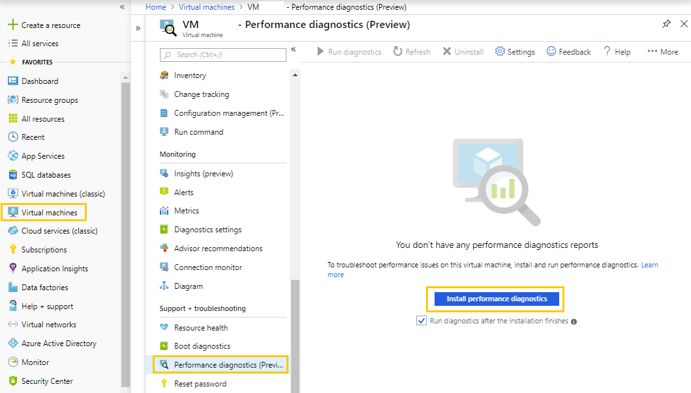
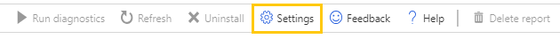
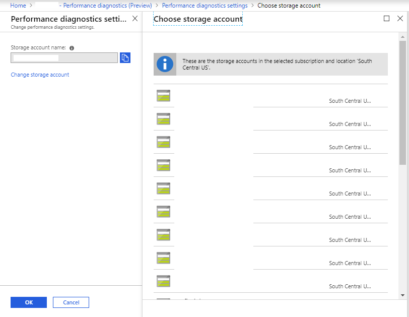
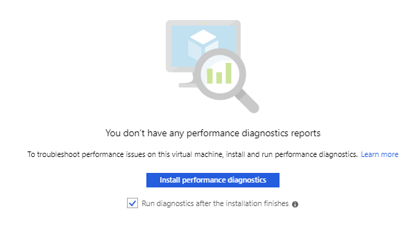
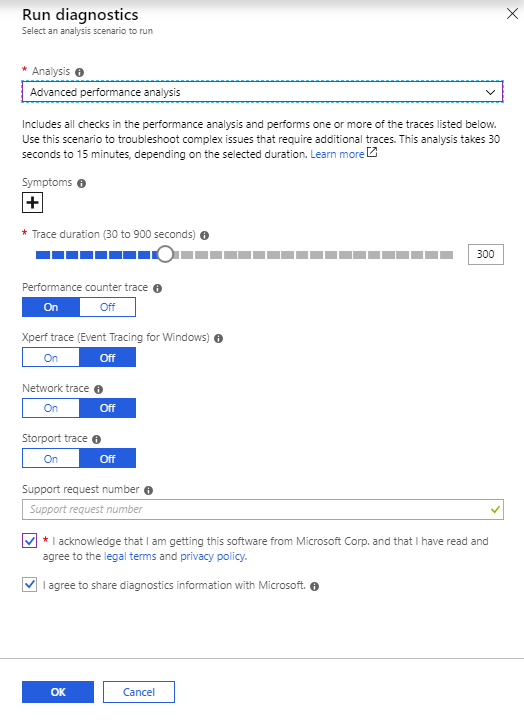
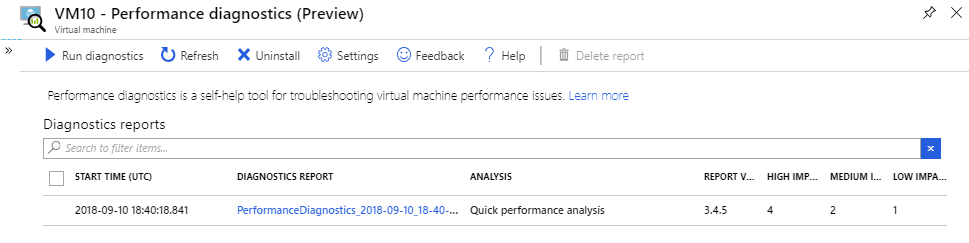
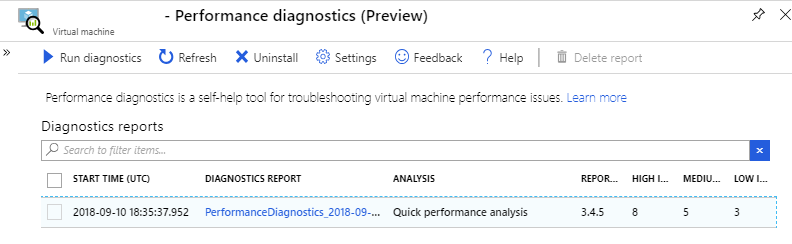
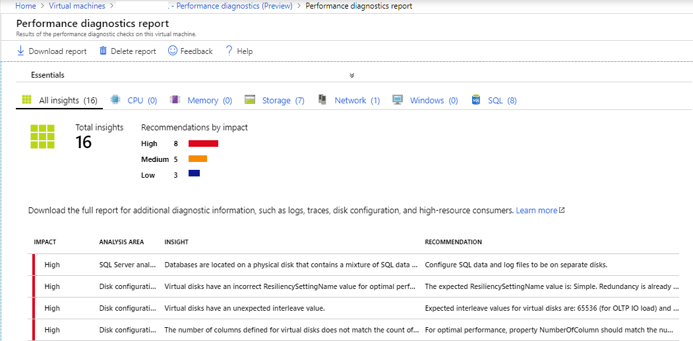
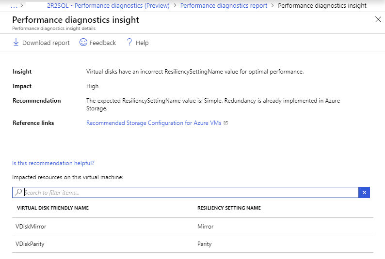
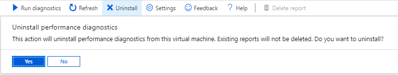

# Performance diagnostics for Azure virtual machines

The performance diagnostics tool helps you troubleshoot performance issues that can affect a Windows virtual machine (VM). Supported troubleshooting scenarios include quick checks on known issues and best practices, and complex problems that involve slow VM performance or high usage of CPU, disk space, or memory. 

You can run performance diagnostics directly from the Azure portal, where you can also review insights and a report on various logs, rich configuration, and diagnostics data. We recommend that you run performance diagnostics and review the insights and diagnostics data before you contact Microsoft Support.

> [!NOTE]
> Performance diagnostics is currently supported on Windows VMs that have .NET SDK version 4.5 or a later version installed. For the steps to run performance diagnostics on classic VMs, see [Azure Performance Diagnostics VM extension](performance-diagnostics-vm-extension.md).

### Supported Operating Systems
Windows 10, Windows 8, Windows 8 Enterprise, Windows 8 Pro, Windows 8.1, Windows Server 2016, Windows Server 2012, Windows Server 2012 Datacenter, Windows Server 2012 R2, Windows Server 2012 R2 Datacenter, Windows Server 2012 R2 Standard, Windows Server 2012 Standard, Windows Server 2008 R2, Windows Server 2008 R2 Datacenter, Windows Server 2008 R2 Enterprise, Windows Server 2008 R2 Foundation, Windows Server 2008 R2 SP1, Windows Server 2008 R2 Standard.

## Install and run performance diagnostics on your VM
Performance diagnostics installs a VM extension that runs a diagnostics tool that is named [PerfInsights](https://aka.ms/perfinsights). To install and run performance diagnostics, follow these steps:
1.	In the left column of commands, select **Virtual machines**.
1.	From the list of VM names, select the VM that you want to run diagnostics on.
1.	In the right column of commands, select **Performance diagnostics**.

    

    > [!NOTE]
    > In this screen shot, the blade of VM names is hidden.
1. Select a storage account (optional)

    If you want to use a single storage account to store the performance diagnostics results for multiple VMs, you can select a storage account by clicking the **Settings** button in the toolbar. Click the **OK** button once you select the storage account.

    If you do not specify a storage account, a new storage account will be created by default.

    

    

1. Select the **Install performance diagnostics** button.
1. Select the **Run diagnostics** check box if you want to run a diagnostic after the installation is completed. If you make this selection, you will be able to choose the performance analysis scenario and related options.

    

## Select an analysis scenario to run

The following analysis scenarios are available from the Azure portal. Select an analysis, depending on the performance issue that you are having. Select the duration and trace options as necessary for the analysis.

* **Quick performance analysis**  
    Checks for known issues, analyzes best practices, and collects diagnostics data. This analysis takes several minutes to run. [Learn more](https://aka.ms/perfinsights/quick)

* **Performance analysis**  
    Includes all checks in the quick performance analysis and monitors high resource consumption. Use this version to troubleshoot general performance issues, such as high CPU, memory, and disk usage. This analysis takes 30 seconds to 15 minutes, depending on the selected duration. [Learn more](https://aka.ms/perfinsights/vmslow) 
    
* **Advanced performance analysis**  
    Includes all checks in the performance analysis, and collects one or more of the traces, as listed in the following sections. Use this scenario to troubleshoot complex issues that require additional traces. Running this scenario for longer periods will increase the overall size of diagnostics output, depending on the size of the VM and the trace options that are selected. This analysis takes 30 seconds to 15 minutes to run, depending on the selected duration. [Learn more](https://aka.ms/perfinsights/advanced) 
    
* **Azure Files analysis**  
    Includes all checks in the performance analysis, and captures a network trace and SMB counters. Use this scenario to troubleshoot the performance of Azure files. This analysis takes 30 seconds to 15 minutes to run, depending on the selected duration. [Learn more](https://aka.ms/perfinsights/azurefiles)

### Provide symptoms (optional)
Select any preselected symptoms from the list, or add new symptoms. This helps us improve the analysis in the future. 

### Provide support request number, if available (optional)
If you are working with a Microsoft support engineer on an existing support ticket, provide the support ticket number. 

### Review the privacy policy and legal terms, and select the check box to acknowledge (required)
To run the diagnostics, you must agree to the legal terms and accept privacy policy.

### Select OK to run the diagnostics 
A notification is displayed as performance diagnostics starts to install. After the installation is completed, you see a notification that indicates that the installation is successful. The selected analysis is then run for the specified duration. This would be a good time to reproduce the performance issue so that the diagnostics data can be captured at the correct time. 

After the analysis is complete, the following items are uploaded to Azure tables and a binary large object (BLOB) container in the specified storage account:

*	All the insights and related information about the run
*	An output compressed (.zip) file (named **PerformanceDiagnostics_yyyy-MM-dd_hh-mm-ss-fff.zip**) that contains log files
*	An HTML report

After the upload, a new diagnostics report is listed in the Azure portal.

## How to change performance diagnostics settings
Use the **Settings** toolbar button to change the storage account where the diagnostics insights and output can be stored. You can use the same storage account for multiple VMs that use performance diagnostics. When you change the storage account, the old reports and insights are not deleted. However, they will no longer be displayed in the list of diagnostics reports. 

## Review insights and performance diagnostics report
Each diagnostic run contains a list of insights and recommendations, affected resources, log files, and other rich diagnostics information that is collected, plus a report for offline viewing. For a complete list of all the collected diagnostics data, see [What kind of information is collected by PerfInsights?](https://docs.microsoft.com/en-us/azure/virtual-machines/windows/how-to-use-perfinsights#what-kind-of-information-is-collected-by-perfinsights) 

### Select a performance diagnostics report
You can use the diagnostics report list to find all the diagnostics reports that were run. The list includes details about the analysis that was used, insights that were found, and their impact levels. Select a row to view more details.

### Review a performance diagnostics report
Each performance diagnostics report may contain several insights and indicate an impact level of High, Medium, or Low. Each insight also contains recommendations to help lessen the concern. Insights are grouped for easy filtering. 

Impact levels represent the potential for performance issues, based on factors such as misconfiguration, known problems, or issues that are reported by other users. You might not yet be experiencing one or more of the listed issues. For example, you may have SQL log files and database files on the same data disk. This condition has a high potential for bottlenecks and other performance issues if the database usage is high, whereas you might not notice an issue if the usage is low.

### Reviewing performance diagnostics insights and recommendations
You can select an insight to view more details about the affected resources, suggested mitigations, and reference links. 

### Download and review the full performance diagnostics report
You can use the **Download report** button to download an HTML report that contains additional rich diagnostics information, such as storage and network configuration, performance counters, traces, list of processes, and logs. The content depends on the selected analysis. For advanced troubleshooting, the report may contain additional information and interactive charts that are related to high CPU usage, high disk usage, and processes that consume excessive memory. For more information about the performance diagnostics report, see [Review diagnostics report](https://docs.microsoft.com/en-us/azure/virtual-machines/windows/how-to-use-perfinsights#review-the-diagnostics-report).

## Manage performance diagnostics reports
You can delete one or more performance diagnostics reports by using the **Delete report** button.

## How to uninstall performance diagnostics
You can uninstall performance diagnostics from a VM. This action removes the VM extension but does not affect any diagnostics data that is in the storage account. 

## Frequently asked questions

### Where is the diagnostics data from my VM stored? 
All performance diagnostics insights and reports are stored in your own storage account. Insights are stored inside Azure tables. The reports compressed file is stored in a binary large object (BLOB) container that is named azdiagextnresults.

You can view the storage account information by using the Settings button on the toolbar. 

### How do I share this data with Microsoft Customer Support? 
There are multiple ways to share the diagnostics report with Microsoft.

**Option 1:** Automatically share the latest report  
When you open a support ticket with Microsoft, it is important to share the performance diagnostics report. If you opted to share this information with Microsoft while you run the diagnostics (by selecting the “**I agree to share diagnostics information with Microsoft**” check box), Microsoft will be able to access the report from your storage account using a SAS link to the output zip file for up to 30 days from the run date. Only the latest report is available to the support engineer. 

**Option 2:** Generate a Shared Access Signature for the diagnostics report compressed file  
You may share a link to the reports compressed file by using Shared Access Signatures. To do this, follow these steps: 
1.	In the Azure portal, browse to the storage account in which the diagnostics data is stored.
1.	Select **Blobs** under the **Blob service** section. 
1.	Select the **azdiagextnresults** container.
1.	Select the Performance diagnostics output compressed file that you want to share.
1.	On the **Generate SAS** tab, select the criteria for sharing. 
1.	Click **Generate blob SAS token and URL**.
1.	Copy the **Blob SAS URL**, and share it with the support engineer. 

**Option 3:** Download the report from the storage account

You can also locate the performance diagnostics report compressed file by using steps 1–4 in Option 2. Select to download the file, and then share it through email or ask the support engineer for instructions to upload the file.  

### How do I capture the diagnostics data at the correct time?
Each performance diagnostics run has two stages: 
1.	Install or update the performance diagnostics VM extension.
1.	Run the diagnostics for the specified duration.

Currently there is no easy way to know exactly when the VM extension installation is complete. Generally it takes about 45 seconds to 1 minute to install the VM extension. After the VM extension is installed, you can run your repro steps to have the performance diagnostics capture the correct set of data for troubleshooting. 

## Next steps
After you review the performance diagnostics insights and report, if you still cannot determine the cause of the issue and need more help, you can open a support ticket with Microsoft Customer Support. 

If you need more help at any point in this article, you can contact the Azure experts on the [MSDN Azure and Stack Overflow forums](https://azure.microsoft.com/support/forums/). Alternatively, you can file an Azure support incident. Go to the [Azure support site](https://azure.microsoft.com/support/options/), and select **Get support**. For information about using Azure support, read the [Microsoft Azure support FAQ](https://azure.microsoft.com/support/faq/).
